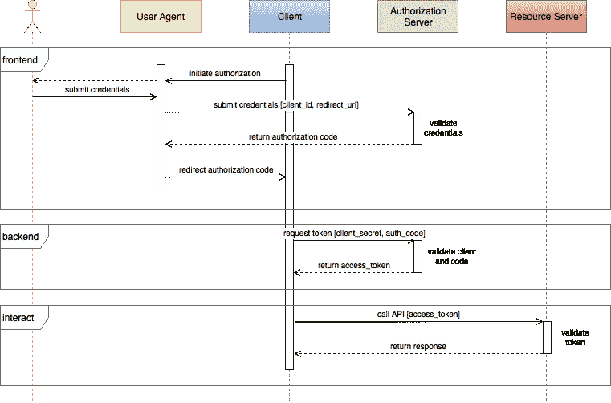
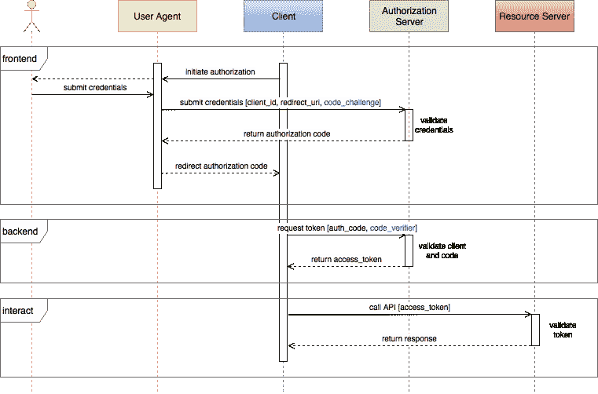
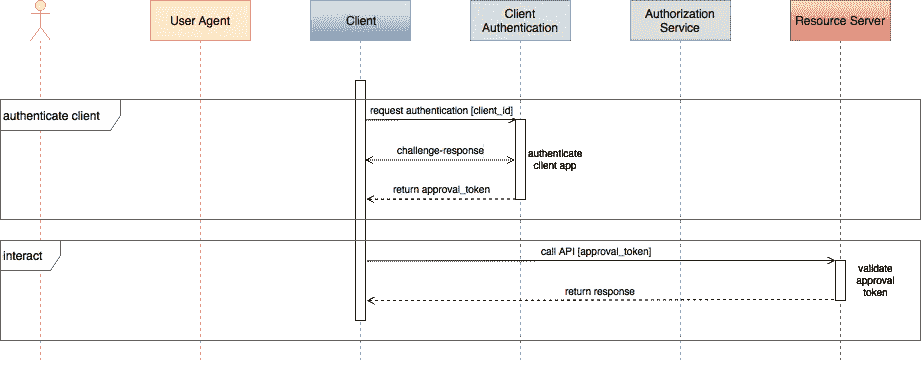
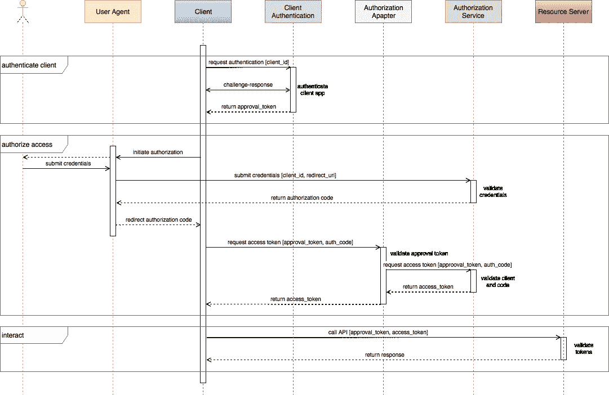
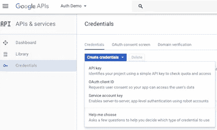
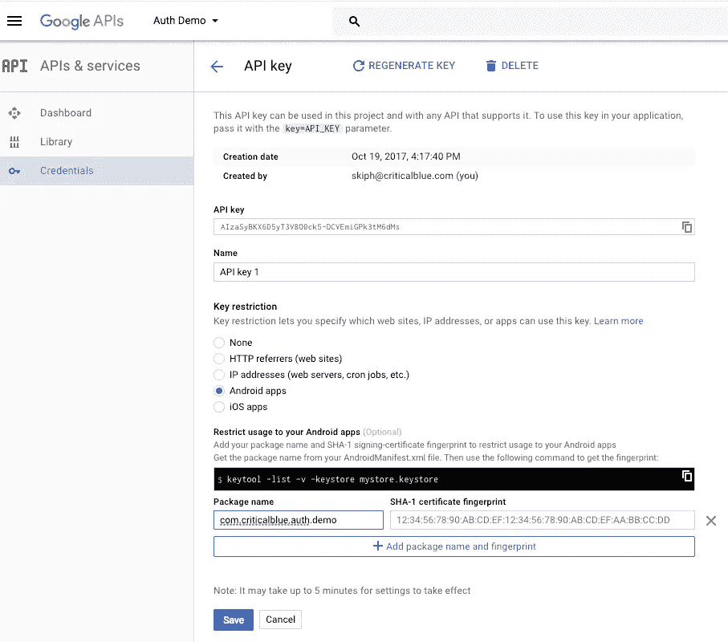
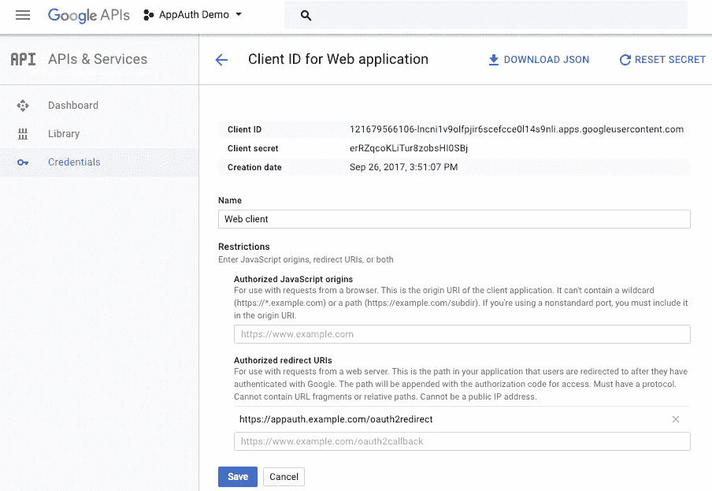
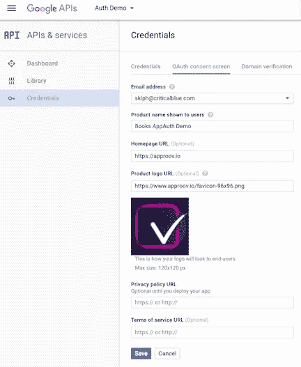
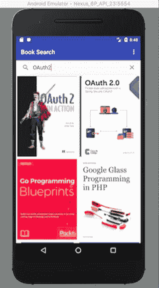
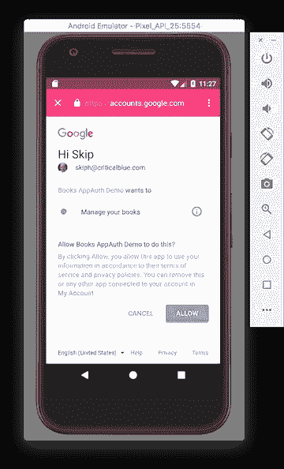

# 加强移动 OAuth2

> 原文：<https://medium.com/hackernoon/strengthening-oauth2-for-mobile-f4f3925dbf18>

## 应用证明技术弥补了常见的身份认证差距


Photo by [Patrick Metzdorf](https://unsplash.com/photos/iPiTNFiB_oI?utm_source=unsplash&utm_medium=referral&utm_content=creditCopyText) on [Unsplash](https://unsplash.com/?utm_source=unsplash&utm_medium=referral&utm_content=creditCopyText)

OAuth2 ，通常与 [OpenID-Connect](http://openid.net/connect/) (OIDC)结合使用，是一个流行的授权框架，使应用程序能够保护资源免受未授权的访问。它将用户身份验证委托给授权服务，然后授权第三方应用程序代表用户访问受保护的资源。OAuth2 为 web 和移动应用程序提供了授权流。

OAuth2 最流行的流程是授权代码授权流程，用于授权机密客户端访问受保护的资源。客户端使用客户端 id 来标识自己，并使用客户端密码向授权服务验证自己。



OAuth2 Authorization Code Grant Flow

授权代码授权很好地分离了前端和后端流程。前端流被委托给用户代理，通常是系统浏览器，它验证用户凭证并要求用户授予客户端访问受保护资源的授权许可。成功后，授权码将返回给客户端。在后端流程中，客户端通过客户端密码进行身份验证，交换访问和刷新令牌的授权码。客户端使用访问令牌代表用户访问受保护的后端资源。

# 移动 OAuth2 代码授权

在代码授权流程中，客户端机密仅向授权服务器公开。它永远不会通过潜在的不太安全的前端用户代理公开。

在 OAuth2 中，机密客户端是能够安全保护客户端机密的客户端。不幸的是，本地应用被认为是公开的，而不是机密的客户端。他们无法[保护静态机密](https://hackernoon.com/mobile-api-security-techniques-682a5da4fe10)。混淆和代码强化技术使秘密更难窃取，但并非不可能。如果客户端秘密可以被窃取，那么任何人都可以使用它来完成授权码交换。

由于公开的客户秘密根本不是秘密，许多身份和授权服务提供商干脆放弃客户秘密。A [ppAuth](https://appauth.io/) ，一个流行的开源 Android 和 iOS OAuth2 SDK，[建议不要利用客户端机密](https://github.com/openid/AppAuth-Android#utilizing-client-secrets-dangerous):

> **利用客户机密(危险)**
> 
> 我们*强烈建议*尽可能避免在本地应用程序中使用静态客户端机密。通过动态客户端注册获得的客户端机密可以安全使用，但静态客户端机密可以很容易地从您的应用程序中提取出来，并允许其他人假冒您的应用程序并窃取用户数据。如果您正在集成的 OAuth2 提供程序必须使用客户端机密，我们强烈建议在您的后端执行代码交换步骤，在这里可以隐藏客户端机密。

公共客户端容易受到各种攻击，包括授权代码和令牌窃取以及恶意软件的客户端冒充。对于不安全的秘密或根本没有秘密的情况，为了恢复用于移动设备的 OAuth2 代码授权流的完整性，本地应用保护必须从公共客户端强度提高到机密客户端强度。

# 代码交换的证明密钥(PKCE)

在使用基本代码授权流的公共客户端上，任何可以观察到前端授权代码的人都可以尝试用它来交换访问和刷新令牌。[代码交换的验证密钥](https://tools.ietf.org/html/rfc7636) (PKCE)被添加到基本流程中，以帮助弥补这一弱点。它试图确保发起前端代码请求的客户端与随后请求后端代码交换的客户端是同一客户端。

客户端首先生成一个名为`code_verifier`的运行时秘密。在 PKCE 的 stringer 形式中，客户机散列这个秘密，并作为前端请求的一部分发送这个`code_challenge`值。授权服务器保存该值。无论有没有客户端密码，客户端都会将代码验证器作为其后续后端代码交换请求的一部分。授权服务器将`code_verifier`的散列与它收到的原始`code_challenge`进行比较。如果它们匹配，服务将照常处理代码交换请求。



OAuth2 Authorization Code Grant Flow with PKCE

利用 PKCE，窃取授权代码的恶意行为者在不知道原始代码验证者的情况下不能成功地完成代码交换。代码验证器是运行时生成的秘密。因此，它是短暂的，不需要在客户端持久化，所以代码验证器在移动客户端可以被认为是机密的。

围绕 PKCE 的可能攻击需要生成一个假的`code_verifier`并将相应的假的`code_challenge`散列注入到客户端的原始前端请求中。在观察到返回的授权码后，恶意参与者可以发送其假的`code_verifier`来完成交换。

像 [SSL/TLS 和证书锁定](https://hackernoon.com/hands-on-mobile-api-security-pinning-client-connections-ebee4d82a911)这样的技术可以防止这些类型的攻击，但它们不能防止重新打包的应用程序冒充应用程序及其授权流。

# 动态客户端身份验证

动态客户端认证使用[远程证明技术](https://hackernoon.com/api-protection-requires-both-user-and-app-authentication-8a8101ed3f23)来验证应用程序是真实的和未经篡改的。

客户端向应用认证服务请求认证。该服务发出一个随机的、证明性的质询，客户端用一个安全的、可验证的响应进行响应。服务器回复一个短期批准令牌，该令牌可能有效，也可能无效，具体取决于证明结果。在正常使用中，此批准令牌被添加到后端 API 调用中，以确保只有正版和批准的应用程序才能成功访问后端资源服务。



API Protection Using Dynamic Client Authentication

使用动态客户端身份验证，客户端没有身份验证秘密。相反，应用认证服务和后端资源服务共享应用认证秘密。当应用程序认证服务认证客户端应用程序时，它使用认证秘密对批准令牌(通常是一个 [JSON Web 令牌(JWT)](https://jwt.io/) )进行签名，并将签名的令牌返回给客户端。客户端将令牌添加到 API 调用，后端资源服务使用身份验证机密来验证批准令牌未过期，并且由相同的应用程序身份验证机密正确签名。即使令牌通过客户端，应用程序身份验证机密也不会直接暴露给客户端。

# 安全 OAuth2 代码授权流

app authentication service 充当批准令牌的来源，这些令牌实际上是短暂的运行时客户端机密。通过对代码授权流的简单扩展，您可以用一系列运行时客户端机密替换静态的`client_secret`。由于客户端中不存在应用认证秘密，并且批准令牌在加密上是不可逆的，因此现在可以将应用视为机密的 OAuth2 客户端，符合安全授权码授权流的要求。

最重要的是，由于对客户端应用程序的任何篡改都会导致证明失败，因此在 OAuth2 流程中，假冒的应用程序无法再模拟有效的客户端。

# 概念实施证明

使用 Android 和 [AppAuth](https://appauth.io/) 为 Google 身份服务演示了一个概念验证实现。

在使用 AppAuth SDK 将 OAuth2 添加到移动 Android 和 iOS 客户端的过程中，开发了一个搜索和查找喜爱书籍的 Android 应用程序，展示了 [Google OAuth2](https://developers.google.com/identity/protocols/OAuth2) 、[Google API](https://developers.google.com/apis-explorer)和 [Android AppAuth](https://github.com/openid/AppAuth-Android) 库。我们使用 CriticalBlue 的免费[approv 演示服务](https://www.approov.io/demo-reg.html)将动态应用认证添加到 OAuth2 流程中。

因为我们不能直接修改 Google 的 OAuth2 身份验证，所以我们添加了一个 OAuth2 适配器服务，它可以验证 Approov 的令牌并协调 OAuth2 代码以进行访问令牌交换。



Secure Mobile OAuth2 Code Grant Flow (PKCE not Shown)

Google 的 OAuth2 适配器修改了两个授权端点。为了方便起见，OpenID 发现端点被修改，以便客户端可以轻松地配置自己来使用修改后的身份验证服务。更重要的是，OAuth2 令牌端点被修改为接受来自客户端的运行时批准令牌。

为了跟进，首先在 GitHub 上克隆 app auth-oauth 2-approv 演示项目，该项目可在[github.com/approov](https://github.com/approov/AppAuth-OAuth2-Books-Demo)获得。OAuth2 适配器是一个节点服务器，位于克隆存储库的 **oauth2-adapter** 子目录中。Android 客户端应用程序位于克隆存储库的 **books-client** 子目录中。

## OAuth2 适配器 TLS 证书

客户端适配器路径受到 TLS 保护和固定是很重要的。由于概念验证将使用本地主机服务器进行演示，我们将把它的自签名证书绑定到 Android 客户端，并使用 HTTPS 在客户端、适配器、Google OAuth2 和 API 路径之间进行通信。

要生成 TLS 公共证书-私钥对，请打开终端并运行:

```
$ openssl req -x509 -newkey rsa:2048 -keyout key.pem -out cert.pem 
    -days 3660 -nodes
```

将 key.pem 和 cert.pem 文件复制到 OAuth2 适配器的配置目录中，该目录位于 <your-repo>/oauth2-adapter/config/。</your-repo>

将 cert.pem 文件复制到位于<your-repo>/Books-client/app/src/main/assets/的 Books 应用程序的资产目录中。</your-repo>

## Google 客户端凭据

你将使用[谷歌图书 API](https://developers.google.com/books/docs/v1/using) 在 Android 上执行开放和授权的搜索。这需要一个 API 键来访问 API 的公共部分，比如开卷搜索。需要 OAuth2 访问令牌来访问 API 的私有部分，比如查找您最喜欢的书籍。

为了注册 Android 的 API 密钥和 OAuth2 凭证，Google 需要一个公钥 SHA1 指纹，它通常是签名您的 Android 应用程序包的公钥的指纹。对于这个演示，我们将创建一个新的秘密密钥库，并将相同的密钥材料用于 API 密钥、OAuth2 凭证和应用程序的签名配置。

在终端中，使用 Java keytool 生成一个“秘密”密钥库，并提取指纹。为了方便起见，您可以对所有参数使用“secret”。

```
$ keytool -genkey -keystore secret.keystore -alias secret 
    -keyalg RSA -keysize 2048 -validity 10000 -keypass secret 
    -storepass secret -dname 'CN=secret'$ keytool -list -v -keystore secret.keystore -storepass secret | 
    grep SHA1SHA1:
C5:A9:B1:F8:A3:8D:07:B3:30:D2:12:06:D2:BA:1E:CF:91:FA:60:97
```

确保将 **secret.keystore** 放在克隆存储库的<your-repo>/books-client/目录中。

接下来进入[谷歌开发者控制台](https://console.developers.google.com)并登录。选择或创建新项目。



此屏幕截图中的项目显示为“验证演示”。使用秘密指纹创建 API 密钥:



接下来，您将创建一个 OAuth2 客户端 ID 和密码。您可能希望使用 Android 应用程序类型，但是它不会生成客户端秘密。相反，请确保您选择了 Web 应用程序类型:



Web Application OAuth2 Client Credentials

完成 OAuth2 同意屏幕:



最后，转到 [Google API 库](https://console.developers.google.com/apis/library)页面，找到并启用 Google Books API。

## Approov 演示注册

证明服务用于在客户端和代理服务器之间建立信任。打开浏览器，访问[https://www.approov.io/demo-reg.html](https://www.approov.io/demo-reg.html)获得免费演示服务。完成注册，打开您的电子邮件，将附件解压到一个方便的地方。

## OAuth2 适配器设置

将 OAuth2 适配器配置为使用来自客户端的 Approov 令牌和 Google 的 Google client secret。

在 <your-repo>/oauth2-adapter/config 目录中，将 secrets_sample.js 文件复制到同一个目录中，并将其命名为 secrets.js，将 approov _ token _ secret 值设置为演示包电子邮件中提供的字符串。将 google_client_secret 的值设置为在前面的 Google credentials 步骤中提供的客户端机密。</your-repo>

在 OAuth2 适配器目录中，运行 npm install 以完成适配器设置。

您现在应该能够使用 npm start 成功运行适配器，但是默认情况下，Approov 强制将被禁用。

```
<your-repo>/oauth2-adapter$ npm start> oauth2-approov-adapter@1.0.0 start <your-repo>/oauth2-adapter
> node server.js**CAUTION: Approov token checking is disabled!**Server listening on ports 3000 & 3001
```

## AppAuth 客户端设置

在您项目的 **books-client** 目录中，创建一个 **secret.gradle** 文件，它将保存您的配置信息:

在 Google credentials 步骤中，将 API 键和客户机 ID 值复制到 secrets 文件中。

gradle build 会在构建应用程序时将这些配置信息插入到应用程序中。git 将忽略 **secret.keystore** 和 **secret.gradle** ，因此这两个文件都不会保存在您的存储库中。

接下来，将 Approov SDK 添加到 Android 客户端。使用之前解压缩的 approv 演示包，找到 Android approov.aar 库，并将其复制到位于<your-repo>/books-client/approv/的 books 客户端的 approv 子项目中。</your-repo>

现在，您应该能够成功构建图书应用程序了。一旦构建正确，您就可以在 Android 模拟器中测试它了。

注意:用于 web 应用程序的 Google OAuth2 服务需要 HTTPS 重定向 URI。最近的 Android 版本要求 HTTPS 应用程序链接通过托管资产链接文件验证该链接。为了避免额外的配置，建议用于测试的 Android 设备或仿真器运行 Marshmallow (API 23)或更早的版本。

为了测试设置，启动 OAuth2 适配器，然后在 Android 中启动 books 客户端。如果正确注册了 API 键，您应该能够成功搜索图书:



要测试 OAuth2 服务，请在 book client 下拉菜单中选择 login 项。这将启动一个 OAuth2 同意屏幕:



使用任何 Google 用户凭证登录，现在您应该会在客户端的顶部栏中看到一个登录图标，并且在下拉菜单中，应该会启用 favorites 项。

有关更多使用细节和调试，请参考文章[使用 AppAuth SDK 将 OAuth2 添加到移动 Android 和 iOS 客户端](https://hackernoon.com/adding-oauth2-to-mobile-android-and-ios-clients-using-the-appauth-sdk-f8562f90ecff)。

## Approov 客户注册

要向 approv 注册图书客户端，请打开一个终端或命令窗口，并切换到解压缩的 approv 演示文档中的目录，该文档包含适用于 Android 和您的本地环境的注册工具。例如，在 Linux 上，该目录是`<your-demo-dir>/registration-tools/Android/Linux`。运行注册工具，指定应用程序 APK 的路径。对于图书客户端，这将是`<your-repo>/books-client/app/build/outputs/apk/app-debug.apk`:

```
tutorial$ cd <your-demo-dir>/registration-tools/Android/Linuxtutorial$ ./registration -a <your-repo>/books-client/app/
build/outputs/apk/app-debug.apk -t ../../registration_access.tok 
-e 2dSubmitting data…Success: new app signature added to database.You can check in the Approov portal that signature ******************************************** has been added to the library ****************
```

一旦注册被处理，Approov 令牌应该开始验证。在 OAuth2 适配器中，您可以通过编辑<your-repo>/oauth 2-adapter/config/config . js 并将`approov_enforcement`设置为 **true** 来实施 Approov 令牌验证。重新启动适配器，只要安装的应用程序是正版的，客户端登录就会继续成功。</your-repo>

如果您从头开始重新构建客户端应用程序并重新安装，登录将会失败，因为新安装的应用程序与原始应用程序不同。重复注册命令，开始批准新应用程序的新登录。

# 安全 OAuth2 移动代码授权流

概念验证成功地演示了向移动代码授权流添加动态运行时秘密。增强的流与原始的代码授权流兼容，只需要授权服务器验证签名的令牌而不是静态秘密。

增强的秘密处理可以很容易地添加到现有的认证服务中，或者对于遗留服务，OAuth2 适配器可以方便地作为网关服务添加到应用程序资源后端集群中。

虽然动态应用程序身份验证通常用于保护后端 API 调用，但它是对 OAuth2 授权代码授权流的简单扩展。除了给予机密客户端代码授权流的所有保护之外，app authentication 还为所有用户添加了客户端篡改和假冒保护。

感谢阅读！有关移动 API 安全性的更多信息，请查看[www . approv . io](https://approov.io)。

如果你推荐这篇文章(点击👏按钮)以便其他人可以找到它。