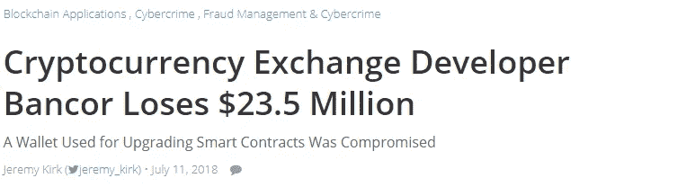

# 加强智能合同安全中最薄弱的环节——“唯一所有者”

> 原文：<https://medium.com/hackernoon/strengthening-the-weakest-link-in-smart-contract-security-onlyowner-c390d0e452b4>

在过去的几年里，# buidlers 已经集体部署了价值数百万美元的智能合约。作为一个我自己，我一直意识到整个[区块链](https://hackernoon.com/tagged/blockchain)生态系统是如何过度依赖开发商的意图。包括投资者在内的最终用户通常不完全理解智能合约代码，责任显然在于开发者。

# 权力越大，责任越大

通常，智能合约的关键功能被定义为使用“onlyOwner”修饰符来执行。这给聪明的合同所有者留下了巨大的权力来做出改变。这就引出了一个问题，谁应该拥有这样的权力？

广义地说，权力可以赋予这两者中的任何一个 1)以太坊地址或 2)智能合约。

## 基于以太坊地址的所有权

在我看来，基于以太坊的所有权从根本上来说是有缺陷的，因为这会导致明显的集中化，由于私钥丢失、利益不一致等原因导致意外代码执行的高风险。



Bancor Hack 2018 ([source](https://www.bankinfosecurity.com/bancor-cryptocurrency-exchange-loses-235-million-a-11188))

当 [Bancor 宣布价值 2350 万美元的加密资产被黑客钱包](https://www.bankinfosecurity.com/bancor-cryptocurrency-exchange-loses-235-million-a-11188)窃取时，我们看到了这一后果。他们允许钱包升级他们的智能合同，这使得它成为黑客的目标。它最终被黑了，攻击者设法用这个钱包窃取了 Bancor 的资产。如果他们通过允许智能合同而不是钱包地址来实现 kill switch，这本来是可以避免的。

```
contract EthAdressGoverned {address public owner;/**
  * [@dev](http://twitter.com/dev) Constructor sets the original `owner` of the contract to the sender account.
  */
  constructor() public {
    owner = msg.sender;
  }/**
  * [@dev](http://twitter.com/dev) Throws if called by any account other than the owner.
  */
  modifier onlyOwner() {
    require(msg.sender == owner);
    _;
  }}}
```

## 基于智能合同的所有权

基于所有权的智能合约提供了一种不可信的替代方案，然而，它再次归结为由智能合约实现的许可系统。

**注意:如果智能合约使用带有 ETH 地址的“onlyOwner”修饰符作为所有者，我们又回到了起点，给予智能合约许可的目的也就失败了。**

# 那么，我们如何解决这个问题呢？

在这两种情况下，失败点最终是对单个以太坊地址的授权。


Showcasing the common point of failure in both scenarios

为了解决这个问题，我们可以使用 1)多重签名智能契约或者 2)基于投票驱动的智能契约所有权模型。

## 基于所有权的多重签名智能合同

在过去，项目(例如 0x)使用多签名钱包，因为它们易于实现(某种程度上)。多签名钱包需要最低数量的签名来授权交易，然后才能执行交易。这可以防止在帐户被黑的情况下未经授权的执行。

但多重签名钱包的缺点是灵活性较差，而且权力总是掌握在少数人手中。此外，在帐户被黑的情况下，无法执行需要所有签名的关键功能。

## 基于所有权的投票驱动智能合约

多签名钱包的问题可以通过使用投票驱动的智能合同来定义 dApp 的所有权和最终治理来解决。我知道围绕链上投票及其可伸缩性相关挑战的大量热烈讨论。虽然我将写另一篇文章来解释我们如何解决这些挑战，但我提出了一种机制，将 dApp 社区分为多种角色(如顾问委员会、开发人员等)，并将这些角色与可配置的投票阈值和多数百分比相结合。通过这种方式，我们可以为 dApps 实现灵活且可扩展的决策模型。


Replacing Ethereum address based ownership with a self-governed smart contract

例如，在紧急情况下(如 DAO hack)实施 kill-switch 的决策可以配置为只需要咨询委员会以高多数和低阈值进行投票。然而，撤销紧急状态的决定(在必要的修正之后)可能需要顾问委员会+成员以高多数和高门槛投票。

[Nexus Mutual](https://nexusmutual.io) 树立了使用基于所有权和治理的投票驱动智能合同的榜样。他们使用 [govblocks-protocol](http://github.com/somish/govblocks-protocol) 来管理他们的 DAO，DAO 处理他们智能合约的所有关键功能。[更多关于 Nexus Mutual 的治理](/nexus-mutual/dao-governance-a-pragmatic-approach-27d529ad0819) 模式。


# 单凭这一点，并不能解决问题

尽管有上述解决方案，但仍然存在很高的人为错误/疏忽风险，这可能会无意中导致安全漏洞和相关的财务损失。奇偶校验付出了代价[当它的 multisig 钱包被黑客攻击](https://paritytech.io/security-alert-2/)时，因为他们的图书馆合同没有初始化。任何人都可以成为它的主人并自毁它。因此，所有平价 multisig 钱包都变得毫无用处，导致 514，000 ETH 的损失。

## 从过去吸取教训

世界各地的传统公司都是根据各自政府的法律成立的，这些法律要求通过公共登记处以标准格式提交公司注册文件。这对于保持流程的透明度、一致性和标准化至关重要。

想象一下，如果今天我们没有一个世界上所有公司的公共注册，这将导致一个不可控制的威胁，即公司听从其所有者的命令，而不对其他利益相关者负责。

## 对标准化的呼吁

我们将合并 dApp 的流程标准化(同时保持分散化)如何，这样可以确保最关键步骤的合规性，尤其是所有权？我们一直在政府部门试验这样的想法，这促使我们开发了一个名为 T2 政府检查员的合同。这个契约就像是某种公共注册中心，只是维护一个 dApp v/s 的所有者的映射。如前所述，所有者可以是以太坊地址、多重签名钱包或投票驱动的智能契约。

一旦在 [GovernChecker](https://github.com/somish/govblocks-protocol/blob/master/contracts/GovernCheckerContract.sol) 契约上注册，dApp 就可以在其智能契约中使用" **onlyAuthorizedToGovern** "修饰符，从而带来更高水平的一致性。这个过程很简单，在这里详细介绍[。](https://docs.govblocks.io/wiki/start-using-governchecker)

我们仍然处于实施“代码即法律”思想的早期阶段，我觉得标准化以及更新法律的机制，从实用的角度来说，与首先弄清楚法律一样重要。欢迎在我们的[Telegram](https://t.me/govblocks)&[Reddit](https://www.reddit.com/r/GovBlocks)社区分享您的想法。

*感谢* [*伊什戈埃尔*](https://medium.com/u/106bb90392d6?source=post_page-----c390d0e452b4--------------------------------) *，* [*卡尔提克拉赫拉*](https://medium.com/u/d68d102c6d4d?source=post_page-----c390d0e452b4--------------------------------) *，* [*穆迪特古普塔*](https://medium.com/u/aa341296c4be?source=post_page-----c390d0e452b4--------------------------------) *为本文出谋划策。*