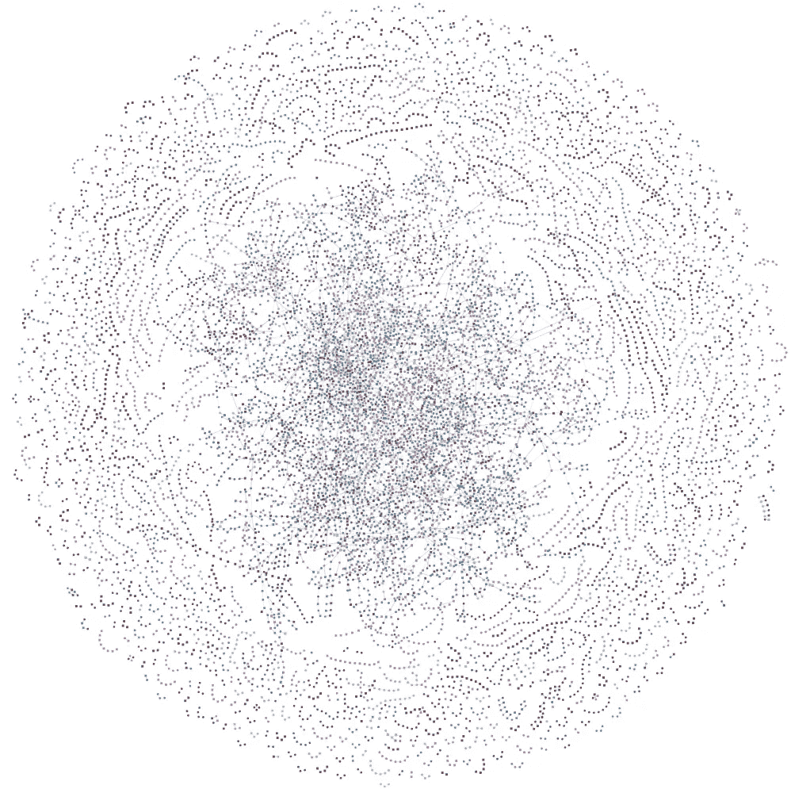
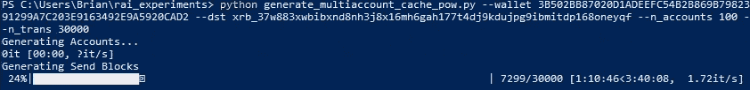
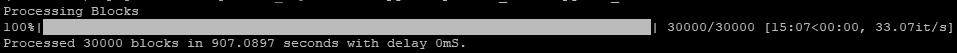
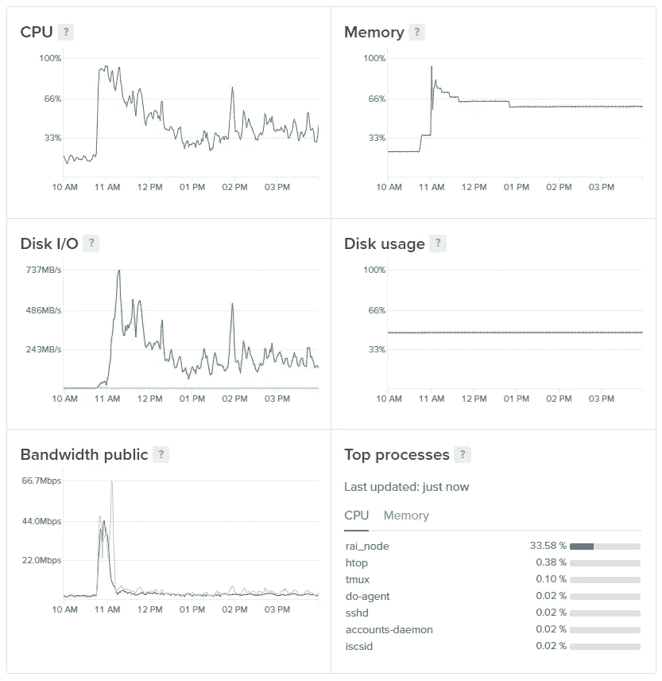

# RaiBlocks 网络的压力测试:第一部分

> 原文：<https://medium.com/hackernoon/stress-testing-the-raiblocks-network-568be62fdf6d>

Captured from [rai.watch](https://rai.watch/#/graph) during the stress test

更新:见[第二部分](/@bnp117/stress-testing-the-raiblocks-network-part-ii-def83653b21f)我达到了峰值 306 TPS。

# 介绍

RaiBlocks 被吹捧为市场上最快、最具可扩展性的加密货币之一，但这些说法如何站得住脚？在[我之前的文章](/@bnp117/raiblocks-how-fast-actually-is-it-tl-dr-about-1-7-seconds-8cf2799e4da3)中，我研究了事务速度，发现事务速度的中间值为 1.7 秒。今天，我将回顾我最近的实验，该实验于 2018 年 1 月 21 日上午 11 点左右在太平洋标准时间进行，我从一个廉价的虚拟专用服务器(VPS)快速发送了大量预先计算的事务，以查看 RaiBlocks 网络每秒可以处理多少事务(TPS)。

# 准备压力测试

Custom script generating the PoW for 30k Transactions on an overclocked GTX 1070

在开始之前，让我们快速回顾一下网络运行的背景。在 RaiBlocks 中，每个账户都有自己的[区块链](https://hackernoon.com/tagged/blockchain)(账户链)，只有账户所有者才能登录他们个人账户链的交易。网络中的每个节点都有形成块格的所有账户链的本地副本。像传统的区块链一样，账户链中的每个块包含该链中前一个块的散列；如果一个块的先前散列不在节点的本地分类帐中，则它不会被视为有效块，但会被缓存一段时间，以防传入的块使该块有效。正因为如此，单个账户链在网络中发送垃圾邮件的速度自然会受到限制，而不会有很大一部分网络拒绝许多交易，因为传入的数据块尚未与其本地分类账完全同步。因此，在这个测试中，我创建了 100 个帐户，并从这些帐户中连续发送垃圾邮件。由于在发送账户链中的下一笔交易之前有 99 笔交易被垃圾邮件发送，[网络](https://hackernoon.com/tagged/network)有更好的机会接受这些交易，因为前一笔交易有足够的时间传播网络。在整个测试过程中，我还会偶尔重新发布这些过去的事务，以便节点有更大的机会接收它们。

以下是这个实验的说明:

*   创建了 100 个帐户，每个帐户填充了 300xrb (0.0003XRB)。这需要 200 次 PoW(发送和打开块)计算，然后才能预计算实验的其余部分。
*   30，000 笔交易(每个账户 300 笔交易，每笔交易发送 1xrb)的 PoW 是在 GTX1070 上生成的，生成大约需要 5 个小时。
*   这些交易都是从我的数字海洋水滴中播出的，因为它有强大的互联网连接。分别播报如下: *{Account_A_1，Account_B_1，Account_C_1，…，Account_A_2，Account_B_2，Account_C_2，…)}*

# 测试执行

由于其高质量的互联网连接，这些块从 5 美元/月的 VPS 播放。应该注意的是，这个实验是在 RaiBlocks MainNet 上进行的，并在各种硬件的真实节点上传播。这不是一个综合的数据中心测试。

Custom script broadcasting the precomputed blocks

该节点花费了 907 秒(大约 15 分钟)来广播所有 30k 个事务。非常有限的 VPS CPU 在此期间紧张；我怀疑一个更强大的 VPS 可以更快地处理交易。

Beginning of stress test (sped up 8x)

Ending of stress test (sped up 40x)

# 结果

Dashboard for my $5/mo Digital Ocean Droplet that broadcasted the transactions

节点以 33TPS 的平均事务速度广播所有事务大约需要 15 分钟。 [raiblocks.club](https://www.raiblocks.club/) 30 分钟平均计数器最大值达到 16.86TPS 左右；压力测试持续了大约 15 分钟，因此我们可以推断他们也观察到了平均约 33TPS。

由于像 RaiBlocks 这样的基于 DAG 的加密货币中不存在确切的全局状态，因此不同的节点在不同的时间会经历不同的交易速率。社区成员 Cronoh 在他的本地笔记本电脑节点上通过 Wi-Fi 连接测得了 120TPS 的[峰值。rai.watch 上每分钟 2406 个事务的峰值导致平均每分钟大约 40 个事务。](https://gist.github.com/cronoh/9d5515146971541503b49643d165675e)

每个 RaiBlocks 的发送事务大约为 260 字节。这意味着，在 GTX1070 上计算这 30，000 笔交易需要大约 5 个小时，这使得分类账的大小增加了大约 7.8MB。如果接收方生成所有相应的接收交易，那么全球分类账将增加 7.8MB。当帐户链历史修剪被释放时，该测试将使分类帐膨胀不到 50KB。

我的数字海洋带宽在压力测试期间达到了 44Mbps 的峰值。如果一个节点有一个较低的带宽限制，那么随着时间的推移，使用将会更加分散，并且该节点将会稍微取消同步，直到它赶上。

# 结论和要点

在这个实验中，我们表明 RaiBlocks 的网络至少可以处理持续的 33 TPS，而单个节点处理的最低峰值为 120 TPS。这些结果是这个实验和我发布的节点的局限性；我对网络处理更高交易速率的能力非常有信心。未来的工作是执行多节点发布压力测试，或者在我当前的压力测试代码中找到瓶颈。

# 误解

1.  请注意，崩溃或取消同步的节点**不是因为 CPU 或互联网带宽**不足。廉价的 VPSs 和< 10W 电脑上的节点在压力测试中表现良好。UDP 事务的突发性可能会使一些服务质量(QoS)较差的路由器崩溃，或者触发其他配置不佳的网络。核心团队目前正致力于减少 rai_wallet/rai_node 软件产生的突发流量，并致力于一种总体上对 NAT 和路由器更友好的数据泛洪方案。
2.  事务在 GPU 上预计算了许多小时。5 美元/月的 VPS 只是广播交易，它不需要进行功率计算。
3.  **在此期间，网络没有出现故障，也没有饱和**。在此期间，其他人的正常交易以正常速度进行。

像这样的东西？支持我在:
xrb _ 1y 6 fjssau 9 hmnprwfxemfnahz 759 tx 7 qrdrfz 7 kbzd 4 jbkd 4 grurq 7 tfmf