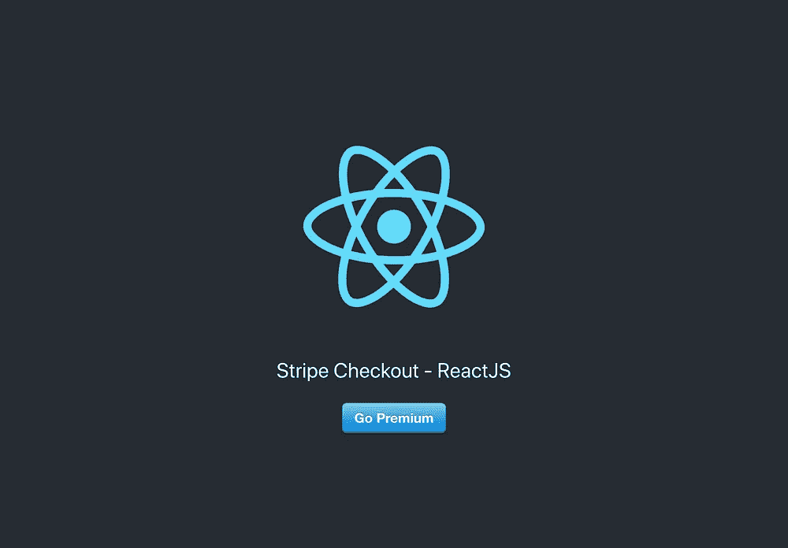
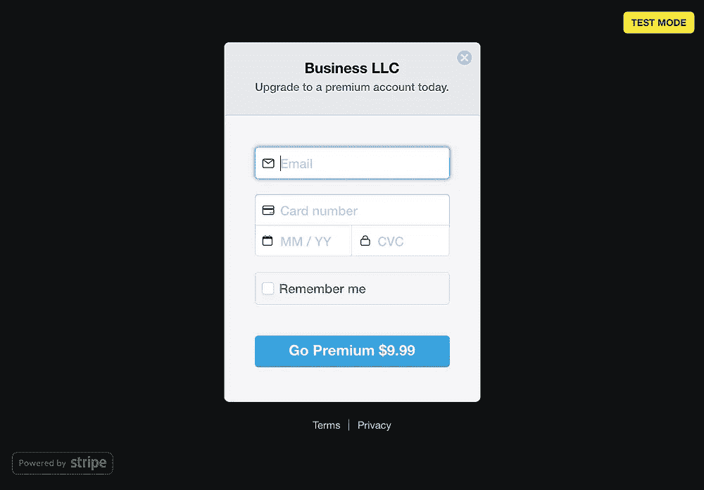

# 条带 API、ReactJS 和 Express

> 原文：<https://medium.com/hackernoon/stripe-api-reactjs-and-express-bc446bf08301>


> *** *对条带检出进行了更改。这篇文章正在更新中。感谢您的耐心！****

我在 [Lambda School](https://mbsy.co/lambdaschool/43054350) (一个为期 30 周的沉浸式全栈 web 开发和 CS 项目)期间，接触了从 HTML/CSS、 [Javascript](https://hackernoon.com/tagged/javascript) 、ReactJS、ExpressJS、API、Python、Django、C 等等的一切。我学习并探索了计算机科学的主题，如数据结构、算法和时间复杂性。然而，我想谈论并提供指导的特定主题是我在 Lambda 实验室项目中遇到的一个任务。将 Stripe Checkout 与一个 [React](https://hackernoon.com/tagged/react) 客户机和一个 Express/Node 服务器集成在一起。

使用 Stripe Checkout 时，有两种方式可供选择，一次性付费或订阅付费。我今天会支付一次性费用。如果您对订阅费用感兴趣，我将在以后的文章中介绍这一点。在我们开始编码之前，您需要完成一个步骤。创建一个[条带](https://stripe.com/)账户。这是一个免费的帐户，可以很快建立起来。我会在这里等你去准备。回到你的仪表板前。


太好了，现在你应该有一个 Stripe 帐户了。请注意，仪表板处于测试模式。把它放在这里，直到把你的项目投入生产的时候。现在让我们开始编码。

# 前端/客户端

## 设置

让我们从创建客户机开始。我将使用 create-react-app 来样板化我们的 react 应用程序。在您的终端中使用以下命令进行设置。

```
create-react-app stripe-client
cd stripe-client
yarn start
```

现在，您应该有一个开发服务器在您的终端上运行，并且能够在新的浏览器窗口中查看您的客户机。当您对应用程序进行更改并保存时，浏览器中的客户端将自动刷新。接下来，我们需要添加所有的库。在新终端中，使用以下命令安装库。

```
yarn add react-stripe-checkout axios
```

接下来让我们创建一个`stripeBtn`组件。该组件将是一个按钮，单击该按钮将打开反应条纹结帐模式。请遵循以下步骤。

```
cd src
touch stripeBtn.js
```

## 创建反应组件

现在，将该组件的以下代码复制并粘贴到新文件夹中，我们将在下面讨论细节。

```
import React, { Fragment } from "react";
import StripeCheckout from "react-stripe-checkout";
import axios from "axios";const stripeBtn = () => {
  const publishableKey = "pk_test_ZU3mlTy0q00DATc9EyF9A8jX";

  const onToken = token => {
    const body = {
      amount: 999,
      token: token
  }; axios
      .post("http://localhost:8000/payment", body)
      .then(response => {
        console.log(response);
        alert("Payment Success");
      })
      .catch(error => {
        console.log("Payment Error: ", error);
        alert("Payment Error");
      });
  }; return (
    <StripeCheckout
      *label*="Go Premium" *//Component button text
      name*="Business LLC" *//Modal Header
      description*="Upgrade to a premium account today." *panelLabel*="Go Premium" *//Submit button in modal
      amount*={999} *//Amount in cents $9.99
      token*={onToken}
      *stripeKey*={publishableKey}
      image="https://www.vidhub.co" //Pop-in header image
      billingAddress={false}
    />
  );
};export default stripeBtn;
```

回顾我们在上面所做的。我们创建一个变量来保存我们的可发布密钥。你从仪表板上看到的。从边栏点击开发者> API 密匙。这个密钥不是秘密，不需要放在。环境文件。我们有一个函数`onToken()`,一会儿会讲到。组件返回一个来自`react-stripe-checkout`的`StripeCheckout`元素。传递的属性用于定制模态和其他事务细节。确保你包括道具`stripeKey.`

`onToken()`函数“幕后”将卡信息发送给 Stripe 并返回一个令牌对象。该对象包含有关交易的有限细节(卡类型、最后 4 位数字、电子邮件等。)我们的函数通过 axios 请求将这个令牌和金额发送到我们的后端，以完成交易。差不多就是这样。由于 React 是模块化的，我们可以在应用程序的多个位置导入组件。我包含了下面的`App.js`代码，在这里我将导入并呈现我们的`stripeBtn`组件。

## 最终步骤和最终确定

```
import React, { Component } from "react";
import logo from "./logo.svg";
import "./App.css";
import StripeBtn from "./StripeBtn";class App *extends* Component { render() {
    return (
      <div *className*="App">
        <header *className*="App-header">
          
          <p>Stripe Checkout - ReactJS</p>
          <StripeBtn />
        </header>
      </div>
      );
  }
}export default App;
```

打开浏览器，检查新的 Stripe 组件，它可以在项目的任何地方重用。看看下面的一些截图。



Clicking the button on the left will make the modal appear on the right.

# 后端/服务器

## 设置

现在我们的服务器…后端。这是很多人开始紧张的地方。不过，别担心，我会尽可能让这一切变得轻松愉快。请记住，我们的后端只是从前端接收令牌，并将其发送到 stripe 以完成支付。首先在终端中导航到项目的根目录，并运行以下命令。

```
mkdir server
cd server
touch server.jsyarn init -yyarn add express stripe cors dotenv
```

在服务器目录中，我们创建一个索引并初始化一个 yarn 项目。设置`-y`标志使用项目的默认值。然后，我们像在前端一样安装了一些我们需要的包。

接下来，我们将创建一个保存环境变量的`.env`文件。您会希望将`.env`放在您的`.gitignore`文件中。这是因为我们不会将 API 密匙等敏感信息上传到 Github，也不会让公众获得这些信息。我们还将创建一个新的目录和两个新文件。

```
touch .envmkdir routes
cd routes
touch index.js payment.js
```

在`.env`文件内添加`STRIPE_SECRET_KEY="YOUR SECRET KEY HERE"`。确保你使用了你的 dashboard 工具条中的密钥(开发者的 API 密钥)。让我们在`/server/servers.js`中创建将使用 Express 创建的服务器基础。获取下面的代码。

## 创建您的服务器

```
const express = require("express");
const cors = require("cors");
const bodyParser = require("body-parser");
const dotenv = require("dotenv");dotenv.config()const app = express();app.use(bodyParser.json());app.use(bodyParser.urlencoded({ extended: true }));app.use(cors());const configureRoutes = require("./routes")configureRoutes(app);app.listen(8000, error => {
  if (error) throw error;
  console.log("Server running on port " + 8000);
});
```

上面我们导入 express 来创建一个应用程序/服务器。导入并配置`dotenv`以使用我们的环境变量(`.env`)。将`cors`应用到应用程序，并用我们的路线目录配置应用程序。最后一步是让你的应用程序监听本地服务器 8000。现在我们需要创建我们的`/routes/payments.js`端点。复制并粘贴下面的代码开始。

## 支付端点

```
const stripe = require("stripe")(process.env.STRIPE_SECRET_KEY);const stripeChargeCallback = res => (stripeErr, stripeRes) => {
  if (stripeErr) {
    res.status(500).send({ error: stripeErr });
  } else {
    res.status(200).send({ success: stripeRes });
  }
};const paymentApi = app => {
  app.get("/", (req, res) => {
    res.send({
      message: "Hello Stripe checkout server!",
      timestamp: new Date().toISOString()
    });
  });app.post("/", (req, res) => {
    const body = {
      source: req.body.token.id,
      amount: req.body.amount,
      currency: "usd"
    };
    stripe.charges.create(body, stripeChargeCallback(res));
}); return app;
};module.exports = paymentApi;
```

在顶部，我们通过从。环境文件。然后创建一个回调，将响应或错误发送回前端。接下来，我们将创建端点(get、post 等。)的支付途径。get 请求只是您的服务器启动并运行的端点。这是 post 请求创建令牌 id、数量和货币主体的地方。我们使用我们的`stripe`实例通过从客户端传入`body`对象和响应的回调来创建费用。这将完成购买，并向客户收取一次费用。如果你正在寻找订阅或重复计费，请查看我的另一篇文章。

最后一步是连接您的`server.js`和`routes`。这已经在`server.js`中进行了配置，所以只需在`/routes/index.js`中添加以下代码。

```
const paymentApi = require("./payment");const configureRoutes = app => {
  paymentApi(app);
};module.exports = configureRoutes;
```

## 你成功了

就是这样。将端子`cd`插入`/server`并运行`yarn start`。这将在本地主机 8000 上运行服务器。在你的浏览器中回到你的客户端，试一试你的新按钮。这里有几张卡片你可以试试:

> 签证号码:4242 4242 4242 4242-Exp:01/20-CVV:123
> 
> 万事达卡:5555 5555 5555 4444-Exp:01/20-CVV:123

如果你遇到任何问题，请给我发信息，我会尽力帮助你。如果你喜欢这个，请分享并关注我的 [Github](https://github.com/Jameson13B) 和 [Twitter](https://twitter.com/jameson_brown) 。请关注未来的文章，如 Stripe 订阅费用等。祝你愉快！