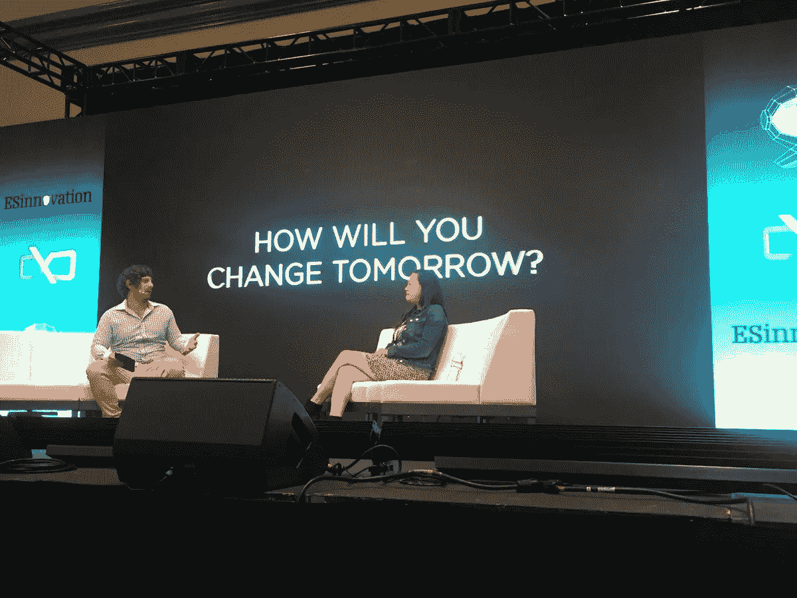

# Stronghold 首席执行官:“让加密成为主流取决于我们”

> 原文：<https://medium.com/hackernoon/stronghold-ceo-its-up-to-us-to-make-crypto-mainstream-3ea9332e1818>

Stronghold 首席执行官 Tammy Camp 表示:“主流媒体宁愿报道 CryptoKitties 的重要进展，如央行如何使用分布式账本技术。”

8 月，TechCrunch 编辑 Josh Constine 在拉斯维加斯举行的技术和创新会议 ChainXChange 上采访了 Stronghold 首席执行官 Tammy Camp。

这次对话是一个名为“把比特币和屎币分开”的聊天系列的一部分，涉及几个话题，包括坎普的企业家背景、区块链目前的轨迹，以及 Stronghold 打算在哪里产生最大的影响。

Camp 说，她作为 500 家初创公司的合作伙伴度过的几年帮助她准备推出 Stronghold 并评估竞争格局。当她两年前离开加速器时，它的投资组合中有 1600 家公司。

“我认为我拥有的数据点可能比大多数人都多，所以这对我的创业帮助很大，”她说。“(启动)一家初创公司就是要寻找市场机会、时机和人脉。”

当 Constine 询问 Stronghold 在全球范围内降低金融壁垒的计划时，Camp 表示，跨境支付是一个成熟的用例，因为 Stronghold 的平台是资产不可知的。具体来说，她说，Stronghold 准备改造汇款行业，该行业的基础是剥削缺乏金融服务的消费者。

“他们肯定是在利用人们，”她说，并指出大多数汇款都是发给发展中国家的人。“每天收入不到两美元的人需要每月花费收入的 10%才能把钱赚回来。”

虽然比特币汇款服务可用，但 Stronghold 现在为机构和零售客户提供 [Stronghold USD](http://stronghold.co/stronghold-usd) ，允许他们以美元结算/接受支付，并将其兑换成其他法定货币。

“有了 Stronghold USD，我们可以立即在许多不同的货币之间进行转换，”Camp 说。“使用 Stellar，我们可以以不到 0.01 美元的价格完成超过 30 万笔近乎即时的交易。”

因为交易在几秒钟内完成，“对消费者来说没有摩擦。由于内置的监管技术，两个不同的金融机构可以像一个机构一样合作，”她说。

TechCrunch Editor Josh Constine and Stronghold CEO Tammy Camp.

坎普观察到，即使加密货币在区块链社区之外获得了动力，公众的看法仍然集中在投机者身上。

她说:“出于某种原因，主流媒体更愿意报道重要的进展，比如中央银行如何使用分布式账本技术。”。在与加密相关的公司能够被主流采用之前，讨论需要达到一定的成熟度，“我们有责任弥合这一差距。”

虽然 Stronghold 是在专门处理金融交易的 Stellar network 上推出的，但 Camp 重申，该公司是平台和资产无关的。

“这有点有趣，因为我们不是说我们是一家交易所，而是说我们是一家金融机构，”她说。“我们从 Stellar 开始，但我不认为我们局限于任何一种协议。将来会有很多协议，很多可以扩展的协议。”

展望未来，Camp 表示，Stronghold 正在创建一个更具包容性的区块链生态系统，在这里可以保存和交换不同形式的价值。

“想象有一天纽约证券交易所、澳大利亚证券交易所和尼日利亚证券交易所都在一个平台上连接起来，”她说。

“你的星巴克积分和航空公司积分也在一个平台上，所以你可以交换这个值。我们将看到越来越多的流动性流向世界上服务不足的地方……我认为我们将成为领跑者。”