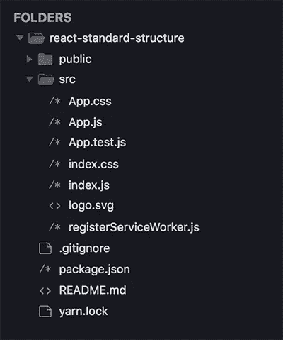
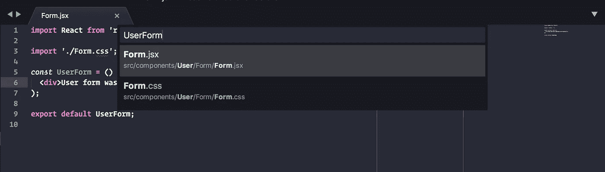
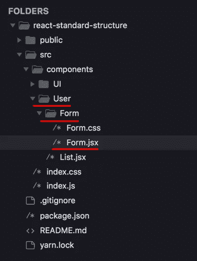

# 在 React 中构建项目和命名组件

> 原文：<https://medium.com/hackernoon/structuring-projects-and-naming-components-in-react-1261b6e18d76>


因为 *React* 只是一个库，它并没有规定你应该如何组织和构建你的项目。这很好，因为它让我们可以自由地尝试不同的方法，并调整更适合我们的方法。另一方面，这可能会给刚开始在 *React* 世界工作的开发者带来一些困惑。

在这篇文章中，我将展示一些我已经使用了一段时间并且已经很好地扩展的方法。这些方法并没有再造轮子，它们只是把我们在市场上的东西放在一起并加以改进。

> 记住:这里没有什么是一成不变的！你可以只采取你认为有意义的方法，并根据你的情况进行调整/改变。

# 文件夹结构

我经常看到的一个问题是关于如何组织文件和文件夹。在这篇文章中，我们认为你有一个最小的结构，就像用`create-react-app`创建的一样。

`create-react-app`为我们生成一个基本项目，在其根中包含文件:*。gitignore* ， *package.json* ， *README.md* ， *yarn.lock*

它还生成文件夹:`public`和`src`。最后一个是我们保存源代码的地方。

看看下面的图片，具有所描述的结构:



在本帖中，我们将重点关注`src`文件夹。除此之外的一切都将保持完整。

# 容器和组件

您可能已经在某个项目的根文件夹中看到了*容器*和*表示组件*之间的分离。我的意思是，在`src`里面，你有一个名为`components`的文件夹和另一个名为`containers`的文件夹:

```
src
├─ components 
└─ containers
```

但是，这种方法存在一些问题，如下所示:

*   **主观规则**——你没有关于什么是*容器*和什么是*表示组件*的明确规则。彼此之间的差异可能是主观的，当你在一个团队中时，很难让所有的开发人员都同意并平等地判断这件事。
*   **它没有考虑组件的动态性** -即使你决定一个组件适合某个特定的类型，也很容易在项目生命周期中改变它，变成另一种类型，迫使你将它从`components`移动到`containers`文件夹，反之亦然。
*   **允许两个组件有相同的名字**——组件在应用程序中应该有声明性的和唯一的名字，以避免混淆每个组件的职责。然而，上面的方法打开了一个缺口，让两个组件同名，一个是*容器*，另一个是*表示。*
*   **生产力损失-** 您必须不断地在容器和组件文件夹之间导航，即使是在单个特征中工作。因为通常一个特性包含两种类型的组件。

这种方法还有一种变体，它保持这种分离，但是在模块内部。

假设在您的应用程序中，有一个模块用户。在其中，您将有两个文件夹来分隔您的组件:

```
src
└─ User
  ├─ components
  └─ containers
```

上面的方法，最小化了在项目树中遥远的文件夹之间导航的问题。然而，它增加了许多噪音。根据您的应用程序有多少模块，您最终会有几十个`containers`和`components`文件夹。

出于这些原因，当我们谈论组织文件夹和文件时，按照*表示*和*容器的概念来划分我们的组件是不相关的。*那个说*，*我们要把我们所有的组件都保留在`components`文件夹里面，除了*屏幕*。

> 即使在文件夹中把它们分开是无关紧要的，了解它们之间的概念差异也是很重要的。如果您对这个主题还有疑问，我建议您阅读文章:[表示和容器组件。](/@dan_abramov/smart-and-dumb-components-7ca2f9a7c7d0)

# 分离和分组代码

在`components`文件夹中，我们按照模块/特性对文件进行分组。

在一个[*CRUD*](https://pt.wikipedia.org/wiki/CRUD)*的用户中，我们就只有这个模块用户了。因此，我们的结构如下:*

```
*src
└─ components
  └─ User
    ├─ Form.jsx
    └─ List.jsx*
```

*当一个组件由多个文件组成时，我们将这个组件及其文件放在一个同名的文件夹中。例如:假设你有一个 *Form.css* 包含 *Form.jsx 的样式。*在这种情况下，你的结构应该是这样的:*

```
*src
└─ components
  └─ User
    ├─ Form
    │ ├─ Form.jsx
    │ └─ Form.css
    └─ List.jsx*
```

> *测试文件与被测试的文件在一起。在上面的例子中， **Form.jsx** 的测试将会留在同一个文件夹中，并被命名为 **Form.spec.jsx***

## *UI 组件*

*除了通过模块分离组件之外，我们还在`src/components`中包含了一个`UI`文件夹，用来保存我们所有的通用组件。*

*UI 组件是足够通用的组件，不属于一个模块。它们是可以保存在开源库中的组件，因为它们没有来自特定应用程序的任何业务逻辑。这些组件的例子有:按钮、输入、复选框、选择、模态、数据显示元素等*

# *命名组件*

*上面我们看到了如何构建文件夹，以及如何通过模块来分离组件。然而，还有一个问题:如何给它们命名？*

> *当我们谈论给组件命名时，它是关于我们给定义组件的**类**或**常量**的名称:*
> 
> *类 **MyComponent** 扩展组件{
> }
> const**my Component**()=>{ }；*

*如前所述，我们给组件起的名字在应用程序中应该是清晰和唯一的，以便更容易找到它们并避免可能的混淆。*

*当我们需要使用像 *React Dev Tools* 这样的工具进行调试时，以及当应用程序中出现运行时错误时，组件的名称非常方便。错误总是伴随着发生错误的组件名。*

*为了给组件命名，我们遵循模式*基于路径的组件命名，*这包括根据组件到文件夹`components`或`src`的相对路径来命名组件，如果你在`components`文件夹之外。基本上，位于`components/User/List.jsx`的组件将被命名为`UserList`。*

*当文件在同名文件夹中时，我们不需要重复名称。也就是说，`components/User/Form/Form.jsx`将被命名为`UserForm`而不是`UserFormForm`。*

*上面的模式有一些好处，我们可以在下面看到:*

## *便于在项目中搜索文件*

*如果您的编辑器支持模糊搜索，只需搜索名称`UserForm`就能找到正确的文件:*

**

*如果你想在文件夹树中搜索文件，你可以很容易地通过组件名找到它:*

**

## *避免在导入中重复名称*

*按照这个模式，您将总是根据其上下文来命名**文件**。考虑到上面的**表单**，我们知道它是一个**用户表单**，但是由于我们已经在**用户**文件夹中，我们不需要在组件**文件**名称中重复那个单词。所以，我们只将其命名为 **Form.jsx***

*当我开始使用 *React* 时，我习惯于将全名放在文件中。然而，这使你重复一个名字很多次，输入路径变得太大。看看这两种方法之间的区别:*

```
*import **ScreensUserForm** from '**./screens/User/UserForm**';
// vs
import **ScreensUserForm** from '**./screens/User/Form**';*
```

*在上面的例子中，你看不到一种方法对另一种方法的优势。但是随着应用程序的增长，可能会看到不同之处。看一下下面的例子，考虑我工作的项目中的一个组件:*

```
*import MediaPlanViewChannel from '/MediaPlan/MediaPlanView/MediaPlanViewChannel.jsx';// vsimport MediaPlanViewChannel from './MediaPlan/View/Channel';*
```

*现在想象一下，在一个文件中，这个值被乘以 5 或 10 倍。*

*因此，我们总是根据文件的上下文来命名文件，根据组件相对于`components`或`src`文件夹的位置来命名组件。*

# *屏幕*

*顾名思义，屏幕就是应用程序中的屏幕。*

*在用户的一个 *CRUD* 中，我们会有一个用户列表的屏幕，一个创建新用户的屏幕和一个编辑现有用户的屏幕。*

*在屏幕上，您可以使用组件来编写应用程序的页面。理想情况下，屏幕不包含任何逻辑，而是一个功能组件。*

*我们将屏幕保存在`src`根目录下的独立文件夹中，因为它们将根据路线定义而不是模块进行分组:*

```
*src
├─ components 
└─ screens
  └─ User
    ├─ Form.jsx
    └─ List.jsx*
```

*考虑到项目使用的是 *react-router* ，我们将文件 *Root.jsx* 保存在`screens`文件夹中，我们在其中定义了所有的应用路由。*

**Root.jsx* 的代码类似于:*

*请注意，我们将所有屏幕放在一个文件夹中，该文件夹具有相同的路线名称，`user/ -> User/`。尝试为每个父路由保留一个文件夹，并在其中分组子路由。在本例中，我们创建了文件夹`User`，并在其中保存了屏幕列表和屏幕表单。这种模式将帮助您通过查看 url 轻松找到每条路线在哪个屏幕上显示。*

*单个屏幕可以用来呈现两个不同的路线，就像我们在上面创建和编辑用户的路线一样。*

*您可能会注意到，所有组件的名称中都包含 Screen 作为前缀。当组件位于`components`文件夹之外时，我们应该根据它到`src`文件夹的相对路径来命名它。位于`src/screens/User/List.jsx`的组件应该命名为`ScreensUserList`。*

*随着 *Root.jsx* 的创建，我们的结构如下:*

```
*src
├─ components 
└─ screens
  ├─ User
  │ ├─ Form.jsx
  │ └─ List.jsx
  └─ Root.jsx*
```

> *不要忘记在 index.js 内部导入 Root.jsx，使之成为应用程序根组件。*

*如果您对屏幕应该是什么样子还有疑问，请看下面的例子，用户表单的屏幕应该是什么样子。*

*最后，我们的应用程序应该是这样的结构:*

```
*src
├─ components 
│  ├─ User
│  │ ├─ Form
│  │ │ ├─ Form.jsx
│  │ │ └─ Form.css
│  │ └─ List.jsx
│  └─ UI 
│
└─ screens
  ├─ User
  │ ├─ Form.jsx
  │ └─ List.jsx
  └─ Root.jsx*
```

# *概括*

*   ***表象**和**集装箱**组件存放在`src/**components**`*
*   *按**模块/特征对组件进行分组。***
*   *将通用组件保留在内部`src/**components**/**UI**`*
*   *保持**屏幕**简单，结构和代码最少。*
*   *根据路线定义对屏幕进行分组。对于路线`/user/list`，我们将有一个位于`/src/screens/User/List.jsx`的屏幕。*
*   *组件根据其相对于`components`或`src`的路径命名。鉴于此，位于`src/components/User/List.jsx`的组件将被命名为`UserList`。位于`src/screens/User/List`的组件将被命名为`ScreensUserList`。*
*   *同名文件夹中的组件，不要在组件中重复名称。考虑到这一点，位于`src/components/User/List/List.jsx`的部件将被命名为`UserList`并且**而不是**被命名为`UserListList`。*

# *结论*

*上面的提示只涵盖了项目的组织和结构的一部分。我试着只保留关于*反应*的内容，把*重复*留给以后的帖子。*

*你呢？你有什么方法可以和我们分享吗？写一个答案在下面，我很想看！*

*你喜欢这本书吗？给我们一个喜欢和 sharing️️️️ ❤️️，帮助我们传播这个词*

*不要忘记关注我，以接收关于未来帖子的通知！*