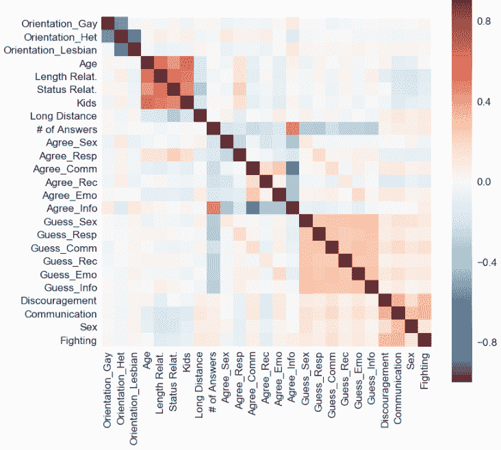

# 研究证实:关系健康是由你们对彼此的了解程度来预测的，而不是你们有多像

> 原文：<https://medium.com/hackernoon/study-confirms-relationship-health-predicted-by-how-well-you-know-each-other-not-how-alike-you-b545a7df36bf>

科技能给我们更健康的浪漫关系的公式吗？

分享由 [Lubna Takruri](https://www.linkedin.com/in/lubnatakruri/) 撰写的这篇文章，来自[快乐夫妇的](http://www.happycouple.co)博客:

真的有办法找出健康关系的秘密吗？事实是，答案有很多——有些人会说沟通，或者互相支持，或者良好的性生活。但这需要对每种独特关系的要素进行详细的分析，以及衡量“健康关系”的方式，才能真正提供一个公式。

在第一项显示关系健康结果的研究中，行为神经科学家和 [**洞察数据科学计划**](http://insightdatascience.com/) 的现任研究员进行的研究发现**了解你的伴侣比相似**对关系健康更重要。交流也被发现是关系健康得分最高的因素之一。

由 Isaac J. Perron，**ph . d .****进行的[数据科学](https://hackernoon.com/tagged/data-science)研究分析了 8302 名 [**快乐夫妻**](http://www.happycouple.co/) 用户的匿名反馈，他们回答了所有四个夫妻健康问题。这些数据让 Perron 能够深入研究用户对各种问题的回答之间的相关性，以及他们如何在回答中自我评估他们的关系健康程度。**

**“我们很高兴看到我们帮助世界建立更好关系的使命正在发挥作用，”Happy Couple 创始人兼首席执行官朱利安·罗伯特说。“良好的关系是关于问正确的问题来了解和接受你的伴侣，我们创建了这个应用程序，给情侣们一个有趣的方式来做到这一点。”**

**决定关系健康的另一个最重要的因素是用户玩这个应用的频率。佩伦发现，一对夫妇在“快乐夫妻”中回答的问题越多，他们的关系健康得分就越高。这种相关性可能有多种原因:**

**“虽然扮演快乐夫妻肯定有可能让关系变得更快乐、更健康，但因果关系的方向可以颠倒。可能幸福的情侣就是喜欢玩幸福情侣吧？”佩伦写道。**

****研究是如何完成的:****

****(** [点击此处查看全文](https://happy-couple-analytics.herokuapp.com/))**

****

**Perron’s Correlation Study**

**Perron 与关系治疗师、作家和 **Happy Couple 联合创始人 Lonnie Barbach 博士**合作，选择**四种方法来衡量“关系健康”**(或地面真相)。他们是人们如何在四个方面评价他们的关系的(在应用程序测试问题中):**沮丧、性、沟通和争斗。****

**在那里，他分析了夫妇在这四个健康类别中的健康分数是如何受到应用程序的 **6 个测试题类别中的**相同**(对齐)和**互相认识**(联系)的影响的。**app 的 3000 个问题分为**性、情感、信息、娱乐、责任、沟通**等类别。**

****在沟通问题类别**中知道对方的答案(正确的猜测)是**沮丧、沟通和战斗中关系健康得分的最大贡献者之一。这表明沟通真的是健康关系的关键。****

**情侣们知道对方在性问题类别中的答案(猜对了),这有力地预测了一段关系的性健康。**

**佩龙说:“研究发现，一段关系中对性健康最重要的因素之一就是人们对他们的伴侣在性方面的理解程度。”。**

**他的研究是 Insight 7 周奖学金计划的一部分，该计划帮助博士和博士后进入数据科学、数据工程和人工智能行业。**

**除了证明[技术](https://hackernoon.com/tagged/technology)可以帮助人们拥有更好更健康的关系，Perron 的研究还为 Happy Couple 团队提供了如何优化应用程序的指导和工具，以便在正确的时间向用户提供正确的问题，帮助他们建立健康、快乐和持久的关系。**

# **利用科学的力量改善人际关系**

**一个建立关系的应用程序 Happy Couple 正在接近拥有健康浪漫关系的公式，并利用关系数据的预测能力来帮助情侣建立更好的关系。两年多来，幸福情侣 app 下载量超过 60 万次。目前，网上有 3000 个问题，组成了一个有趣的新婚风格的问答游戏。为了更好地了解对方，每对夫妇每天都要回答 5 个关于自己和另一半的问题。**

**该应用程序也有超过 1.2 亿对夫妇的回答。有了这些工具，以及数据科学家和 Happy Couple 的关系治疗师联合创始人的协作专业知识，这只是首次看到这些数据的预测能力，以及它可以告诉我们如何拥有健康的浪漫关系。**

**罗伯特说:“我们下一步将是让快乐夫妇定期评估我们的夫妇，询问他们对婚姻关系的感受，为他们的日常回答添加更多的内容。”“有了这些海量的关系数据，我们很快就能开始预测关系何时走上正确的道路，甚至更好地在正确的时间为正确的夫妇调整我们的内容。**