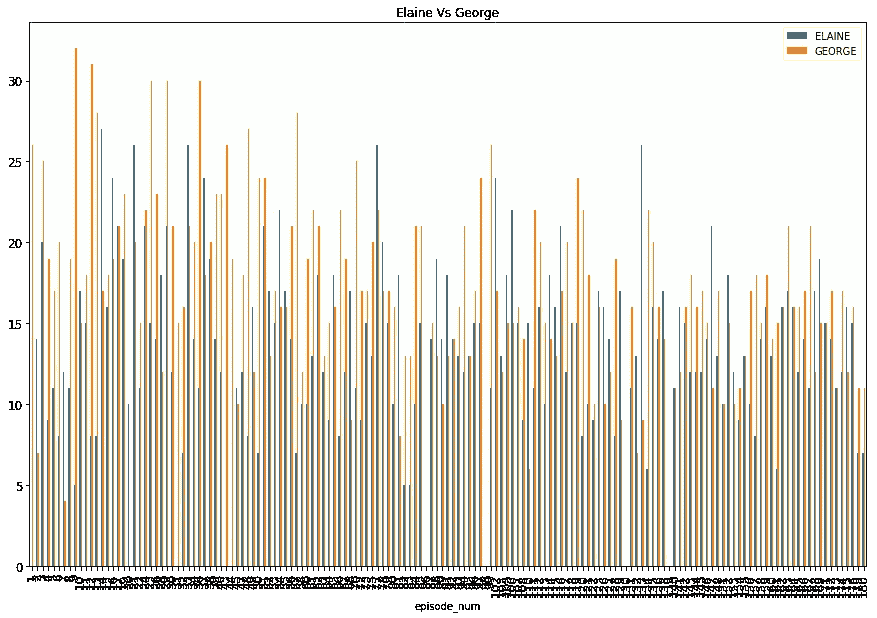

# 什么都没做就研究这个节目

> 原文：<https://medium.com/hackernoon/studying-the-show-about-nothing-1d92d58a102c>

在过去的 6-7 年里，我一遍又一遍地看《宋飞正传》,直到现在，它仍然是我最喜欢的节目之一。对于一个声称什么都不是的节目来说，它无疑已经设法填满了九季的内容，所有这些似乎都没有什么情节。

如果你对这个节目不熟悉，你会发现它描绘了(主要)四个不起眼的人的日常生活——杰瑞·宋飞、乔治·克斯坦萨、科斯莫·克莱默和伊莱恩·贝尼斯。这四个人，以及其他很多配角和客串明星参与了一系列看起来毫无意义的对话和活动，不知何故，这些都在每集结束时聚集在一起。

昨天，当我兴致勃勃地观看弗兰克·克斯坦萨讲述他创建的节日“Festivus”的一集时，我发现自己是多么崇拜弗兰克·克斯坦萨这个角色。但他在很多集里都没出现过，对吧？多才多艺的律师杰基·齐尔斯也没有，但他和弗兰克产生了同样的效果。那是哪几集来着？该死的。你可能会想，看了这么多遍这个节目，这样的信息会“纹在我的脑子里”。但不可否认的是，事实并非如此。必须有一种比在维基百科上查找更复杂、更有趣的方式来获取这些信息。因此，周末数据潜水游戏开始了。

这项分析中使用的衡量标准是一个人每集有一句台词要说的次数。因此，一个人(比如杰姬·奇里斯)在整场演出中第一次有台词就是他/她第一次出现。接下来的其他结果是一个角色对这部剧或一集有多重要，或者在多少集里伊莱恩或克莱默没有出现。另外，我们知道中心的 4 个角色，但是除了 Jerry 之外的 3 个角色是如何排列的呢？所以，我是这样做的。

***抓取并解析数据。***

我获得了剧集列表，并从 seinfeldscripts.com<hat-tip>网站上刮下了每集的脚本，以一致的速度使用请求，以免淹没它们，即使只有大约 200 个自动化 API 调用。该网站还列出了所有剧集的列表，从第 1 集到第 180 集。[1]</hat-tip>

收集到的数据既不容易管理，也不一致。因此，模式的推导有点麻烦，但最终我找到了一种方法，只获得对话，更重要的是，使用美丽的汤传递对话的人(bs4)。

```
soup = BeautifulSoup(req.content, ‘html.parser’)
paragraphs = soup.find_all('p').
.
.if (j.isupper() and len(j)>1 and ‘:’ in j):
     if j in chars_dict:
         chars_dict[j]=chars_dict[j]+1
         chars_dict[‘TOTAL’]=chars_dict[‘TOTAL’]+1
     else:
         chars_dict[j]=1
         chars_dict[‘TOTAL’]=chars_dict[‘TOTAL’]+1
```

如果这是一个写得很好的脚本，模式应该是这样的-

> 克雷默:“Hoochiemama！”

上面提到的代码片段将处理。但是在许多文件中，你有这样的条目

> 乔治:“万德莱工业！比如万德莱工业"

这里唯一表明对话已经开始的是冒号(“:”)。所以这是另一个要处理的案子。

***存储和过滤数据***

遍历整个脚本集产生了一个字典词典，其中的键是一集的编号，值是该集的演员及其相应对话数的字典。

接下来我考虑我主要感兴趣的角色，因为对于这个用例，我并不真的关心一些人，比如[苏·艾伦·米施克](http://seinfeld.wikia.com/wiki/Sue_Ellen_Mischke)或者球童斯坦。

```
characters =[“JERRY”,”GEORGE”,”ELAINE”,”SUSAN”,”KRAMER”,”JACKIE”,”FRANK”,”RAVA”,”NEWMAN”,”TOTAL”]
```

在将步骤 3 中获得的字典的关键字统一转换为大写字母后，我将上述字符的每集出现值以及每集对话的总数(“总数”)存储在一个数据帧中，因为 Pandas 是一个非常好的数据处理工具。
然后将出现值标准化为占总数的百分比。

尽管所有的尝试都是为了获得完整的数据，但还是有一些文件，即剧集脚本只能被部分处理或者无法被处理，因为没有办法在角色名字和对话本身之间做出明确的区分。这显然是因为考虑的唯一来源是 Seinfeldscripts.com。未来的实验可能会考虑其他来源来填补缺失的数据。为此，我过滤掉了总值为< 100

```
df = df[df.TOTAL > 100].sort_values(by=”episode_num”)
```

The finale episodes have also been omitted from this analysis.

**的条目结果:**

主要结果是基于我选择的以下标准的一组图表-
a)《伊莱恩 vs 克莱默》每集对话的百分比
b)《伊莱恩 vs 乔治》每集对话的百分比
c)《乔治 vs 克莱默》每集对话的百分比
d)弗兰克·克斯坦萨主演的剧集
e)苏珊主演的剧集
f)杰姬·奇勒斯主演的剧集
g)纽曼主演的剧集

还计算了其他各种图表。

所有图表的 X 轴显示了集数(尽管不清楚),而 Y 轴跟踪了每集所占的百分比。


All characters

可以理解的是，杰瑞每一集的对白都是最多的。

伊莱恩对乔治:



ELAINE BENES vs GEORGE COSTANZA

趋势表明，乔治(约 20–30%)总是比伊莱恩(约 5–25%)拥有更多的屏幕空间。

乙)**伊莲 vs 克莱默:**


ELAINE BENES vs COSMO KRAMER

虽然他们似乎在很大程度上是一致的，但看起来伊莱恩几乎总是比克莱默有更多的话要说，至少在总集数的前 60%里。然而，到最后，克莱默似乎有更多的话要说。

乔治 vs 克莱默:


GEORGE COSTANZA vs COSMO KRAMER

这里没有惊喜。乔治主导了大约 20-30%的对话，而克莱默平均主导了接近 15%的对话。

所以，我们看到，就主要角色的重要性而言，杰瑞>乔治>(伊莲=克莱默)。继续前进，

弗兰克·克斯坦萨


FRANK COSTANZA

弗兰克·克斯坦萨第一次出现在第 62 集——“障碍点”，最后出现在第 166 集——“罢工”(传说中的 Festivus 集)，除了最后几集。

**e)苏珊·罗斯**


SUSAN ROSS

苏珊第一次出现在第 43 集——“球场”，最后出现在第 134 集——“邀请”，当……你知道..

**f)杰姬·奇里斯**


JACKIE CHILES

杰姬·齐丽斯只在 3 集 113、122 和 143 中扮演主要角色，同样没有出现在大结局中。我终于有答案了，:D

**克)纽曼**


我们看到纽曼在更多的剧集中扮演了一个关键角色，在第 132 集——瓶子存款——第二部分中，他和克莱默一起经营了一个瓶子骗局(啊，怀旧),他的比例高达 14%。

这个实验非常有趣。我希望在接下来的几部中填补空白，并为其他角色设计出数据和关系。

宁静现在！！！！

[1][http://www.seinfeldscripts.com/seinfeld-scripts.html](http://www.seinfeldscripts.com/seinfeld-scripts.html)
**代码**:[https://github . com/abhiii 5459/DataViz/blob/master/Seinfeld/Seinfeld _ analysis . ipynb](https://github.com/abhiii5459/DataViz/blob/master/Seinfeld/Seinfeld_Analysis.ipynb)