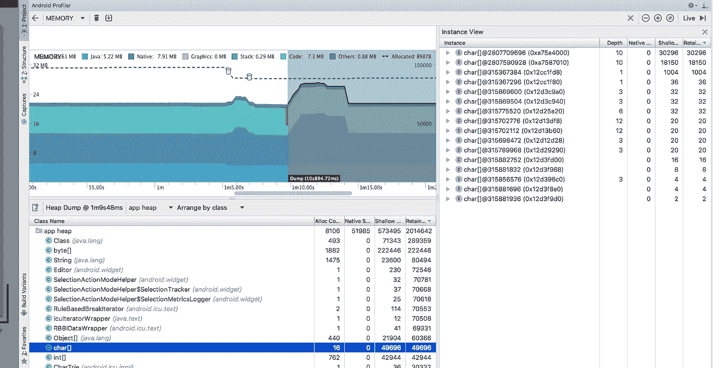

# Android Studio 3.0 的惊人新功能

> 原文：<https://medium.com/hackernoon/stunning-new-features-of-android-studio-3-0-9ec53292f60e>

## Android Studio 现在提供即时应用程序支持、Android Profiler、ContraintLayout、对 Kotlin 的支持等等！


Android Studio 3.0 已经发布，大多数 Android 开发者似乎对此感到高兴。有如此多的新特性和改进，更新您的 IDE 到这个新版本显然是一个新的想法！

# 如何更新

## 更新 IDE 和插件

Android Studio 应该已经提示你更新到 3.0 了。如果它还没有这样做，那么转到菜单栏中的'*检查更新'*'来这样做。

一旦你第一次在 3.0 中启动你的项目，Android Studio 会告诉你有一个新版本的插件需要更新。您可以继续使用您的项目，但是在更新之前，您将会错过许多新功能和改进。简单地说，按照提示将你的项目更新到版本 3 的 [Gradle](https://gradle.org/) 插件，并使用最新版本的 Gradle 4。

# 我为什么要更新？

在 Android Studio 3.0 和新的 Gradle 插件中，有一个无尽的新功能和改进列表。

*   [科特林](http://kotlinlang.org)编程语言支持
*   [Android profiler](https://developer.android.com/studio/preview/features/android-profiler.html) :内存、CPU、网络
*   [Java 8](http://www.oracle.com/technetwork/java/javase/overview/java8-2100321.html) 内置语言特性
*   更快的构建时间
*   设备文件浏览器
*   [安卓即时应用](https://developer.android.com/topic/instant-apps/index.html)支持
*   [自适应图标向导](https://developer.android.com/guide/practices/ui.../icon_design_adaptive.html)
*   XML 和可下载字体
*   [安卓东西](https://developer.android.com/things/hardware/index.html)支持
*   布局编辑器改进
*   APK 分析和调试
*   布局检查器改进
*   提高了梯度同步速度
*   AAPT2 现在默认使能
*   [Firebase app](https://firebase.google.com/) 索引助手
*   应用链接助手

虽然这个列表很长，但它仍然没有涵盖 Android Studio 3.0 的所有功能！有兴趣的可以去安卓开发者网站查看[完整发布说明。](https://developer.android.com/studio/releases/index.html#3-0-0)

在这篇文章中，我将只关注 Android Studio 3.0 的几个精选功能:

*   即时应用支持
*   Android Profiler
*   约束布局
*   科特林编程语言支持

我还将写一下 Kotlin 以及它与 TypeScript 的不同之处。

# 即时应用支持

Android Studio 3.0 现在可以让你创建即时应用。Android 即时应用程序通过启动一个 URL 使原生 Android 应用程序能够在您的设备上运行。简单地说，你可以在你的设备上运行一个应用程序，而不必安装它！

使用即时应用程序，用户可以使用应用程序的单个功能，而不必安装应用程序的所有其他功能。当用户从即时应用程序请求一个功能时，他们只会收到运行该特定功能所需的代码，不多也不少。在用户使用完该功能后，系统可以处理该功能的代码。

为了提供这种按需下载功能，您需要将您的应用程序分解成更小的模块，并将它们重构为*功能模块。*

当您构建即时应用项目时，构建输出是包含一个或多个功能 apk 的即时应用 apk。每个要素 APK 都基于项目中的要素模块构建，用户可以按需下载并作为即时应用程序启动。

## 纽约时报填字游戏

《T2 纽约时报》创造了一个简单而高效的用户体验:一旦你点击他们的网址，你就可以立即玩每日迷你填字游戏。如果你想继续玩拼图，你可以玩一个其他的免费拼图，等待明天的每日拼图，或者使用 Play in-App Billing 订阅更多的拼图。


这个即时应用程序的使用频率更高，使用即时应用程序的人的会话数量增加了一倍多。有人在应用上花费的时间越多，他们就越有可能订阅并保持用户身份，因此这是团队的一个重要指标！

点击此处查看更多即时应用:

[](https://play.google.com/store/apps/collection/promotion_3002d0f_instantapps_featuredapps?e=-EnableAppDetailsPageRedesign) [## 立即试用的应用程序 Google Play 上的 Android 应用程序

### 享受数百万最新的 Android 应用程序、游戏、音乐、电影、电视、书籍、杂志等。随时随地，跨越…

play.google.com](https://play.google.com/store/apps/collection/promotion_3002d0f_instantapps_featuredapps?e=-EnableAppDetailsPageRedesign) 

# Android Profiler

Android Studio 3.0 中新的 Android Profiler 窗口取代了 Android Monitor 工具。这个新工具为您的应用程序的 CPU、内存和网络活动提供实时数据。



您可以执行基于示例的方法跟踪来计时代码执行、捕获堆转储、查看内存分配以及检查网络传输文件的详细信息。

# [约束布局](https://developer.android.com/reference/android/support/constraint/ConstraintLayout.html)

`ConstraintLayout`允许您创建具有平面视图层次结构(无嵌套视图组)的大型复杂布局。就像`[RelativeLayout](https://developer.android.com/reference/android/widget/RelativeLayout.html)`一样，所有视图都是根据兄弟视图和父布局之间的关系排列的。唯一不同的是，`ConstraintLayout`比`RelativeLayout`更灵活，更容易使用 Android Studio 的布局编辑器。

要了解更多关于`ConstrainLayout`的信息，请点击这里:

[](https://developer.android.com/training/constraint-layout/index.html) [## 使用 ConstraintLayout | Android 开发人员构建响应式用户界面

### ConstraintLayout 在与 Android 2.3 (API level 9)及更高版本兼容的 API 库中可用。这一页…

developer.android.com](https://developer.android.com/training/constraint-layout/index.html) 

# 支持科特林


[Kotlin](https://kotlinlang.org/) 是由 [JetBrains](https://www.jetbrains.com/) 开发的一种静态类型编程语言，运行在 [Java 虚拟机](https://en.wikipedia.org/wiki/Java_virtual_machine)上，也可以编译成 JavaScript 源代码或使用 LLVM 编译器基础设施。

Android Studio 3.0 让你用 Kotlin 编码！事实上，谷歌甚至认为它是编写 Android 应用程序的第一等公民！

做出这一重大决定的原因是科特林代码被证明具有:

*   **更好的可读性** —可读的代码是那些向读者清楚传达其意图的代码。完全可读的代码是即使非编码人员也能完全理解的代码！
*   **更好的正确性** —从开发人员的角度来看，正确性被定义为对规范的遵守，这些规范决定了用户如何与代码交互，以及当代码被正确使用时应该如何表现。
*   **开发人员生产力**——这是对开发人员与团队协作并实现更好代码的能力的度量。时间管理也是开发人员生产力的一个重要因素。

正如我之前所说，Kotlin 是一种静态类型的编程语言。如果一个变量的类型在编译时已知，那么这种语言就被称为静态类型。

对于某些语言，这意味着程序员需要在代码中使用变量之前指定变量的类型。

Kotlin 使用积极的类型推断来确定尚未声明类型的值和表达式的类型。

# Kotlin vs TypeScript

创建 TypeScript 是为了给 JavaScript 提供类型安全。Kotlin 也帮助你实现这个目标，此外，Kotlin 提供了 JVM 和 web 的精华。

TypeScript 是 JavaScript 的一个**超集**。所以基本上，它*就是* JavaScript。这使得 JavaScript 开发人员更容易转向 TypeScript。

另一方面，Kotlin 是一种完全不同的语言，运行在 Java 虚拟机(JVM)上。虽然 Kotlin 可以被编译成 JavaScript，但人们必须问的问题是，当我们有 TypeScript 时，为什么开发人员要经历学习一种完全不同的语言的麻烦，这种语言可以被编译成 JavaScript:这是 JavaScript，但增加了类型安全。

虽然 TypeScript 的目标是取代 JavaScript，但 Kotlin 有更大的计划，成为创建应用程序的全栈！

此外，Kotlin 具有内置的空安全特性，这使得它比 TypeScript 更有优势。

如果上面的争论让您更加困惑，现在您不知道是使用 Kotlin 还是 TypeScript，下面是基于几个方面的两种语言的语法比较:

## 变量和约束

```
// Kotlin
var myVariable = 42
myVariable = 50
val myConstant = 42// TypeScript
var myVariable = 42;
myVariable = 50;
val myConstant = 42;
```

## 显式类型

```
// Kotlin
val explicitDouble: Double = 70.0// TypeScript
const explicitDouble: number = 70;
```

## 类型强制

```
// Kotlin 
val label = 'The width is "
val width = 94
val widthLabel = label + width// TypeScript
const label = "The width is ";
const width = 94;
const widthLabel = label + width;
```

## 字符串插值

```
// Kotlin
val apples = 3
val oranges = 5
val fruitSummary = "I have ${apples + oranges} " + "pieces of fruit"// TypeScript
const apples = 3;
const oranges = 5;
const fruitSummary = `I have ${apples + oranges} ` + "pieces of fruit."; 
```

## 什么时候去科特林，什么时候打字？

*   您可以使用 Kotlin 开发您的后端、前端、Android 应用和桌面应用。您还可以共享/重用数据类、模型、验证等。也可以与 Java 一起使用，因为 Kotlin 与 Java 兼容。
*   如果你在前端工作，TypeScript 是完美的。KotlinJS 没有 TypeScript 成熟，也没有 TypeScript 享有的那种社区支持。话虽如此，如果你想构建一个企业级的后端、前端和原生 Android 应用，那就选择 Kotlin 吧。
*   TypeScript 有一个主要缺陷—它是 JavaScript 的超集。这意味着，除了类型安全问题之外，JavaScript 的所有问题都会困扰你。虽然 KotlinJS 中有术语“JS ”,但它实际上彻底消除了所有这些问题。

我是 [Rajat S](https://medium.com/u/ae259dddfc25?source=post_page-----9ec53292f60e--------------------------------) ，是 [GeekyAnts](https://geekyants.com/?utm_source=medium&utm_medium=article&utm_campaign=blog) 的技术内容作家。一个有抱负的程序员还有很长的路要走。一个热爱漫威电影的铁杆 DC 漫画迷。😛在[推特](https://twitter.com/rajatk16)上关注我，了解更多关于[极客聚会](https://geekyants.com/?utm_source=medium&utm_medium=article&utm_campaign=blog)上发生的令人惊奇的事情。

感谢 [Rahul Raj](https://medium.com/u/3349bab4000d?source=post_page-----9ec53292f60e--------------------------------) ，他是 [GeekyAnts](https://geekyants.com/?utm_source=medium&utm_medium=article&utm_campaign=blog) 的软件工程师。

感谢您的阅读！请吧👏如果你喜欢的话。