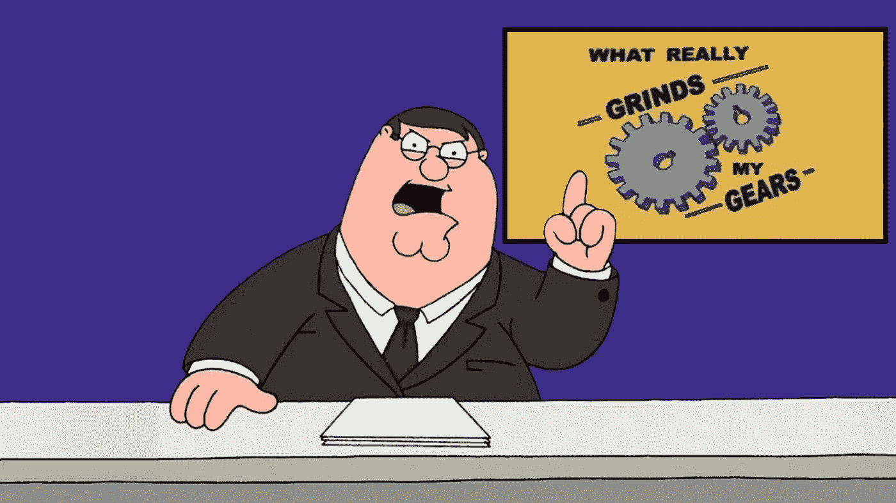
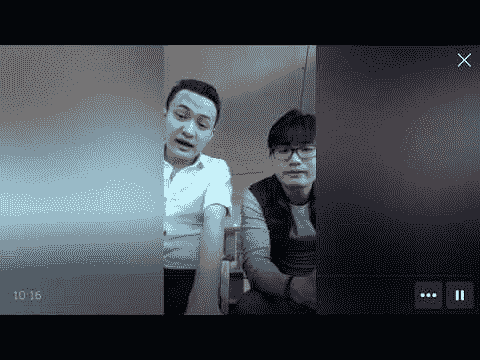
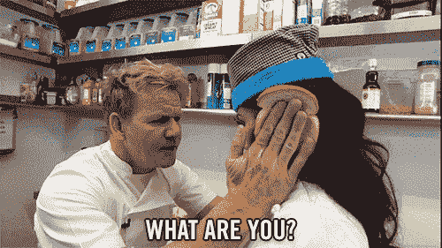
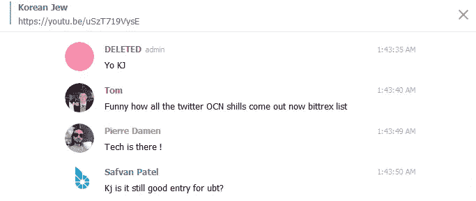
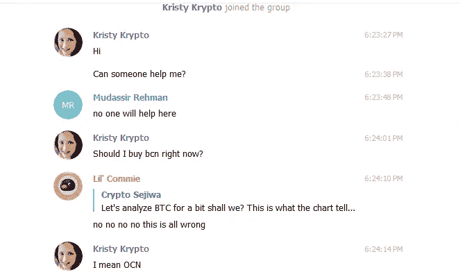

# 懒惰的加密电报问题真的磨我的齿轮

> 原文：<https://medium.com/hackernoon/stupid-crypto-telegram-questions-that-really-grind-my-gears-7b44f2d07478>

所以这个已经酝酿了一段时间了。每次踏入我最大持股的电报聊天(比如 [Te-Food](/te-food/te-food-progress-report-3-59361ce722d3) 和 [Matrix AI](https://i.redd.it/kez4ad2rcaz01.jpg) [网](https://www.youtube.com/watch?v=5u9c20_y4bI))我都要滚动浏览无休止的懒人问题。

我们都是来学习的。学习很棒。问伟大的问题是一种应该培养和鼓励的习惯。另一方面，当你试图浏览电报聊天寻找有用的信息时，因为懒得使用谷歌而问懒惰的问题是很烦人的。

排名不分先后:

## "为什么团队不尝试新的交流方式？"，“为什么 XYZ shitcoin 已经在币安上市，而我们的 shitcoin 却没有？”等等。

*   该团队可能已经申请了所有可能的交易所。
*   当申请在交易所上市时，会有一个 NDA。
*   如果管理/团队提前宣布交换，列表很可能会被取消或推迟。

Much Technology

*   在下跌时在大型交易所上市，远没有牛市时创造的价格动力大。

## “在哪里可以买到这枚硬币？”

说真的，去 CMC.com 点击“市场”有多难？也许每个电报聊天中的管理员应该固定以下链接:

 [## LMGTFY

### 对于那些觉得用他们的问题来打扰你比搜索更方便的人…

bfy.tw](http://bfy.tw/IQ0e) 

## “为什么硬币的价格在下跌？”

在整个市场下跌的时候问这个问题，愚蠢的加分。

## “我应该在什么价位买入？”，‘这是一个好的切入点吗？“等等。

所以，很明显你想得到最好的价格来进入和退出市场。当你进行研究的时候，这些都是很好的问题，但是让别人给你答案是懒惰的。

Yes Safvan, UBT is at ICO price and is partnered with Microsoft so it’s an excellent entry price (which you would know if you’d bothered to do some research)

与其问这么懒的问题，为什么不试试:

*   你认为我们会在 150 sats 或以下找到支持吗？
*   价格为什么会降/涨，有什么根本原因/消息吗？
*   价格是否已经触底，还是看起来还会进一步下跌？

## “应该买 ABC Token 吗？”

这是另一个你应该问自己而不是别人的“内心”问题。

No Kristy, OCN is complete garbage and doesn’t even have a team listed on their website.

相反，请尝试:

*   这个项目有合作伙伴吗？( *ProTip* ，这个你可以自己找出来)。
*   团队背景强吗？
*   围绕项目的 FUD/负面新闻是什么？它有价值吗？
*   该团队试图占领的市场规模有多大？
*   什么是代币经济学/硬币将如何获得其价值？
*   该项目要取得成功必须发生什么，达到上述事件/里程碑的概率是多少？
*   项目完全失败需要发生什么，发生的可能性有多大？

还有什么其他蠢/懒的问题真的磨 ***你的*** 一年半载？我是不是 ***太贱了*** ？写在评论里，我会回复你的。

如果你喜欢猜测[区块链](https://hackernoon.com/tagged/blockchain)和[加密货币](https://hackernoon.com/tagged/cryptocurrency)项目，那么关注媒体( [Bare Shylls](https://medium.com/u/1e7aa51bf607?source=post_page-----7b44f2d07478--------------------------------) )和推特([https://twitter.com/BareShylls](https://twitter.com/BareShylls))。

喜欢这篇文章吗？按住下面的拍手按钮，直到它达到 50，并在 Twitter 上分享。

