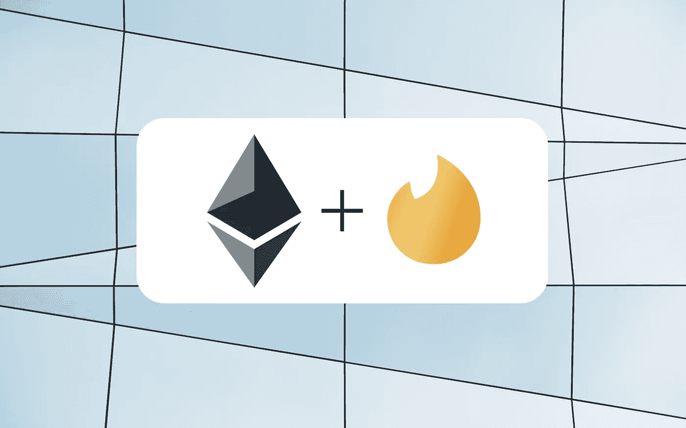

# 区块链上的订阅

> 原文：<https://medium.com/hackernoon/subscriptions-on-the-blockchain-c037ade68242>

## 为分散式应用程序实现订阅模型(以太坊)



Backround Photo by [Luca Bravo](https://unsplash.com/photos/xnqVGsbXgV4?utm_source=unsplash&utm_medium=referral&utm_content=creditCopyText) on [Unsplash](https://unsplash.com/?utm_source=unsplash&utm_medium=referral&utm_content=creditCopyText) | Ethereum Logo | Tinder Gold Logo

**简介**
你可能已经听说去中心化的应用程序将会是互联网的未来。为了让这个分散的生态系统茁壮成长并可持续发展，我们将需要许多开发人员来开发应用程序。这些开发商显然是想赚钱；但是由于分散式应用程序是如此的新，关于如何从它们身上赚钱有很多困惑。我相信一些传统的收入模式会在[区块链](https://hackernoon.com/tagged/blockchain)发挥作用。因此，我正在创建一个系列，我们在其中实现它们，作为未来应用程序的示例。在这篇文章中，我们将学习何时以及如何在 Solidity 中实现[订阅](https://hackernoon.com/tagged/subscription)模式。

**生存能力—“当”** 在我们进入代码之前，让我们来讨论一下订阅何时可以在区块链上工作。当您的应用程序是分散的时，任何人都可以看到组成应用程序的契约；这意味着他们可以复制并粘贴你的代码来立即复制你产品的大部分。如果前端是开源的，或者托管在分散的存储上，那么所有的应用程序代码都可以被克隆。

那么，我们能做些什么来让用户继续使用我们的应用呢？答案在于一个不可克隆的元素:网络。如果你的应用有[网络效应](https://en.wikipedia.org/wiki/Network_effect)，用户会倾向于网络更好的应用，或者更大的用户群。展示网络效应的应用包括社交应用，如 Tinder、脸书和 Instagram。我认为这类似于中本聪共识，人们选择最长的链作为有效链。

回到订阅，在 Tinder 的例子中，订阅的价值在某种程度上与 Tinder 的用户数量有关。如果有人克隆 Tinder，它将毫无价值，因为几乎没有用户会使用它。没有人会在克隆体上订阅[超级像](https://www.help.tinder.com/hc/en-us/articles/115004493543-Super-Like)，因为没有人让他们在上面使用自己的超级像。

总之，如果订阅模式展现出网络效应并拥有固定的用户基础，它可能适用于您的 dApp。为了更好地适应克隆，一些订阅功能本身也应该表现出网络效应。

**实施—“如何”**
在订阅模式中，用户可以付费解锁特定时间段的特殊功能。当然，为了让用户支付经常性费用来使用产品，它必须是一流的。所以对于我们的例子，高级功能将来自最好的订阅产品之一: [Tinder Gold](https://blog.gotinder.com/introducing-tinder-gold-a-first-class-swipe-experience/) 。

为了实现这个模型，我们将创建一种方法来跟踪订户，并创建只有他们才能访问的高级功能。下面所有的代码示例都可以在 [Github](https://github.com/kloading/RevModels/blob/master/subscription.sol) 上找到。

我们将首先创建两个结构:一个用于用户和他们的 Tinder 卡，另一个用于他们的订阅。我们将假设数据(图像等)。)存储在 [IPFS](http://ipfs.io) 上，这是一种对等网络协议。为了引用该数据，我们可以使用存储卡的散列。

```
User public userInfo;struct User {        
   address userAddr;      // user's ethereum address
   Subscription subInfo;  // store their subscription
   bytes current;         // hash of currently displayed card 
   bytes previous;        // hash of previous swiped Card
} 

struct Subscription {        
   bool status;           // store if the user is subscribed (T/F)           
   uint expiry;           // when the user susbcription expires
}
```

接下来，构造函数创建一个用户并将他们的订阅状态设置为 false。到期时间被设置为当前时间，我们将在后面看到如何使用它。对于 Tinder 卡，我使用了一些任意的散列，它的具体值与我们的目的并不相关。

```
constructor() public     
{        
userInfo = User({
     userAddr:msg.sender, //The address of the user
     subInfo:Subscription({status: false, expiry: block.timestamp}),
     current:"Qm78fg903b9209rh20f03dla",
     previous:""
  });    
}
```

现在我们需要一种用户付费和订阅的方式。让我们创建一个可支付的函数来改变用户的订阅状态。订阅一个月需要花费 1 ETH。他们可以订阅一个月的任意倍数，只需调用该函数适当的次数。

```
function subscribe() public payable     
{        
   require(msg.value == 1 ether); //or else function will throw
   userInfo.subInfo.status = true;        
   userInfo.subInfo.expiry = block.timestamp + 30 days;  
}
```

你可能会注意到，乙醚是支付给合同，而不是应用程序所有者。需要有一种方法让主人得到他们新发现的财富。为此，我们可以存储所有者的地址，并将下面一行添加到 subscribe()函数中。

```
address public appOwner = 0xac4013A20D0FDb5908673CBCD4d400e3DC68726b;function subscribe() public payable    //function from above
{        
   // ... omitted lines

   appOwner.transfer(1 ether); //sending the money to the owner
}
```

对于订阅处理程序的最后一部分，我们需要一种内部方法来检查用户是否被订阅。这比仅仅检查状态变量是真还是假要复杂一些，因为当订阅到期时，契约不能自动将状态设置为假。为此，我们还需要检查当前时间是否超过了用户订阅时设置的过期时间戳。

```
function checkSubscription() internal returns(bool status)    
{        
   if(userInfo.subInfo.status != true) {  
      // if the user is not subscribed          
      return false;        
   }        
   if (block.timestamp >= userInfo.subInfo.expiry) {   
      // if the subscription has expired  
      // update status to false        
      userInfo.subInfo.status = false;            
      return false;        
   } else {            
      return true;        
   }    
}
```

酷毙了。现在我们已经完成了所有这些，我们可以为我们的用户实现我们的高级功能。Tinder Gold 用户有一个名为[倒带](https://www.help.tinder.com/hc/en-us/articles/115004493323-Rewind)的功能，可以让你收回上一次刷卡。我们可以利用前面的函数 checkSubscription()来确保用户是订阅者，然后才允许他们回滚。

```
function rewind() public returns(bool success)    
{        
   if(checkSubscription() != true) {            
      return false;        
   } else {            
      userInfo.current = previous; //rewinding swipe
      userInfo.previous = "";        
      return true;        
   }    
}
```

最后，我们可以创建一个公共函数来检查用户是否订阅而不使用 gas。这一点很重要，这样应用程序的前端可以避免显示用户无法访问的特性(如果调用不正确，会浪费时间)。让这个函数无气的关键词是“常数”。

```
function peekSubscription() public constant returns(bool status)     {        
   if(userInfo.subInfo.status != true || 
   block.timestamp >= userInfo.subInfo.expiry) {            
      return false; //user is not subscribed
   } else {            
      return true;  //user is subscribed        
   }    
}
```

我们必须创建一个新函数而不是使用以前的 checkSubscription()函数的原因是，如果订阅已经过期，checkSubscription()需要进行状态更改。因此，这个函数不能保持不变。

**结尾**
好了，我们对订阅模式的尝试到此结束。记住，这只有在你的应用有网络效应和大量用户的情况下才会起作用。现在去用 dApps 做衣架吧！

完整的合同代码在 [Github](https://github.com/kloading/RevModels/blob/master/subscription.sol) 上。这是我第一次编写 Solidity 代码，所以不要在没有亲自审查的情况下使用合同。

发现错误？有建议或反馈吗？下面往下评论。

在 kaushikdevireddy.com[阅读更多关于我的信息](https://kaushikdevireddy.com)