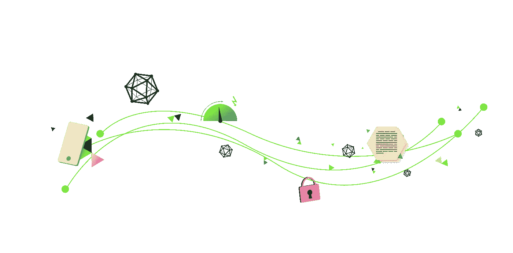

# 通过区块链订阅作为传统媒体的商业模式

> 原文：<https://medium.com/hackernoon/subscriptions-via-the-blockchain-as-business-model-for-traditional-media-153091c5c35f>

新闻和媒体行业对可行的在线商业模式的探索与万维网本身一样古老。为什么在线广告对优质新闻有害，微支付不起作用，以及匿名点击订阅如何实现可持续的会计模式。

早在 90 年代，互联网上就出现了一种以吸引人的注意力为核心的商业模式:广告。出于需要而生的东西成了文化上根深蒂固的习俗。虽然现在确实有支付选择，但是支付的意愿还是缺乏。在线订阅的付费墙或个人文章的小额支付只能在一定程度上发挥作用，而且在经历了 20 年的试验后，仍然是个例外。相反，*零边际成本*的概念似乎是字面上的意思，也是客户的要求。与此同时，与主流商业模式相关的价格变得越来越明显。

如今产生的大量内容以及由轰动效应驱动的报道(想想“点击诱饵”)对本已陷入困境的行业不利，尤其是在假新闻和对这些机构的集体信任丧失的背景下。如果传统媒体在未来几年无法找到现有的基于广告的收入模式的替代品，优质新闻将继续受到打击。

**通过区块链货币化内容时出现的问题**

关于区块链技术如何帮助媒体，尤其是内容制作者开发可持续和高效的商业模式，已经有很多文章发表。聚合器可以被跳过，钱可以直接从消费者流向生产者。虽然这种用例是有用的，值得称赞的，但它可能不会立即取代传统的增长结构——因为用户实际上欣赏这种平台在准备、管理和搜索内容时所增加的价值。

从技术角度来看，单个文章、视频或歌曲的货币化似乎只在理论上可行:为了以经济可行的方式提供小额支付，所用区块链的交易成本必须低且可预测。到目前为止，还没有区块链提供这样的可扩展性——这意味着这个用例可能还需要几年的时间。

然而，这一次微支付能否奏效还值得怀疑。无论是 Flattr、Paypal 捐赠等传统/集中方式，还是个体媒体的专有解决方案，“按使用付费”的媒体消费显然不符合人类心理。早在 1996 年，区块链和加密货币的先驱尼克·萨伯在他的文章“[小额支付的心理会计障碍](https://archive.is/sWHgX)”中就注意到了这一发现。

**重新思考金钱:流动资金，订阅的理想选择**

这个问题的一个替代方案可能是基于区块链的订阅。然而，还没有有效的方法将加密货币用于基于订阅的商业模式。目前，用户必须用私钥签署每笔交易——例如每个月——或者在托管账户中有足够数量的硬币。这两种选择都需要努力，而且非常麻烦。

为了解决这个问题并通过区块链对订阅进行计费，开发者社区目前正在讨论一个关于订阅模式的[以太坊改进提案(EIP)](https://github.com/ethereum/EIPs/issues/948)。

On-Chain Streaming Money & Smart contracts

一个不同的建议是由 [*lab10 集体*](https://lab10.coop/en/) 提出的。他们的 ARTIS 区块链公司的目标是彻底废除循环支付的模式。受 Andreas Antonopoulos 关于[“流动的钱”](https://www.youtube.com/watch?v=l235ydAx5oQ)的思想的启发，硬币(或代币)在 ARTIS 区块链上连续转移，而不是离散转移。所谓的 *Streem* 是从一个事务开始的。很快，资金开始以预定的速度在两个账户之间流动——直到另一笔交易停止 *Streem* (例如订阅)。

这个动画演示了如何快速和用户友好地进行订阅。

所谓的*匿名一键式订阅*允许用户通过 ARTIS 基础设施只需点击一下就可以开始订阅(相比之下，传统支付流程需要 50 多次点击)。他既不需要注册也不需要输入支付细节就能做到这一点。由于这种新颖的支付系统，每个客户不仅节省了 80%的时间，还保持了匿名性。

使用这种显著改进的可用性开始订阅(可以随时取消)的意愿可能比当前环境和传统框架高得多。因此，可以假设将来会有更多的用户为好的在线内容付费。

下一件大事:区块链的订阅？

这就是一键式订阅服务提供商将如何受益。他们将拥有直接和永久的现金流，而不是运行展示广告、收集数据和使用第三方支付网关——真正意义上的现金流。特别是传统媒体可以回到他们喜欢的商业模式，专注于他们最擅长的领域，即追求高质量的新闻报道。

从订阅报纸开始的东西也可以用于共享经济中的服务，甚至可以用于支付工资、租金或零花钱。