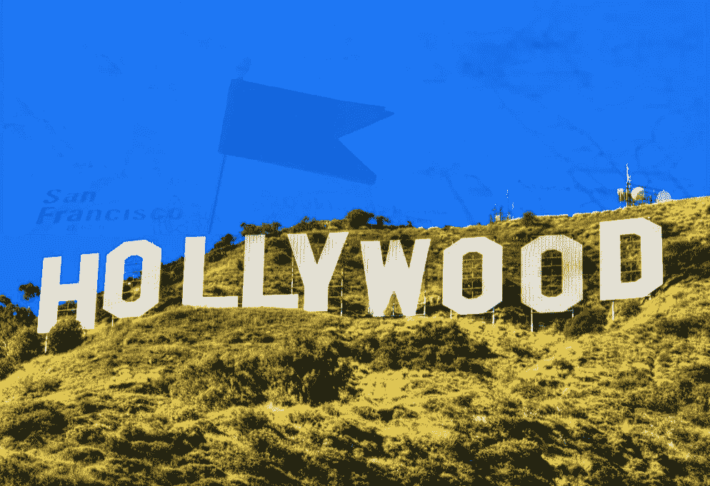

# 订阅与好莱坞

> 原文：<https://medium.com/hackernoon/subscriptions-vs-hollywood-5d6fa6f9c0b5>

*“当我们赢得金球奖奖时，这有助于我们卖出更多的鞋子，*”杰夫·贝索斯在 2016 年 Vox 的代码大会上说。这句话起初可能没有意义，但它彻底解释了目前保持数百万张信用卡与他们的[订阅](https://fourweekmba.com/subscription-business-model/)相关联的斗争，无论是亚马逊、网飞、苹果还是 YouTube。谁将征服好莱坞的战斗已经开始，可能很快就会有一个赢家。

这不是华纳兄弟这样的公司的故事，他们最初是娱乐公司。这是科技公司的故事，它们以书店起家，在鞋类电子商务领域扩张，目标是金球奖。这与荣誉和名声无关，但与增长和收入息息相关。

当我在这篇文章中提到硅谷时，我指的不是地理位置，而是一种思维模式和思考创业的方式，这几乎是传统的。

这一切是如何开始的？

# 金球奖、亚马逊和杰夫·贝索斯通过检查鞋店增加的销售额来庆祝

当雷切尔·布罗斯纳安凭借亚马逊的《了不起的麦瑟尔夫人》获得 2018 年金球奖最佳女主角时，杰夫·贝索斯可能会以一种你意想不到的方式庆祝。没有一瓶香槟，也没有美食。他很可能在检查他的商店收入。

正如他在 2016 年 Vox 的代码大会上所说，正如[在 Business Insider](https://www.businessinsider.com/amazon-ceo-jeff-bezos-said-something-about-prime-video-that-should-scare-netflix-2016-6?IR=T) 上报道的那样，“*我们以一种非常不寻常的方式将(我们的订阅视频)货币化，当我们赢得金球奖奖时，这有助于我们卖出更多的鞋子。它以非常直接的方式做到了这一点。因为如果你看看 Prime 会员，他们比非 Prime 会员在亚马逊上购买的更多，他们这样做的原因之一是一旦他们支付了年费，他们就会四处看看，“我如何才能从该计划中获得更多价值？”因此，他们会浏览更多的类别，购买更多的商品。作为一家企业，他们的许多行为变化对我们来说非常有吸引力。顾客也更多地使用我们的服务。*”

[亚马逊的商业战略](https://fourweekmba.com/cash-conversion-cycle-amazon/)，可以定义为一台提款机，是基于在利用所谓的[现金转换周期](https://fourweekmba.com/cash-conversion-cycle-amazon/)的同时拥有狭窄的利润率。这听起来像是一个金融骗局，但事实并非如此。掌握现金转换周期首先意味着建立一个超级高效的企业，拥有值得信赖的供应商和客户认可的强大品牌。这三件事都不是增长黑客，这三件事加在一起需要亚马逊几十年的时间。然而，到今天为止，这种策略在业务增长方面已经获得了数倍的回报。

如果我们看看该集团的净销售额，他们从 2013 年的 740 亿美元增加到 2017 年的 1770 多亿美元。如果这还不够的话，[的净利润率](https://fourweekmba.com/financial-ratio-formulas/)从 2013 年的 0.3%升至 2017 年的 1.7%。对于一家以微薄的利润为增长融资并扼杀竞争的公司来说，这是一个惊人的增长(超过 5 倍)。

然而，为了更好地了解亚马逊的增长情况，我们还想看看另一个统计数据:亚马逊在生产业务上的投资。

# 当细分市场成为产品线:亚马逊如何打破筒仓运行综合增长战略

在大型官僚公司的旧世界里，公司被分成不同的部门。这些部分是孤立的。因此，一个业务部门和另一个业务部门之间没有整合、沟通和理解。虽然我肯定亚马逊在成为一家价值数十亿美元的公司的同时，也变得官僚化了，而且比它作为一家初创公司时要慢得多。不可否认的是，在更高的层面上，亚马逊理解经营业务部门的重要性，就像那些提供给相同客户的产品一样。正如亚马逊试图争夺金球奖的案例所示，该公司利用其高级会员为他们提供“更多服务”,这实际上成为其在线商店的更多销售。

这是亚马逊在 2017 年年度财务报告中对生产工作的说明:

> 该服务的获奖原创作品，如两次获得评论家选择奖和两次金球奖的了不起的麦瑟尔夫人，以及奥斯卡提名电影《重病号》。我们已经在全球范围内扩大了我们的节目安排，在美国推出了新一季的 Bosch 和 Sneaky Pete，在英国推出了 Grand Tour，在德国推出了 You Wanted，同时增加了来自日本的新 Sentosha 节目，以及来自印度的 Breathe 和屡获殊荣的 Inside Edge。同样在这一年，我们扩展了 Prime 频道，在美国增加了 CBS All Access，并在英国和德国推出了频道。我们在 Prime Video 上首次推出了 NFL 周四晚足球赛，在 11 场比赛中有超过 1800 万观众。2017 年，Prime Video Direct 获得了 3000 多部故事片的订阅视频权利，并向独立电影制作人和其他权利持有人承诺了超过 1800 万美元的版税。展望未来，我们也对即将到来的原创剧集感到兴奋，其中包括汤姆·克兰西的《杰克·瑞恩》，由约翰·卡拉辛斯基主演；安东尼·霍普金斯和艾玛·汤普森主演的《李尔王》；马特·韦纳制作的《罗曼诺夫家族》;奥兰多·布鲁姆和卡拉·迪瓦伊主演的《嘉年华会》;乔恩·哈姆主演的《好兆头》；和返校节，由山姆·艾斯梅尔监制，朱莉娅·罗勃兹首次主演电视连续剧。我们获得了《指环王》多季制作的全球电视转播权，以及执行制片人史蒂文·斯皮尔伯格(Steven Spielberg)制作的由哈维尔·巴登主演的迷你剧《科尔特》(Corte ' s)的全球电视转播权，我们期待着今年开始制作这些节目。

虽然我们不知道亚马逊 Prime 带来了多少收入(收入分布在产品和服务销售中，成本分配在销售成本中)，但我们可以假设亚马逊 Prime 已经成为亚马逊整体商业战略中的一项关键资产。

# 网飞困境:多种收入来源如何让亚马逊更容易利用其优质会员资格

当我们想到一个成功的会员服务能够推出一部受欢迎的电视连续剧时，毫无疑问，第一个想到的是网飞。然而，[网飞商业模式](https://fourweekmba.com/how-does-netflix-make-money/)偏向所谓的[订阅商业模式](https://fourweekmba.com/subscription-business-model/)。这个商业模式非常简单；你每个月支付固定的费用来换取一项通常没有广告的服务。

虽然这种模式行之有效，并帮助许多公司获得了牵引力。它也是资本密集型的。对于网飞来说，要增加订阅量和留存率，它必须持续投入数十亿美元的生产成本，以在其平台上吸引尽可能多的眼球。虽然当一家公司持续增长并不断获得外部投资时，这种模式是可持续的，但如果增长停滞和保留恶化，这也可能导致突然亏损。

在这方面，[亚马逊的商业模式](https://fourweekmba.com/amazon-business-model/)可能会更强大，它可能会给它更多的自由来试验 Prime 会员资格，看看它如何适应其整体商业战略。最近，正如 [Tech Crunch 报道的那样，网飞自己也在尝试向一小部分观众宣传其网飞原创产品。](https://techcrunch.com/2018/08/17/netflix-tests-video-promos-in-between-episodes-much-to-viewers-dislike/)

尽管这只是针对一小部分会员的一次小规模测试，而且主要集中在推广网飞内容上，但少数观看者对此并不看好。这可能会让 T4 网飞的商业模式更加脆弱。

# 完全建立在订阅业务模式上的业务存在缺陷

像网飞这样的公司已经能够通过简单的基于订阅的商业模式在世界范围内建立一个公认的品牌。这种模式的成功有几个原因。它保证了可预测的收入(每个月，除非你从相同的收入基线开始灾难性的事情)。客户信任(订阅业务模式推动公司与客户建立长期关系)。理论上，它需要更少的销售和营销工作(因为你不需要重新开始来获得与前一年相同的收入水平)。

它也有一些重要缺点需要考虑，特别是对于仅仅建立在这种模型上的企业。首先，在大多数情况下，退订该计划是没有摩擦的，高流失率的风险是真实存在的。其次，维持一个稳定的客户群可能是资本密集型的，因为你需要不断创造新的内容，以使这些客户回来，并吸引新的客户。第三，随着竞争的加剧，保持成员的基线完整变得更加困难。就像亚马逊开始投资数十亿美元为其原创节目制作节目一样，新的进入者正在到来。

# 谁将接管好莱坞？

我发现，新科技公司在商业战略方面最引人注目的地方是，它们坚持不懈地关注客户，独立于业务部门的逻辑或传统的企业思维，理解他们的需求。亚马逊如何投资制作电视剧以利用其主要成员的例子告诉我们，这些科技巨头已经准备好收购任何行业，如果这有助于他们的增长。

因此，如果我们认为好莱坞不会被硅谷敌意收购，那我们就错了。同样的科技行业也是建立在人们的想象力和财务指标之上的。在过去，好莱坞制作公司是制作关于硅谷的电影的公司；反之亦然。在未来。硅谷公司将制作一部关于好莱坞的电视连续剧。这是征服全球数十亿眼球的史诗级战役。

*原载于 2018 年 8 月 19 日*[*【fourweekmba.com*](https://fourweekmba.com/silicon-valley-dominating-hollywood/)*。*