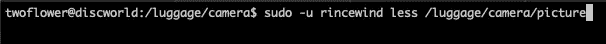
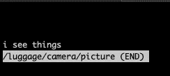
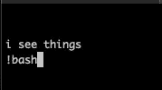
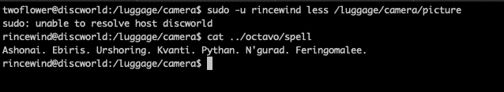

# sudo 给我做个三明治。然后我会打开你的冰箱。

> 原文：<https://medium.com/hackernoon/sudo-make-me-a-sandwich-then-ill-pwn-your-fridge-d4f36fb85db5>

[https://xkcd.com/149/](https://xkcd.com/149/)

Sudo 是一个用于 Unix 类计算机操作系统的程序，它允许用户以另一个用户的安全特权运行程序。[https://en.wikipedia.org/wiki/Sudo](https://en.wikipedia.org/wiki/Sudo)

假设我们有一个名为**/行李箱/** 的文件夹。行李里装着一些非常贵重的东西。Rincewind 和 twoflower 是两个带着这种行李旅行了一段时间的用户。因为，灵思风不想让 twoflower 读 octavo，但如果他看着相机就没问题，相机和相机都在行李里。**/行李箱/相机//行李箱/octavo/** 我们已经允许 twoflower 只运行 cat 命令作为 rincewind，并且只在位置**/行李箱/相机/** 文件夹中运行。因为我们不知道这些照片会被命名为什么，所以我们将在**/行李箱/相机/*** 中使用通配符

灵思风认为 twoflower 将永远无法读取 octavo 中的任何内容，当然也永远无法读取文件夹中的咒语，并且文件权限都设置为 0700。
下面是**/etc/sudoers . d/012-two flower**文件的输出和一个命令输出。

我们对这个设置感觉很好，它只允许 twoflower 在一个单独的路径中使用一个单独的命令。接下来我们让两朵花来试试。然后可怕的事情发生了。

双花念出了八开体内的咒语，一切都结束了。怎么会？什么？这就是通配符与 sudo 配合使用的方式。只是乌龟，一直往下。我们永远不应该在 sudo 中使用这样的通配符。

接下来，锁定它，我们将去掉 cat 命令，用 VI 代替它，这样就不会有参数传递给 VI，因为如果包含了通配符路径，VI 就会遇到同样的目录遍历问题。

更糟糕的是，现在，不仅 twoflower 仍然可以在 octavo 中读取和编辑咒语，VIM 还可以作为 sudoer 使用 shell。这是因为在会话作为 sudoer 启动后，VIM 正在调用 shell。蜜獾(VIM)不在乎 sudoers.d/file 说了什么。
好吧，下一步，去掉 VIM，少给 twoflower 一个文件夹，只给一个文件，因为越少越好。

这可能有点难以理解，所以这里还有一些截图。

start the sudo less command and pass the picture file

less is now displaying the picture file

!bash<enter>

less has launched an escaped shell as rincewind and now we can read the spell (facepalm)

Sudo 是一个超级强大而且极其危险的工具。允许 sudo 访问的命令需要仔细考虑，功能也需要理解。这些例子都不是利用或溢出。它们都完全按照设计运行。理解你正在授予 sudo 的特权，否则有人会进入你的冰箱，吃掉你所有的食物，然后烧掉你的房子。

关于受限 shells 和命令的更深入解释的重要资料。

 [## SANS 渗透测试

### 编者按:几个月前，在 GPWN 无笔测试课程校友的邮件列表上，我们有一个很好的，生动的…

pen-testing.sans.org](https://pen-testing.sans.org/blog/2012/06/06/escaping-restricted-linux-shells)