# 机器学习通过检测预防自杀:在社交媒体上利用人工智能

> 原文：<https://medium.com/hackernoon/suicide-prevention-by-detection-leveraging-ai-on-social-media-52e1066eb1ea>

在这篇文章中，我解释了我在计算语言学协会第 56 届年会上发表的论文“识别推文中自杀意念的特征提取的计算方法”中所做的工作。我期待着在今年 7 月最负盛名的自然语言处理会议上展示我们的工作。作为一名少数民族和代表性不足的学生，我没有太多机会与行业专业人士互动，也没有机会接触从事国际水平项目的导师，他们将帮助我探索与我的兴趣相符的进一步项目，并在这样一个巨大的平台上介绍我们影响数百万人生活的工作。

我写这篇文章的主要动机是向我所在的不同社区的学生和专业人士介绍自然语言处理在人道主义事业中的作用，以及他们对世界的巨大影响。这包括打破围绕精神健康和自杀的禁忌和污名，特别是在发展中国家。这篇文章有一个简短的介绍，更多的技术细节可以在我们的文章中找到。此外，如果对这篇文章有任何疑问/帮助/疑问，请随时联系我。我一直在寻找方法来帮助其他学生起步，激励他们，并回馈给我这么多的社区。

## 对这个问题的深入研究

万维网和社交网络的技术进步，特别是社交媒体使用的增加，导致了在 Twitter 等网站上出现自杀意念与自杀案件之间的正相关。我不需要强调自杀对家庭和周围社区的毁灭性影响，但是，我觉得很有必要说明这个问题的严重性。

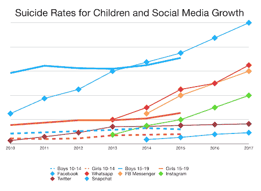

根据世界卫生组织的数据，自杀是全世界 15- 29 岁人群的第二大死因。事实上，T2 每年有近 80 万人死于自杀。企图自杀的人数要高得多。

许多自杀死亡是可以预防的，了解个人交流抑郁的方式和预防这种死亡的想法是很重要的。自杀预防主要取决于对自杀企图和自残倾向的监视和监控。

## **自杀意念:什么**

自杀意念是指杀死自己或计划自杀的想法，而自杀行为通常被定义为包括所有可能的自残行为，意图造成死亡。

许多成功的模型已被用于句子级别分类，然而，那些成功的模型能够学会将自杀意念与抑郁以及不太令人担忧的内容(如自杀报告、纪念、活动和支持)区分开来。等等，需要更多的分析来选择更具体的特征和方法，以建立准确和稳健的模型。自杀对周围社区的巨大影响，加上缺乏特定的特征提取和分类模型来识别社交媒体上的自杀意念，以便采取行动，这是这项工作的驱动力。

## 公式化问题

开发一个准确而强大的二进制分类器，可以识别社交媒体上可能暗示自杀活动的内容，以防止自杀并提供帮助。这包括:

1.  创建数据集，该数据集由表现出自杀意念的推文和未表现出自杀意念的推文及其注释组成。
2.  在监督环境下通过手工工程和分析过程识别文本分类的特征。
3.  基于第二阶段选择的特征开发模型，探索深度学习方法，如 RNN、CNN-LSTM 解决问题。

在下一篇文章中，我将深入讨论每个子问题的技术方面。

## 数据:收集和注释

匿名数据是从微博网站 Twitter 收集的——具体来说，是在 2017 年 12 月 3 日至 2018 年 1 月 31 日期间，包含自我分类的自杀想法(即标记有“自杀”一词的文本帖子)的内容。Twitter REST API 2([https://developer . Twitter . com/en/docs/API-reference-index . html](https://developer.twitter.com/en/docs/api-reference-index.html))用于收集包含以下任何符合自杀意念的英语单词或短语的推文。

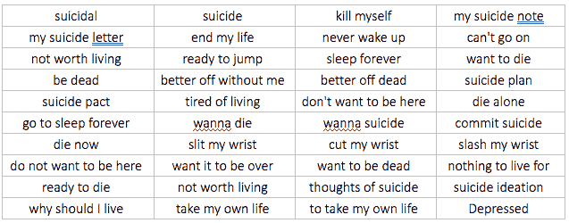

Subset of the phrases/words used for tweet scraping

然后，总共收集了 5213 个文本帖子，随后进行了人工注释。人类注释者被要求使用二元标准通过回答问题*来表明该文本是否暗示自杀意念，该问题是该文本暗示自残倾向还是自杀意图？*

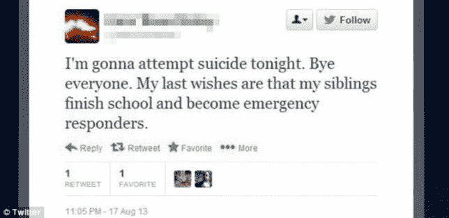

An example of a tweet wth suicidal intent present

存在自杀意图的推文清楚地表明了自杀倾向，不同于轻率的引用、哀悼、新闻等。文本的基调是严肃的，还包括了未来试图自杀的计划。这些推文占了数据集的 15.76%。

An example of a tweet with suicidal intent absent

没有自杀意图的推文包括新闻、报道、哀悼、自杀意识、轻率的引用，是推文的默认类别。

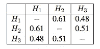

Cohen’s Kappa for Interannotator agreement

## 拟议方法:管道

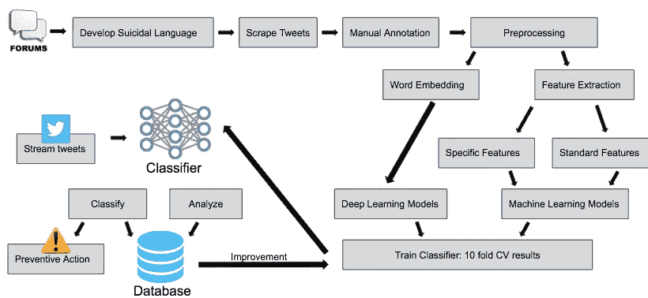

## 预处理

预处理是通过按照下面给出的顺序应用一系列过滤器来处理原始推文实现的。

1.  使用带有 Hadoop 的 Ling-Pipe([http://alias-i.com/lingpip](http://alias-i.com/lingpipe/)e)删除非英语推文。
2.  识别和消除@username 格式的 tweet 正文中的用户菜单、URL 以及 RT 格式的 retweets。
3.  删除所有长度大于 10 的标签，因为大量的标签是连接在一起的单词，这往往会无意中扩大词汇量。
4.  停用词移除。

## 特征设计和提取

表现出自杀意念的推文缺乏半刚性的预定义词汇句法模式。因此，他们保证使用手工工程和分析一组特征，而不是在使用深度学习模型的监督设置中嵌入句子和单词。

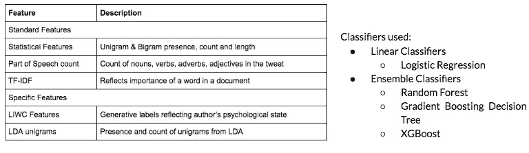

Description of Feature Design and Classifiers

最重要的特征之一是 LIWC 特征。语言查询和字数统计程序(http://liwc.wpengine.com/ LIWC)([)是一个透明的文本分析程序，可以统计心理意义类别中的单词。使用 LIWC 的实证结果证明了其在各种实验设置中检测意义的能力，包括显示注意力集中、情绪、社会关系、思维方式和个体差异。](http://liwc.wpengine.com/)

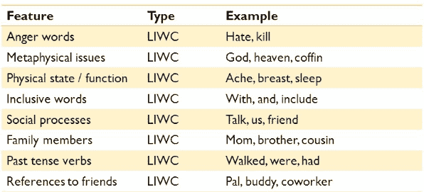

## **分类**

自杀意念检测被公式化为一个有监督的二元分类问题。对于每个 tweet *t ∈ D，*文档集，引入二进制值变量 *y ∈ {0，1}* ，其中 *y = 1* 表示 tweet *t* 表现出自杀意念。为了了解这一点，分类器必须确定 ti 中的任何句子是否具有特定的结构或关键字，以标记任何可能的自杀想法的存在。上述特征用于训练分类模型，以识别表现出自杀意念的推文。诸如逻辑回归的线性分类器以及包括随机森林梯度增强决策树和 XGBoost 的集成分类器被用于分类。

## 自杀意念的深度学习

当与单词嵌入结合使用时，深度学习架构在句子级分类中显示出前景。两个模型，香草-RNN 和随后的 CNN-LSTM(CNN LSTM 架构涉及使用卷积神经网络(CNN)层，结合 LSTM 对输入数据进行特征提取。)被使用。使用这些模型的动机是它们能够捕捉文本中的长期依赖性。香草 RNN 的架构显示在这里。由于消失梯度问题，香草 RNN 的表现不是很好，因此在学习推文中的长距离相关性时变得低效。CNN-LSTM 被专门用于缓解 RNN 中的问题，该问题使用 LSTM 来捕捉长期依赖性，与 RNN 不同，其对间隙长度相对更不敏感。CNN 用于从单词嵌入中更有效地提取特征。

## **基线**

建议方法的验证是通过与基线模型进行比较来完成的，基线模型是比较的有用点。在下面的结果中有更多的解释。准确度、精确度、召回率和 F-1 分数是用于比较的评估指标。

## 结果和分析

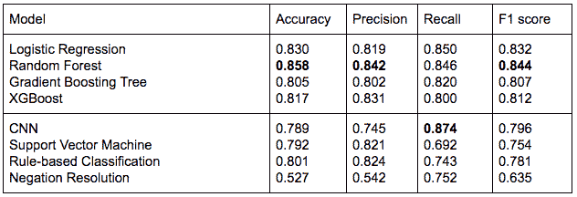

与分类部分中描述的前四个模型结合使用的建议功能在大多数指标的性能方面取代了基线模型。LSTM 模型的召回率最高，因为它能够捕捉长期依赖关系，但其在准确性和 F1 得分方面的整体表现相对较差。SVM 和基于规则的分类都不如所提出的方法表现得好，因为这些模型中使用的特征的缺乏不适合学习如何对具有自杀意念的推文进行分类。这两种方法都更适用于一般领域，然而，所提出的方法中的特征更针对自杀意念检测的特定问题领域，特别是 *LIWC* 特征和 Top- ics 概率。最后，否定解决方法在数据集上表现不佳，因为它无法适应大量和高度多样化的自杀意念交流形式及其隐含的僵化。与所提出的方法相比，这种方法不能有效地从输入文本中学习和提取基本特征，因此性能也不好。

虽然四种分类器的性能相当，但随机森林分类器的性能最好。这归因于随机森林分类器通过减少方差而不是减少偏差来减少误差的能力。正如在各种文本分类问题中所看到的，尽管简单，但逻辑回归表现得相当好，并且与两种 Boosting 算法相比具有更高的准确性和 F1 分数。

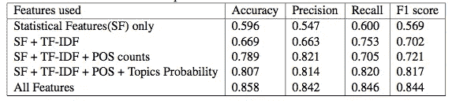

上表显示了包含各种特征的随机森林分类器的性能变化。由于包含主题概率特征，精确度略有降低，这意味着由于通过主题概率特征包含的 LDA 单字，更大子集的推文被分类为自杀，但最终由于包含 LIWC 特征而提高。词性计数也导致召回率的降低，这通过随后包含主题概率和 LIWC 特征来补偿。就大多数评估指标而言，这些显著的改进归功于 TF-IDF、POS 计数和 LIWC 功能。据观察，所提出的特征集与随机森林分类器结合使用时性能最佳，并且包含每个特征的性能改善验证了提取该特征的需要。

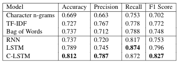

Results for Deep Learning

通过深度学习，我们推断基线表现不佳，RNN 也表现不佳。考虑到更高的召回率，LSTM 在获取长期依赖方面显示出希望。美国有线电视新闻网-LSTM 使用更大的特征提取，并给出了整体性能。

## 详细分析

**接收器工作特性**

ROC 和 AUC 分析是在数据集不平衡的情况下进行的，并测量灵敏度和特异性。随机森林和 CNN-lstm 在准确性方面超越了性能。令人惊讶的是，GBDT 表现不佳。

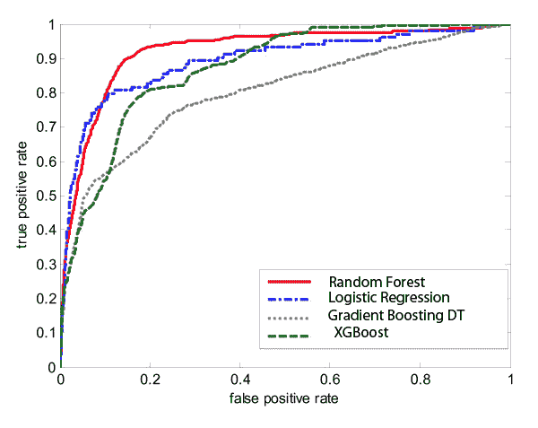

Machine Learning ROC Curves

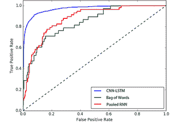

Deep Learning ROC Curves

**顶级特色**

使用基于卡方检验的排序来分析顶部特征，以识别对未来分类问题有帮助的特征，并消除冗余特征。LIWC 和 POS 特征虽然尺寸小，但贡献巨大。

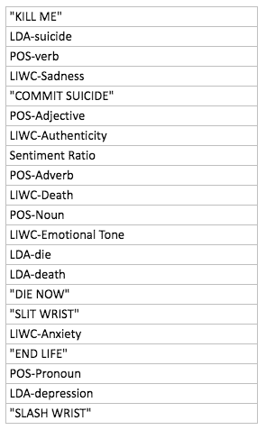

Top 20 features ranked by importance

## 用户界面

还开发了一个用户界面，以识别和分析正在直播的推文中的趋势。

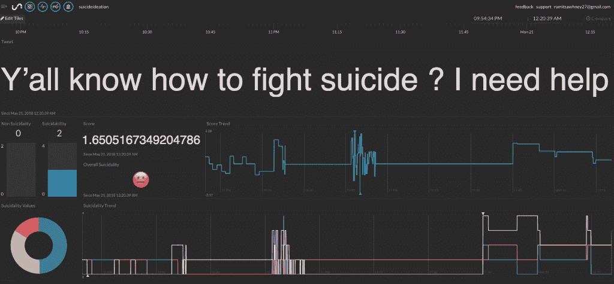

## 总结结果

RF 获胜是因为它有能力减少差异，这在自杀推文中非常重要，因为它们具有多样性。CNN-LSTM 紧随其后。在同一数据集上，工作取代了当前的艺术状态。随着我们纳入更多的数据，可能需要更多的验证，这也是我们的模型的目标。

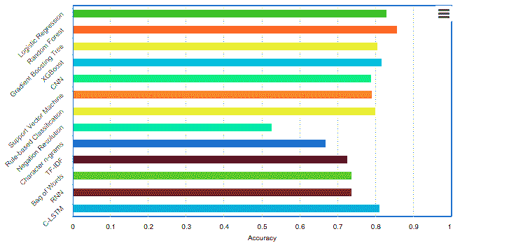

## 误差分析

*   **看似自杀的推文**:人类注释者和我们的分类器都无法识别“我想自杀，哈哈。:(“哈哈，现在就杀了我吧”是自杀意念的代表，或者是对自杀的轻率提及。
*   实用难度:推文“我失去了我的孩子。结束……”或“癌症杀死了我的妻子。我现在也要走了。”被我们的人类注释者正确地识别为带有自杀意图的推文。这条推文包含话题变化的元素，没有明确提到自杀意念，但我们的分类器无法捕捉到它。
*   **暧昧:**推文“知道我会自杀很奇怪吗？”是一条 tweet，由于其模糊性，人类注释者和提出的方法都无法对其进行分类。
*   **高波动:**反映多种情绪波动和波动的推文对于分类器和人类标注者来说都是困难的，例如“我现在需要自杀，哈哈哈，不认真。我已经受够了🙂".
*   **严格的特征约简:**为惩罚函数分配较大的权重减少了计算量，提高了整体准确性，但导致对微妙暗示自杀想法的推文的错误分类，例如“是时候永远睡觉了..通过消除数据集中不常见的特征。

## 伦理学

讨论了两个主要问题:

1.  没有征求用户的个人同意，因为数据是公开的，试图联系 Twitter 账户持有人参与研究可能会被视为胁迫，可能会改变用户的行为。
2.  心理支持没有提供给那些看起来有风险的 Twitter 用户，因为通过 Twitter 进行干预可能不合适。这是由于几个原因:自杀风险波动；不请自来地接触参与者是对隐私的侵犯；这种接触可能导致不请自来的关注；最重要的是，这项研究的主要目的是确定是否有可能以这种方式对推文进行分类，而不是立即假设编码是准确的。

我承认，针对自杀预防的互联网研究是复杂的，而且还处于起步阶段，我认为，在与个人进行不请自来的接触之前，迫切需要科学有效的数据。

## 限制

为了提高自动分类器的可靠性和准确性，未来的努力将受益于扩大自杀相关搜索词的范围，以确保包括更多自杀倾向的表达。未来的模型应该尝试通过去除前缀和后缀、加入正则表达式以及分析相邻的单词序列和单词本身来规范单词，因为罕见的单词或脏话可能代表更大的自杀风险。如上所述，除了所需的准确度，目前的方法不能清楚地辨别出那些经历被动自杀意念的人和那些处于采取行动的直接危险中的人。目前的研究并没有试图用线下的方法来验证自杀的风险，比如家人和朋友，标准化的调查问卷或临床咨询。这项研究中使用的 Twitter 数据也无法提供样本特征，如年龄和性别，这限制了结果的普遍性。

## 结论和未来工作

本文提出了一个分析推文的模型，通过开发一组特征输入分类器，使用[机器学习](https://hackernoon.com/tagged/marketing)识别自杀意念。当由人类注释时，5213 条推文的总数据集的 15.76%被发现是自杀的。线性分类器和集成分类器都被用来验证为自杀意念检测提出的特征选择。还与采用各种策略如否定解决、LSTMs、基于规则的方法的基线模型进行了比较。这项工作的主要贡献是与其他分类器以及基线相比，随机森林分类器的性能有所提高。这表明，与其他分类器相比，所提出的基于 bagging 方法的特征集具有最小的相关性。

未来的一些工作包括:

1.  创建社交网络图，分析交流和社区。
2.  纳入用户历史和过去的活动，以提高鲁棒性。
3.  扩展到更多的社交媒体和网络论坛，以获取更广泛的目标受众。