# 📚使用 spaCy 的葡萄酒评论摘要📋

> 原文：<https://medium.com/hackernoon/summarization-with-wine-reviews-using-spacy-b49f18399577>

## “吃美食不需要银叉。”

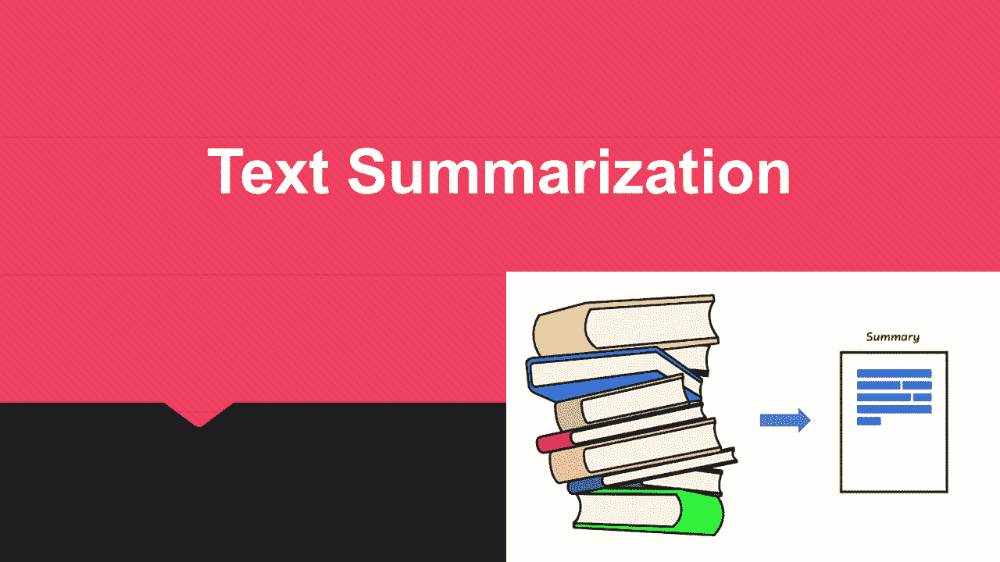

# 🎬葡萄酒评论简介

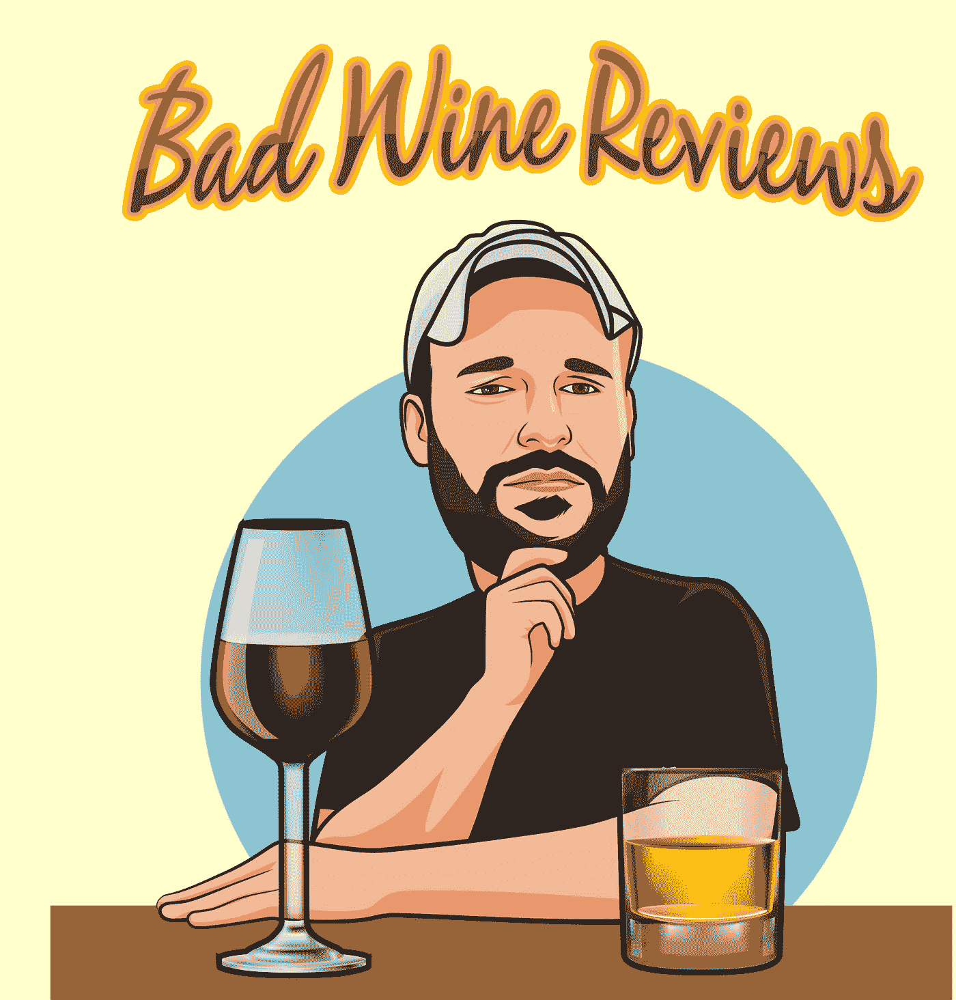

在本文中，我将尝试探索葡萄酒评论数据集。它包含了 130k 的酒评评论。在这篇文章的最后，我会试着做一个简单的文本摘要器来总结给定的评论。总结评论也可以用作评论标题。我将使用 spaCy 作为处理这个项目的自然语言处理库。

# 📋该项目的目标

这个项目的目标是建立一个模型，可以为葡萄酒评论中的评论创建相关的摘要。该数据集包含超过 13 万条评论，托管在 [Kaggle](https://www.kaggle.com/zynicide/wine-reviews) 上。

# 什么是文本摘要？

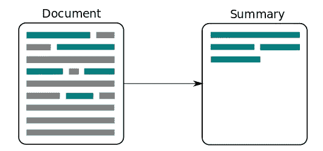

> 文本摘要是从一个源(或多个源)中提取最重要的信息以产生特定用户(或多个用户)和任务(或多个任务)的删节版本的过程。

# 为什么我们需要文本摘要？


[Imgur](https://imgur.com/HyPUqwF)

近年来，我们看到文本信息的数量与日俱增。文本信息增长迅速。用户阅读文本信息变得更加困难，并且还会失去兴趣。这就是文本摘要出现的原因，它将解决这个问题。

# 文本摘要方法的类型

文本摘要方法可以分为不同的类型。

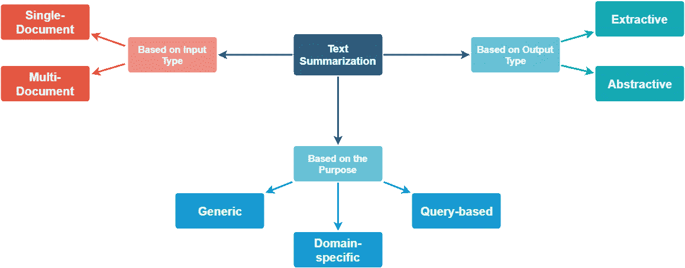

**一、基于输入类型:**

1.  单个文档，其中输入长度较短。许多早期的摘要系统处理单个文档的摘要。
2.  多文档，这里输入的长度可以任意。

**二世。基于目的:**

1.  通用，其中模型对要汇总的文本的领域或内容不做任何假设，并将所有输入视为同类。已经完成的大部分工作都围绕着一般的总结。
2.  特定于领域，其中模型使用特定于领域的知识来形成更准确的摘要。例如，总结特定领域的研究论文、生物医学文献等。
3.  基于查询，其中摘要仅包含回答关于输入文本的自然语言问题的信息。

**三。基于输出类型:**

1.  摘录，从输入文本中选择重要的句子形成摘要。今天的大多数摘要方法本质上都是提取的。
2.  Abstractive，模型形成自己的短语和句子来提供更连贯的摘要，就像人类会生成的一样。这种方法肯定更吸引人，但比提取摘要要困难得多。

# 先决条件

这篇文章做了如下假设:

*   你对 Python 很熟悉
*   您的系统上安装了 Python 3.6 或更高版本
*   spaCy 包。

# spaCy 是什么？

spaCy 是 Matt Honnibal 在 [explosion.ai](https://explosion.ai/) 开发的“Python 中的工业强度 NLP”的一个相对较新的包。它的设计考虑到了应用数据科学家，这意味着它不会让用户在决定使用什么深奥的算法来完成常见任务时感到沉重，而且它很快。非常快(在 Cython 中实现)。如果你熟悉 Python 数据科学栈，spaCy 就是你的 NLP 的`numpy`——它相当低级，但是非常直观和高性能。然而，由于 SpaCy 是一个相对较新的 NLP 库，它没有像 NLTK 那样被广泛采用。

# 空间安装

`**spaCy**`、其数据及其模型可以使用 python 包索引和设置工具轻松安装。使用以下命令在您的计算机上安装 spacy:

```
! pip install spacy
```

对于 Python3，将上面命令中的“pip”替换为“pip3”。

或者从[这里](https://pypi.org/project/spacy/)下载源代码，解压后运行以下命令:

```
!python setup.py install
```

要下载所有数据和模型，请在安装后运行以下命令:

```
!python -m spacy.en.download all
```

您现在已经准备好探索和使用空间。

# 加载空间库

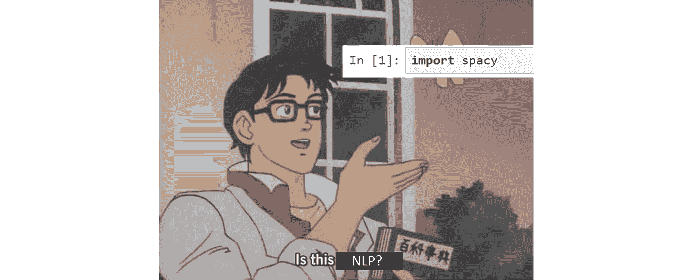

```
import spacy
```

# 实施部分

# 1.导入包

```
import numpy as np *# linear algebra*
import spacy
nlp = spacy.load('en_core_web_sm')
import pandas as pd *# data processing, CSV file I/O (e.g. pd.read_csv)*
import seaborn as sns
import matplotlib.pyplot as plt
from wordcloud import WordCloud
import string
import re
from collections import Counter
from time import time
*# from sklearn.feature_extraction.stop_words import ENGLISH_STOP_WORDS as stopwords*
from nltk.corpus import stopwords
import nltk
import plotly.offline as py
import plotly.graph_objs as go
import plotly.tools as tls
%matplotlib inline

stopwords = stopwords.words('english')
sns.set_context('notebook')
```

# 2.导入数据集

在本节中，我将为这个笔记本加载所需的数据集。这个数据集有大量的评论。很难处理完整的数据集。因此，为了方便起见，我将随机地将数据集分成更小的块。

```
reviews = pd.read_csv("../input/winemag-data-130k-v2.csv", nrows=5000,usecols =['points', 'title', 'description'],encoding='latin1')
reviews = reviews.dropna()
reviews.head(15)
```

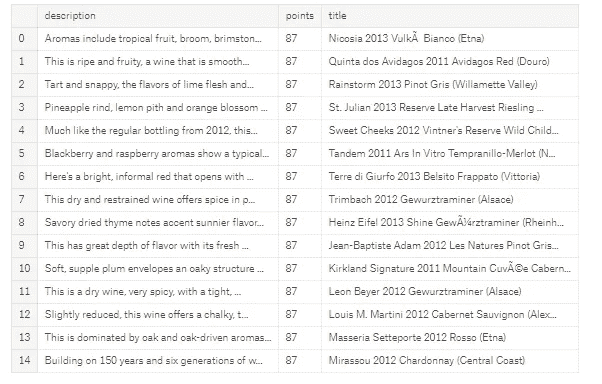

# 3.文本预处理

在这一步中，我将使用 Spacy 对文本进行预处理，换句话说，我将清除评论标题中无用的特征，如标点符号、停用词。对于这项任务，Python 中有两个有用的库。1.NLTK 2。斯帕西。在这本笔记本中，我将使用 Spacy，因为与 NLTK 相比，它非常快，并且有许多有用的特性。因此，没有进一步做，让我们开始吧！

```
!python -m spacy download en_core_web_lg
nlp = spacy.load('en_core_web_lg')
def normalize_text(text):
    tm1 = re.sub('<pre>.*?</pre>', '', text, flags=re.DOTALL)
    tm2 = re.sub('<code>.*?</code>', '', tm1, flags=re.DOTALL)
    tm3 = re.sub('<[^>]+>©', '', tm1, flags=re.DOTALL)
    return tm3.replace("**\n**", "")
```

输出屏幕:

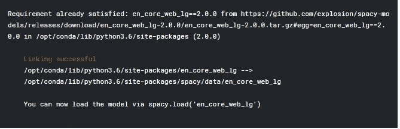

```
*# in this step we are going to remove code syntax from text* 
reviews['description_Cleaned_1'] = reviews['description'].apply(normalize_text)
```

```
print('Before normalizing text-----**\n**')
print(reviews['description'][2])
print('**\n**After normalizing text-----**\n**')
print(reviews['description_Cleaned_1'][2])
```

输出屏幕:

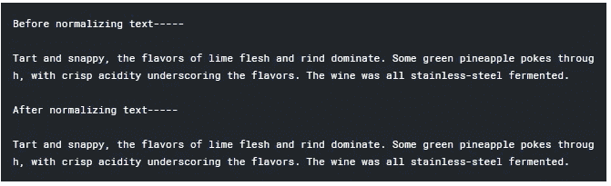

我们可以看到我们的文本标准化后的巨大差异。现在我们可以看到我们的文本更容易管理。这将有助于我们探索评论，并在以后制作摘要。

我们也看到了一些标点符号和停用词。我们也不需要它们。首先，我没有删除它们，因为我们在将来制作摘要生成器时会用到它们。因此，让我们创建另一个列来存储不带标点符号和停用词的规范化文本。

# 3.1 在将文本输入空间之前清理文本

```
punctuations = '!"#$%&**\'**()*+,-/:;<=>?@[**\\**]^_`{|}~©'
*# Define function to cleanup text by removing personal pronouns, stopwords, and puncuation*
def cleanup_text(docs, logging=False):
    texts = []
    doc = nlp(docs, disable=['parser', 'ner'])
    tokens = [tok.lemma_.lower().strip() for tok **in** doc if tok.lemma_ != '-PRON-']
    tokens = [tok for tok **in** tokens if tok **not** **in** stopwords **and** tok **not** **in** punctuations]
    tokens = ' '.join(tokens)
    texts.append(tokens)
    return pd.Series(texts)
reviews['Description_Cleaned'] = reviews['description_Cleaned_1'].apply(lambda x: cleanup_text(x, False))
```

```
print('Reviews description with punctuatin and stopwords---**\n**')
print(reviews['description_Cleaned_1'][0])
print('**\n**Reviews description after removing punctuation and stopwrods---**\n**')
print(reviews['Description_Cleaned'][0])
```

输出屏幕:

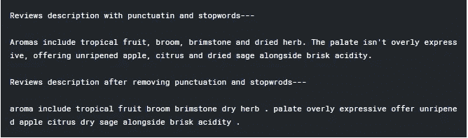

哇！看吧！现在我们的文本看起来可读性更好，也不那么杂乱了！

# 4.点数分布

在这一节，我将试着理解点的分布。这里的点数表示该描述在社交媒体(如 facebook、twitter 等)上获得的投票数。

```
plt.subplot(1, 2, 1)
(reviews['points']).plot.hist(bins=30, figsize=(30,5), edgecolor='white',range=[0,150])
plt.xlabel('Number of points', fontsize=17)
plt.ylabel('frequency', fontsize=17)
plt.tick_params(labelsize=15)
plt.title('Number of points description', fontsize=17)
plt.show()
```

输出屏幕:

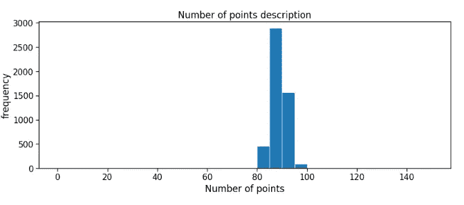

分数的描述大部分在 80 到 100 之间。大多数描述的得分在 80 到 100 分之间。

# 5.分析评论描述

在这一节，我将尝试分析葡萄酒的描述。在葡萄酒评论中，葡萄酒描述起着至关重要的作用。好的描述能让你的酒脱颖而出。这也有助于更快地获得评论。最后，它会帮助你得到一些分数。看看在酒的描述里能找到什么。

```
reviews['Title_len'] = reviews['Description_Cleaned'].str.split().str.len()
rev = reviews.groupby('Title_len')['points'].mean().reset_index()
trace1 = go.Scatter(
    x = rev['Title_len'],
    y = rev['points'],
    mode = 'lines+markers',
    name = 'lines+markers'
)
layout = dict(title= 'Average points by wine description Length',
              yaxis = dict(title='Average points'),
              xaxis = dict(title='wine description Length'))
fig=dict(data=[trace1], layout=layout)
py.iplot(fig)
```

输出屏幕:

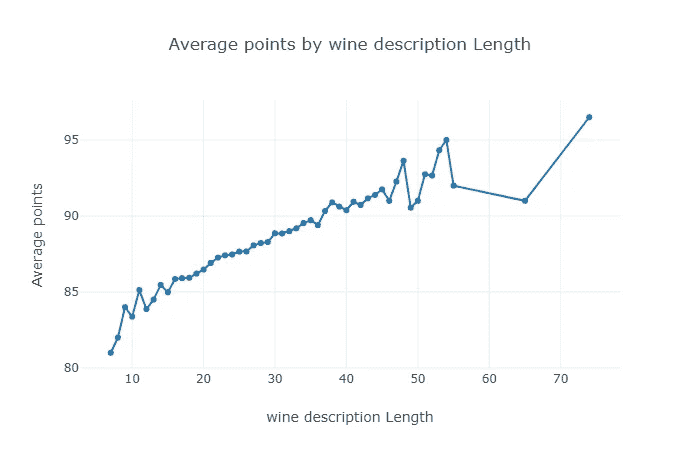

# 6.描述摘要生成器


[Siraj Raval](https://www.youtube.com/watch?v=ogrJaOIuBx4&t=164s)

> 在这一步，我将试着做一个描述摘要。对于文本摘要有大量的研究。但是我将尝试做一个简单的文本摘要技术。该技术描述如下。

# 6.1 将段落转换成句子

> 我们首先需要将整段文字转换成句子。将段落转换成句子的最常见方法是每当遇到句号时就拆分段落。

# 6.2 文本预处理

> *将段落转换成句子后，我们需要移除所有句子中的特殊字符、停用词和数字。*

# 6.3 对句子进行标记

> *我们需要对所有的句子进行分词，得到句子中存在的所有单词*

# 6.4 找出加权出现频率

> 接下来我们需要找到所有单词出现的加权频率。我们可以通过将每个单词的频率除以最频繁出现的单词的频率来找到每个单词的加权频率。

# 6.5 用加权频率替换原句中的单词

> *最后一步是插入加权频率来代替原始句子中的相应单词，并找到它们的总和。重要的是要提到预处理过程中移除的单词(停用词、标点符号、数字等)的加权频率。)将为零，因此不需要添加*

# 6.6 按总和降序排列句子

> *最后一步是按照句子总和的逆序排序。出现频率最高的句子概括了全文。*

# 文本摘要功能:

这个函数有助于从大文本中提取摘要。所以当我们想从文本中提取摘要时，我们总是需要这个函数。这里的功能如下:

```
def generate_summary(text_without_removing_dot, cleaned_text):
    sample_text = text_without_removing_dot
    doc = nlp(sample_text)
    sentence_list=[]
    for idx, sentence **in** enumerate(doc.sents): *# we are using spacy for sentence tokenization*
        sentence_list.append(re.sub(r'[^\w\s]','',str(sentence)))

    stopwords = nltk.corpus.stopwords.words('english')

    word_frequencies = {}  
    for word **in** nltk.word_tokenize(cleaned_text):  
        if word **not** **in** stopwords:
            if word **not** **in** word_frequencies.keys():
                word_frequencies[word] = 1
            else:
                word_frequencies[word] += 1

    maximum_frequncy = max(word_frequencies.values())

    for word **in** word_frequencies.keys():  
        word_frequencies[word] = (word_frequencies[word]/maximum_frequncy)

    sentence_scores = {}  
    for sent **in** sentence_list:  
        for word **in** nltk.word_tokenize(sent.lower()):
            if word **in** word_frequencies.keys():
                if len(sent.split(' ')) < 30:
                    if sent **not** **in** sentence_scores.keys():
                        sentence_scores[sent] = word_frequencies[word]
                    else:
                        sentence_scores[sent] += word_frequencies[word]

    summary_sentences = heapq.nlargest(7, sentence_scores, key=sentence_scores.get)

    summary = ' '.join(summary_sentences)
    print("Original Text:**\n**")
    print(text_without_removing_dot)
    print('**\n\n**Summarized text:**\n**')
    print(summary)
```

现在我们已经写了函数，让我们试着总结一些描述。

```
generate_summary(reviews['description_Cleaned_1'][8], reviews['Description_Cleaned'][8])
```

输出屏幕:

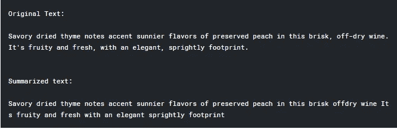

```
generate_summary(reviews['description_Cleaned_1'][100], reviews['Description_Cleaned'][100])
```

输出屏幕:

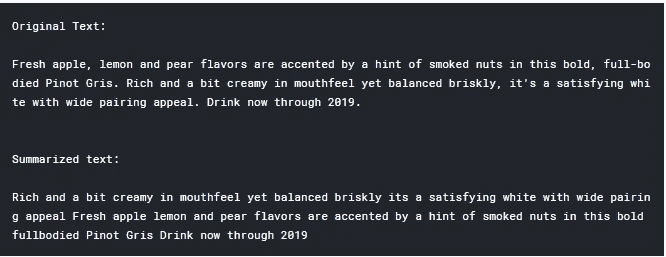

```
generate_summary(reviews['description_Cleaned_1'][500], reviews['Description_Cleaned'][500])
```

输出屏幕:

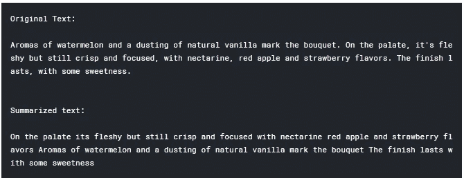

太棒了。我们成功地制作了一个简单的 winemag 描述摘要器。

# 7.结论

感谢阅读这篇文章。如果您有任何建议，请随时在评论中联系我，或者发送[邮件](http://harunspeedy1995@gmail.com)或连接 [LinkedIn](https://www.linkedin.com/in/harun-ur-rashid6647/) 。保持联系，了解更多最新消息。谢谢你。😎

完整代码请访问 [Kaggle](https://www.kaggle.com/harunshimanto/summarization-with-wine-reviews-using-spacy) 。

> "让我们用美酒和甜言蜜语来庆祝这一时刻."

如果你喜欢这篇文章，然后给👏鼓掌。开心分析！