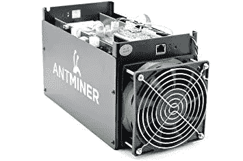

# 比特大陆诉讼概要

> 原文：<https://medium.com/hackernoon/summary-of-bitmain-lawsuit-ed3a3412c965>

**戈尔·格沃尔基扬诉比特大陆公司、比特大陆技术有限公司和指定经营实体 1 至 10**

于 2018 年 11 月 19 日在加州北区对比特大陆提起诉讼。*参见*[https://www . scribd . com/document/393971649/比特大陆-集体诉讼](https://www.scribd.com/document/393971649/Bitmain-Class-Action)

在一个简短的总结中，原告指控比特大陆营销和销售 ASIC 矿机，这些矿机被预先配置为使用客户的电力来为比特大陆自身的利益生成加密。

原告于 2018 年 1 月购买了他的 ASIC，它很难配置，并且它被预配置为在全功率模式下运行，此时它使用原告的电力为比特大陆的利益进行开采。诉状称，共有 100 多名集体成员，争议金额超过 500 万美元。

原告的**第一项指控**是比特大陆使用了不公平竞争，这是非法的、欺诈性的、欺骗性的、不真实的或误导性的广告，违反了公共政策，是不道德的、不道德的、压迫性的和不道德的，因为行为的严重性超过了任何声称的利益。原告要求法院发布命令，要求比特大陆停止他们的不正当竞争，赔偿因比特大陆的不公平和欺骗行为而产生的所有费用；按照法律允许的最高利率支付利息，并支付原告的律师费。

第二项指控**是不当得利，称比特大陆以原告为代价获得了利益，包括电费。原告请求法院要求比特大陆交出其以原告为代价获得的所有资金、利润和收益。**

**第三项指控**针对转换，称比特大陆转换了原告和集体成员的 ASIC 设备的使用，并请求归还。

我本来希望诉讼能包括更多信息，解释原告的电费是多少，他开采的比特币有多少进入了比特大陆的钱包，或许还能在 block explorer 上展示那次交易。从我的理解(这是相当有限的)来看，来自所有制造商的矿工，不仅仅是 bitmain，都带有工厂设置，一开机就开始采矿。一旦有人得到一个矿工，他们应该更新工厂设置为自己的定制设置。我怀疑比特大陆的回应会指控原告疏忽，没有及时配置他们的机器。

原告可能会辩称，比特大陆应向所有购买者明确披露，在配置之前，采矿将在比特大陆的账户上进行。当我搜索比特大陆的网站时，我没有发现任何东西可以提醒人们，该矿工将在配置前为比特大陆采矿，尽管有大量的配置说明。网站上没有使用条款或服务条款。

有一个简短的免责声明对我来说没什么意义，它只是说，

> 放弃
> 
> 除了通过我们提供或已表明要使用的方式之外，您不得通过任何方式访问(或试图访问)本服务，并且您明确同意不通过任何非法或不合法的方式访问(或试图访问)本服务，也不使用本服务来支持任何非法或不合法的活动或目的。
> 
> 进入本网站并注册本服务，即表示您承认并同意，根据您所在司法管辖区的法律，您可以合法地获得本服务。

*见*https://service.bitmain.com/policies/disclaimer.

支持页面上有很多信息，但没有说机器将挖掘比特大陆，直到配置。【https://service.bitmain.com/support】见。

我看了几个关于设置程序的 youtube 视频，没有一个视频提到在设置之前，会为制造商开采硬币。*见*见[https://www.youtube.com/watch?v=sz-XZL77qqs](https://www.youtube.com/watch?v=sz-XZL77qqs)。

总之，我认为诉讼是有价值的，如果它能证明比特大陆在没有透露矿工将为比特大陆采矿直到配置好的情况下出售矿工，并且这确实发生在 100 多人身上，并导致比特大陆开采了价值超过 500 万美元的密码(好运)。