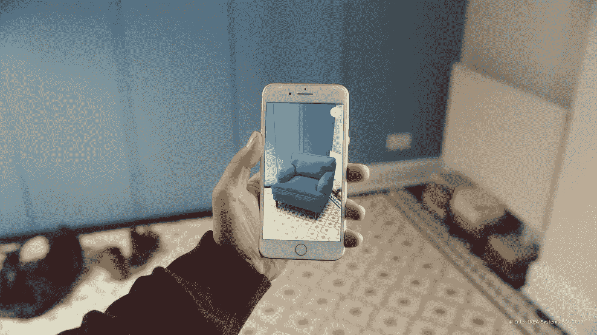
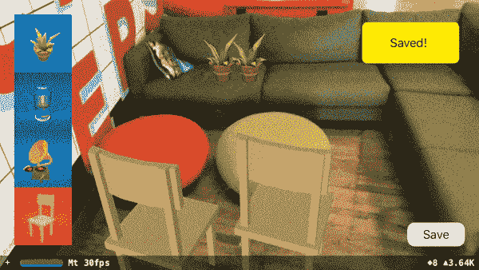
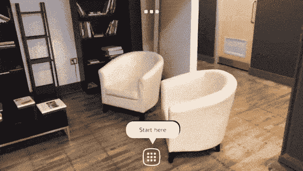
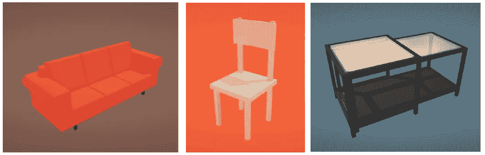
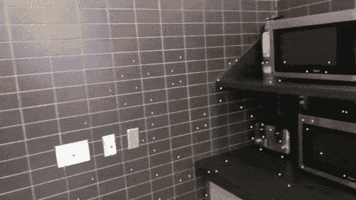
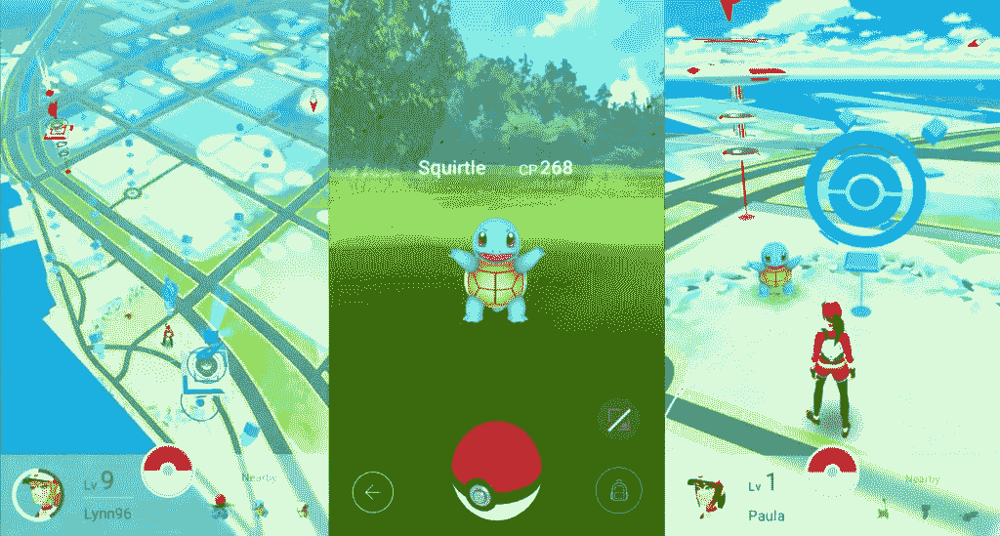
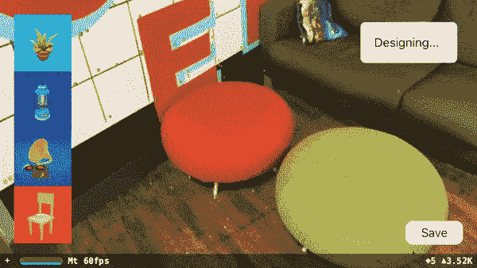
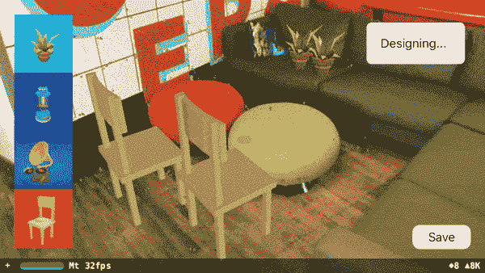

# 使用“恢复会话”功能增强 ARKit 室内设计应用程序的性能。

> 原文：<https://medium.com/hackernoon/supercharge-your-arkit-interior-design-app-with-a-resume-session-feature-9da31252a266>

## 如何为持续会话重新设计 AR 应用程序？



IKEA Place was one of the first ARKit app on the iOS app store

App Store 上发布的第一批 ARKit 应用程序之一是[***IKEA Place***](https://itunes.apple.com/ca/app/ikea-place/id1279244498?mt=8)**，这是一款家具购物应用程序，让人们在购买之前用宜家的家具目录虚拟设计自己的家。**

**从那时起，家具和家居装饰的产品可视化已经成为手机上最受欢迎的 ar 应用之一，甚至 Lowe's 和亚马逊等大型零售商也加入了实验，尝试 AR 的力量来影响消费者的家具购物行为。**

***如果你从未尝试过这些应用程序，请查看**[***宜家家居***](https://itunes.apple.com/ca/app/ikea-place/id1279244498?mt=8)**或*[***house craft***](https://itunes.apple.com/ca/app/housecraft/id1261483849?mt=8)***。*******

# ****那么什么是“恢复会话”问题呢？****

****“恢复会话”问题指的是当今市场上所有 AR 室内设计应用程序面临的一个共同问题——他们没有办法从一个应用程序会话到下一个应用程序会话保存放置在物理位置的虚拟家具的位置。这意味着每当用户意外或有意关闭应用程序时，他们就会失去所有进展，需要从头开始重新设计他们的空间！****

******这篇文章是关于为什么这是当前应用程序的一个问题，以及你如何使用 ARKit 的一个新的 SDK 潜在地解决这个问题——**[**place note SDK**](https://placenote.com)**。******

********

****Placenote SDK enables the persistent placement of AR content in any physical space.****

****首先，我们先来看看一个基础的 AR 室内设计 app 是如何搭建的。****

# ****AR 室内设计应用是如何工作的？****

****这些应用程序基本上是通过让你在 AR 中虚拟地将 3D 家具模型放在你周围的平面上来工作的。因此，如果你想买一张新沙发，你可以从不同的角度看看它会是什么样子，想象一下沙发的颜色和尺寸是否适合你的房间。****

****要了解这些应用在技术层面上是如何工作的，你需要了解如何构建一个简单的基于 ARKit 的 iOS 应用，该应用可以检测水平面并在其上放置 3D 对象。如果你是这方面的新手，[这里有一个很棒的教程](https://www.appcoda.com/arkit-horizontal-plane/)会告诉你如何构建它。****

****一旦你可以建立一个可以在平面上放置 3D 物体的应用程序，你就可以简单地用椅子的模型来代替 3D 物体，[，就像这个](https://poly.google.com/view/88nXdqyGV06)。****

****现在，在一个非常基础的层面上，每个家具应用程序都有两个主要组件****

******1。在平面上放置和移动 3D 模型的界面** ARKit 可以轻松检测平面，并让您在其上放置 3D 对象。****

********

****Screen record of furniture placement in [Housecraft on the App Store](http://www.housecraftapp.com/)****

******2。家具零售商通常会提供一份 3D 模型目录，供您从** 3D 模型中选择。为了原型制作，你可以使用来自网站的免费 3D 模型，比如 [Sketchfab](http://sketchfab.com) 、 [Google Poly](http://poly.google.com) 或 [Turbosquid](http://turbosquid.com) 。****

********

****3D models from [Google Poly](http://poly.google.com)****

****这些元素的结合是目前 App Store 上所有室内设计应用的基础，虽然其中许多设计精美，使用有趣，**但目前所有这些应用都有一个大问题。******

# ****房间里的大象****

****如果你在 iPhone 或 iPad 上尝试过这些应用，你会觉得很熟悉。你煞费苦心地在房间周围添加各种家具，将它们正确排列，并选择与你的装饰相匹配的颜色。在虚拟装饰你的房间 15 分钟后，如果你不小心(或故意)关闭应用程序并再次打开它…然后**噗**，你的设计已经消失，你需要再次重做一切。不仅如此，你还不能把这些设计分享给任何人，除了拍一张 AR 场景的照片或视频。****

****从 UX 的角度来看，这不是一个很好的体验，因为大多数视觉设计工具的两个主要功能是保存和恢复进度以及与他人合作。****

****所以，让我们从技术角度来探究一下问题是什么。****

# ****ARKit 的问题是****

****如果你使用过 ARKit，你会知道每次打开 AR 应用程序时，ARKit 都会在手机的当前位置设置一个任意的(0，0，0)点，并相对于该点将所有内容放置在场景中。这是因为，尽管 ARKit 可以检测环境中的视觉特征来跟踪手机的运动，但它没有能力“记住”这些特征。****

****这意味着，如果对象相对于真实世界的位置很重要，则不能构建系统来保存和恢复设计会话。每次打开应用程序，你都需要重新摆放家具。在大多数用户流中，这是不必要的摩擦。****

> ****那么问题是什么呢？ARKit 的问题在于，它用来跟踪运动的视觉特征不够“清晰”，不足以在每次观察一个区域时在同一个地方重复发现。****

********

****为了在房子的特定区域保存数字内容，我们需要一种方法来永久固定 AR 内容在物理空间中的位置，以便每次打开应用程序时，场景的原点都会捕捉到它在现实世界中的正确绝对位置。我们姑且称这个特性为“**持久性**”。****

> ****AR 中的持久性是让数字对象在多个应用程序会话中永久保留其在现实世界中的位置的能力。****

******解决这个问题的一个办法，就是**[***Placenote SDK***](https://placenote.com)**。这篇文章的其余部分将教你如何构建一个室内设计应用程序，在其工作流程中加入持久会话。******

# ****解决持久性问题****

****为了让数字对象在现实世界中有一个持久的位置，你的应用程序需要一些现实世界的表示(例如地图)和一种在地图上找到它的位置的方法。****

****像 Pokemon GO 这样的应用程序通过使用 GPS 来地理定位商店和公园等特定现实世界地标附近的 Pokemon。这种地理定位足以进行粗略定位，但由于 GPS 非常不准确，每次打开应用程序时，内容的位置可能会偏离目标 5 到 20 米。此外，GPS 不能在室内工作，而室内是大多数“室内”设计发生的地方。****

********

****Pokemon go uses GPS for geolocation with low accuracy.****

****Placenote SDK 采用了不同的方法来解决这个问题。它不是使用 GPS，而是使用一个摄像头来可视地扫描一个物理空间，并将其转化为一张地图，以供将来检索。它还使相机能够通过将当前图像与预先创建的地图进行比较，在地图中定位自己。通过这种方式，Placenote 实现了一个自给自足的视觉定位系统(不需要外部信标)，最重要的是，**可以在室内工作**。****

# ****Placenote 如何进行视觉定位****

****Placenote 将定位过程分为两个主要步骤****

1.  ******映射:****摄像机用于视觉扫描物理区域。地图绘制完成后，Placenote 会将地图保存并上传到云中，并返回一个 mapID，该 mapID 可用于重新加载地图或与多个设备共享地图。******
2.  ********重新定位:**使用 mapID 下载预先构建的地图，Placenote 尝试将摄像机当前看到的图像与地图的一部分进行匹配。当找到匹配时，它会返回手机/平板电脑在该地图中的位置估计值。******

*******如果你像我一样是一个计算机视觉极客，这听起来会很熟悉。(SLAM)。*******

******这个系统虽然基本上是无缝的，但可能会稍微改变用户工作流的设计。**让我们来看看如何重新设计一个室内设计应用程序来融入视觉定位范例。********

# ******为视觉定位重新设计你的应用******

******这是一个室内设计应用程序的潜在重新设计，将视觉定位工作流程纳入其 UX。******

## ******1.设计房间(同时绘制地图)******

******使用 Placenote，需要稍微修改设计阶段，以便在后台运行映射过程。这意味着，当用户在房间中放置家具时，Placenote 可以通过在后台运行并行的特征提取和映射过程来开始构建环境的 3D 地图。好消息是，这不需要给用户任何额外的提示。它应该无缝地适应任何现有的工作流程。******

******如果你在 Xcode 上用 **Swift 编码，你可以在你的视图控制器中的 viewDidLoad()函数的末尾运行这一行。这将在用户打开应用程序时立即启动制图过程。********

```
****LibPlacenote.instance.**startSession()******
```

******还增加了一个新功能，从 ARKit 发送图像帧到 Placenote。******

```
****func **session**(_ session: ARSession, didUpdate: ARFrame) {let **image**: CVPixelBuffer = didUpdate.capturedImage
    let **pose**: matrix_float4x4 = didUpdate.camera.transformLibPlacenote.instance.**setFrame**(image: image, pose: pose)
}****
```

************

******The design stage can run mapping in the background (green dots are feature points)******

## ******2.保存设计会话******

******如果您的应用程序中没有“保存”或“共享”按钮，则“保存”会话可能是添加到您工作流程中的唯一额外步骤。由于目前没有室内设计应用程序可以真正将设计保存在一个特定的位置，所以并不真正需要“保存”按钮。但是，如果您有一个“共享”功能，允许您捕获设计空间的屏幕截图或视频，您可以使用以下代码片段将保存功能链接到此共享按钮:******

```
****LibPlacenote.instance.**saveMap**(**savedCb**: {(mapId: String?) -> Void in print("Saved Map ID: " + String(mapId))
   LibPlacenote.instance.**stopSession**()
},**uploadProgressCb**: {(completed: Bool, faulted: Bool, percentage: Float) -> Void in**if** (completed) {print("Uploaded map!")}
})****
```

******在 Placenote 的映射过程中，保存功能保存并上传在设计过程中创建的地图。地图上传后，您将收到一个 **mapID** ，可用于重新加载地图或与其他设备共享地图，使您的应用程序更具社交性。******

******从开发的角度来看，您还需要保存应用程序中内容的位置。这可以在本地完成，也可以在您自己的云后端使用一个简单的 JSON 文件完成。******

************

******Save a design session by saving a map and the positions of content in the map.******

## ******3.恢复设计会话******

******一旦保存了地图，当您想要在该区域打开保存的设计时，您可以重新加载它。将此功能纳入 UX 的一种方法是，每次打开应用程序时检查是否存在之前保存的 mapID(在 viewDidLoad()函数中)。如果 mapID 存在，请加载最新的地图并尝试在该地图中定位设备。******

******一旦 Placenote 找到匹配，场景就可以准确地加载到它停止的地方，以便用户可以继续设计。您可以将这一行添加到视图控制器中的 **viewDidLoad()** 函数中。******

```
******// if you saved a mapID in user defaults, retrieve it like this**guard let savedID = defaults.string(forKey: "MapID") 
   else { return false }LibPlacenote.instance.**loadMap**(mapId: “Map ID”,**downloadProgressCb**: {(completed: Bool, faulted: Bool, percentage: Float) -> Void in if (completed) { LibPlacenote.instance.**startSession**()
   }
})****
```

************

******The session can be resumed as soon as the app is reopened.******

******就是这样！通过一些小的改变，您可以为您的 AR 体验添加一个全新的维度，使其持久，更具社会性，并且总体上成为室内设计应用程序的更好解决方案。******

******上面的代码示例是在 **Swift** 中为原生 SceneKit 开发的，但是 Placenote SDK 也可以作为 **Unity** 插件使用。要了解更多关于 Placenote 的信息或尝试示例应用程序，请查看[Placenote.com](https://placenote.com)。******

# ******Placenote SDK 入门******

******你可以在这里了解更多关于 Placenote 如何帮助构建 v [虚拟家具设计和 staging](https://placenote.com/virtual-furniture-design-staging/) 应用的信息。在接下来的几天里，我将发布上述应用程序示例的示例代码，因此如果您感兴趣，请注册一个 API 密钥，并使用下面链接的安装指南尝试 Placenote SDK for Unity 或 SceneKit。******

 ******[## 获取 API 密钥并选择平台| Placenote

### 单击下面的链接打开您的开发者门户。注册一个帐户并创建一个新的 API 密钥。然后回到…

placenote.com](https://placenote.com/install)****** 

# ******怎么联系******

******要就 Placenote、ARKit 或任何与 AR/VR 相关的内容与我联系，请随时联系:******

1.  ******给我发邮件:neil [at] vertical.ai******
2.  ******Placenote Slack 社区:[加入我们的 Slack 群组](https://join.slack.com/t/placenotedevs/shared_invite/enQtMjk5ODk2MzM0NDMzLTIzMjQwZTAxMzYxYWMyMjY1NzZmYTA2YjY0OGU5NzAzNjUxN2M1ZTQ1ZWZiYzI4ZDg4NGU1ZjQ0ZTA4NDY0OWI)******