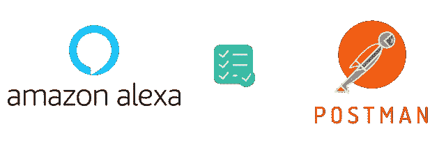
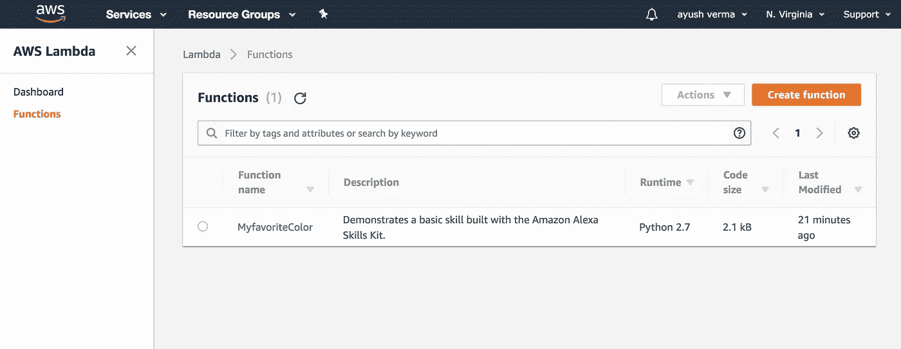
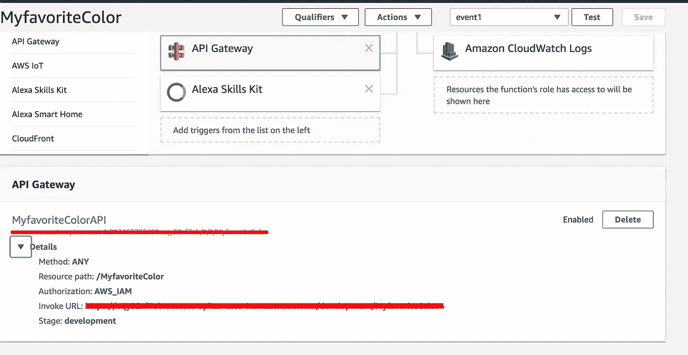
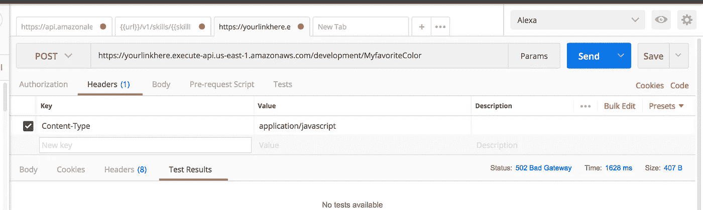
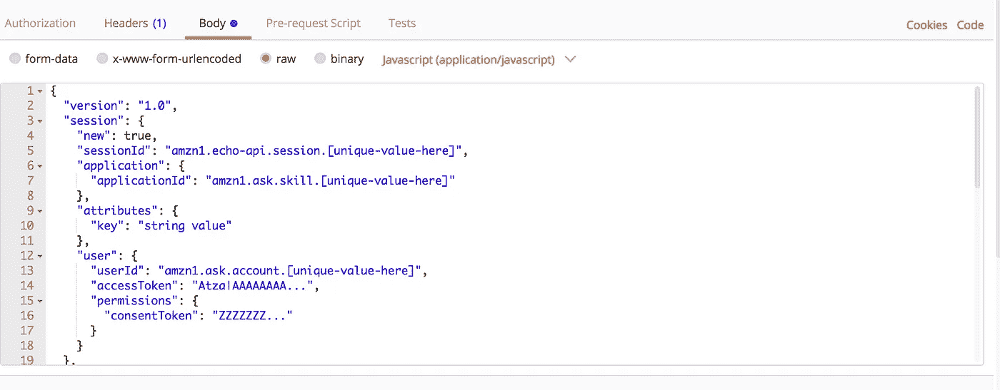
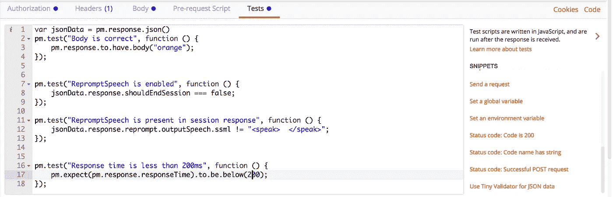
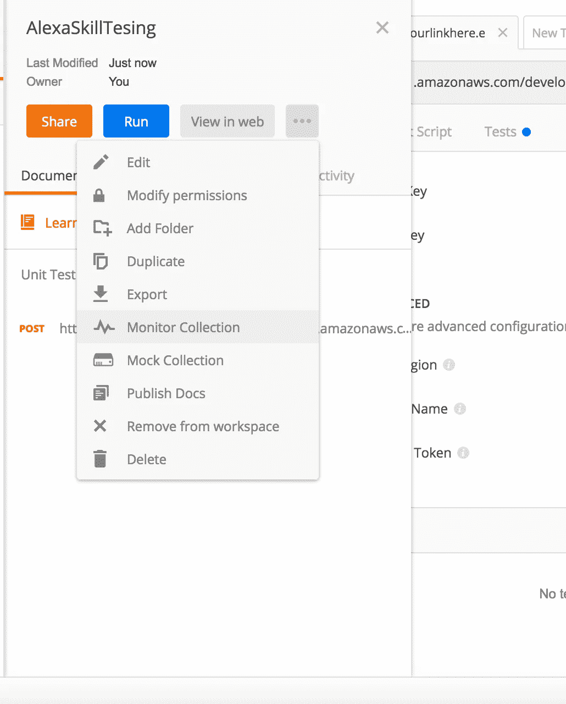
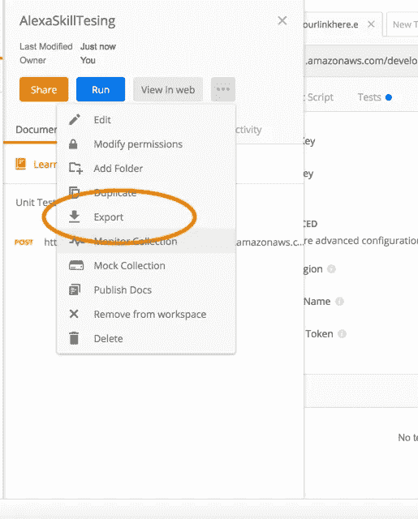

# 邮差和纽曼对 Alexa 技能的增压单元测试

> 原文：<https://medium.com/hackernoon/supercharged-unit-testing-of-alexa-skills-with-postman-and-newman-53e6c48214e3>



最近，亚马逊一直在努力改善其 Alexa 智能个人助理的开发者体验。该策略技能管理 [API](https://hackernoon.com/tagged/api) 的一部分，提供了测试多回合对话、实体解析、对话管理和更多现有测试工具不支持的功能。

用 Postman 测试 Alexa 技能取代了亚马逊开发者门户提供的基本测试服务。

首先，我们将使用三样东西来完成所有这些工作

我们需要三样东西来开始

*   [AWS Lambda](https://docs.aws.amazon.com/lambda/latest/dg/welcome.html)

如果你以前没有为 Alexa 建立技能，我会建议，在 5 分钟内完成[建立技能](https://developer.amazon.com/alexa-skills-kit/alexa-skill-quick-start-tutorial)，从核心原则开始。

一旦你设置好 Lambda 函数并运行，我们就可以开始了。



Function might be looking something like this

*   [API 网关](https://aws.amazon.com/api-gateway/)

通过亚马逊 API Gateway，我们可以为 Alexa 提供一致的、可扩展的编程接口，以访问后端的端点。

1.  首先，转到 [AWS API 网关](https://aws.amazon.com/api-gateway/)并登录控制台。
2.  首先，确保您已经从页面顶部的单选按钮中选择了“New API”。然后新建一个角色，选择“L [ambda 执行角色](https://www.google.co.in/search?q=lambda%20execution%20role%20cloudformation&ved=0ahUKEwjAntrtwvXZAhWLfZAKHT4ZCwEQsKwBCC0oADAA)
3.  现在您需要打开 Actions 按钮，这次选择“Deploy API”在出现的“部署 API”框中，为“部署/测试阶段”选择“[新阶段]”。对于其他三个值(阶段名称、阶段描述和部署描述)，您可以只使用单词“Test”来表示它们。值并不重要，这只是为了让您知道这个新 API 的用途。我们在后期需要这个。



Sample Dashboard

4.现在，从屏幕顶部的蓝框中复制调用 URL。您的 API 已经设置好，可以开始运行了。

*   使用 Postman API 工具启动和运行

1.  如果你还没有这个神奇的工具，一定要下载 [Postman](https://www.getpostman.com/) 。但是等等…

**为什么是邮递员？**

*   在本文中，我们将使用 Postman 来创建和执行针对 Lambda 函数的单元测试。每次你对你的 Lambda 进行修改时，你都应该运行你的测试来确保所有的东西都像预期的那样工作
*   我们有一些神奇的东西叫做[监视器](https://www.getpostman.com/docs/v6/postman/monitors/intro_monitors)，这将帮助我们节省单元测试 [Alexa 技能](https://hackernoon.com/tagged/alexa-skills)的开销。
*   Postman 帮助我们编写基于 TDD 的请求前脚本和请求测试脚本。是的，[*Postman collections*](https://www.getpostman.com/docs/v6/postman/scripts/postman_sandbox)让 API 测试再次变得伟大。
*   我在邮递员工作。😜

好了，现在你有希望成为邮递员了。

如果您需要 API gateway 上每个请求的更多安全性，那么您可以添加 [AWS 签名](https://docs.aws.amazon.com/apigateway/latest/developerguide/how-to-use-postman-to-call-api.html)并继续。



现在您需要一个样本请求来开始测试。你可以从像 serverless 这样的服务模拟器中获得 Lambda 请求，也可以从亚马逊账户中的 Cloudwatch 日志中获得。

选择 body 并点击“raw”单选按钮，这表示我们正在将自己的 JSON 数据转发给 Lambda。



Raw datatype

输出将被嵌入`"SSML"`:表示输出的语音是用 SSML 标记的文本[。这是 alexa 交流的一种方式。](https://developer.amazon.com/docs/custom-skills/speech-synthesis-markup-language-ssml-reference.html)

点击可以了解更多关于请求结构[的信息。](https://developer.amazon.com/docs/smapi/account-linking-schemas.html)

在这一点上，确保并验证您可以成功地与您的 Lambda 通信，现在我们可以开始为这个请求创建一套测试，它将定义单元。

例如，我们正在使用喜爱的颜色技能，“`WhatsMyColorIntent what my favorite color”` 应该返回”`orange"`

```
pm.test("Body is correct", function () {
    pm.response.to.have.body("orange");
});
```

类似地，当你想检查 Alexa 在用户给出响应并重新输入后是否继续该技能时，我们需要检查字段`shouldEndSession`



Tests

类似地，你可以为一个 Alexa 技能定义一组测试，并在每次技能发生变化时运行它。当您对请求或代码进行任何意外更改时，Postman 将帮助您了解中断。

这样你就节省了大量的时间和精力来写代码，而不是无聊的测试。

您还可以保存 Alexa 对 Postman 的响应并编写测试，而无需再次调用 Prod API 进行一次会话。你可以在这里了解更多[。您可以在 Runner 中运行您的收藏，并了解您的技能状态。](http://blog.getpostman.com/2017/03/16/simulate-a-back-end-with-postmans-mock-service/)



Monitor Skills on Postman’s cloud.

现在，如果你像我一样是 CLI 迷，你会更喜欢从命令行测试所有的测试，对吗？

没问题，邮差有一个工具叫，[纽曼](https://github.com/postmanlabs/newman)，是邮差的命令行伴侣。

用 NodeJS 通过`npm install newman --global` 安装纽曼。

就是这样。现在是在 CLI 中使用集合的时候了。



Export by clicking here.

现在，使用以下命令在 CLI 中运行测试

`newman run AlexaSkillTesting/test_to_check_color.json`

仅此而已。看到你的终端跟邮递员说话，替你测试。

是的，**邮递员监视器肯定可以通过监视响应来提供帮助，并在出现问题时发出通知。因为，我们将为我们的技能编写一整套单元测试，这样当我们对某个东西进行更改时，我们就有信心没有任何东西损坏，一切正常。这绝对有助于我们在每个对话阶段进行技能的功能测试。所以，干杯🍺**

希望，我已经帮助你测试 alexa 的技能。感谢阅读🙌