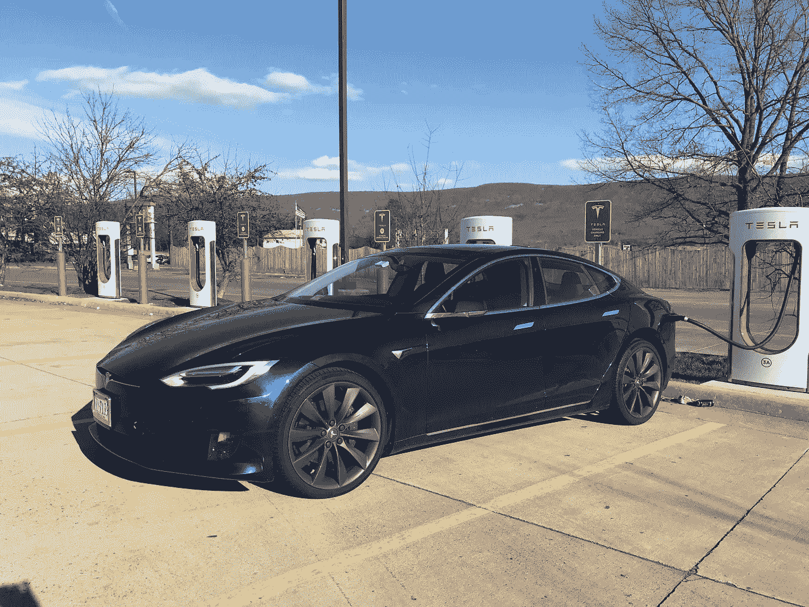

# 开着我的特斯拉穿越弗吉尼亚的超级充电站

> 原文：<https://medium.com/hackernoon/supercharger-station-hopping-across-virginia-in-my-tesla-bc79eb99eb9f>

My Tesla charging at one of the many stations in Virginia

我成为一名[特斯拉](https://hackernoon.com/tagged/tesla)车主已经一年了，逐渐适应驾驶全电动汽车。做出这种改变需要了解何时何地加油。鉴于增压站可以快速为你的汽车加油，它是一个巨大的好处。我正常的城外旅行是在人口稠密的 I-95 走廊上来回，覆盖了 [DMV](https://hackernoon.com/tagged/dmv) (特拉华州-马里兰州-弗吉尼亚州)地区。

上周末，我冒险离开 95 号州际公路，前往该州西部的蓝岭山脉。这是我的全电动体验日志，有关于我的汽车电池表现如何的实际数据，以及沿途的充电站。

# 去弗吉尼亚西南部的公路旅行

首先是计划旅行。我在 DC 地区工作，所以几乎走遍了整个州。上路之前，我画出了从麦克林到克里斯蒂安堡的各种选择。

Options for my Drive to Southwestern Virginia

特斯拉 I drive 的型号是 S75，最大续航里程为 249 英里。鉴于行程为 258 英里，这次旅行将测试我沿途的充电技能。

# 增压弗吉尼亚

研究特斯拉网站突出了所有主要高速公路上的选项。81 号州际公路是沿着蓝岭山脉的主要道路，有三个增压器站。64 号州际公路在山区与它相连，并允许向东前往里士满和大西洋上的弗吉尼亚海滩地区。在夏洛茨维尔和我的家乡里士满，都有一个超级充电站。

Tesla Supercharging Stations in western Virginia

# 让我们开始这次旅行吧！

周五下午 2 点 15 分，我离开了位于麦克林的办公室，并在办公室车库给我的车充满电。电量计显示电池可行驶 243 英里——是其最大容量的 98%。离开弗吉尼亚北部郊区的交通非常繁忙，但行驶了 25 英里后，它就畅通了。农村地区州际公路的限速是每小时 70 英里，这些公路上到处都是卡车司机，他们强制要求快速行驶。三月的天气凉爽，气温在 40 度以下。这影响了电池在旅途中的效率。

开了 90 分钟后，是我在杰克逊山第一次充电的时候了。截至下午 3 点 44 分，能量表已经下降到 118 英里，但我只行驶了大约 100 英里。交通、天气和速度增加了理想状况下 20%的阻力，这是屏幕上的仪表所计算的。

View from the Supercharger in Mount Jackson, Virginia

充电站距离高速公路只有 0.2 英里，在一个 Sheetz 停车场。鉴于我是唯一一个使用它的人，能量转移率非常好。在电池电量约为 50%的情况下，充电开始时为 89 千瓦。我伸伸腿，休息了一会儿，喝了点东西。19 分钟后，加油站给电池增加了 70 英里的电量，整装待发。

# 计划我的到来

下午 4:03，我继续我的行程，用车载导航监控电池消耗。它不断预测能源利用，并在安顿下来后设定我的期望，即我会在不另收费的情况下关闭它。另外一点要考虑的是到达目的地后的附带旅行。我要去参加我女儿的游泳比赛，所以空手而归不是个好主意。

Onboard charging forecast on my Tesla

我又加了一个充电站，车载导航给了我方向。下午 5 点 23 分，我到达列克星敦的超级充电站，剩下 95 英里的能量。电池使用效率相似，由于车速和较低的温度，电池使用效率降低了 20%。

我再次成为唯一一辆正在充电的汽车，尽管我没有获得很大的能量转移率(75kW ),因为电池相对来说是充满的(60%)。当计划停止时，这是一个考虑因素，因为电池电量越低，充电器充电越快。一个超级充电站的额定功率高达 120 千瓦，但要达到这个水平需要一个几乎耗尽的电池。

Supercharging station in Lexington, Virginia

下午 5 点 41 分，我离开了摊位，在 18 分钟内增加了 59 英里的能量。这给了我足够的精力来完成这次旅行。我在下午 6:55 到达克里斯蒂安斯堡，电池里还有 54 英里的能量。

# 酒店充值

我们在布莱克斯堡住的酒店在停车场有一个免费的充电站。它甚至有特斯拉电缆，所以我可以直接插入。充电速度为 10kW，比超级充电站慢得多，但鉴于我有一整晚的时间，这不是问题。七个小时的充电让我从 46 英里回到 243 英里。

Level 2 charger at Marriott Courtyard in Blacksburg

# 正在回家

过了一个愉快的周末后，我们于周日下午返回。我住在里士满，有 200 英里的路程。能量计显示开始时行驶了 232 英里，温度上升了大约 50 度。这比周五稍微好一点，尽管考虑到涉及的高速公路，车速将是相似的。

Map getting home to Richmond

我在下午 1:40 上路。在输入方向后，汽车警告我，虽然我可能有足够的钱回家，但电池会非常低。地图突出显示了我旅行中的两个增压器，并建议保持低于 65 英里/小时，以最大限度地提高电池的效率。

Onboard charging forecast heading home

我开了一个多小时的车，在下午 2 点 55 分，我在列克星敦超级充电站停下来休息，吃了点零食。电量下降到 143 英里，充电开始时为 70 千瓦。

One of many delicious reasons to stop at the Lexington Supercharger

经过 15 分钟的休息，它增加了 46 英里的电荷。机载计算机停止发出距离目的地的警告信号，并在下午 5:00 到家。总行程刚刚超过 200 英里，电池只剩下 43 英里。根据行车电脑中的预测计算，由于车速和温度，效率损失了 15%。

# 结论

这次旅行很成功，增强了我去更荒凉地方的信心。以下是总结:

*   高速公路和寒冷的室外温度会降低电池效率高达 20%。
*   15-20 分钟的充电是无痛的，并提供了一个喝饮料或小吃和生物休息的机会。
*   电池的充满程度会影响增压器的充电速度。当 50-60%充满时，预计大约 75-80kW，或大约 3-4 英里/分钟。如果电池电量进一步耗尽，最初充电速度会加快。
*   在弗吉尼亚，增压站离主要公路不太远。这样就把频繁充电的不便降到了最低。
*   有充电站的酒店很棒，尽管充电速度较慢，但允许第二天满罐重启。这些比较慢——一个 10kW 的充电器每小时传输 30 英里。
*   17 英寸显示屏上的车载能源预测非常有用，尽管计算是基于理想条件。