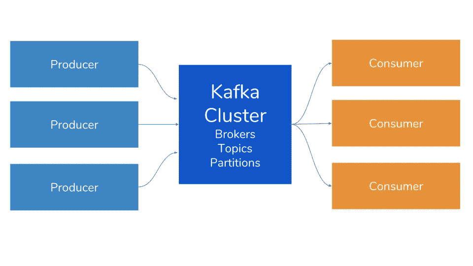
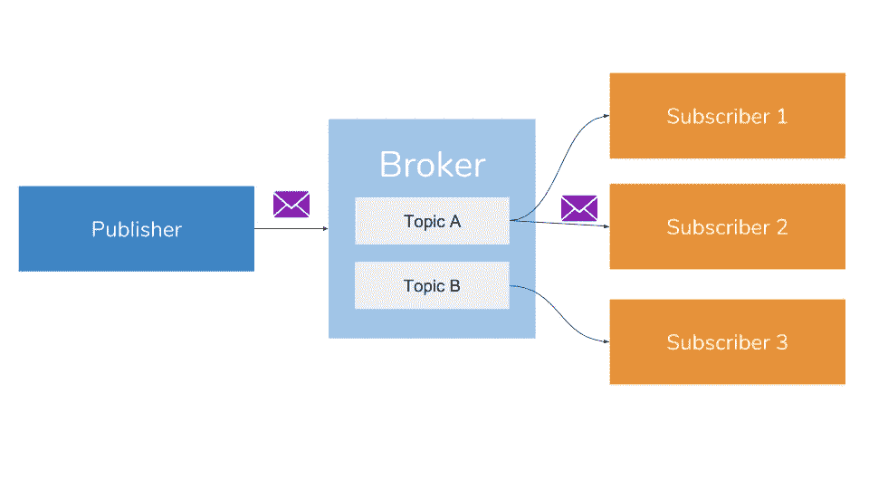
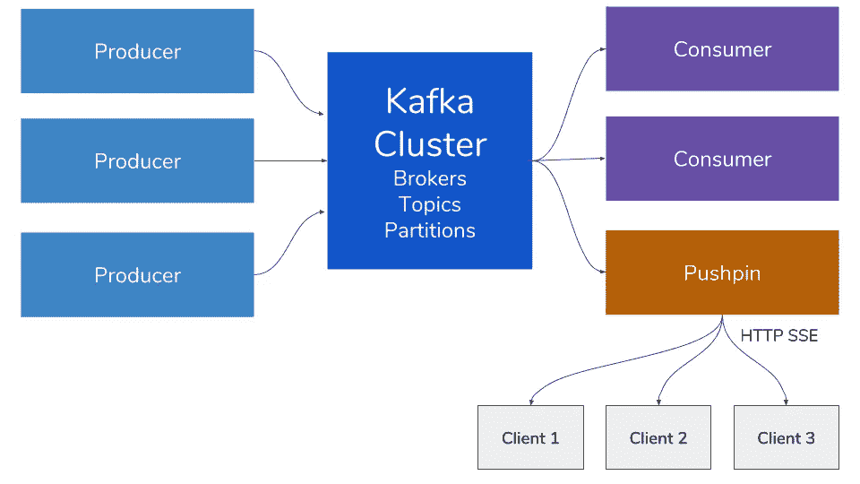

# 增强 Kafka——通过添加图钉实现实时网络流

> 原文：<https://medium.com/hackernoon/supercharging-kafka-enable-realtime-web-streaming-by-adding-pushpin-fd62a9809d94>

## 通过公共 HTTP 流 API 公开 Kafka 消息


[Matt Butler](http://butlerm.tumblr.com/post/131710073935/connecting-networks)

Apache Kafka 是为系统添加实时消息功能的新热点。其核心是一个开源的分布式消息传递系统，使用发布-订阅系统来构建实时数据管道。但是，更广泛地说，它是一个分布式的、水平可伸缩的提交日志。

在 Kafka 集群中，您将拥有主题、生产者、消费者和经纪人:



*   主题—一组邮件的分类
*   生产者——将信息推入卡夫卡的主题
*   消费者——从卡夫卡的主题中提取信息
*   卡夫卡经纪人——一个卡夫卡节点
*   卡夫卡集群——卡夫卡经纪人的集合

*这里深入探究卡夫卡*[T5](https://sookocheff.com/post/kafka/kafka-in-a-nutshell/)*。*

总的来说，Kafka 通过发布-订阅模型提供了快速、高度可伸缩和冗余的消息传递。



发布-订阅模型是一种消息传递模式，其中发布者将发布的消息分类到主题中，而不知道哪些订阅者会收到这些消息(如果有的话)。同样，订阅者表达对一个或多个主题的兴趣，并且只接收感兴趣的消息，而不了解发布者的任何信息([源](https://en.wikipedia.org/wiki/Publish%E2%80%93subscribe_pattern))。

# 卡夫卡的长处

作为一个信息系统，卡夫卡有一些变革的力量，这些力量催化了它越来越受欢迎

1.  **实时数据管道** —可以处理高流量的实时消息吞吐量
2.  **高吞吐量** —支持高速大容量数据(每秒 1000 个)的能力
3.  **容错** —由于其分布式特性，它对集群中的节点故障具有较强的抵抗力
4.  **低延迟** —毫秒处理数千条消息
5.  **可扩展性** — Kafka 的分布式特性允许您在不停机的情况下添加额外的节点，从而方便了分区和复制

# 卡夫卡的极限

由于其固有的架构，Kafka 没有优化为 API 消费者提供对实时数据的友好访问。因此，许多组织都不愿意公开他们的 Kafka 端点。

换句话说，如果您想使用传统协议(如 websockets 或 HTTP)，很难跨公共 API 边界公开 Kafka。

为了克服这个限制，我们可以将 Pushpin 集成到我们的 Kafka 生态系统中，以处理更传统的协议，并以更容易访问和标准化的方式公开我们的公共 API。

# 图钉+卡夫卡

服务器发送事件(SSE)是一种浏览器通过 HTTP 连接(在 HTML5 标准中标准化)从服务器接收自动更新的技术。Kafka 本身并不支持这个协议，所以我们需要添加一个额外的服务来实现这一点。

[Pushpin 的](http://pushpin.org/)主要价值主张是它是一个**开源**解决方案，支持实时推送——这是事件 API([GitHub Repo](https://github.com/fanout/pushpin))的必备条件。它的核心是一个反向代理服务器，使得实现 WebSocket、HTTP 流和 HTTP 长轮询服务变得容易。从结构上来说，图钉使用常规的、短期的 HTTP 请求与后端 web 应用程序进行通信。

集成图钉和卡夫卡为你提供了一些显著的**好处**:

*   **面向资源的 API** —为消费者提供更符合逻辑的面向资源的 API ，它与现有的 REST API 相适应。换句话说，您可以通过标准化的、更安全的协议公开数据。
*   **认证** —重用现有的认证令牌和数据格式。
*   **API 管理** —利用您现有的 API 管理系统或负载平衡器。
*   **web 层可扩展性** —如果您的 Web 用户数量大幅增长，那么扩展您的 Web 层可能比 Kafka 集群更经济、更高效。

在下一个例子中，**我们将通过 HTTP 流 API 公开 Kafka 消息。**

# 构建 Kafka 服务器发送的事件

这个[示例项目](https://github.com/fanout/kafka-sse-example)从 Kafka 服务读取消息，并使用 HTTP 上的服务器发送事件(SSE)协议通过流 API 公开数据。它是使用 Python & Django 编写的，并且依赖于 Pushpin 来管理流连接。



## 它是如何工作的

在这个演示中，我们在 Kafka broker 上放置了一个图钉实例。Pushpin 充当 Kafka 消费者，订阅所有主题，并将收到的消息重新发布给连接的客户端。客户端通过图钉收听事件。

更具体地说，我们使用 [views.py](https://github.com/fanout/kafka-sse-example/blob/master/kafka_events/views.py) 来建立一个 SSE 端点，而 [relay.py](https://github.com/fanout/kafka-sse-example/blob/master/kafka_events/management/commands/relay.py) 处理消息输入和输出。

1.  **首先，我们需要设置 virtualenv 并安装依赖项:**

```
virtualenv --python=python3 venv
. venv/bin/activate
pip install -r requirements.txt
```

**2。用卡夫卡和图钉设置创建一个合适的**`**.env**`**:**

```
KAFKA_CONSUMER_CONFIG={"bootstrap.servers":"localhost:9092","group.id":"mygroup"}
GRIP_URL=http://localhost:5561
```

**3。运行 Django 服务器:**

```
python manage.py runserver
```

**4。运行图钉:**

```
pushpin --route="* localhost:8000"
```

**5。运行** `**relay**` **命令:**

```
python manage.py relay
```

`relay`命令根据`KAFKA_CONSUMER_CONFIG`设置一个 Kafka 消费者，订阅所有话题，将收到的消息重新发布到 Pushpin，包装成 SSE 格式。

客户可以通过向`/events/{topic}/`发出请求(通过图钉)来收听事件:

```
curl -i [http://localhost:7999/events/test/](http://localhost:7999/events/test/)
```

输出流可能如下所示:

```
HTTP/1.1 200 OK
Content-Type: text/event-stream
Transfer-Encoding: chunked
Connection: Transfer-Encodingevent: message
data: helloevent: message
data: world
```

[**GitHub 上的回购**](https://github.com/fanout/kafka-sse-example)