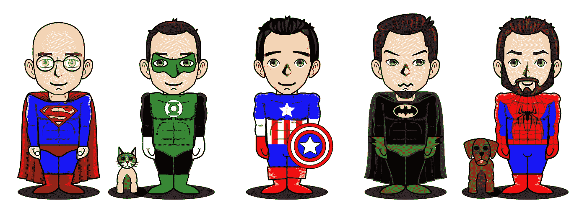
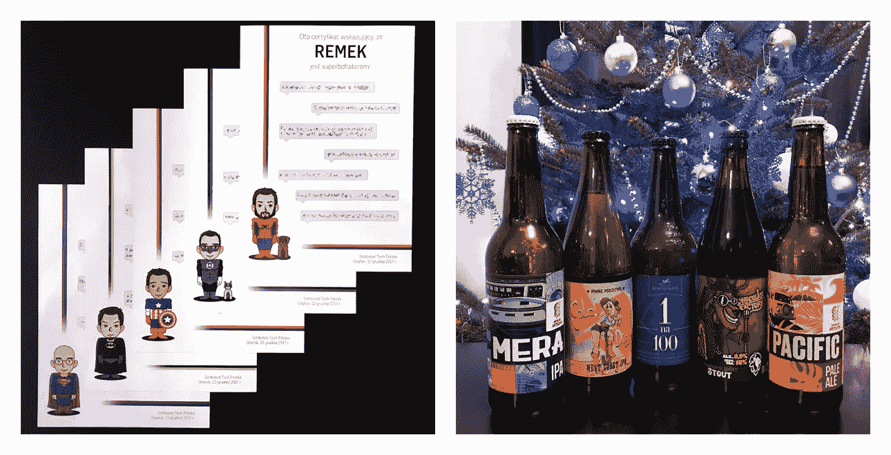
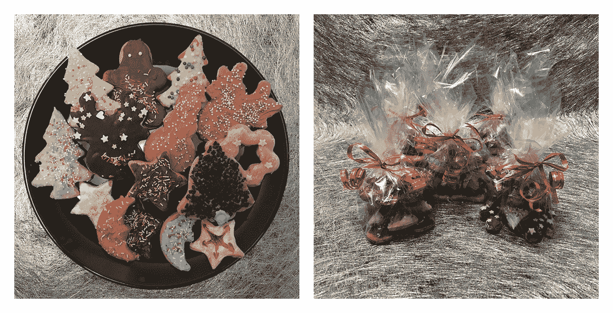
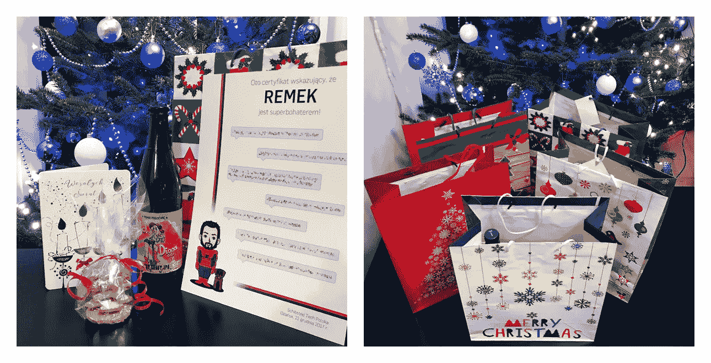

# 超级英雄的表演回顾

> 原文：<https://medium.com/hackernoon/superheroes-performance-review-530dfde22bad>

年底又是一个无聊的年度[业绩](https://hackernoon.com/tagged/performance)回顾？如果你的团队中有超级英雄，让他们觉得自己很特别——就像真正的超级英雄应该得到的那样。

Photo by ErikaWittlieb

我不得不说我相信绩效评估。一份好的绩效评估会让人感到被重视和重要，激励他们成长，帮助他们设定职业目标。但是，为了使它更好地发挥作用，需要正确地进行绩效评估。

我的[公司](https://hackernoon.com/tagged/company)是前段时间集团层面大重组的一部分。其中一个后果是，我们自己相当不错的绩效评估计划被一个新的计划所取代，在我看来，这个计划并不完全符合我们的工作性质。公司里的许多人并不热衷于做这件事，因此他们没有以适当的方式做这件事。对我来说，这感觉像是浪费时间。

此外，我的团队最近士气低落。由于许多我们无法控制的原因，我们正在进行的项目并不十分顺利。结果，我们开始感到紧张和沮丧。我想找些能鼓舞士气、让人们振作起来的东西。

我在工作中发现的一件突出的事情是和我一起工作的人。我发现我的团队是同类中最好的，我知道其他人也有类似的感觉。我认为年底是一个很好的机会来提醒我的队友们他们有多棒。我决定进行一次非同寻常的个人年度绩效评估。

## **获得反馈**

我从获取团队成员的个人反馈开始。在两周一次的一对一谈话中，我让每个人说一些关于团队中每个同事的事情。我说我需要它来帮助我进行年度绩效评估。

对我们的大脑来说，[坏情绪比好情绪更强烈，更令人难忘](http://assets.csom.umn.edu/assets/71516.pdf)因为我想鼓舞士气而不是打击士气，所以我只要求积极的反馈。我出乎意料地问了每个人，我没有给太多时间思考，因为我不想占用我的开发人员的宝贵时间，我认为这样的反馈会是最卑微的。

当男人们听到这个消息时，他们每个人都有相似的反应:“嗯……那很难”。他们认为他们不会成功。但最终，每个人都能够对其他团队成员说几句积极的话，而不需要想太多。为了帮助他们，我问了他们一些辅助问题:

1.  你喜欢他什么？
2.  他给你的印象是什么？
3.  他最近给你带来惊喜了吗？
4.  他最近帮过你什么吗？

令我惊讶的是，他们的反馈迅速、谦逊、广泛且富有创造性。我原以为他们会复制同样明显的观察结果，但事实证明他们的大多数观点都是独一无二的。这让我意识到，当你做个人评估时，征求他人对一个人的反馈可能是有价值和有帮助的——不同的人有不同的经历，在不同的问题上接触，指出并重视不同的行为。

当人们分享他们的反馈时，我会一本正经地把他们的话记在笔记本上。有时，我会问一些额外的问题，以明确他们的意思或获得更详细的意见。会议结束后，我重写了一些引语，让它们听起来更清晰，但我保留了它们的原意。以下是其中一些:

> 他是一个妥协的人。我们可以很容易地一起制定出好的解决方案。
> 
> 他给我留下了深刻的印象，他的热情，活力和他渴望职业发展的事实。
> 
> 你可以看到他关心交付一个伟大的产品。
> 
> 他是一个你可以永远依靠的人。
> 
> 他总是愿意花时间回答我的问题，这很酷。

## **证书**

我把每个人最有趣的引语写在纸上，并在标题上加上他们的名字。我的计划是将它们打印出来，并在年底分发给我的团队成员。

我意识到他们看起来很穷，我在想办法让他们看起来更漂亮。引文显示每个人都是独一无二的，都有一些超能力。一个想法闪过我的脑海，我会创建证书，说每个人都是超级英雄！我用一个[免费在线服务](http://superherotar.framiq.com/)画出了他们超级英雄的头像。超级英雄的选择相当随意，但在某些情况下，我基于一些显而易见的线索——例如，一个网络开发人员被描绘成蜘蛛侠。

Superheros’ avatars

我在证书上放了头像，并添加了一些简单的设计(尽我糟糕的设计技巧所允许的那样复杂)。我联系了当地的一家打印店，要求将它们打印在高质量的闪亮纸上。我想让它们看起来像真的证书一样专业。

## **礼物**

我知道我会在年底，就在圣诞节假期之前，把证书寄出去，所以我决定把它们作为更大的圣诞礼物的一部分。几乎每个开发人员都喜欢什么样的通用且价格合理的礼物？答案很明显:啤酒。

我已经和我的团队一起工作了 1 年多，在此期间我们一起喝了很多啤酒，所以我非常了解我的每个团队成员的啤酒风格偏好。我去了一家当地的精酿啤酒店，选择了每种啤酒风格中最好的一种——一个人一瓶。

Printed certificates and the selection of beers

由于这些即将成为圣诞礼物，我还想加入一些与圣诞节有关的东西。我和我的未婚妻有一个传统，就是每年圣诞节前烘烤和装饰姜饼。我决定在包里放一些美味的自制饼干。

Gingerbread cookies before and after wrapping up

我还为他们和他们所爱的人添加了圣诞卡，上面写着最美好的圣诞和新年祝福。我把所有东西都放在漂亮的圣诞礼品袋里。

A content of a bundle and all gifts together

## **交付**

我计划在圣诞假期前的最后一天送礼物。那天我们进行了一次 sprint 演示，在每次 sprint 演示之后，我们都会召开一次回顾会议(你可以在[我的博客文章](/@sskorc/7-cardinal-sins-of-retrospectives-419364a258c3)中读到我们是如何进行这些演示的，或者实际上我们在进行这些演示时试图避免哪些错误)。我认为这是展示惊喜的绝佳时机。

因为这是一个特殊的场合，所以我想举办一个特别的回顾会。我们以前做过一次[速配复古](/product-labs/get-more-personal-feedback-3fa7d7416388)，希望再试一次。这是实现这一目标的绝佳机会。在快速约会复古期间，我们专注于提供积极的、建设性的和具有挑战性的反馈。我相信它本身给了我们很好的鼓舞士气的机会，也很好地介绍了这个项目的主要部分。

在进行了复古训练后，我请大家多呆一会儿，我带了礼品袋。我做了一个简短的演讲，在演讲中我透露了在一对一的谈话中获得反馈的真正原因。我祝他们一切顺利，并给了他们礼物。他们感到惊讶和着迷。我相信，就在长时间的工作休息之前，它带来了一些微笑和赞赏，而且据我判断，它有助于提高士气。

## 结论

一些标准化的绩效评估程序有着复杂的表格和难以理解的问题，容易失去与人的接触，也不能为员工提供明确的利益。我们很容易忘记人和他们之间的关系是最大的资产。作为领导者和/或经理，我们需要尽一切努力来接纳他们的关系，并确保他们感受到被欣赏和被单独对待。有了好员工(我希望你们都有)，对所有人都有好处——他们、你、你的客户和公司。我相信会的。