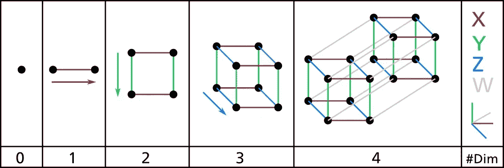
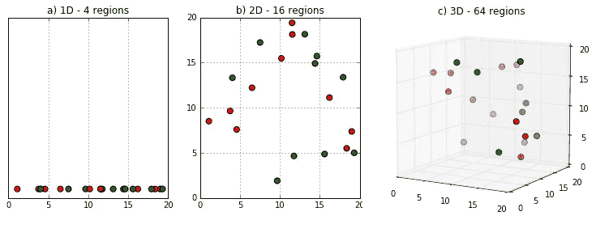
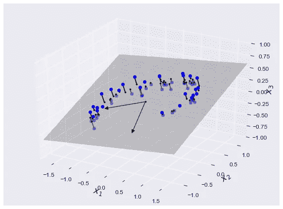
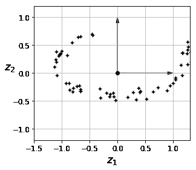
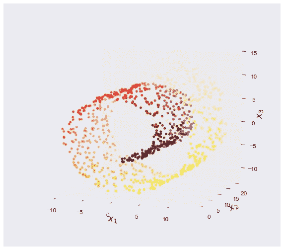
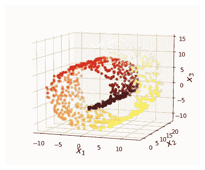
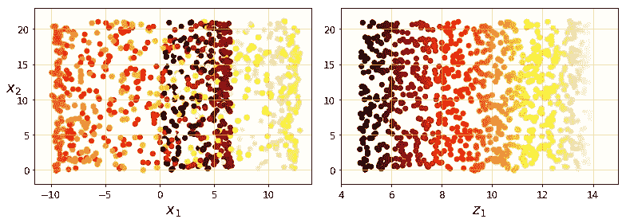
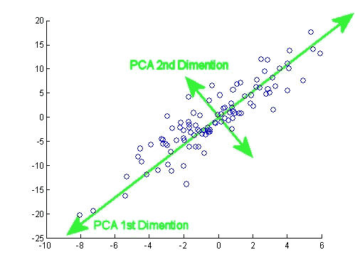
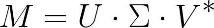
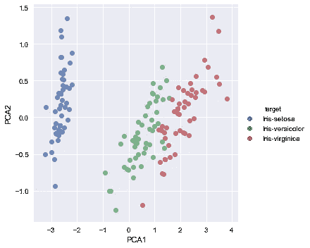

# 监督机器学习——降维与主成分分析

> 原文：<https://medium.com/hackernoon/supervised-machine-learning-dimensional-reduction-and-principal-component-analysis-614dec1f6b4c>

## 第二部分


Special thanks to a dear friend of mine, Katharine, for inspiring this series. May the lessons learned in this series guide even the warmest of hearts.

本文是系列文章的一部分。 [*此处检出 Part 1*](https://hackernoon.com/supervised-machine-learning-linear-regression-in-python-541a5d8141ce)*。*

# 介绍

*本系列的动机是让任何对机器学习领域感兴趣的人都能够* [*开发*](https://hackernoon.com/tagged/develop) *，理解并实现自己的机器学习算法。*

在[机器学习](https://hackernoon.com/tagged/machine-learning)问题中，每个训练实例通常涉及成千上万个特征。这可能是一个问题，因为它使我们的训练极其缓慢，容易出现[](https://hackernoon.com/supervised-machine-learning-linear-regression-in-python-541a5d8141ce)**(参见“过拟合”部分)*。这个问题通常被称为*****维度之祸** *。*****

****由于与****维数灾难**相关的问题，有必要大幅减少特征/维度的数量，以帮助提高我们模型的性能，并使我们能够为我们的机器学习模型达成最佳解决方案。幸运的是，在大多数现实生活问题中，通常可以减少训练集的维数，而不会损失太多数据中的方差。******

******例如，我们的一些数据点在解释我们想要的目标变量时可能完全没有意义。因此，我们可能更愿意把它们从我们的分析中去掉。而且，经常是两个数据点可能高度相关；因此，通过将它们合并成一个数据点，您不会丢失太多信息。******

> ******通过减少训练集的维度，我们可以提高训练的速度，并将数据集减少到二维或三维，从而更容易执行数据可视化(聚类、模式)。******

******在本章中，我们将探讨与***维数灾难*** *、*执行维数约简的各种方法( ***投影&流形学习*** )以及一种称为 ***主成分分析*** 的维数约简算法。******

# ******维度的诅咒******

******一个傻瓜曾经说过“救命救命！我好像看不到任何人！”智者回答说“因为你被困在了四维空间”，明白了吗？我也没有******

************

******Source: [Wikipedia](https://simple.wikipedia.org/wiki/Dimension)******

******事实证明，在高维空间中，会出现各种在低维空间中不会出现的现象。******

> ******最值得注意的是，随着数据集维度的增加，空间的体积增长如此之快，以至于可用的数据变得极其稀疏。******

******正如[奥雷连·杰龙](https://github.com/ageron/handson-ml)所指出的，如果你要在一个单位空间(1 x 1 平方)中选取一个随机点，它只有 0.4%的机会位于距离边界不到 0.001 的位置(换句话说，随机点极不可能“在任何维度上都是极端的”)。但是在一个 10000 维的单位超立方体(一个 1 x 1 x … x 1 的立方体，有一万个 1)中，这个概率大于 99.9999%。******

************

******Source: [Clever Owl](http://cleverowl.uk/2016/02/06/curse-of-dimensionality-explained/)******

******为了进一步强调这个问题，想象一下，如果你在一个单位正方形中随机选取两个点，这两个点之间的平均距离大约是 0.52。如果你被要求随机选择两个点，但是这次是在一个单位 3D 立方体中，平均距离大约是 0.66。对于 1，000，000 维的超立方体，这个距离大约是 408.25——这要归功于奥丽恩·杰龙[。因此，高维数据集通常存在极其稀疏的风险，这使得我们的模型容易过度拟合，并且比低维数据更不可靠。从而对我们的机器学习模型的性能产生负面影响。](https://github.com/ageron/handson-ml/blob/master/08_dimensionality_reduction.ipynb)******

> ******简而言之，训练集的维度越多，过度拟合模型的风险就越大。******

```
********Note:** One solution to the problem of *the curse of* *dimensionality* could be to increase the size of the training set such that it reaches a sufficient density of training instances. However, this solution is extremely impractical as the number of training instances required to reach a given density grows exponentially with the number of dimensions.******
```

# ******降维方法******

******有两种主要的降维方法，*投影*和*流形学习*。我们将在下面深入探讨这两种方法。******

# ******推断******

*******抓起一张纸，放在两个物体之间。就是这样！你学会投影了！*******

******值得庆幸的是，在大多数现实生活问题中，我们的训练实例并没有在所有维度上统一分离。我们观察到的大多数特征都遵循某种模式，这通常导致我们的特征要么是恒定的，要么是高度相关的。因此，所有训练实例实际上都可以映射到高维度的低得多的维度子空间。以这个三维空间为例。******

************

******Source: [handson-ml](https://github.com/ageron/handson-ml)******

******正如您所看到的，几乎所有的训练实例都位于一个平面附近:这个平面是高维(3D)空间的低维(2D)子空间。现在，如果我们将 ***项目*** 的每个训练实例垂直投影到该子空间上(如从小线条所见)，我们可以得到新的 2D 数据集。就是这样！我们刚刚将一个高维(3D)空间缩减为一个较低的二维空间。轴的投影现在将对应于新特征，通常表示为 *z* 1 和 *z* 2(平面投影的坐标)。******

************

******Source: [handson-ml](https://github.com/ageron/handson-ml)******

```
********Projection****Original Dimensions** --> [x1, x2, x3] (*3-Dimensions*)**Projection Dimensions** --> [z1, z2] (*2-Dimensions*)**Note:** This various depending on the dimensions of your data set. For our example, we have used a 3D data set and reduced the dimensions to 2D, as it is easier to visualise. However, if you have more dimensions in your training and after reduction, you have k-dimensions. Your coordinates would be denoted as (z1, z2...zn) for all n dimensions in k******
```

## ******弱点******

******而投影法在进行降维时简单有效。如果我们在我们的维度子空间中有重叠的实例，简单地将我们的实例投射到一个超平面可能会导致重要信息的丢失。就拿这个从 Sci-kit Learn 引进的[瑞士卷](http://scikit-learn.org/stable/modules/generated/sklearn.datasets.make_swiss_roll.html)来说吧。******

************

******如果我们只是将一个 2D 平面投影到这个 3D 空间上(*例如，通过放下 x3* )，它将简单地将各个层挤压在一起，并丢失我们想要捕捉的所有信息。相反，我们想要的是展开瑞士卷，以获得 2D 数据集，如果我们能够捕捉几乎所有的方差，而没有太多的信息损失。这种技术被称为流形学习。******

# ******流形学习******

******一个人曾经说过“我如何在一天内游遍一个城市？”导演回答说“通过雇佣一个 CGI 人员，并让他展开城市”——因此多面学习诞生了。—哈哈……******

******简而言之，流形学习是指我们弯曲和扭曲高维空间，使其可以映射到低维空间，其中高维空间可以在低维空间中局部相似。这种技术通常是机器学习中最常用的方法，因为它使算法能够找到减少数据集维度的最佳流形。例如，在我们的瑞士卷的例子中，算法的目标是学习展开我们的瑞士卷的最佳方式，使我们能够相对于它的原始维度空间捕捉尽可能多的信息。******

************************

******Source: [handson-ml](https://github.com/ageron/handson-ml)******

## ******弱点******

******流形学习未能提高我们模型的准确性的地方是当手头的任务在低维子空间中表达时并不简单。这样，如果我们要减少训练集的维数，数据集的解释能力相对于它的原始维数会减少。******

> ******一般来说，如果你有一个超过 3 维的数据集，通常情况下，降维算法将有利于提高模型的性能。******

# ******主成分分析******

******主成分分析 **(PCA)** 数据科学领域最重要的算法之一，也是迄今为止当今最流行的降维方法。主成分分析的目标很简单，识别一个最接近数据点的超平面，并将数据投影到其上。******

************

******Source: [leonardoaraujosantos](https://leonardoaraujosantos.gitbooks.io/artificial-inteligence/content/principal_component_analysis.html)******

# ******保持我们的差异******

******当在低维超平面中映射我们的原始数据集时，我们首先必须确定正确的超平面。在主成分分析中，超平面在大多数情况下由穿过我们数据集的轴来确定，这保持了最大的方差。******

************

******Source: [prachimjoshi](https://prachimjoshi.wordpress.com/2015/07/23/principal-component-analysis-part-1/)******

******我们希望选择在数据集中保留最大方差的轴，因为与考虑其他投影相比，它很可能会丢失较少的信息。在这种情况下，我们选择的轴被称为**主成分**，也被称为 **PCA1** ，因为它捕捉了我们数据集内的最大方差，第二个主成分与第一个主成分正交，因为它占了我们数据集中最大的剩余方差，表示为 **PCA2** 。******

```
********Note:** In real life we are more likely to work with higher dimensional data sets. As a result, we may need to include addition Principal Components in order to capture the more of the variance in our data set. Thereby, increasing the performance of our Machine Learning algorithm. However, for the purpose of visualisation, only necessary to take two Principle Components for visualisation; and in some cases three.**Data Visualisation:** [PCA1, PCA2 and/or PCA3] 2 or 3 Dimensions**Machine Learning:** It is preferred in most machine learning problems to capture at least 95% of the training set's variance. Thus, it is not necessary to stick with 2 or 3 Principal Components.******
```

# ******主成分******

******有各种各样的技术可以用来寻找我们的主要组成部分。然而，寻找我们的主成分的最常见的方法被称为**奇异值分解(SVD)** 。事实证明，如果您执行一种称为奇异值分解( **SVD** )的基本矩阵分解技术，将训练集矩阵 X 分解为三个矩阵的点积，我们的第三个矩阵 V*实际上包含了我们正在寻找的所有主分量。******

************

```
******Where:**M =** m × n matrix whose entries come from a field, where either field consists of real numbers or complex numbers.
**U  =** a *m × m* unitary matrix. (left singular vector)
**Σ  =** *m* × *n* diagonal matrix with non-negative real numbers.
**V  =** *n* × *n* unitary matrix. ( right singular vector)
**V*  =** conjugate transpose of the *n* × *n* unitary matrix.For those whom are interested in the full mathematics in Singular Value Decomposition(SVD). [Here is a good link](https://www.youtube.com/watch?v=mBcLRGuAFUk)******
```

# ******履行******

******对我们的数据集进行主成分分析非常简单。我们只需调用 Sci-Kit Learn 中的函数 **PCA** 。******

```
********from** sklearn.decomposition **import** PCA

pca = PCA(n_components = 2)
X2D = pca.fit(X).transform(X)******
```

******在拟合数据集之后，我们可以将数据集转换成一个 **Pandas DataFrame 对象**，并带有各自的标签 **(PCA1，PCA2)。********

```
******df = pd.DataFrame(X2D,columns = ['PCA1','PCA2'])******
```

******然后我们可以把主要成分绘制到散点图上。为了简单起见，我使用了一个名为 **Seaborn** 的库。******

************

******从散点图中，很明显，我们可以看到我们的主成分聚类。这表明我们的数据集中存在可以解释我们的目标变量的方差。最值得注意的是，如果我们想要检查每个主成分的解释方差，Sci-Kit Learn 有一个方便的函数，名为**explained _ variance _ ratio**，它为我们提供了每个主成分的解释方差的信息。让我们调用它！******

```
******pca.explained_variance_ratio
array([0.82,0.15])******
```

> ******这告诉我们 82%的方差位于第一个轴上，******
> 
> ******12%位于第二轴上，******
> 
> ******其余的方差在其他主成分中获得。******

******当我们希望在高维数据集中执行数据可视化任务时，这种方法非常有效。然而，当我们建模时，我们经常希望在我们的训练集中捕获一定比例的方差。******

> ******作为一般规则:我们通常倾向于在我们的训练集中捕获至少 95%的方差。******

******为此，我们只需将 n_components 参数从一个整数更改为一个介于 0.0 到 1.0 之间的浮点数，表示我们希望捕获的方差比率:******

```
******pca = PCA(n_components = 0.95)
X = pca.fit_transform(X_train)******
```

# ******恭喜你！您已经涵盖了降维和主成分分析的所有基本原理！！******

> ******哇，一天要学的东西太多了！我们刚刚讨论了机器学习的一些重要概念。我希望你对降维有了更多的了解，并在你的下一次冒险中看到它的力量。******

******以下是我们所学内容的简要总结:******

*   ******什么是****维度诅咒**********
*   ******我们可以用来**减少维度**诅咒**影响**的方法。值得注意的是:**投影&流形学习********
*   ****各种**降维方法**的**弱点******
*   ****介绍**主成分分析**和**的工作原理******
*   ****如何**实现主成分分析******

## ****如果你喜欢这篇文章，请👏并分享给你的朋友。记住，你最多可以鼓掌 50 次——这对我真的很重要。****