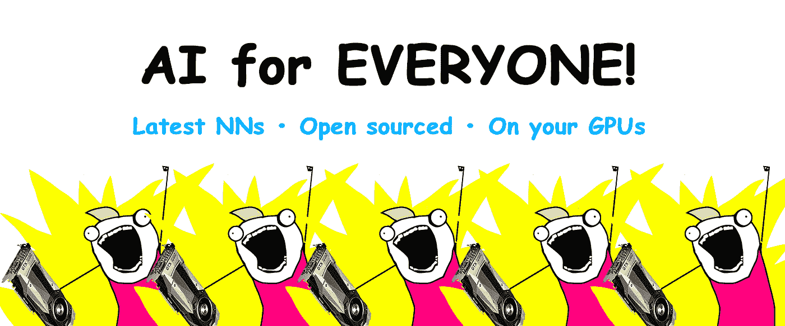
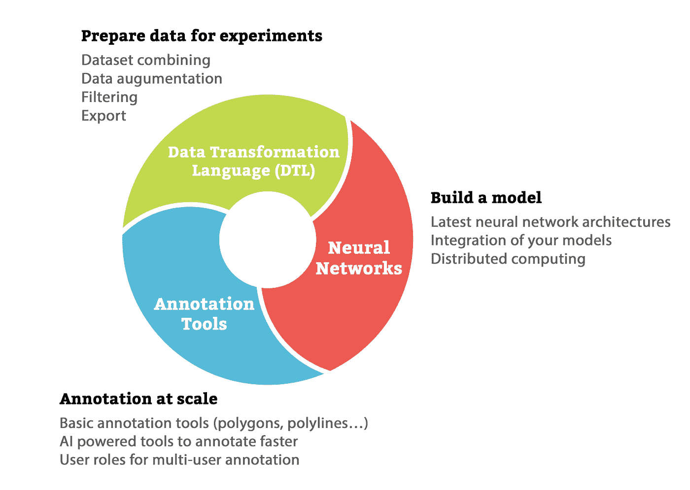
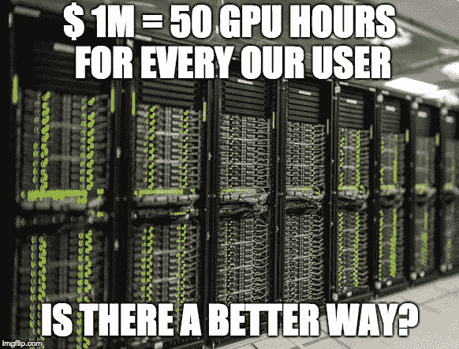
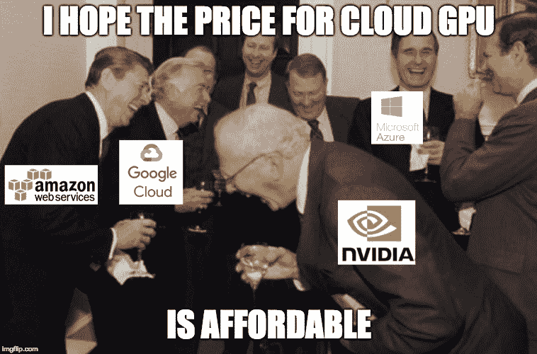
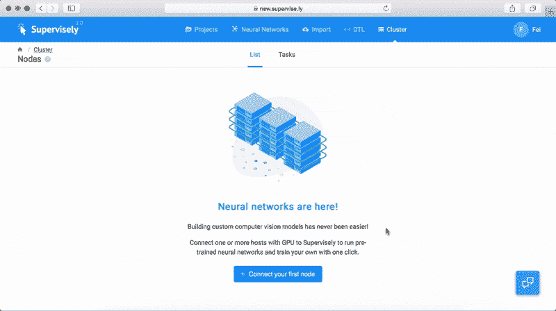

# 🤖超级超越注释—开箱即用的最新深度学习模型

> 原文：<https://medium.com/hackernoon/supervisely-goes-beyond-annotation-latest-deep-learning-models-out-of-the-box-144bc372d6f6>

自从我们在 2017 年 8 月首次发布以来，围绕[超级](https://supervise.ly/)发生了许多惊人的事件。社区在不断发展，今天大约有 5000 人在使用我们的平台。我们已经走了很长的路，收到了积极的反馈，实现了新功能，修复了错误，现在更好地了解了人们的需求。

Supervisely makes AI available for everyone

# 解决 GPU 难题

但是有一件事让我们很难过:

> 长期以来，与企业版相比，社区版仍然非常有限。我们的企业客户有机会使用 Supervisely 作为一个完整的计算机视觉平台，而 Community Edition 更像是一套注释工具。为什么还不够？

当你构建一个 AI 产品时，你必须逐一经历三个主要阶段——注释、数据准备和神经网络构建。如果一个阶段缺失或效率低下，开发过程将会大大减慢。

Supervisely 旨在涵盖以下主要阶段:

Fundamental concepts behind Supervisely

在我们的情况下，社区版中缺少神经网络模块，用户体验不完整。但是我们设法找到了解决办法。

# 最后一块

今天，我们很高兴地宣布我们的计算机视觉平台的最后一部分——现在每个人都可以在监督下训练和运行最新的神经网络。

为了让它成为可能，我们必须克服一个巨大的挑战:“**我们从哪里获得大量的 GPU 资源，以便我们的社区可以使用神经网络？**

这个解决方案本身被证明是微不足道的——我们已经让连接你自己的个人电脑或云电脑变得极其容易。只需在您的终端运行一个命令，安装超级代理，并立即开始试验神经网络:UNet V2，YOLO V3，fast-RCNN，Mask-RCNN，DeepLab V3 和许多其他人已经在那里，还有更多人即将到来。

我们的“GPU 难题”解决方案具有以下优势:

## **1。免费的！**

我们给了英伟达太多权力——他们[禁止](https://wccftech.com/nvidia-geforce-eula-prohibits-datacenter-blockchain-allowed/)数据中心在服务器中使用更便宜的 GeForce 显卡。现在，云中的 GPU 会让你付出昂贵的代价。Pascal 架构的高端 GTX 1080 Ti 比 AWS 中单个 p2.xlarge 一个月的费用还便宜。

聪明点，使用裸机——没关系，我们个人知道很多大公司都这么做。但是，同样，如果您手头没有 GPU，您可以在 AWS 或 Azure 中部署代理。

## **2。无锁定**

谷歌、亚马逊、微软——它们都提供云人工智能服务。问题是，本质上，他们强迫你使用他们的计算资源，在他们的服务器上存储你的数据，使用他们的软件——来永远留住你。

有了 Supervisely，你可以在任何你想要的地方运行模型和存储数据——可能是你的本地 PC 或 AWS 服务器——选择权在你。

## **3。GPU 的有效使用**

你有没有过那种不满足的感觉，太多的研究想法没有被测试？不再是了！连接任意多的计算机，使用各种数据样本或训练元参数运行训练过程，然后汇总和评估结果。

换句话说，将计算机连接到你的私人计算集群，进行大量的实验，而不需要任何成本。

## **4。可重复研究**

基于神经网络构建计算机视觉产品意味着大量的实验，尤其是在开发的早期阶段。这些实验包括尝试以不同的方式注释对象，使用不同的神经网络架构，了解如何更好地扩充数据等等。

Supervisely 被设计用来跟踪用户进行的实验。因此，用于数据转换、训练元参数的脚本以易于查看和再现的方式保存和组织，从而产生“最准确的模型”。

不够？我们还有一个惊喜给你。

# 超级开源

我们开源( [github link](https://github.com/supervisely/supervisely) )我们拥有的每一个 NN，像 DTL 这样的工具，我们的 python 库，当然还有代理。但是你为什么要这么麻烦呢？以下是几个原因:

## **1。单一格式统治一切**

深度学习社区很牛逼。每周人们都分享最新的 NNs。更好，更快，更强！

但是要花很多时间去弄清楚如何使用它们。因为开源项目没有标准化:它们使用不同的数据格式和训练/推理过程。而且不幸的是，有时候这些项目有很难发现的 bug。

我们为您改编最流行的神经网络——我们发布的每个模型都是标准化的，并在真实项目中经过测试，重写为单一格式，以便与主管一起工作。即使你根本不想使用 Supervisely(但是为什么？)，还是很好的收集了现成的最好的模型。

拿走吧。

## **2。安全第一！**

预防胜于治疗。你不必信任我们，在你的电脑上运行一些命令——通过代理开源，你可以自己检查代码，并看到没有隐藏的部分:我们不会去挖掘一些甜甜圈，我们根本不碰你的电脑。

## **3。定制型号**

最好的部分——你不局限于我们提供的模型:使用 Supervisely 库，你可以实现任何你想要的架构，并将其作为 Docker 映像添加到 Supervisely 中。呜呜呜。现在，只需点击一下鼠标，您就可以运行它，跟踪实验，尝试不同的数据集和数据增强策略，这是您喜欢监管的一切。

当然，您的模型是您的——将它们推送到私有注册中心，并在环境变量中提供凭证:我们对它没有任何访问权。或者分享给社区。

## 其他改进

除了神经网络支持和错误修复，这个版本还有很多新的很酷的特性，比如:

*   可共享链接
    现在你可以通过简单的链接在账户间共享你的项目和神经网络。共享机制就像谷歌文档一样简单。你创建一个可共享的链接，并把它给任何你想要的人。用户点击链接后，相应的项目或模型被复制到他的帐户。
*   **简化的用户权限** 新的权限控制允许创建多个用户，并授予他们对选定数据部分的细粒度访问权限。
*   **可定制的热键** 现在注释工具变得更加方便——每个动作现在都有一个热键，您可以随时重新分配，使您的工作流程完全符合您的要求。

# 如何开始

## **安装**

要开始在您的项目中使用神经网络，请执行以下步骤

**第一步**。前往 [new.supervise.ly](https://new.supervise.ly/) 报名
**第二步**。按照[中的步骤](https://docs.new.supervise.ly/cluster/add_delete_node/add_delete_node/)在装有 gpu 的机器上安装代理。

在那之后，你的 gpu 机器被超级连接，可能被用来运行训练/推理任务。

## **教程**

最简单的开始方式是一步一步地浏览我们的教程。我们建议从下面这个开始:[使用 UNet V2 的多类图像分割](https://docs.new.supervise.ly/neural-networks/examples/unet_lemon/)(本教程的“柠檬数据集”可在“导入”——>“数据集库”中获得)。

下面是带有玩具示例的教程列表，将有助于理解基本概念并亲自训练最流行的深度学习模型。

*   [使用 UNet V2 的多类分割](https://docs.new.supervise.ly/neural-networks/examples/unet/)(血管分割)
*   [使用 PSPNet 进行多类分割](https://docs.new.supervise.ly/neural-networks/examples/pspnet/)(柠檬/猕猴桃分割)
*   [使用 Deeplab V3 进行多类分割](https://docs.new.supervise.ly/neural-networks/examples/deeplab/)(柠檬/猕猴桃分割)
*   [使用掩模 R-CNN 的多类实例分割](https://docs.new.supervise.ly/neural-networks/examples/mask_rcnn/)(柠檬/猕猴桃分割)
*   [使用 YOLO V3 的多类物体检测](https://docs.new.supervise.ly/neural-networks/examples/yolo_v3/)(柠檬/猕猴桃检测)

以下是针对更复杂的真实案例的教程:

*   [快速人物检测](https://docs.new.supervise.ly/cookbook/real-world-use/fast-person-detection/fast-person-detection/)
*   [自动道路分割](https://docs.new.supervise.ly/cookbook/real-world-use/auto-roads-segm/auto-roads-segm/)
*   [NNs 和不规则图像尺寸](https://docs.new.supervise.ly/cookbook/real-world-use/irregular-image-size/irregular-image-size/)
*   [如何使用中性类](https://docs.new.supervise.ly/cookbook/real-world-use/neutral-class/neutral-class/)
*   [卫星图像](https://docs.new.supervise.ly/cookbook/real-world-use/satellite-imagery/satellite-imagery/)
*   [通过分割对象边界找到实例](https://docs.new.supervise.ly/cookbook/real-world-use/instance-boundary/instance-boundary/)
*   [无人机如何分析电力线](https://docs.new.supervise.ly/cookbook/real-world-use/powerlines/powerlines/)

我们相信你会在那里发现很多有趣的东西。

# 后手稿

超级监管的新版本仍在测试中，所以一些问题是可能的。为了尽可能平稳的过渡，我们在一个新的链接下发布了它:[**new . supervise . ly**](http://new.supervise.ly/)。您的帐户已经在那里，所以只需登录，附加一个代理，并开始试验神经网络！测试后，我们会将您的数据集从以前的版本迁移到新版本。

反馈和建议将不胜感激！如果您有任何技术或一般问题，请随时在我们的[空闲时间](https://supervise.ly/slack)提问。

如果你觉得这篇文章很有趣，那么让我们也来帮助别人吧。如果你给它一些，更多的人会看到它👏。