# 🎉Supervisely v2.0:通过深度学习增强您的训练数据管道

> 原文：<https://medium.com/hackernoon/supervisely-v2-0-supercharge-your-training-data-pipeline-with-deep-learning-ab95bed3a57f>

超级帮助公司、研究人员、工程师、学生和许多其他人为各种计算机视觉任务(从行人检测到肿瘤分割)制作和准备训练数据。我们很高兴看到超过 2000 人正在使用 Supervisely。非常感谢每个帮助改进它的人！

今天，我们宣布超级监管 2.0:它现在是公开的，这是一个大事件！因此，我们很高兴推出一些令人兴奋的新功能，希望每个人都会喜欢。

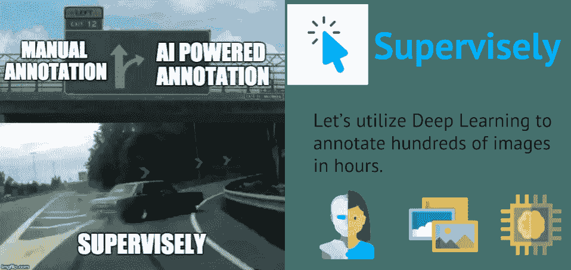

这篇文章的目的是宣布新的功能，并讲述更多关于 Supervisely 如何使用深度学习来改变为深度学习创建训练数据的方式。

对于那些认为计算机视觉具有战略重要性并准备投资生态系统为他们当前和未来的人工智能产品进行大规模图像注释的人来说，这将是特别感兴趣的。

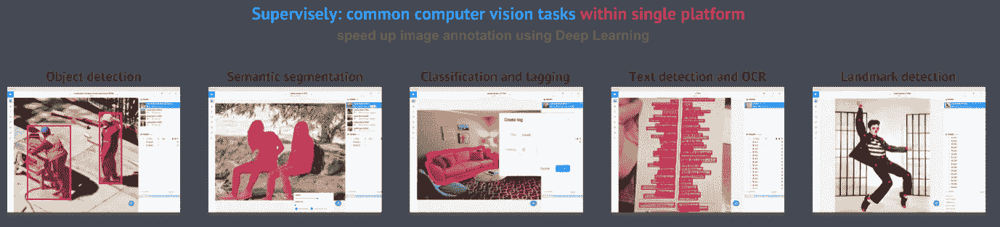

## 监管到底是什么？

深度学习会一直存在。训练数据越多，人工智能越聪明。我们的使命是为公司提供尽可能高效地执行图像注释的工具。

在宣布新功能之前，我想给你展示几个 Supervisely 可能的使用场景。

Use case: image annotation with AI powered tools

第一个用例非常简单。上传您的数据，并使用我们的[人工智能工具](https://hackernoon.com/%EF%B8%8F-big-challenge-in-deep-learning-training-data-31a88b97b282)开始手动注释，这些工具专门处理语义分割任务的注释过程。注释完成后，您可以下载所需格式的图像和注释。

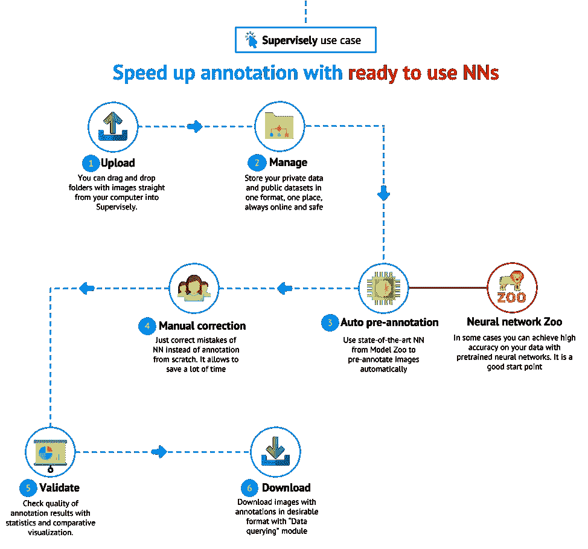

Use case: speed up image annotation with ready to use NNs

第二个用例说明了来自 Model Zoo 的预训练神经网络的使用。在用户上传图像后，他可以将神经网络应用于数据集进行预注释。有大量的例子，其中可以使用现成的模型来加速注释过程:即，用边界框检测建筑区域中的工人，或者在自拍图像上分割人。

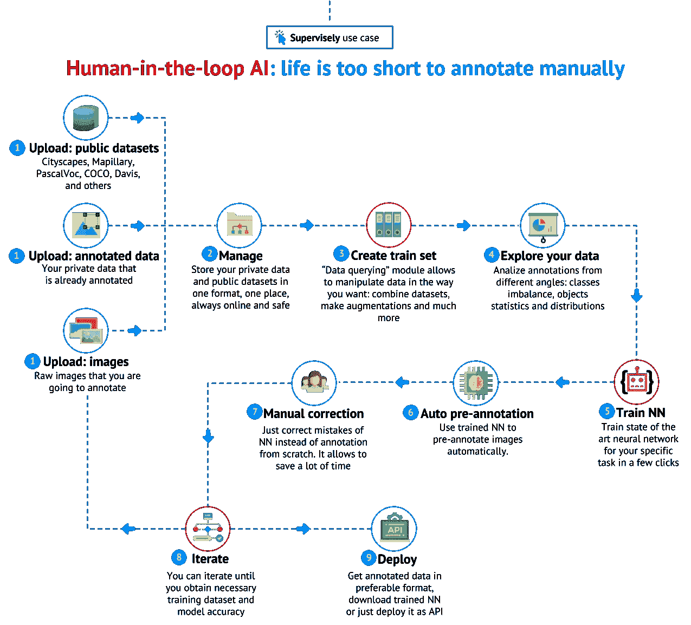

第三个用例展示了人在回路中的人工智能方法。用户可以为他的自定义任务训练神经网络，然后使用这个神经网络预先注释图像。那么用户应该只纠正 NN 预测。并且这个过程是迭代的。随着时间的推移，神经网络变得越来越智能，注释的数据越来越多，注释的过程也越来越快，用户可以一遍又一遍地重复这个过程，直到获得必要的精度。因此，用户既可以获得带有高质量注释的大数据集，也可以获得针对自己特定任务的精确神经网络。

## 超级 2.0 版:神经网络

现在有可能在没有任何编码的情况下，在管理内部使用最先进的神经网络。

让我们考虑语义分割的例子，以更好地理解其背后的动机。目前，语义分割是计算机视觉领域的关键问题之一。纵观全局，语义分割是为完整的图像理解铺平道路的高级任务之一。

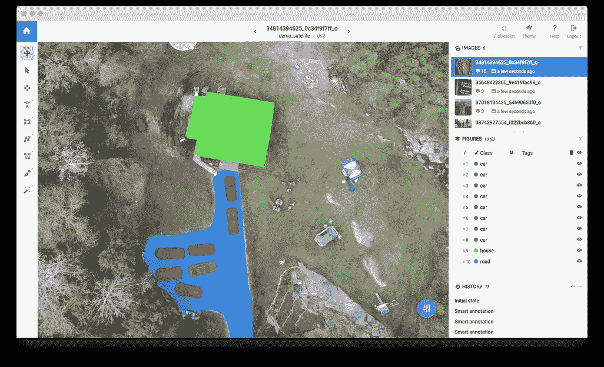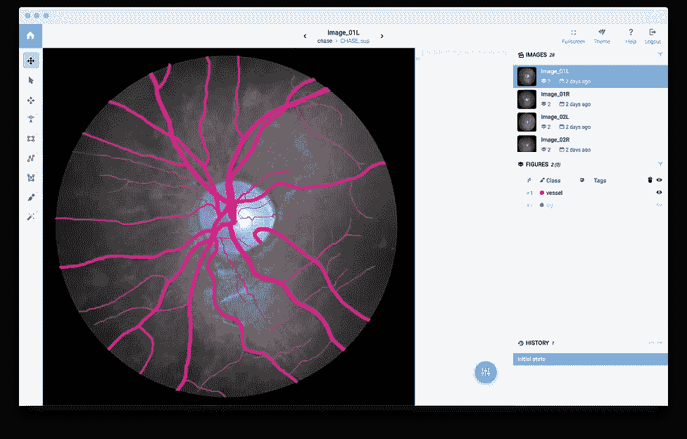

Example of semantic segmentation: have to assign each pixel in the image an object class. Left: satellite image. Right: retina vessels.

在深度学习接管计算机视觉之前，人们使用的是不太准确的经典计算机视觉方法。几年前，很难预测哪种方法应该应用于您的特定细分任务。要回答这个问题，你必须有这个领域的专业知识，并做大量的研究。

但现在情况正好相反。有很多关于语义分割的基准和文献。对于大约 80%的业务任务，应该使用什么样的神经网络架构显然就足够了。

因此，我们决定集成最先进的神经网络架构及其针对不同计算机视觉任务的预训练权重，例如:对象检测、语义分割、实例分割、文本检测、OCR、分类和标记。

现在，没有任何特殊知识的用户可以利用深度学习的能力来完成广泛的现实世界任务。

我们介绍神经网络模块。我们增加了能力:

*   使用 model zoo 中的即用型 NNs
*   在系统内部用你的数据训练他们
*   以分布式方式将它们(推理)应用于您的图像并预览预测
*   只需点击几下鼠标就可以将它们部署为 API 服务

## 超级 2.0 版:数据转换语言(DTL)

数据科学家花费大量时间准备训练数据集。诸如数据集合并、类映射、对象和图像过滤以及各种数据扩充等常规任务在管理上是自动化的。

我们有数据转换语言(DTL)模块，允许以简单的 json 格式定义计算图形。这个配置文件用来告诉管理员你想要如何处理图像和它们的注释。

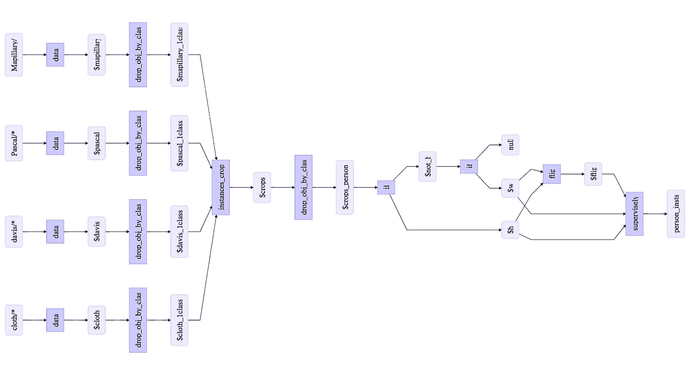

Example of computational graph

生成大量增强的训练数据集是一种常见的做法。此类数据集可能包含数百万张图像，生成过程可能需要数小时或数天。

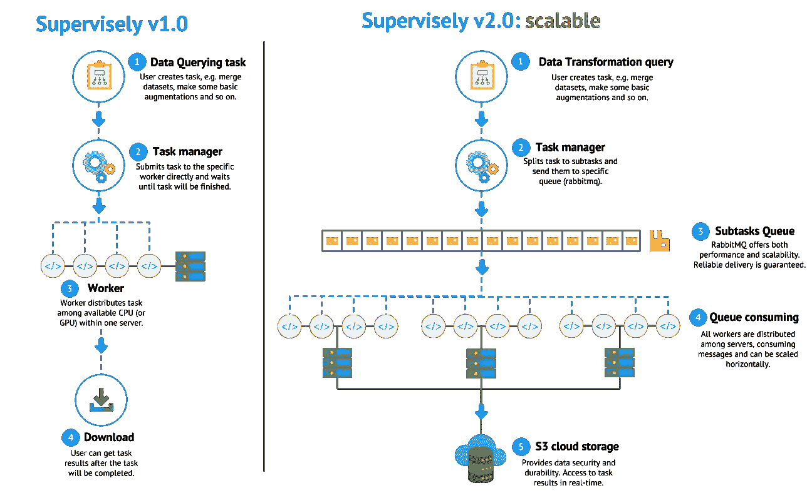

How tasks are distributed in Supervisely v2.0

新版本不仅可以在一台计算机内的核心之间分发，还可以在集群中的多个节点之间分发。这一改进将有助于我们将处理时间从几个小时大幅减少到几分钟。它使得实验更快更便宜。

## 超级 2.0 版:数据上传

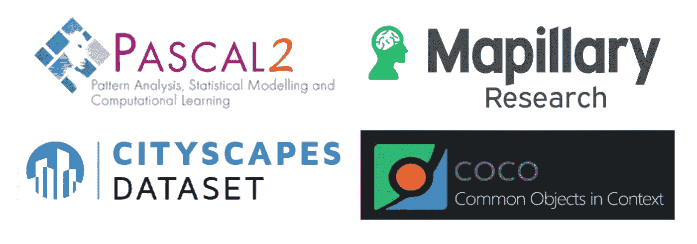

我们增加了支持上传的公共数据集的数量:Pascal、COCO、mapi pile、Cityscapes、CamVid、Davis 等

现在，您可以将所有数据导入系统，并以一种格式保存。我们通过添加散列来加速上传过程。如果图像已经在我们的系统中，我们不会在云存储中存储它的副本。因此，对于所有公共数据集，上传时间很快。只需拖放带有图像和注释的目录，Supervisely 就会完成剩下的工作。

## 超级 2.0 版:协作

许多公司需要大规模地执行注释:当多个用户同时注释图像时。我们公开了这个特性，因此用户可以在一个工作空间中创建并处理共享数据。管理员可以为每个用户设置访问权限，并监控质量和生产力。

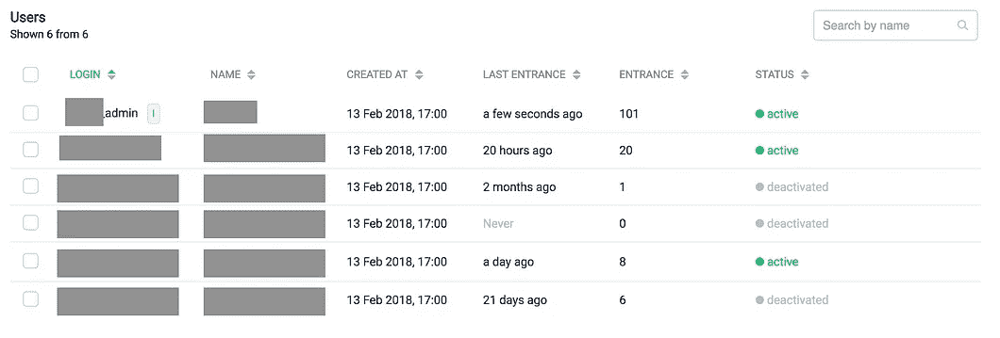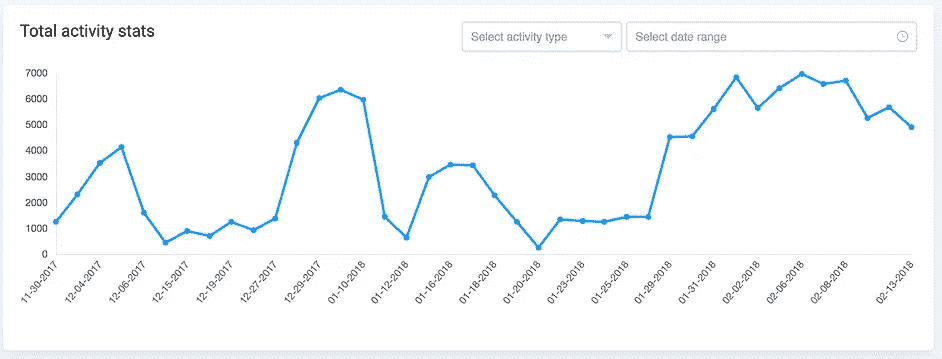

Example: users in one workspace, user activity stats

## 超级 2.0 版:比以往任何时候都更适合企业

为了将所有东西放在一起，我们必须对我们的技术体系进行一些改变。

我们已经将所有数据从我们的网络服务器转移到谷歌云，以加强安全性和可访问性。那些正在寻找自托管解决方案的人现在可以选择将你的图像存储在现有的 S3 兼容云上(或者只是将数据保存在裸机上)，这可以在 supervise ly[Enterprise Edition](https://supervise.ly/enterprise)(EE)中获得。

运行多个数据转换任务，神经网络训练和推理是一项具有挑战性的任务:现在我们在 RabbitMQ 和 Kubernetes 的帮助下将任务分配给工人。

当涉及到将软件部署到服务器时，Docker 是一个方便的解决方案，但它也是一个很好的工具来标准化我们模型动物园中的几十个模型:我们有基于 Caffe、PyTorch、Tensorflow(当然！).为了让这个动物园井然有序，我们实现了一个非常简单的 API，以便超级管理员可以与模型通信，并将所有必要的库打包到一个 docker 映像中。现在，我们可以连接我们的私有注册表并使用图像名称进行操作——就这么简单！顺便说一句，你也可以——在企业版中，你可以连接你自己的 docker 注册库，然后直接从 Supervisely 界面训练和运行模型。

## 结论

深度学习对所有行业来说都是至关重要的技术。Supervisely 旨在满足业务需求。它涵盖了大规模的端到端深度学习工作流:管理数据，人工智能支持的注释，训练，评估和部署定制的神经网络。

PS。由于对新版本的高需求，我们不得不限制免费访问我们的 GPU 实例。因此，如果你有兴趣尝试[supervise . ly](http://supervise.ly)的新功能，你可以请求访问。如果您有任何技术或一般问题，请随时在我们的[休闲](https://supervise.ly/slack)中提问。

如果你觉得这篇文章很有趣，那么让我们也来帮助别人吧。如果你给它一些，更多的人会看到它👏。