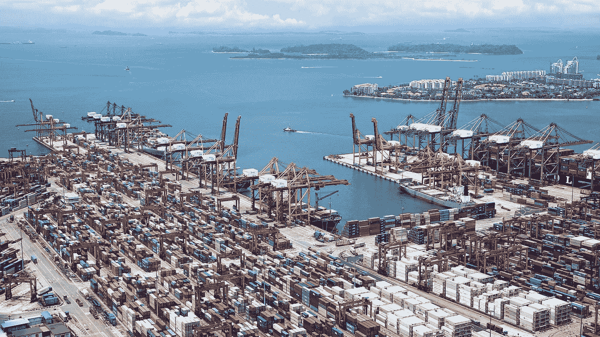
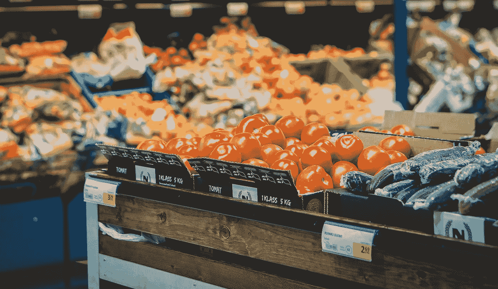
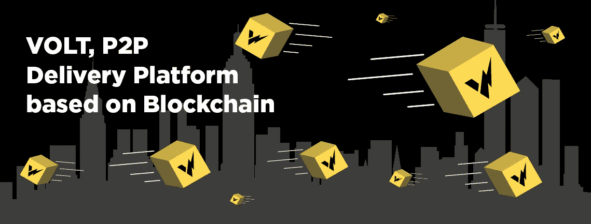

# 供应链和区块链——将它们联系在一起的公司

> 原文：<https://medium.com/hackernoon/supply-chain-and-blockchain-the-companies-linking-them-together-1cdfefa79320>

在为总部位于区块链的最后一英里配送平台 [VOLT](http://www.volttech.io) 工作了一段时间后，我对区块链如何改革供应链进行了大量研究，坦率地说，供应链是多么需要改革。

这不仅仅是更有效地跟踪货物，尽管这是一个重要的考虑因素，这也是关于如何降低成本和增加对客户的透明度。

在运输行业，每天都有数十亿美元被金融纠纷套牢，而发票可能需要一个多月才能支付。如此多的时间和金钱浪费在像这样不可避免的事情上，我想看看一些公司，它们试图通过节省我们的时间、金钱、环境甚至我们的生活来改变现状。

# CargoX

航运/货运业是地球上最大的行业之一，处理全球 80%以上的货物交易。因此，有些人可能会惊讶地发现，纸质文件仍然是该行业收货流程的重要组成部分。

提货单(B/L)是一种既能确保进口商收到预期货物又能确保出口商得到付款的文件。它用于确认任何货物的内容，并作为货物收据、货物已售出的合同证明或货物所有权。

可以想象，考虑到每天运送到世界各地的巨大数量，继续用手工和纸张来完成这项任务是非常耗时和昂贵的。使用智能合同，为他们的初始项目 [CargoX](https://cargox.io/) 开发了一个基于以太坊区块链的协议和平台来管理提单。使用区块链发布这些文档可以是即时的，确保它们是防篡改的并且不会丢失。

CargoX 将为公司和消费者省钱，并将提高整个行业的效率。他们的平台也将有进一步的应用，所以他们是业内值得关注的大公司。

# 联邦快递

联邦快递技术研究所与孟菲斯大学的研究基础设施合作，促进新兴技术的跨学科研究。他们最近宣布与 Good Shepherd Pharmacy 合作开发一个新的区块链基础设施，以帮助癌症患者获得药物治疗。

有大量未使用的药物，如果回收，可以安全地重新分配给其他需要的人。“仅在田纳西州，每年就有价值超过 1000 万美元的优质处方药被冲进马桶”好牧人药房的首席执行官菲尔·贝克说“*区块链是这个问题的解决方案。”*

今年早些时候，在上述声明之前，联邦快递的首席执行官弗雷德·史密斯说，区块链是“下一个将彻底改变全球供应链的前沿”联邦快递非常期待区块链不仅能简化他们自己的业务，还能在其他地方有所作为，对人们的生活产生积极影响。

# 沃尔玛和 IBM

去年，IBM 和包括沃尔玛在内的其他 9 家公司开始测试他们基于区块链的计划，希望能够通过供应链跟踪食品。

他们命名为“食品信托区块链”,其主要目标是提高公司更快地追踪食品相关疫情的能力，并确定涉及召回特定批次特定产品的问题。能够在几秒钟内而不是几天内追踪到变质的食物来源，极大地提高了限制变质农产品影响范围和疫情持续时间的机会。

今年早些时候，沃尔玛宣布能够在其活产业务中使用区块链，帮助 track farm 以一种高效和高度透明的方式上市，这不仅可以降低成本和食品价格，还可以让消费者放心，他们将确切知道他们在吃什么以及来自哪里。

# 伏特

虽然当天快递服务并不是一个新现象，但在零售和商业区当天送货仍然是供应链中相对较新的一环。尽管如此，这已经是一个巨大的市场，许多行业的大量主要公司已经提供了当天服务，对消费者来说价格更高。

[Volt Technology](http://www.volttech.io) 在区块链建立了一个分散的当天交付平台，不仅参与当天市场的竞争，还参与次日市场的竞争。

通过让快递员通过 VOLT 平台为自己工作，包裹、文件、食品或商品可以通过 P2P 方式递送，几乎完全省去中间人。

次日送达通常采用中枢辐射方式，即同一城市/地区的货物将被发送到一个中心枢纽，可能在城市之外，第二天再被送回同一地点。

VOLT 的平台将意味着完全不再需要中心枢纽，这对环境非常有利，因为分拣枢纽占用的空间更少，运送包裹的流量也更少。

使用人工智能，伏特平台还将能够为已经在类似路线上或从他们要去的地方回来的信使提供新的工作，大大提高效率。

通过去除中间商，VOLT 的服务将比其他公司更便宜，这意味着独立企业将能够与一些大公司竞争，而不必为此损失利润。

VOLT 将使用区块链来保护信使和消费者的数据，使包裹跟踪更加可靠和接近即时，并确保有一个高效的过程，这将有利于环境和整个社会。

# 结论

区块链在应用方面几乎是无限的，但在一些领域，区块链能够提供的变革显然是必要的。

物流和货物流动就是其中一个领域，我们有望在不远的将来看到这些应用在现实世界中发挥作用。

*来源*

 [## 沃尔玛、IBM 区块链计划旨在跟踪全球食品供应链

### 沃尔玛和其他九家公司与 IBM 合作，发布了一款用于追踪全球食品的区块链…

cointelegraph.com](https://cointelegraph.com/news/walmart-ibm-blockchain-initiative-aims-to-track-global-food-supply-chain)  [## 沃尔玛正在让供应商将食品放在区块链上

### 沃尔玛公司正在让供应商将食品放在区块链上，以帮助减少浪费，更好地管理污染情况…

www.bloomberg.com](https://www.bloomberg.com/news/articles/2018-04-23/walmart-is-getting-suppliers-to-put-food-on-blockchain-to-track)  [## 联邦快递利用区块链向癌症患者分发药品的新合作伙伴——Bitrazzi

### 联邦快递是公开承认区块链技术力量的众多全球实体之一。

bitrazzi.com](https://bitrazzi.com/fedexs-new-partnership-set-to-use-blockchain-to-distribute-medicine-to-cancer-patients/)