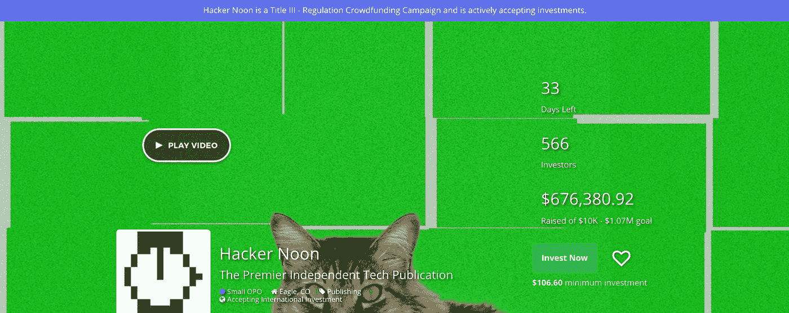
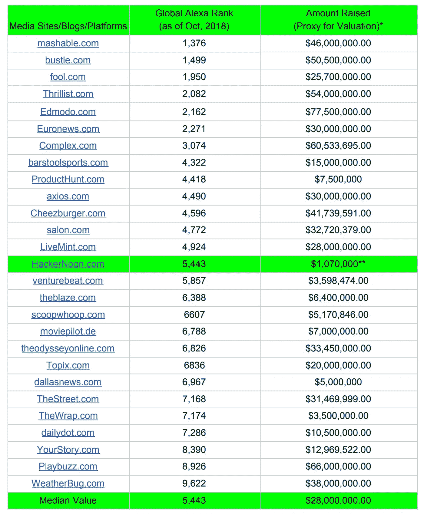
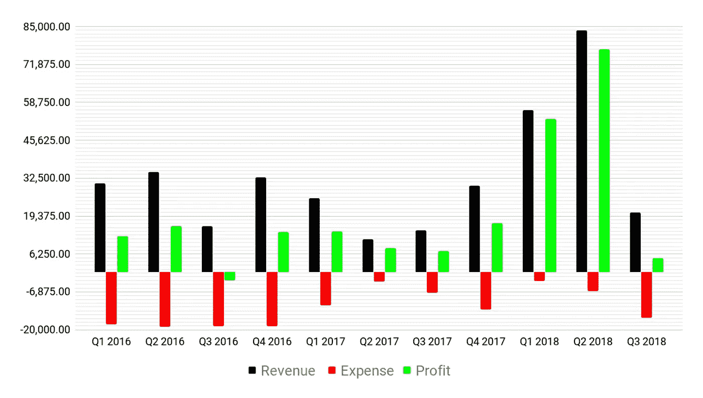
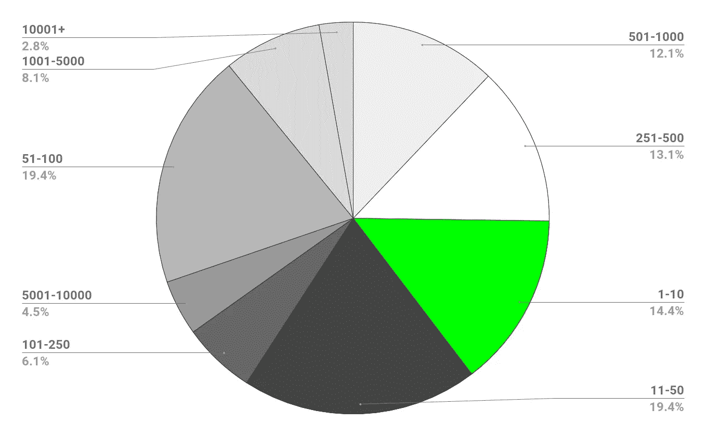

# 通过投资《黑客正午》来支持独立科技媒体

> 原文：<https://medium.com/hackernoon/support-independent-tech-media-by-investing-in-hacker-noon-right-now-151996345af2>

## 我们在 [Hacker Noon](http://hackernoon.com) 创建了一个成功的技术博客，为读者提供免费故事，为作者提供高质量的免费分发，一个社区驱动的编辑线和赞助商的高性能活动。

[Photo Credit](https://www.startengine.com/hackernoon)

[我们的股权众筹活动](https://www.startengine.com/hackernoon)已经从 566 名投资者那里筹集了 67.6 万美元。这场运动仍在进行，如果你现在正在阅读这个网站，我恳求你考虑拥有这个网站的一部分。[你的投资](https://www.startengine.com/hackernoon)可以帮助我们成长为网络上排名第一的独立科技博客，让我们摆脱对平台的依赖。所有的平台依赖和风险投资都会产生偏见和既得利益。我们希望根据他们工作和故事的价值来放大声音。

我们认为现在是您投资 Hacker Noon 的最佳时机，因为:

## 1.全球排名前 5k 的网站很少有总估值这么低的。

世界上有 6440 亿个网站&全球 Alexa 排名前 10k 的发布平台的总筹资额中值为 2800 万美元(*见下图*)。当我们围绕我们的工作流程成功构建了自己的内容管理时，我们能够也将会极大地提高我们的估值。

# 黑客正午 vs .其他媒体网站:筹集金额 vs .全球 Alexa 排名

*Source: Alexa (for ranking) & CrunchBase (for amount raised). *We believe amount raised is a factor in having an idea of a company’s valuation.** For Hacker Noon: assuming that this crowdfund is fully subscribed*

## 2.在过去的 2.5 年里，我们的现金流一直是正的。

像我们这样的早期创业公司很少能立即盈利(*见下面*我们的盈利&亏损图)。

# Hacker Noon 季度收入、费用和利润(2016 年 1 月至 2018 年 9 月)

*Source: Hacker Noon’s Quickbook Intuit*

## 3.我们的团队非常精干。

大多数其他类似流量的科技网站都比我们大得多。展望未来，我们将继续保持 5 人团队的精干。

# 在 Alexa 全球排名 1k-10k 的 400 多家出版物/博客中，只有 14.4%的员工少于 10 人

*Source: CrunchBase*

## 4.我们从未接受任何投资,因为我们不需要。

我们甚至没有商业信用卡——我们 100%的运营成本来自我们的收入。为了建立我们自己的 CMS，我们第一次筹集资金。还有什么更好的方式来展示我们的黑客正午社区的力量，首先做一个[股权众筹](https://www.startengine.com/hackernoon)？

## 5.我们的社区有 7000 名投稿作家(而且还在增长)，这是我们最大的财富。

新网站将为投稿作者提供更多的好处。我们的投稿作者将实际上获得他们的追随者的电子邮件地址，有机会赚取硬币，他们相关业务的行动呼吁将被纳入设计。我们将给予我们的贡献者选择和分配。

## 6.超过 **52%的客户已经续订**或承诺与我们续订。

我们已经预售了 2019 年黑客正午 2.0 的赞助。这是可能的，因为我们相信赞助如果做得好并不是坏事。邪恶的是追踪用户。

## 7.在过去的 3 年里，每天发布 20 多个故事，我们已经培养了**稀有的行业知识**如何[发布非常成功的内容。](https://www.indiehackers.com/forum/publishing-wildly-successful-content-online-with-david-smooke-of-hacker-noon-d5ecd175d6)

我们的大约 25，000 篇博客文章的图书馆是人们不断回来的地方。我们将在新网站上以更干净的方式整理这些知识。

## 8.我们是**互联网领先出版物之一** [**加密货币**](https://hackernoon.com/tagged/cryptocurrency)**&**[**区块链**](https://hackernoon.com/blockchain) 。

我们通过自身的成长看到了区块链的崛起&我们相信代币是未来。我们拥有行业知识、社区和与区块链公司的强大联系。我们还为 Hacker Noon 2.0 引入了一个积分系统，为**潜在的硬币发行**做准备。

## 9.[支持**独立科技媒体**](https://www.startengine.com/hackernoon) 为了更好的互联网！

由于许多媒体网站用读者的时间、信息和金钱来换取内容，我们想提醒你，通过[支持 Hacker Noon](https://www.startengine.com/hackernoon) ，你支持了互联网的初衷——信息自由。

## 10.你多久会有机会拥有你正在阅读的网站的一部分？

 [## 黑客正午

### 首屈一指的独立技术出版物

www.startengine.com](https://www.startengine.com/hackernoon)