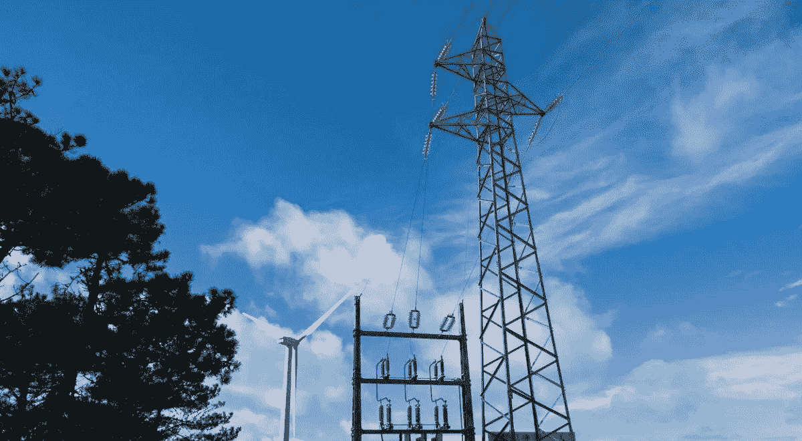

# 当然，区块链使用了大量的能源，但这不一定是一件坏事…

> 原文：<https://medium.com/hackernoon/sure-blockchain-uses-insane-amounts-of-energy-but-thats-not-necessarily-a-bad-thing-16829060686c>

# 在过去的几个月里，区块链的主题在全世界的辩论中变得越来越重要。不仅仅是对比特币公司而言，而且是一个新的共享经济的支柱。

我们生活在这样一个时代，越来越多的人认识到放弃核能和化石燃料的必要性。可再生能源的重要性正在稳步增加，因此，由于无法运输而浪费的风能和太阳能更少，这是更好地整合分散的可再生能源和[确保能源供应过程中的一个关键因素](https://www.pwc.fr/fr/assets/files/pdf/2016/12/blockchain_opportunity_for_energy_producers_and_consumers.pdf)。

# 区块链提供了新的可能性

区块链技术显示出很大的前景。除了用于执行能源供应交易，它还可以为计量、计费和结算过程提供基础。

Blockchain could present the link between energy efficiency and the investment industry

其他可能的应用领域包括所有权文件、资产状况(资产管理)、原产地担保、排放限额和可再生能源证书。区块链技术有可能从根本上改变我们所知的能源，首先从单个行业开始，但最终会改变整个能源市场。

其他可能的应用领域包括所有权文件、资产状况(资产管理)、原产地担保、排放限额和可再生能源证书。区块链技术有可能从根本上改变我们所知的能源，首先从单个行业开始，但最终会改变整个能源市场。

> *2017 年，仅全球比特币挖矿就用掉了比大多数国家还多的电力(！).这只是区块链的众多用途之一。*

加密货币等新技术本身消耗的大量电力是另一个因素；对电力需求的增加有助于弥补当前能效投资和充分挖掘清洁能源潜力所需投资之间的差距。换句话说，它可以让大型企业在可再生能源领域获得足够的利润。

据 Greenbiz.com 称，我们超过三分之二的效率潜力仍未被挖掘。除了抑制我们的碳排放之外，这种潜在的潜力意味着重要的就业和经济市场被忽视了。我们需要金融创新和创造力来释放能源和电子设备投资，并抓住这些就业和增长机会。区块链会是答案吗？将区块链创造的更大需求与其提供的技术解决方案结合起来，一个更加绿色的未来就在眼前。

> *在* [行为交换](http://behaviour.exchange/) *的专家团队正在为区块链研究新的令人兴奋的应用。查看他们的* [*博客*](https://medium.com/behaviourexchange) *获取更多有趣的文章，或加入他们的* [*电报*](https://t.me/behaviourexchange) *与他们一起探索区块链的未来！*