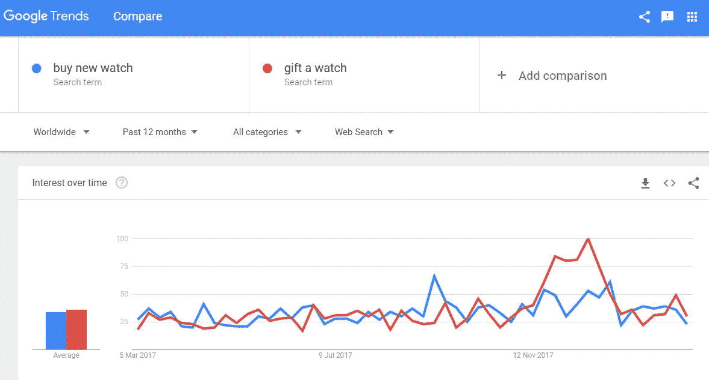

# 免费验证你的商业想法的最可靠的方法(还有一个主测试)

> 原文：<https://medium.com/hackernoon/surest-ways-to-validate-your-business-idea-for-free-and-a-master-test-too-7092ccbe3744>

当你坐在星巴克舒适的椅子上啜饮咖啡时，中途你突然灵机一动，想出了除切片面包之外下一个最好的东西。你很快在餐巾纸上记下你的想法，然后很快喝完咖啡，赶回家继续思考。

在一个小时内，你不仅仅是在做梦，而且你认为你已经想通了。对吗？不对！！

通常，我们被我们认为是有史以来最伟大的想法冲昏了头脑，我们忘记了核心——测试你的产品在市场中的真正需求——想法验证！！

想法验证应该是你计划的基础，并分两步执行——内部和外部。

***你是什么想法？***

在你开始你的旅程之前，有几个问题你必须问。你的目标受众(TA)是谁？你的想法/产品有助于解决他们面临的问题吗？该产品如何为他们的生活增加价值？

你的数据的最终结果必须来自行动指标，而不是虚荣指标。

清楚了吗？

我希望你是！

因此，让我们快速讨论一下如何进行想法验证？

**内部理想验证:**

当你想出要为这个世界提供什么时，确保你已经做了以下检查:

**1。谷歌——问一问，你就会发现！！**

在[谷歌](https://hackernoon.com/tagged/google)上快速搜索，看看是否已经有竞争产品。如果这是一个拥挤的市场，那么也许你应该重新考虑你的想法，除非你有一个非常新的独特的功能来区分你。

**2。侦察你的对手:**

在另一个地方，你是否有一种需要被别人满足？儿童 DIY 烘焙套装在美国很容易买到，但在印度却没有。因此，当“烘焙我印度”为孩子们创造了一个 DIY 烘焙套件时，它在印度获得了成功。

**3。深入而聪明地研究:**

转到[谷歌关键词](https://adwords.google.com/intl/en_in/home/tools/keyword-planner/)和[谷歌趋势](https://trends.google.com/trends/)。现在检查你的想法周围的关键词是否有很好的搜索量。它会让你知道产品/服务的需求有多受欢迎。高搜索量意味着你应该继续你的想法，低搜索量可能意味着重新思考策略。例如，你发明了一款很酷的新手表，然后检查人们是否打算购买或赠送这款手表，它是全年都有需求还是只有季节性需求。

People search for watches all year and highest demand is around Christmas. Graph shows how people want to gift watches more than buy for themselves around Christmas

**4。潜伏并聆听:**

观察业内可能最接近的竞争对手，分析他们的规模、范围等。想知道这是否可以复制。你计划制作一些还不存在的奇异的茶，但是有玩家提供奇异的咖啡。这是你观察和分析异国饮料需求的最接近的基准。

**5。获取知识:**

你有你想要踏入的领域的基础知识吗？例如，如果你正在制作一个科技产品，你是否了解[科技](https://hackernoon.com/tagged/technology)的基础知识，向开发者解释它，并了解存在的局限性等等。或者，如果你想开一个生物技术实验室，但对科学毫无头绪，那么你需要学习很多东西。

**外部产品验证:**

**1。研究**

让我澄清一件事——当你寻找有价值的反馈来验证你的商业想法时，朋友和家人并不重要。这并不是说他们知识渊博，而是关系中的尊重和爱掩盖了准确的反馈。它是唯一的人类！！

以研究的名义把你的想法推销给咖啡馆里的随机人群/目标受众闲逛的地方，并要求他们给你一些诚实的反馈，以帮助朋友的冒险。你不需要手里拿着一个产品来展示，但一份调查问卷就可以了。全程注意人们的行为和肢体语言。

**2。创意保护(可选)**

如果你担心你的创意会因为其独特性和真实性而被窃取，那么申请专利可能是个好主意。此外，在这个阶段，你可以更新你的 LinkedIn 个人资料，并宣布自己正在研究一个关于隐形模式的想法。这让人们好奇你在做什么，他们期待你展示你的产品。

**3。客户获取计划:**

制定一个如何获得第一个、第十个、第五十个和第一百个客户的计划。那才是真正的挣扎。此后，这是一个用例子来衡量的游戏。为了验证和构想成功，需要确保这一点。知道周期和它的辐条。例如，如果你有一个科技产品，你知道 Appsumo 和 product Hunt 吗，如果你正在创建一个新的能量棒，你知道如何将产品带入沃尔玛或分销渠道等。

**4。打造您的 MVP**

最小可行产品是最终产品的缩影。它具有用于测试目的的最少数量的规格和特征。构建 MVP 基于各种假设和变量。因为这是一个测试阶段，所以它有助于降低风险，最小化成本和工作量。它也有助于给出关于产品可用性的反馈。你会知道公司是应该转向还是保持他们的道路。

一个让我吃惊的例子是 Dropbox 的推出。Dropbox 是一款可以让你在不同平台上共享文件的应用。它由创始人 Drew Houston 在 2007 年发布的预告片视频发布，解释了应用程序的功能并进行演示。上线后，beta 版的注册人数一夜之间从 5000 人增加到了 75000 人。因此，即使在实际应用发布之前，也验证了兴趣水平的假设。这一测试为该应用创造了急需的需求，很快 Dropbox 就拥有了 100 万订户。

**验证你商业理念的最大考验:**

(请击鼓)

好吧，所以创意验证阶段最大的考验是预付款。是啊！！

如果你能从未来的客户(非家人或朋友)那里得到象征性的一笔钱，因为他/她对你的提议非常感兴趣，不想错过，你就知道你走对了路！！

**结论:**

想法验证是一个过程，你应该在你的想法开始时花相当多的精力。满足消费者需求的产品比不受欢迎的产品更有可能成功。

附:如果你对此有任何想法或意见要分享，欢迎回复并补充。

*原载于 2018 年 2 月 27 日*[*blog . alore . io*](https://blog.alore.io/validate-your-business-idea/)*。*