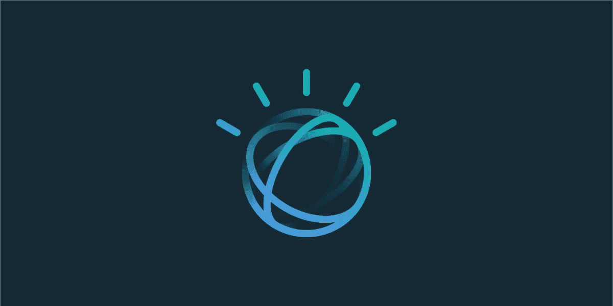
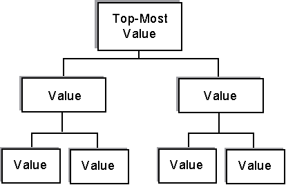

# 表面挖掘 IBM 沃森的发现

> 原文：<https://medium.com/hackernoon/surface-digging-ibm-watsons-discovery-2ae4605cf65f>

Image Source: Google

沃森发现是同类最佳的**云原生洞察引擎**。它处于所有其他认知人工智能驱动的云服务的前沿。

它深入数据集，解开前所未有的答案。主要调整为了解和监督过去，现有和未来的趋势，以及从利基和自由数据中获得的独特模式，以帮助企业。

## IBM Watson 的三个突出特点是，它…

*   放大结果
*   轻松学习领域
*   体现了适用于任何类型业务的高级人工智能功能。

**沃森发现**现已**两岁**，迄今为止，发现背后的团队已经推出了一些里程碑式的功能。其中，异常检测、相关性训练、语义匹配、段落检索是值得注意的部分。不会错过用户体验、语言帮助和部署支持方面的基本增强。

# **剥皮管辖条例**

Image Source: Google

通过实现元素分类来消除不需要的管理规则和措施。这里是 IBM 的一个描述性文档，可以帮助您开始使用它的第一个 [**元素级分类**](https://console.bluemix.net/docs/services/discovery/element-classification.html#element-classification) 。给出一个概述，这会让你对句子层面的元素有更深的见解。

比如…

*   **哪个党？** —它属于谁
*   **什么性质？** —采取的行动类型和相关信息
*   **哪一类？** —领域特定类

这一增强功能利用了针对采购合同和金融服务法规的经过培训和测试的模型。

# **实验界面**

Image Source: Vimeo

如果您希望可视化 insight 引擎中的数据，Visual Insights 是实现这一目标的方法。视觉洞察将利用沃森发现对数据的理解能力，将所有数据分组到连接中。

这些联系围绕着逻辑现实的元素，比如关系、概念、地点、组织等等。

您可以从图形表示或通过以标签云视图形式给出的独立实体来研究数据集或文档。如果你缺少数据集，可以查看一下 IBM 的新闻收集。

下一篇文章将详细介绍 IBM Watson 的发现。