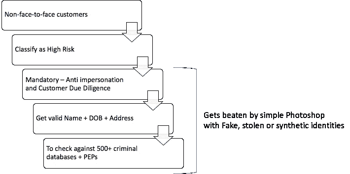
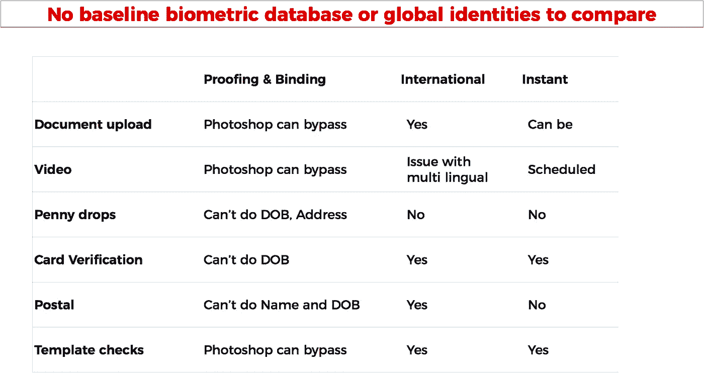
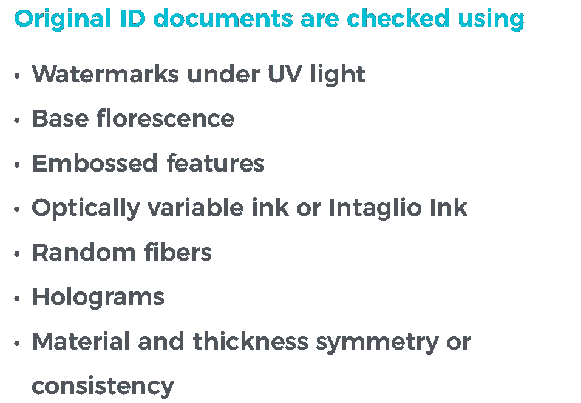
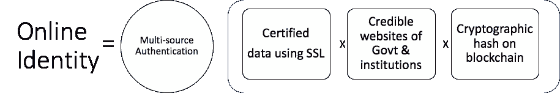
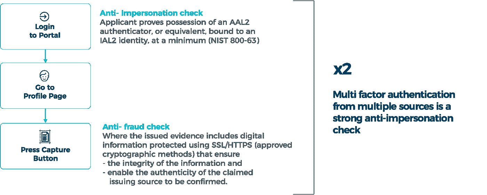
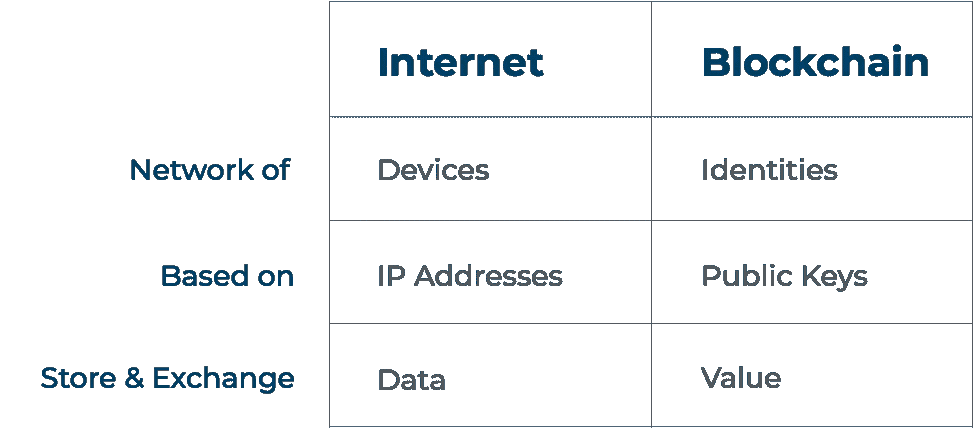
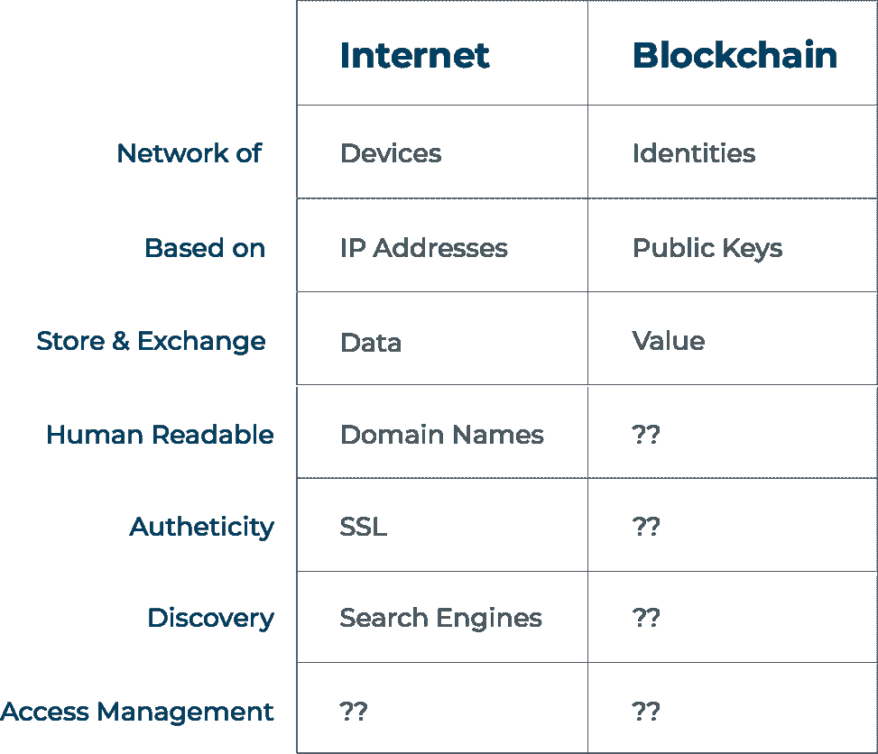

# 惊人的真实！在线身份= mC

> 原文：<https://medium.com/hackernoon/surprisingly-true-online-identity-mc%C2%B3-f4314a990df7>

# 金融科技这个“未解”的难题终于有了突破

I=mC 可能听起来很滑稽，但却很奇怪，而且非常真实。正如你将看到的，这是创建真正值得信赖的全球在线身份网络的最快、最简单和唯一的解决方案。

# 什么是网络身份？

任何在线帐户

1.  和一个真实的人有身体上的联系，
2.  合法——在可靠的机构数据库中有正确的姓名和出生日期。
3.  可核查、可审计和可担保。
4.  有实际控制权，没有冒名顶替。

# 所有现有的技术都可以很容易地被简单的 Photoshop 击败，以创建虚假的身份或冒充某人。

Online Identity or eKYC is just like emperor’s clothes.

身份对于责任是绝对重要的。无论是金融交易、新闻、共享市场还是网络安全。保持身份的私密性是很重要的，但是如果事情变得非常糟糕，身份也可以被揭露。

没有真实的身份，就不可能在互联网上抓住坏人或保护儿童的安全。

# 在全球范围内打击经济犯罪

> 所有国际银行业法律都要求所有新的非面对面客户签约都被归类为高风险。
> 
> **对这些客户进行客户尽职调查和反假冒检查是强制性的。**
> 
> **你基本上需要一个有效的姓名、出生日期和地址的组合来对照 600 多个犯罪数据库和 pep 来检查这些客户。**

> 问题是，任何一个拥有简单 Photoshop 的人都可以在网上绕过这些检查。没有现有的技术可以确定身份是假的、被盗的还是合成的。

A broad set of limitations are covered here.

> "这就是为什么所有银行都需要进行实物 KYC 的原因. "

知道身份是否真实的唯一方法是在与人见面时检查原始文件。

但是问题仍然很大。仅在欧洲，十年内就有 4000 万本护照丢失或被盗。盗窃、使用伪造文件、数据泄露和创建合成身份已经达到了流行的程度。

在由经验丰富的澳大利亚护照官员进行的控制测试中。[他们无法检测出超过 14%的欺诈性照片。](https://www.washingtonpost.com/news/speaking-of-science/wp/2014/08/19/passport-officers-arent-too-good-at-spotting-fake-photos/?noredirect=on&utm_term=.410dfe2f2bc3)

[尽管进行了实物检查，金融机构在当前十年仍将面临逾 4000 亿美元的罚款。](https://in.reuters.com/article/banks-regulator-fines/u-s-eu-fines-on-banks-misconduct-to-top-400-billion-by-2020-report-idINKCN1C210D)

# 为什么这么难解决？

协调全球身份数据库不仅在政治上、经济上具有挑战性，而且也是不可取的。由于隐私和被滥用的可能性，大多数国家不会同意拥有这样一个全球公民的中央数据库。即使一个人能够执行如此大规模的任务，也需要得到同意

任何在线身份系统都需要解决以下因素

*   合法有效和银行认可的
*   与正确的人结合
*   在线和离线全球可用
*   密码可证明/可验证
*   可恢复和损失证明
*   防欺诈
*   不集中—由用户控制。

问题是，如何将身份限定为姓名和出生日期的真实有效的组合。然后你如何确保被代表的人实际上是同一个人，而不是其他人？

# 在线身份

# I= mC

现在，设想一种方法来创建一个与真实的机构数据库相关联的密码可证明的身份。

这将包括

1.  **使用 SSL 认证数据**—通过使用有效 SSL/TLS 证书接收的数据来验证身份所有者的配置文件信息。
2.  **可信网站** —使用白名单和/或其他可信度因素(如网站的 alexa 档案)检索存储在各种可信政府组织的私人数据库或私人机构数据库中的信息。
3.  **密码散列** —通过在不可变的区块链/ DLT 上存储出处和信息的散列，使信息具有抗篡改性、可靠性和可验证性。
4.  **多源认证** —对来自多个来源、第三方(如政府、银行、公用事业公司或 ICAO 合规文件)的用户进行认证，这可能需要用户

> 使用密码或登录网站
> 
> 基于知识的认证(KBA)，
> 
> 使用 NFC 和面部认证扫描基于 ICAO 的身份文件

从多个来源验证用户数据不仅可以防止使用单个机构的中央黑客攻击，而且由于多因素或第三方身份验证，还可以充当强大的防假冒检查。

## 一种从全局数据库生成身份凭证的新方法

这是一种使用 SSL 捕获的新型认证技术。它使系统独立于任何机构，并且不需要事先的协议或集成。随着潜在的和被压抑的在线需求，它在全球范围内有着直接的应用和可用性。

# 这有什么区别吗？

互联网创建于 1973 年，它基本上是一个无需许可的设备网络，旨在存储和交换数据。然而，这些设备从未在全球范围内与人或他们的身份有任何物理绑定。任何人都可以选择一个名字，做他们想做的任何事情，而无需承担任何责任或易于追踪。

然而，区块链是一种建立在互联网之上的新型网络，同样无需许可，但有一个关键区别。它基于可以保存和存储值的公钥。可以说，基于非对称密钥的不可否认性及其分散的性质使其成为全球身份网络的主要候选。

然而，它缺少一些关键的元素，如人类的可读性，以及域名(10 年后出现)和 SSL(花了 20 年)等可信度，从而使它真正变得可用和友好。没有 SSL，互联网商务和银行业就不会起飞。类似地，区块链缺乏人类可读性，也缺乏 SSL 这样的可信度。

现在，Identity=mC 利用互联网现有的 SSL/TLS 基础设施，并对其进行扩展，以在区块链的基础上创建一个新的、可靠的、可验证的身份系统。

这对于填补创建在线问责制所需的身份网络缺失的空白至关重要。这不仅是金融技术和密码产业的需要，也是解决网络安全、假新闻、网络犯罪等问题的需要。

# 区块链可以成为消除金融犯罪的灵丹妙药。

区块链让我们有能力追踪跨境和跨资产类别的交易。一旦钱包与真实身份挂钩，追踪脏钱甚至腐败所得就变得容易多了。

拥有一个可以被包括银行在内的所有人信任的去中心化身份系统，开启了一个全新的可能性世界。作为起点，它无疑解决了 fin-tech 的 eKYC 问题。

# 结论

几十年来，真正有效的在线全球身份网络一直是一个难以实现的梦想。难以置信，但区块链和 mC 是真正的唯一可行的解决方案，提供银行可在线身份。这是区块链自我主权身份与真实世界用例的技术突破。

简单地说，如果你的 eKYC 不是由 mC(最新的艺术)驱动的，那么你就有一些“非常严重的”photoshop 漏洞。

# 非常严肃的营销笔记

如果你是一家金融科技公司、区块链公司甚至银行，并且认为你的 eKYC 足够好。我会说，你应该再仔细看看。因为没有这项技术不仅是不可能的，而且还会带来包括坐牢在内的个人和刑事指控。你的 eKYC 需要防弹。如果你仍然有不同的想法，那么给我发电子邮件 vishal@dirolabs.com，我会让我的 photoshop 团队向你展示如何…冰淇淋打赌开始了！

**关于 Diro Labs** —是一家在伦敦注册的公司，正在开发一个分散身份&访问平台，为金融科技行业提供防弹 eKYC 解决方案。它在新德里有一个离岸研发中心，申请了超过 15 项专利。Diro 去年在一个拥有 10 亿人口和世界领先的 IT 技能的国家赢得了国家奖。它由一些世界领先的密码学家、身份和反洗钱专家提供建议。