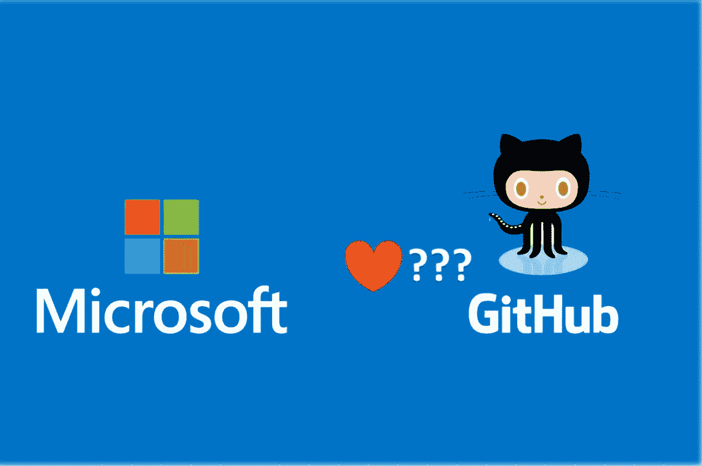
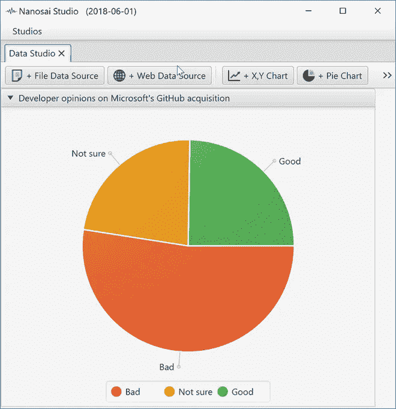

# 调查:开发者对微软收购 GitHub 的感受

> 原文：<https://medium.com/hackernoon/survey-developers-feeling-regarding-microsoft-s-github-acquisition-ed494b9cc636>

(作为用户和粉丝)微软收购了 GitHub，这是一种悲伤的感觉，尽管他们支付了 70 亿美元的巨额支票！我感到悲伤的第一个原因是，作为超过 2000 万开发人员使用的以开发人员为中心的工具的宠儿之一，我觉得如果 GitHub 独立于大型软件供应商，对开发人员社区会更好。第二个原因是，这次收购只是加强了微软等大型科技公司的垄断地位，这些公司利用其庞大的现金储备和分销能力来摆脱初创公司，有一天可能会在某些垂直领域与它们竞争。当然，微软并不是唯一一家这样做的大型科技公司，老实说，我很钦佩塞特亚·纳德拉接任首席执行官以来，在让微软变得更加开放方面所采取的一些措施。肯定比鲍尔默先生强！

GitHub 是一家私人公司。作为一家风投支持的初创公司，意味着大规模退出对于他们的硅谷支持者(如安德森·霍洛维茨和塞阔艾)来说始终是头等大事。在这种情况下，从这些支持者的角度来看，70 亿美元是一个很难拒绝的出价，因为 GitHub 的最新已知估值被认为约为 20 亿美元。据 [PitchBook](https://pitchbook.com/news/articles/the-big-winners-from-the-github-acquisition) 报道，Andreessen Horowitz 将从此次收购中获得超过 10 亿美元，红杉可能紧随其后成为第二大投资者。

对于微软来说，他们肯定会得到比 TFS 更好的东西，也许会吸引已经与微软技术(如. Net)合作的开发者将 GitHub 与其他微软服务(如 Azure)一起使用。然而，我怀疑这次收购是否会像许多行业专家声称的那样帮助微软 Azure 赶上亚马逊网络服务(AWS)。

**开发商对这笔交易有什么看法？**

为了找到答案，我在收购消息公布的当天进行了一次 twitter 民意调查，询问关注我和 Nanosai.com 的开发者们对此次收购的感受。参与调查的 686 名开发商中，绝大多数(53%)对此次收购感觉不佳，而 24%感觉良好，23%不确定。当然，在超过 2000 万使用 GitHub 的开发者中，686 可能看起来微不足道。

Visualisation by [Nanosai Studio](https://nanosai.com/studio).

我无法抗拒使用更大样本的诱惑，所以我想在 Hackernoon 开发者社区中进行一次新的调查，看看这种感觉是否成立！

***请随意完成(不超过 60 秒) [***Hackernoon 调查— GitHub 采集***](https://docs.google.com/forms/d/e/1FAIpQLSePfZP0fk543zBfCIY8ypz05Rf2vK8_byhu7ne0Tiwo9YsSrA/viewform?usp=sf_link) 并与您的同事分享。如果回复足够多，我们会把它们发给微软，提醒塞特亚·纳德拉和其他人不要搞砸了！:)

最后，我仍然想知道 GitHub 是否可以通过 IPO 甚至 ICO 保持独立而做得更好！:)你怎么看？欢迎留下您的评论！

*发帖人*[*bambordébaldé*](https://medium.com/u/665359d135fa?source=post_page-----ed494b9cc636--------------------------------)*，联合创始人|推特:*[*@ cloud balde*](https://twitter.com/cloudbalde)*|领英:*[linkedin.com/in/bambordé](https://www.linkedin.com/in/bambord%C3%A9)