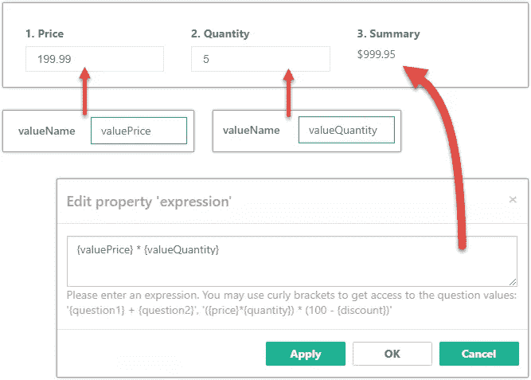

# SurveyJS 超出测试版

> 原文：<https://medium.com/hackernoon/surveyjs-an-open-source-javascript-survey-library-with-versions-for-angular-2-react-vue-2086d988b974>


SurveyJS 是一个开源的 JavaScript 调查库，有 [Angular 2+](https://surveyjs.io/Examples/Library/?id=questiontype-text&platform=Angular2) 、 [React](https://surveyjs.io/Examples/Library/?id=questiontype-text&platform=Reactjs) 、 [Vue](https://surveyjs.io/Examples/Library/?id=questiontype-text&platform=Vue) 、 [Knockout](https://surveyjs.io/Examples/Library/?id=questiontype-text&platform=Knockoutjs) 和 [jQuery](https://surveyjs.io/Examples/Library/?id=questiontype-text&platform=jQuery) 等版本，现已退出测试。

我们在两年多前的 2015 年 9 月 25 日首次发布了公开版。到 2017 年 4 月，当我们发布“ [Meet SurveyJS](https://hackernoon.com/meet-surveyjs-d8ac6a61db62) ”时，该库已经具备了功能竞争力和稳定性，我们只需要再多一点来自该领域的反馈，就可以称之为 1.0 版本。

从 4 月到现在，我们不断从用户的调查、表格和测验中学习，努力改进 API，引入新功能，当然，修复 bug 和可用性问题。

这是最新消息。

# **面板:介于问题和页面之间**

考虑下图所示的简单条件流:


由于调查工具通常将您限制为两种类型的实体—问题和页面—显而易见的选项是:

*   将与合作伙伴相关的问题移至单独的**有条件可见页面**。缺点是过多的导航和将相关信息分离到多个页面会导致糟糕的 UX。
*   使用带有**条件可见问题**的单页。从 UX 的角度来看，这更好，但是需要“代码复制”。

SurveyJS 现在提供了第三种，有点介于两者之间的选择:**将问题放到有条件可见的面板中**。正如我们从许多客户调查中看到的，这种面板概念正在被广泛使用。

这里有一个活生生的例子。如果你在产品满意度量表上选择 3 分或更少，会弹出一个附加问题的面板。在本例中，还有一个嵌套的折叠面板。

SurveyJS Panel example

面板为另一个常见任务提供了一个优雅的解决方案。考虑以下调查页面:


如果需要电话号码，并且可以填充三个字段中的任何一个，那么 SurveyJS 就不需要复杂的逻辑。您只需将字段分组到一个面板中，并将 **isRequired** 属性设置为 **true** 。

在下面的实时示例中了解它的工作原理:

SurveyJS Panel.isRequired = true

而且，如果您想知道灵活性，SurveyJS 支持无限数量的嵌套面板。例如，“电话号码”面板可以嵌套在有条件可见的“地址”面板中，等等。

# “visibleIf”和“enableIf”表达式中的自定义函数

最简单的 SurveyJS 表达式将使用静态值和问题答案。这里有一个例子:


这与任何调查工具一样简单明了:对于没有编程经验的用户来说，构建起来非常容易。

可能引起你注意的是 **{age}** 不太可能的用法。很可能你不会问年龄，而是会问出生日期，然后试着根据出生日期算出年龄。

回到 2017 年 4 月，如果你问我们如何做到这一点，我们会建议处理 **onValueChanged** 事件(在调查答案的每次更改时触发)来计算年龄并将其存储到一个变量中。然后可以在表达式中使用该变量。

但是，只有当调查是由您(开发人员)创建时，这种方法才有效。但是如果你正在使用 [SurveyJS 库](https://surveyjs.io/Overview/Library/)和 [SurveyJS 编辑器](https://surveyjs.io/Overview/Editor/)构建一个内部调查引擎，问卷将由不具备用 JavaScript 处理事件所需专业知识的用户构建。

为了解决这个限制，我们现在允许您注册自定义函数。下面的代码实现了“根据出生日期计算年龄”功能(库附带的功能之一):

```
// The age() function accepts a birth date
// and returns the number of full yearsfunction age(params: any[]): any {
   if (!params && params.length < 1) return -1;
   var birthDay = new Date(params[0]);
   var ageDifMs = Date.now() — birthDay.getTime();
   var ageDate = new Date(ageDifMs); // miliseconds from epoch
   return Math.abs(ageDate.getUTCFullYear() — 1970);
}// Register the function for use in SurveyJS expressions
Survey.FunctionFactory.Instance.register(“age”, age);
```

有了这些功能，我们又回到了系统管理员可以处理的简单问题上:


这里有一个现场示例来演示:

Using age function example

既然我们提到 SurveyJS 附带了某些函数，我们需要注意的是，我们还没有提供像 Excel 那样的扩展函数库。然而，我们将在本文后面的**表达式和总计**部分提到几个更有用的函数。

# 动态面板:处理列表数据

对于调查来说，列表肯定是最糟糕的数据类型，但例子很多:儿童列表、过去五年访问过的国家、最近的地址、过去和现在的工作等等。

如果你有测量建造的经验，下面线框中的嵌套列表流程一定会让你感到恐怖:


使用测量软件提供的标准方法，您可以稍微轻松地实现左侧。只需使用矩阵小部件。虽然它会笨拙地将字段排列成行，所以如果你每个条目有三个以上的字段，那么就做好水平滚动的准备，也就是糟糕的 UX。

但是右边呢:包含每个兄弟姐妹的孩子的二级列表？你不能把一个矩阵放入一个矩阵中…为此，我们通常建议为每个兄弟对象运行一个单独的调查，正如你所想象的，这需要编码。

这些复杂情况现在已经成为过去。使用 SurveyJS 中新实现的**动态面板**小部件，您可以构建具有任何项目布局的列表，嵌入嵌套列表，甚至跨多个页面编辑列表对象。正如上图所示，你可以从在一页上填写基本信息开始，然后在另一页上添加更多信息。

现在看一个例子，我们将在下面讨论最有趣的部分。

Dynamic Panel Example

如您所见，两个页面编辑相同的雇主信息:第二个页面将显示您在第一个页面上开始构建的相同列表。用技术术语来说，这两个页面包含连接到同一个列表源的**动态面板**小部件。请注意以下重复的代码行:

```
// Two dynamic panels on different pages
// connected to the same list source"pages": [{
   "name": "page1" 
   ...
   "elements": [{
      ...
      "type": "paneldynamic",
      **"valueName": "employers"**
      ...
   }] 
}, {
   "name": "page2" 
   ...
   "elements": [{
      ...
      "type": "paneldynamic",
      **"valueName": "employers"**
      ...
   }]
}]
```

另一个有趣的部分是，在第一页上，列表条目一个接一个堆叠在一起，而在第二页上，你可以在各个雇主之间导航。这由动态面板的 **renderMode** 属性控制，该属性可以设置为:

*   "**列表**"(默认值，用于第一页)
*   " **progressTop** "(在第二页明确赋值)
*   “ **progressBottom** ”、“ **progressTopBottom** ”(在 JSFiddle 中尝试)

```
...
"renderMode": "progressTop"
...
```

# 表达式、汇总和总计

动态面板大受欢迎，越来越多的用户请求对此产生了兴趣。有了这样一个简单的列表管理工具，我们的客户开始创建更复杂的布局，包括**发票**。SurveyJS 可以轻松处理布局，但是我们收到了越来越多的自动计算总数的请求。

同样，如果你是一名开发人员，这不是一个限制。但是随着时间的推移，我们不断用标准的 **onValueChanged** 事件处理程序建议来回应客户，我们意识到这些情况并不是孤立的，我们需要一个每个人都可以使用的更简单的机制。

解决方案:一个**表达式**小部件，其最简单的用法如下图所示:



**表情**物业可以接受:

*   常数
*   数学运算符
*   调查问题值
*   本文前面讨论的自定义函数

说到自定义函数，您会发现对总计有用的一个预定义函数是" **iif"** 。以下是如何使用它对购买 10 件或 10 件以上的商品打八折:

```
"iif({quantity} < 10, {quantity}*{price}, {quantity}*{price}*0.8)"
```

另一个值得注意的函数——"**sumInArray**"——可用于计算动态面板或动态矩阵中所有项目的总和:

```
// summarize 'quantity' question values 
// in the 'invoiceItems' panel/matrix"sumInArray('invoiceItems', 'quantity')"
```

下面是一个用 SurveyJS 实现的简单发票表单。它什么都有:一个自定义函数，为每个发票条目计算的汇总，以及总计。

Invoice example

# 一个带有定制小部件的 GitHub 存储库

SurveyJS 首先是一个编程库，允许您将任何 JavaScript 小部件集成到您的调查中。我们的客户当然喜欢利用这一点，但是这当然是有代价的——几行代码。

有些天真的是，如果我们完善集成 API 并彻底记录它，我们期望减少支持负载。然而问题从未停止。每个部件都有它的怪癖。每个 SurveyJS 用户最想做的就是找到一个现有的代码进行复制。所以我们屈服了，最终支持所有高需求部件的集成代码，把它作为项目的一部分。

要查看我们现在支持的小部件，请查看专用的 [GitHub 库](https://github.com/surveyjs/widgets)。列表如下:

*   [选择 2 个标签框](https://surveyjs.io/Examples/Library?id=custom-widget-select2-tagbox)
*   [JQuery UI 日期选择器](https://surveyjs.io/Examples/Library?id=custom-widget-datepicker)
*   iCheck
*   [天线. io 杆额定值](https://surveyjs.io/Examples/Library?id=custom-widget-barrating)
*   [SortableJS](https://surveyjs.io/Examples/Library?id=custom-widget-sortablejs)
*   [图像拾取器](https://surveyjs.io/Examples/Library?id=custom-widget-image-picker)
*   [NoUISlider](https://surveyjs.io/Examples/Library?id=custom-widget-nouislider)
*   [签名板](https://surveyjs.io/Examples/Library?id=custom-widget-signaturepad)
*   [输入屏蔽](https://surveyjs.io/Examples/Library?id=custom-widget-inputmask)
*   [CK 编辑](https://surveyjs.io/Examples/Library?id=custom-widget-ckeditor)
*   [轻松自动完成](https://surveyjs.io/Examples/Library?id=custom-widget-autocomplete)
*   [漂亮复选框](https://surveyjs.io/Examples/Library?id=custom-widget-pretty-checkbox)

如果你对我们下一步应该添加什么有想法，请告诉我们。

# 定时测验功能

自从我们第一次发布这个库以来，SurveyJS 一直被用来创建定时测验。但是直到现在，一些特性还需要手工编码:

*   用于显示说明和开始按钮的标题页。本页不计入测验/调查进度。
*   整个调查和单个页面的时间管理。测验通常需要显示页面上和/或调查中的剩余时间，并且需要在时间到了时自动向前跳转。
*   问题正确答案的概念和获得答案统计数据的能力。

您可以查看一个利用这些新功能的简单测验示例。

即使您没有开发测验，您仍然可以使用此功能来了解您的用户在填写整个调查或每个单独的页面上花费了多少时间。

# Bootstrap 4 支持和内部主题

我们本打算等到 Bootstrap 4 正式发布后再进行集成，但同样，请求的数量太多了，我们别无选择，只能卷起袖子马上开始。因此，请使用 SurveyJS 享受 Bootstrap 4 Beta，但请注意，当 Bootstrap 团队发布更新时，通常需要几天时间来同步我们的代码。

一切容易的事情都有一定的界限。应用引导主题也是如此。网站的建立需要考虑到这个框架，并不是每个网站都是这样的。这对我们来说意味着引导主题不能是我们提供的唯一选择。另一个选择是手动定制 CSS 这是我们从第一天就允许的。虽然它允许完全的外观和感觉控制，但它也需要最大的努力。

我们意识到，我们的客户群中有很大一部分想要介于两者之间的东西——现成可用且易于定制的主题，而不依赖于引导程序。这也是我们现在团队里有全职设计师的原因之一。以几次大型调查为参照点，她创作了“绿色”(默认)、“橙色”、“深蓝”、“暗玫瑰”、“石头”、“冬天”、“冬石”七个主题。

要应用主题，请使用下面的代码行:

```
Survey.StylesManager.applyTheme("stone");
```

下面的示例向您展示了如何应用内置主题，以及如果您需要不同的调色板，如何修改其中的一个主题。使用实时示例中的组合框来尝试这些选项。

You can easily switch themes using root marker CSS class

# 支持网页内容可访问性指南(WCAG) 2.0

WCAG 对一些开发人员来说是指导，对其他人来说是严格的要求，当然对残疾用户来说也是必须的。我们一直知道 SurveyJS 必须支持这一点，所以它完成了。

# 一个新的布尔小部件

一个简单而有用的复选框小部件，帮助您改进调查 UI:

Boolean Question example

# 了解有关项目调查的更多信息

项目调查包括三个产品:

*   一个 JavaScript 库，可以让你在你的网站上进行调查(开源和免费)。
*   一种云服务，允许你创建和存储调查，下载和分析他们的结果(目前免费使用)。
*   一个基于 JavaScript 的嵌入式调查编辑器 UI(提供免费的非商业和付费的商业使用许可)。

本文回顾了我们在 SurveyJS 库中实现的最新新特性。要了解有关 Project SurveyJS 提供的功能的更多信息，查看包含实时示例的文档，或联系我们并提出问题，请访问我们的“关于”网站，网址为 [https://SurveyJS.io](https://SurveyJS.io) 。