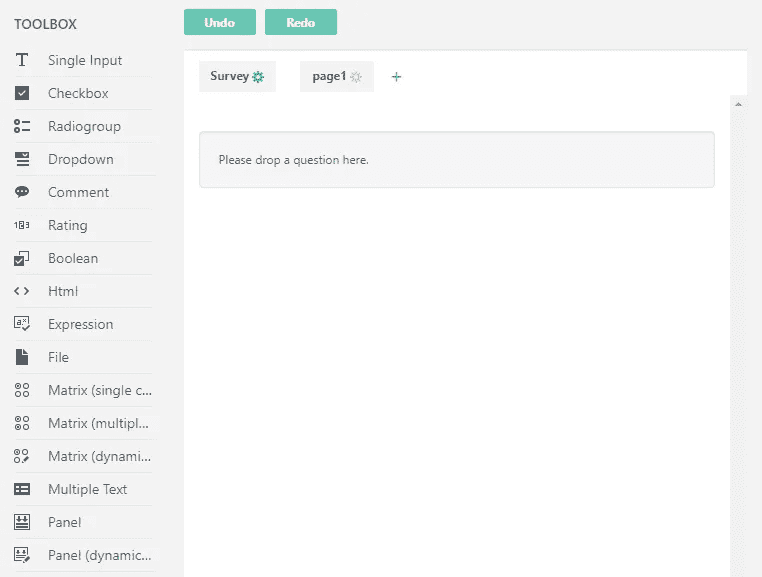

# SurveyJS:改进的表单生成器可用性(2018 年上半年)

> 原文：<https://medium.com/hackernoon/surveyjs-improved-form-builder-usability-first-half-of-2018-3373f8577af3>

自从我们发布了麻省理工学院许可的 SurveyJS 库和开源的 T2 表单生成器的生产版本以来的六个月里，我们已经了解了很多关于人们如何使用我们内置的调查编辑器 UI 以及是什么让他们感到困惑。在本文中，我们将总结我们遇到的可用性问题以及我们如何解决它们。

# 属性窗格:现成解决方案的问题

第一个也可能是最常见的可用性问题是右侧的属性窗格，这是所有开发人员和高级用户都熟悉的景象:

Property Grid

开发人员不断询问我们隐藏该窗格的方法，因为它对使用表单生成器来构建调查的最终用户似乎没有帮助。

幸运的是，我们预见到了这样的请求，并且已经有了用户友好的模态对话框作为现成的替代品。下面的例子显示了一个问题编辑器。类似的多选项卡编辑器窗口也可用于面板、页面和调查。

Checkbox Question modal Editor

我们确实更新了这些对话框，使多面板 UI 更容易被发现。现在，您可以将选项卡转换为折叠形式:

Radiogroup Question modal Editor with accordion

手风琴是我们最喜欢的视图，也是现在的默认选项。顺便说一下，上图强调了编辑器 UI 的另一个改进——应用自定义主题的能力。

# 在设计器中管理页面:添加新项，选择

令我们惊讶的是，我们收到了许多问题，询问我们如何在调查中添加新的一页，这是第一步，也是最基本的一步。我们进行了一些可用性测试会议，事实上看到了测试人员的挣扎。我们必须做出改变——这种简单的操作对每个人来说都应该很简单。

这是旧的设计图面。

Design surface — pages, v1.0.1

我们就该设计的以下问题达成一致:

*   所选页面的标签(“第 1 页”)和页面表面之间没有连接。他们似乎是独立的实体。
*   绿色齿轮在指示所选页面方面表现不佳。
*   许多用户忽略了小加号按钮。
*   “调查”链接与“页面”链接在同一行增加了混乱。

这是我们更改后该设计图面的外观:

Design surface — pages, v1.0.25

*   按钮变成了选项卡，以便在选定的页面标签和设计图面之间建立更好的视觉联系。
*   下拉菜单提供了另一种选择页面的方式。选项卡控件和下拉列表是同步的。
*   “+”按钮现在变大了一点，位于右上角更显眼的位置。此外，下拉列表中还有一个“添加新页面”项。
*   “调查”按钮已被重命名为“调查设置”，并上移至“撤消”和“重做”按钮旁边。

**改变之后**:有了新的设计，我们成功地进行了几次可用性测试，再也没有收到用户关于管理页面的问题。

# 表达式属性编辑器

与前面的例子不同，我们一直知道我们的表达式编辑器在当前形式下会有问题。

我们创造了一个强大的表达引擎。您可以使用内置或定制的嵌套元素和函数来构建任何复杂程度的逻辑表达式。同时，编辑器是一个带有文档链接的简单的纯文本备忘录字段。

想查一个函数？切换到文档。想查一个以前的问题名来参考它的值？关闭编辑器，找到那个问题…

可以想象，我们的支持论坛上不乏问题和改进建议。对于我们自己来说，这个对话也是一个越来越令人头疼的问题——即使在我们的内部测试中，我们也花费了大量宝贵的时间来构建这些表达式。

Expression Editor, v1.0.1

我们现在添加了一个简单的向导，可以创建一个逻辑条件。您可以在整个表达式中添加条件，从而积累更复杂的标准。

Expression Editor, v1.0.25

左侧的下拉列表列出了所有问题及其嵌套元素。然后，您可以选择一个比较运算符和值。

如果可能的话，我们会在表达式生成器窗口中显示引用的问题。最终用户可以使用复选框、单选按钮组、下拉列表、评级等选择一个值。，而不是直接在文本框中输入值。

文本编辑器仍然存在，因此您可以根据需要修改表达式。并且，如果您引用 Ace 编辑器，您可以按 CTRL+SPACE 来显示完成提示。

**改变后**:关于表情的问题数量明显下降。我们仍不时会收到一些，但它们大多与复杂的场景有关，并涉及到定制功能的帮助。

# 在设计器图面上编辑问题

在最初的版本中，元素设计器 UI 只有两个命令:“Editor”和一个省略号，该省略号打开一个带有附加操作的菜单。我们很快发现，对于每个人来说，找到省略号后面的删除命令并不是一项显而易见的任务。

Element designer UI, v1.0.1

在更新 UI 之前，我们需要从两个角度考虑重新设计。

首先，我们希望允许最终用户直接在设计界面上执行最常见的任务:更改问题的标题、根据需要标记问题、更改问题类型或内容(选项)。

另一方面，SurveyJS 首先是一个开发人员工具，所以我们需要启用一种简单的方法来定制表单生成器中可用的命令。

我们已经使用装饰器概念实现了上述所有内容。装饰器是基于预定义条件出现在 SurveyJS 元素上的 UI 设计器命令。开发人员可以移除默认的装饰器或注册自己的装饰器。

你在下图中看到的图标和下拉菜单是我们在当前版本中提供的默认装饰。您不会发现我们已经将与问题相关的修饰器移到了问题边界之外。否则用户界面会变得混乱，尤其是对于标题较长的问题。

Element designer UI, v1.0.25

如您所见，我们首先保留了编辑命令，然后是删除、显示/隐藏标题、必需属性。

右侧的“下拉”链接指示问题类型，并允许您快速切换到不同的表示方式。

Change element type action

问题标题也有自己的装饰。这使您能够直接在设计器表面编辑标题。

Title adorner

对于下拉式问题，选项不会立即显示在屏幕上，请使用编辑选项装饰器来访问列表。

Edit Choices adorner

一旦答案选项可用，您将看到它们的装饰器，它允许您使用拖放操作来添加、删除、编辑和重新排序选项。

Choices items editing and drag & drop adorners

我们没有提到的一个装饰品是显示在问题区上方的汉堡包。这是一个拖放装饰器，我们将在下一节讨论它。

Element Drag & Drop adorner

# 使用拖放添加和重新排序元素

我们想在本文中讨论的最后一个可用性问题是拖放的可发现性。终端用户不知道他们可以通过从工具箱中拖动来创建和定位问题。他们也没有意识到以后可以使用拖放来重新排序元素。

Surface designer and Toolbox, v1.0.1

由于拖放是不可发现的，用户最终只能点击工具箱元素。表单生成器将该元素添加为当前页面的最后一个条目，而用户不知道下一步该做什么。

首先，我们将消息更改为“请从左边的工具箱中在此处放下一个问题”，并将其放大。放置目标现在是整个设计器图面，而不是以前可用的小矩形。

Surface designer and Toolbox, v1.0.25

拖放装饰器——我们在上一节中提到的一个字形——出现在问题的左上角，这是用户现在启动拖放来重新排序问题的地方。

关于 toolbox，另一件值得一提的事情是，您可以通过将项目按类别分组来定制视图，如下图所示。

Surface designer and Toolbox with categories, v1.0.25

# 几句话作为结论

我们已经解决了无数其他的可用性和设计问题——这些问题太多太次要了，无法在此一一列举。

随着几个最新版本的推出，我们从最终用户那里收到的问题明显减少了。我们的可用性测试会议现在进行得很顺利，测试人员从来不会对简单的任务感到困惑。

您可以[试试我们的表单生成器](https://surveyjs.io/Survey/Builder/)并自己看看，不需要注册。

这里是[表单生成器库文档](https://surveyjs.io/Documentation/Builder/)，包括集成到不同平台上编写的 web 应用程序的例子。

最后，你可以在 GitHub 上自由的 [fork Form Builder。这是一个开源项目。](https://github.com/surveyjs/editor)

要了解更多关于 SurveyJS 的信息，我们建议您访问[我们的网站](https://surveyjs.io/)或者看看下面的文章:[遇见 SurveyJS](https://hackernoon.com/meet-surveyjs-d8ac6a61db62) 和 [SurveyJS 出 Beta](https://hackernoon.com/surveyjs-an-open-source-javascript-survey-library-with-versions-for-angular-2-react-vue-2086d988b974) 。