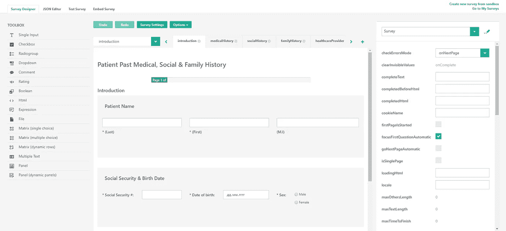
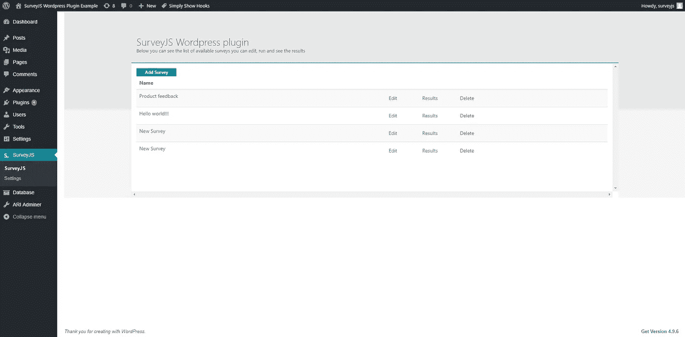
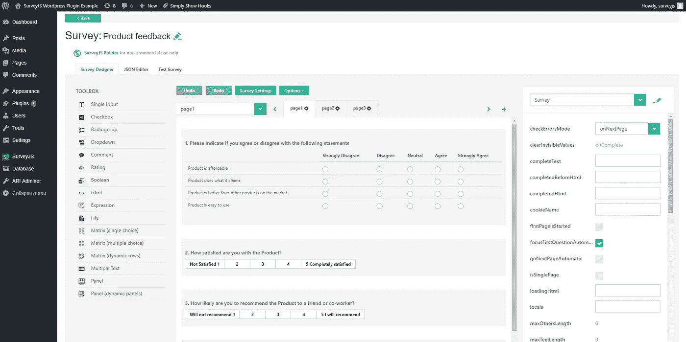
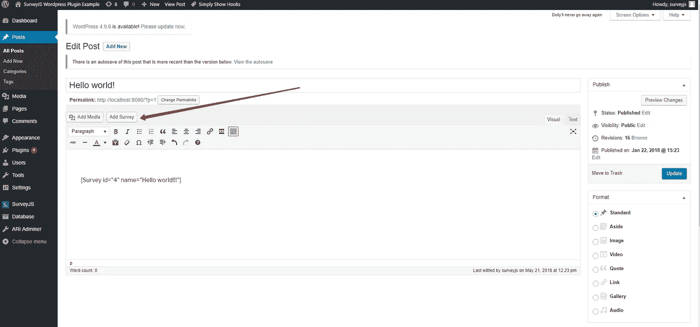
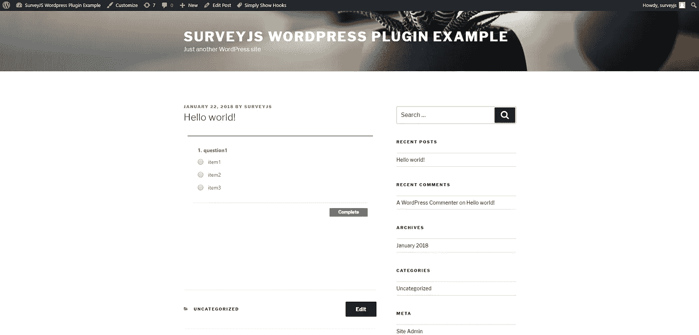
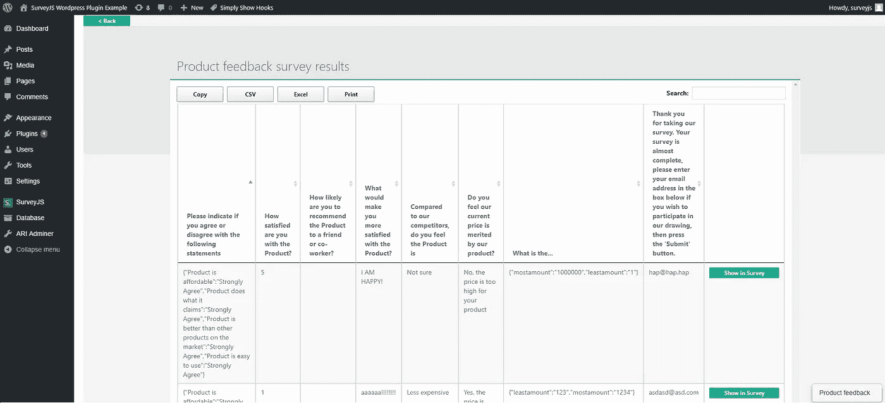

# Wordpress 的 SurveyJS 插件

> 原文：<https://medium.com/hackernoon/surveyjs-plugin-for-wordpress-9f42d9219db0>

我们很高兴为 WordPress 引入一个新的插件— [SurveyJS 插件](https://wordpress.org/plugins/surveyjs/)。它将帮助您创建调查、测验或表格。将它添加到你的 WordPress 站点上的任何页面或帖子，收集结果，并下载它们进行分析。

这个插件是免费的，在 [GPLv2](https://wordpress.org/about/license/) WordPress 标准许可下发布。不需要注册，只需安装和使用即可。它基于 SurveyJS 库，并使用了完整的 SurveyJS 功能。

## 这里简单列举一下*调查的特点:*

*   该插件有 15 个元素(问题和面板):从简单的输入，如文本和下拉菜单，到面板容器和动态矩阵(表格)来构建复杂的表单
*   多页支持
*   多种语言的本地化和对多语言调查/表格的支持(一项调查支持多种语言)
*   控制调查流程:能够为页面、面板、问题甚至复选框、单选按钮组和下拉框中的单个项目设置可见性表达式
*   从 web 服务为复选框、单选按钮组和下拉列表填充数据的能力
*   带有几个内置验证器的用户输入验证
*   在只读调查中显示结果的能力
*   几个好看的主题和更多

## 强大的编辑器

您可以使用名为 SurveyJS Builder 的强大可视化编辑器来构建调查。它可以从头开始创建调查，对其进行定制，并在您将调查发布到您的网站之前对其进行测试。

SurveyJS Builder

## 如何向您的网站添加调查

安装 SurveyJS WordPress 插件后，您可以打开可用调查的列表。在这里，创建一个新的调查，打开任意调查的编辑器窗口，打开调查结果窗口，并根据需要删除调查。

按下“添加调查”按钮，插件将创建一个新的调查，并在调查生成器窗口中打开它:

您可以轻松地将问题从左侧的工具箱拖放到设计图面，并通过使用就地编辑工具右侧的属性网格来设置属性。每个更改都会立即保存，您可以通过编辑器顶部中间部分的相应按钮来撤销它。

关于选项和设置的更多信息可以在[文档](https://surveyjs.io/Documentation/Builder/)中找到。

设计好调查后，我们可以通过帖子部分的“添加调查”按钮(Wordpress shortcode)将其添加到您网站的任何页面:

您将在页面预览模式下看到您的调查，并可以接受调查。瞧啊。我们做到了！

结果呢？—您在问…调查结果窗口可通过“结果”在调查列表中找到:

您可以对结果进行排序、搜索，并以最流行的格式导出它们。

## 支持、错误修复和新版本

SurveyJS 是一个流行的平台，可以帮助你用 JavaScript 创建调查、测验和表格。这个插件是 Project SurveyJS 的一部分，将被进一步开发。除了内置的 [Wordpress](https://wordpress.org/support/plugin/surveyjs) 论坛和 GitHub 问题跟踪器，你还可以在我们的 AnswerDesk 网络应用中提问。

我们期待您的反馈，并努力尽快修复您发现的错误。