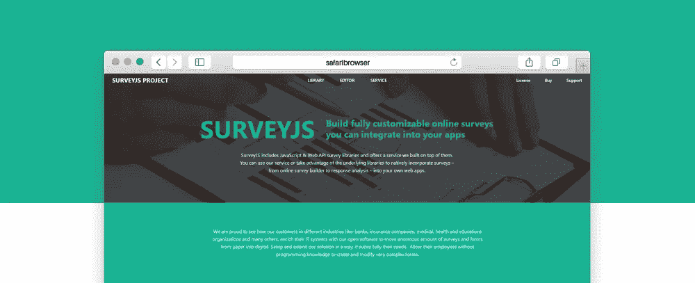

# SurveyJS:调查和表单构建器库中的新功能(2018 年上半年)

> 原文：<https://medium.com/hackernoon/surveyjs-whats-new-in-survey-and-form-builder-libraries-first-half-of-2018-a02dd8888ed>



距离我们发布 1.0 版本的调查库和表单生成器已经过去半年了。在过去的六个月中，我们实现了流行的客户场景，为非技术用户提供了更简单的体验，并提高了 Form Builder 的可用性。本文总结了所有这些增强。

如果你是 SurveyJS 的新手，你可能也想看看我们的[网站](https://surveyjs.io/)或者回顾一下我们以前的文章，包括 [Meet SurveyJS](https://hackernoon.com/meet-surveyjs-d8ac6a61db62) 和 [SurveyJS 出测试版](https://hackernoon.com/surveyjs-an-open-source-javascript-survey-library-with-versions-for-angular-2-react-vue-2086d988b974)。

# 动态过滤选项、列和行

许多调查都有某种条件逻辑，我们确实允许根据特定的条件筛选出问题，或包含多个问题的面板。我们的客户要求我们提供另一种级别的控制，事实上这是过去几个月中最受欢迎的要求。现在，您可以根据之前在调查中的选择来控制哪些答案选项可见。

**方法#1:指定单个选项的可见性条件**

看看下面的例子。只有在前一个问题中输入了电话号码，才会出现两个沟通渠道选项——短信和 WhatsApp。

Filter individual choice items

现在无需编写代码就可以实现这种行为。我们已经为答案选项引入了“visibleIf”属性，您将在上面的 JSON 中找到以下几行:

```
choices: [
   "Email",
   { value: "Text Messages", **visibleIf**: "{phone} notempty"},
   { value: "WhatsApp", **visibleIf**: "{phone} notempty"}
]
```

**方法 2:显示之前问题中选择的选项**

本例中的问题根据用户的回答逐步筛选出浏览器。

Filter item choices

逻辑分析如下。

1.  显示完整的浏览器列表。

```
name: "installed",
choices: ["Chrome", "MS Edge", "FireFox", "Internet Explorer", "Safari", "Opera"]
```

2.仅显示上一个问题中选中的浏览器。

```
name: "default",
**choicesVisibleIf: "{installed} contains {item}",** choices: ["Chrome", "MS Edge", "FireFox", "Internet Explorer", "Safari", "Opera"]
```

SurveyJS 迭代所有“选择”，并将每个“选择”作为一个“{item}”替换到“choicesVisibleIf”中。只有使表达式为真的选项才会出现在列表中。

3.显示在#1 中检查的浏览器，排除匹配#2 的浏览器。

```
name: "secondChoice",
**choicesVisibleIf: "{installed} contains {item} and {item} != {default}",** 
choices: ["Chrome", "MS Edge", "FireFox", "Internet Explorer", "Safari", "Opera"]
```

# 答案选项中的动态文本支持

SurveyJS 允许您使用包含变量占位符的“邮件合并”样式的动态字符串，如下所示:

```
"{user_display_name}, could you please confirm your e-mail:"
```

新版本将对这种格式的支持扩展到了问题标题之外。您现在可以在答案选项、矩阵列、行标题等中使用它——就像我们的客户一直在问我们的那样。

下面的 JSFiddle 展示了一个例子。

The processing in checkbox choices

# 旋转矩阵

如果您的矩阵问题有很多列，只有几行，您现在可以选择旋转显示，从而更有效地使用屏幕空间。这在较小的设备上可能特别方便。

要切换列和行，请使用 **columnLayout** 属性。您可以在矩阵、矩阵下拉列表和矩阵动态问题类型中找到它。

看看[我们文档中的一个例子](https://surveyjs.io/Examples/Library/?id=questiontype-matrixdynamic-vertical)。

# 矩阵动态和面板动态中新条目的默认值

如果您想开始一个已经填写了预定义答案的调查，请使用已经存在一段时间的“default value**”**属性。

如果您使用矩阵动态或面板动态问题，该属性将负责您的初始条目，但最终用户可能会创建额外的行和面板。这是我们过去要求您处理事件和编写自定义代码的地方。在最新版本中，我们添加了 defaultRowValues 和 defaultPanelValues 属性，以便您可以轻松地为动态添加的行和面板指定选择，如果它们需要对每个新条目都相同的话。在 JSON 或我们的设计器对话框中设置这些属性值。

# 矩阵动态和矩阵下拉列表中的自定义单元格类型

我们正在取消对您可以在矩阵动态和矩阵下拉列表中使用的单元格类型的限制。如果以前你只能使用文本、下拉菜单、单选按钮组、复选框和一些其他选项，现在你可以嵌入任何 SurveyJS 问题类型或自定义小部件。

下面的示例演示了一个带有星级单元格的矩阵。

Star rating in matrix cells

要了解如何在 Form Builder 中设置新的单元格类型并注册其属性，请看[这个例子](https://surveyjs.io/Examples/Builder/?id=matrixcustomcelltypes)。

# 新问题类型:量规矩阵

标题矩阵与标准矩阵相似，但显示的单元格带有就地描述，而不是单选按钮。使用 Cells 属性设置每个单元格的文本。

[查看一个标题矩阵示例](https://surveyjs.io/Examples/Library/?id=questiontype-matrix-rubric)

# 问题标题:隐藏或更改位置

使用 question 对象中新的“ [titleLocation](https://surveyjs.io/Documentation/Library/?id=Question#titleLocation) ”属性，在问题的左侧、上方、下方显示标题，或者隐藏标题。使用问题容器(面板或页面)设置将值设置为“默认”以进行集中控制。

# 文件问题:支持多文件上传和文件类型过滤

我们向文件问题添加了一些有用的属性。

**允许多重**

如果设置为 true，最终用户将能够使用单个文件问题上传多个文件。

接受的类型

允许您限制文件类型。默认值是一个空字符串，允许任何类型。有关可用属性值的详细信息，请参见 [HTML 输入的“接受”属性规范](https://www.w3schools.com/tags/att_input_accept.asp)。例如，如果您希望仅允许 PDF 文件，请将 acceptedTypes 设置为"。pdf”。

# 表单生成器中的可用性改进

下面是对表单生成器的一些主要更改:

*   就地编辑—用户可以直接在 Form Builder 界面上更改问题标题和项目。
*   支持多个主题—您现在可以选择一个预定义的主题或手动构建一个自定义主题。
*   可定制的项目编辑器
*   弹出式编辑器中带有可折叠部分的折叠型—在设置显示中实现更好的结构
*   新建表达式向导—帮助用户构建“visibleIf”和“enableIf”表达式
*   改进的页面编辑器—简化了您处理多页调查的方式
*   分类工具箱-现在可以对工具箱项进行分组

参见 [SurveyJS:改进的表单生成器可用性](https://medium.com/p/3373f8577af3/edit)文章了解更多详情。

# 集成示例

在我们不断努力使 SurveyJS 库尽可能平稳地集成到您选择的网站引擎中的过程中，我们已经创建了现场样本，展示您如何将 SurveyJS 集成到几个流行的后端中——PHP、[NodeJS 和 ASP.NET MVC 核心](https://surveyjs.io/Examples/Service/)。