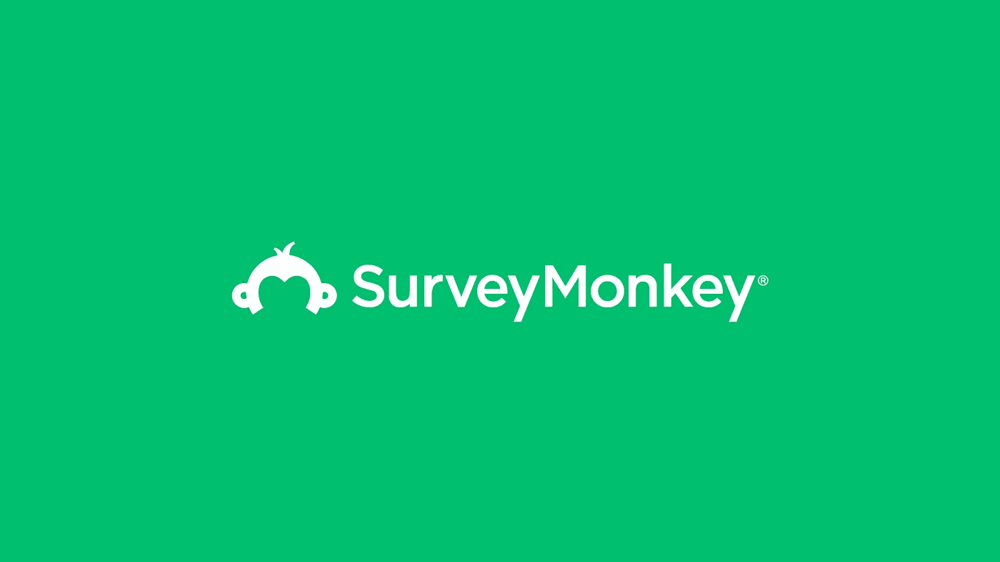
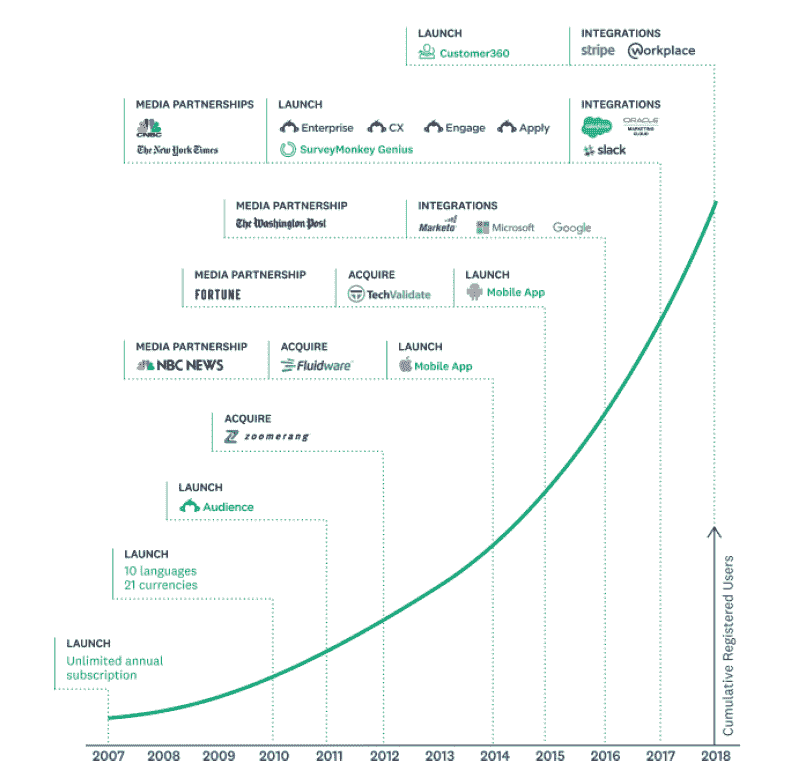
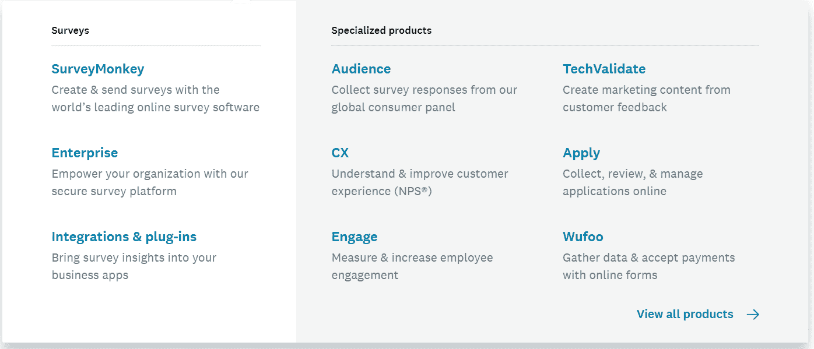
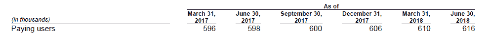
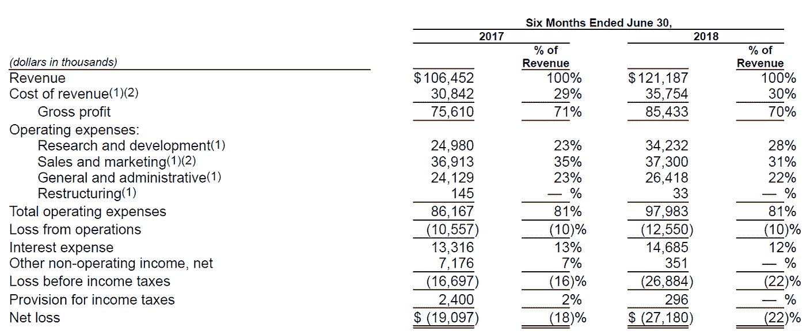
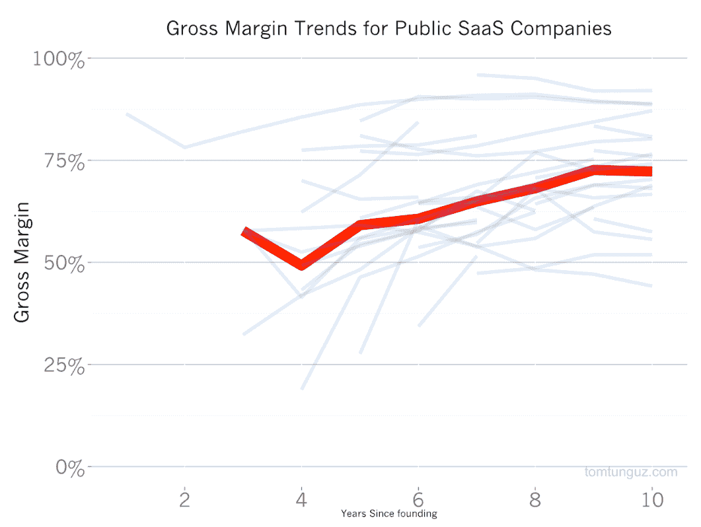
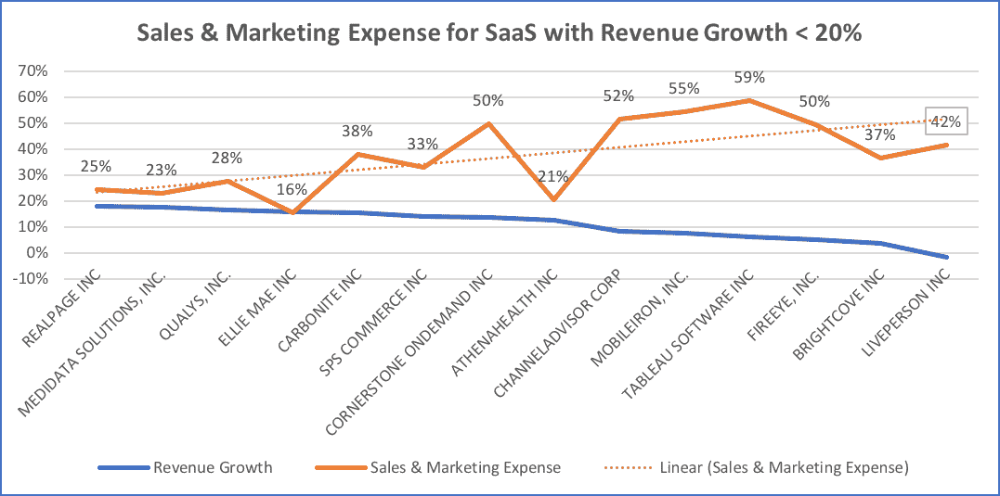
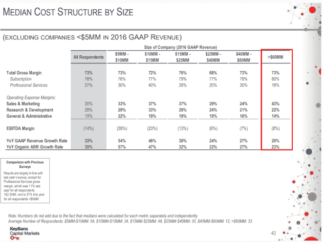
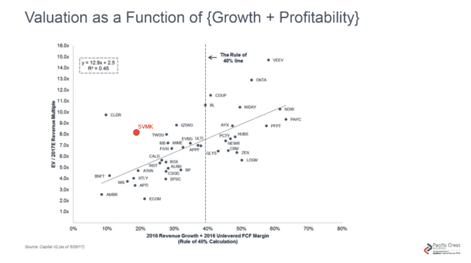

# SurveyMonkey IPO:如何看待它

> 原文：<https://medium.com/hackernoon/surveymonkey-ipo-what-to-make-of-it-2cbcc1813e6>

**公司概况**

[SurveyMonkey](https://hackernoon.com/tagged/surveymonkey) (SVMK)上个月上市，在公开市场筹集了约 1.8 亿美元，并开始在纳斯达克交易，股票代码为 SVMK。它出售在线调查 SaaS 产品，帮助个人和组织收集和测量反馈。一些用例是市场研究、从客户那里收集数据、员工和客户参与度测量等。

SVMK 于 1999 年作为一个简单的在线调查工具开始，通过扩展核心产品、推出新的产品线、收购公司以及与合作伙伴整合，已经发展成为一套产品。

这是过去十年中产品发布、收购和合作的时间表

在 190 多个国家和地区，客户使用 SVMK 的产品每天产生超过 2000 万个答案。除了面向自助服务和企业客户的旗舰调查产品，SVMK 还有非常专业的用例产品:Audience、CX、TechValidate、Engage、Apply、Wufoo 等。

**资助**

根据 Crunchbase 的数据，在首次公开募股(IPO)之前，SVMK 已经筹集了总计 11 亿美元的资金——包括债务和股票。在 2014 年的上一轮融资中，该公司的估值为 20 亿美元。因此，12 美元的发行价使该公司的估值达到了 15 亿美元——比上一次估值有所下降。在 IPO 时，老虎环球是最大的股东，现在仍然是，持有 29%的股份，其次是雪莉·桑德伯格，脸书的首席运营官，持有 10%的股份，他已故的丈夫大卫·戈德堡是 SVMK 的首席执行官。

**用户&增长**

SVMK 有一个高效的自助服务模式，使他们更容易获得大规模的客户。自成立以来，SVMK 共吸引了 6000 多万注册用户，其中 1600 万是在过去一年中活跃的。

该产品的病毒性质——在每份调查表的末尾都签有“由 SVMK 提供动力”——使得用户获取变得高效。难怪 80%的个人付费用户要么直接通过他们的网站，要么通过有机搜索。

在 1600 万总活跃用户中，61.6 万是付费用户(在 2018 年 Q2 奥运会上)，这意味着 3.85%的健康免费到付费转换率。相比之下，2018 届的另一家 IPO Dropbox 的免费到付费转换率约为 2%。

这些付费用户遍布 300，000 个组织域(这意味着人们已经使用@organization.com 电子邮件帐户创建了一个帐户)，覆盖了 98%的财富 500 强公司。尽管这 300，000 名客户中的大多数都采用自助服务模式，但 SVMK 也与 2，900 多名客户签订了组织级合同，这些客户带来了 12%的总收入。

即使付费用户基数巨大，但如果我们看看付费用户的增长率，SVMK 似乎已经碰壁了:付费用户从 2017 年 Q2 的 59.8 万增长到 2018 年 Q2 的 61.6 万，同比仅增长 3%。

然而，同期收入增长了 18.7%，从 1.021 亿美元增至 1.212 亿美元。为什么营收和用户增长率如此背离？原因是:2017 年个人用户计划的变化，以更高的价格提供了更多的功能。由于这一点，ARPU(每用户平均收入)从 2017 年的 350 美元增加到 2018 年的 400 美元，对 Q2 2017 年到 Q2 2018 年的总收入增长贡献了 80%；其余 20%来自用户增长。这显示了 SVMK 产品对其客户群的定价能力。

> ***“评估一家企业最重要的决定是定价能力。如果你有能力提高价格而不把生意输给竞争对手，你的生意就非常好。如果你不得不在提价 10%之前祈祷，那你的生意就糟透了。”*巴菲特**

然而，SVMK 能在短期内再次改变计划和定价吗？如果不是，下一个问题是，未来的增长来自哪里？

它能否通过大幅减少客户流失或向现有客户群销售更多产品来实现增长？这让我们想到了 SaaS 业务的另外两个关键增长动力。

**保留和扩展**

*保持力*

SVMK S-1 并未提供其客户群的详细群组级别流失率，以解释近年来流失率是下降了还是提高了。尽管如此，他们的整体流失数字看起来已经很健康:2017 年，超过 75%的收入来自前几年的现有客户。对于 2018 年 H2 奥运会，大约。基于域名的客户年化收入的 75%来自过去三年一直向 SurveyMoneky 付费的客户。因此，我认为在不久的将来，客户流失的大幅减少不会带来收入的大幅增长。

*膨胀*

基于美元的净留存率，即公司在考虑年度计划中个人用户的流失、追加销售、交叉销售和扩张后，可以从现有客户中保留多少收入，为 80%，而基于组织美元的净留存率始终高于 95%。

虽然单个数字的净留存率还不错，但它明显低于组织基于美元的净留存率。因此，客户组合向更多组织级客户的转变会对公司的增长轨迹产生重大影响。

SVMK S-1 也揭示了该公司在这方面的计划。它计划通过建立一支销售队伍来获得更多的组织级客户，根据 SVMK 的说法，由于产品的自助性质，这“在历史上一直是有限的”。

不过，SVMK 在这些组织中有很大的渗透力。600，000 个付费客户群中的 300，000 个组织域，以及 98%的财富 500 强公司中的付费用户。然而，其中大多数都是基于自助服务模式，并且与公司没有任何组织级别的合同。

为了推动未来的增长，Survey Monkey 希望将这些客户纳入组织层面的合同。为了加强这方面的努力，它今年还推出了新产品 Customer 360。

*“Customer 360 是我们专有的基于信号的系统，由我们的数据科学模型驱动，该模型分析我们整个用户群的使用模式和信号，以确定将活跃用户转化为付费用户、向企业客户追加销售组织、扩展现有企业关系以及交叉销售专门构建的解决方案的机会。”*

然而，瞄准组织级客户可以显著改变公司的商业模式。如果发生这种情况，财务指标将会如何改变，以及改变多少？

**财务指标**

这是任何一家公司的财务图表中，最能说明公司商业模式的图表。

毛利率保持在 70%以上，处于美国大多数 SaaS 上市公司的水平。然而，它仍然略低于其他 SaaS 公司，这些公司和 SVMK 一样成熟，正如你从下图中看到的(数据是四年前的，但数字不会有很大不同)。

如果客户组合更多地从自助服务转变为组织级合同，毛利润将进一步下降，因为服务企业客户的人员成本将远远高于自助服务客户。

另一个可能发生重大变化的项目是销售和营销(S&M)费用。通过自助服务模式和免费增值产品的内置病毒功能，SVMK 已经能够将其 S&M 费用保持在较低水平(约为 100 万美元)。去年收入的 32%)，而其他知名 SaaS 上市公司的平均增长率为 42%。

(Source: OPEXEngine)

然而，更多地关注企业客户将需要建立一支销售队伍，从而增加 S&M 费用并影响业务的整体利润。如果 S&M 的费用增加，它能够或者能够降低 R&D 和 SG&A 的费用，将 EBITDA 保持在当前接近 25%的健康范围内吗？

该股在 IPO 当天上涨了 56%，开盘价为 18.75 美元。然而，在撰写本文时，该公司的交易价格略低于 13 美元，这使得该公司的企业价值约为 18.5 亿美元，这意味着其交易价格是 TTM(过去 12 个月)收入的 8.29 倍。

如果我们要绘制 SVMK 的估值倍数与增长率的关系图，并将其与其他 SaaS 公司进行比较，它会显示在下图中红色小圆圈的周围。*去除价格上涨的影响，价格上涨占去年增长的 80%，将使红色圆圈进一步向左移动。

在支付了 1 亿美元的债务后，该公司计划将剩余的 1.2 亿美元用于扩张。观察 SVMK 如何有效地利用这笔钱来扩大销售和进一步发展将是一件有趣的事情。

如果你一直在看这家公司，并有任何有趣的想法要补充，请随时留下任何评论。

*其他公司的收入倍数是使用 FTM(未来 12 个月)计算的，我们在 SVMK 还没有这种方法。

感谢 Alfonso 阅读草稿并提出修改建议。

免责声明:文章中表达的所有观点都是我个人的观点，不代表我所属的任何组织的观点。另外，我没有持有任何 SVMK 股票。