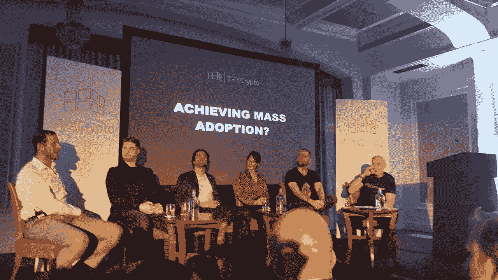
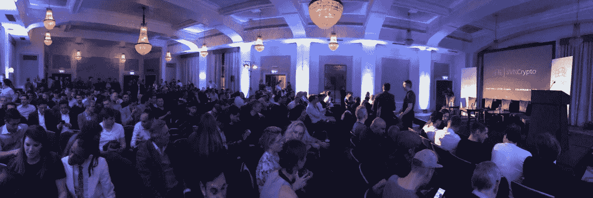

# SVK 本周在他们欣欣向荣的伦敦会议上谈论监管和大规模采用

> 原文：<https://medium.com/hackernoon/svk-talks-regulation-and-mass-adoption-at-their-thriving-london-meet-up-this-week-84cc09c694df>

Panel from left to right: Stephen Kelso (Galaxy), David Packham (EOS 42), Alex Perrin (Virgin Ventures), Jess Houlgrave (Codex), Piers Ridyard (Radix) and Shane Kehoe (SVK).

2018 年 10 月 26 日//伦敦

10 月 24 日星期三，我们参加了 SVK 的行业会议。出席人数甚至高于联合创始人谢恩·凯霍 的预期(仅基于主席与与会者的比例)。我相信这在一定程度上要归功于他们出色的小组成员，比如银河数字欧洲的负责人、 [**斯蒂芬·凯尔索**](https://www.linkedin.com/in/stephen-kelso-60a63654/) 和维珍风险投资的 [**亚历克斯·佩兰**](https://www.linkedin.com/in/alexandre-perrin-8/?originalSubdomain=uk) 等人物，但重要的是要归功于谢恩和 SVK 团队为发展伦敦区块链社区所付出的辛勤工作，这显然是存在的，并且正在蓬勃发展。

Another thriving meet up with Eos42 as sponsors

介绍结束后，谢恩很自然地将小组成员引向了争论的核心；**规定**。让小组成员了解机构资金的动向是非常有见地的，斯蒂芬和亚历克斯都提供了以前大众无法获得的见解。最终，他们得出结论，不管其“去中心化”和“反现状”的性质如何，监管对加密资产来说是不可避免的。

密码爱好者反对监管是非常典型的，因为他们经常看到政府试图“控制”数字资产，其目的就是要独立于这些限制。该小组在一些听众的支持下明确表示，他们认为实施监管是为了保护个人。为了进入经济并得到认真对待，数字货币应该符合现有框架，以保护投资者免受今天在数字蛮荒的西部漫游的众多恶意个人的影响。

这就是 [**大卫·帕卡姆**](https://www.linkedin.com/in/davidpackham/)*创始人 **EOS 42** 提供的一些第一手见解。在与 FCA 进行了一系列交谈后，他表示，他发现监管机构主要专注于打击 ICO 市场，我们都知道这个领域远非完美。*

> *“监管将为比特币披上合法性和体面的面纱”*

*剑桥大学(University of Cambridge)贾奇商学院(Judge Business School)的克里斯蒂安彭伯顿(Christian Pemberton)赞同这种观点，认为监管的到来将增强更为谨慎的传统市场的信心。*

> *“最终，比特币的价值将不是由监管决定的，而是它在现实世界应用中的效用，包括作为支付系统或价值储存手段。从长期来看，监管可能对加密货币有利，因为这将有助于将其作为一种资产类别合法化，并为投资者提供保护，加速其采用。”*

***Richard Durant，**新加坡南洋商学院认为，许多散户投资者曾经害怕的东西，最终将使这项技术获得最终的成功。([引自《金融时报》](https://www.ft.com/content/5a9d757e-5836-11e8-bdb7-f6677d2e1ce8)。)*

*除了法规，专家组提出了另一个障碍，并确定 UX 和用户界面问题是阻碍主流采用该技术的领域。访问和利用代币及其底层技术的困难显然无助于推动代币的使用，但他们仍然相信，未来几个月和几年将会取得进步，以纠正这一问题。就我个人而言，我认为 UX/UI 是开发人员最关心的问题之一，因为在此之前，生态系统的许多方面都需要完善，比如可伸缩性和安全性。*

***史蒂芬·凯尔索**陈述了一个有趣的统计数据，如果可信的话，它揭示了与投资者构成相关的行业现状。他声称 93%的加密货币投资者是散户，这肯定可以解释过去经历的情绪驱动的波动。(在过去的一个月里，纳斯达克、道琼斯和标准普尔 500 指数实际上比比特币更不稳定，这并不奇怪，因为它的横向波动)。来源: [**比特币杂志**](https://bitcoinmagazine.com/articles/past-month-bitcoin-has-been-less-volatile-nasdaq-dow-and-sp-500/)*

*在我们最近参加的会议上，大规模采用是一个反复出现的话题。从抽象的意义上讲，想象更多的人进入和购买市场是很容易的，但是我不太确定市场容量的增加是否构成“大规模采用”，这将有助于定义这一点。Alex Perrin 间接提到了***【50 亿无法使用传统金融系统的人】*** 在大规模采用方面的重要性，我倾向于同意这一点。*

**

*Instead of first trying to disrupt, we should look to empower the billions*

> *为了促进这项技术的采用，我们应该向那些被传统系统排除在外的人提供服务，并促进自下而上的采用和改革。*

*与高度发达的金融和经济体系正面交锋不是挑战它们的可行方式，因为速度和成本等方面的比较会很快进行，从而分散最终消费者对区块链根本利益的注意力。我们不应该首先试图破坏，而应该寻求授权。数十亿人的生活超出了金融习惯者的预期，以此衡量，他们不会期待如此精致和用户友好的体验，这可能为更快的采用铺平了道路。*

*总之，我认为监管经常被误解，在一个仅受情绪驱动的散户投资者驱动的市场中，这可能是有害的。我从这次讨论中得出的主要观点是，需要做更多的工作来教育那些参与市场的人，让他们了解监管将是什么样子，以及如果实施深思熟虑的监管，它将如何使整个生态系统受益。*

*重要的是要记住，我们正处于早期，特别是在 1993 年作为互联网背景下的比较年(由专家组决定)。*

*— — — — — — — — — — — — — — — — — — — — — — — — — — — — — —*

*作者:Oliver Kicks，Coinweb 分析师。 [oliver@coinweb.io](http://oliver@coinweb.io) ，【https://twitter.com/kickso】T2*

*— — — — — — — — — — — — — — — — — — — — — — — — — — — — — —*