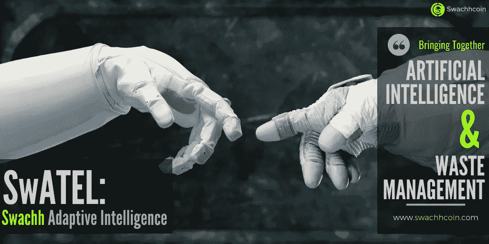

# Swachhcoin 和人工智能

> 原文：<https://medium.com/hackernoon/swachhcoin-and-artificial-intelligence-2dba36eaea98>

## **为什么我们需要人工智能来管理垃圾？**

人工智能的概念是在大约 50 年前提出的，它被认为是技术的未来。它通常指拥有人类所拥有的那种智能的机器或软件。因此，利用这项技术将允许我们将一些需要某种程度智能的任务(如驾驶汽车)分配给机器。

# **人工智能的崩溃**

人工智能基于四个核心功能。这些是:

## **知识工程**

这决定了机器利用常识、解决问题的技能和智能来完成困难任务的能力

## **机器学习**

机器学习是机器利用自己掌握的数据来发展其智商的能力。人们期望人工智能能够在没有任何监督的情况下做到这一点。

## **机器感知**

机器感知是指机器利用感官输入对情况、物体或人物进行分类的能力。这类似于人类处理周围环境的方式。

## **机器人技术**

机器人只是指人工智能操纵和导航物体的能力。

上述功能是人工智能区别于普通计算机的地方。如果我们深入分析这些功能，我们会发现人工智能基本上受高效数据存储系统的支配。人工智能的决策和学习过程完全依赖于大量数据的可用性。

## **区块链:去中心化、不可变的数据**

区块链是一个数据存储系统，它以加密的形式存储数据，并在节点间分发数据。因此，[区块链非常适合人工智能的核心功能，因为人工智能能够访问可以共享和审计的数据集合。](https://hackernoon.com/artificial-intelligence-blockchain-passive-income-forever-edad8c27844e)

# **在废物管理系统中实施人工智能**

全球废物管理系统将极大地受益于人工智能和区块链在各种废物管理应用和工具中的应用。目前，有公司正在考虑将废物收集和回收过程中涉及的过程自动化。他们打算创建能够识别数据模式的系统，这将反过来触发执行废物管理任务的系统方法。

## **为什么废物管理系统需要人工智能？**

## **人工智能非常适合垃圾收集**

由 AIs 驱动的智能垃圾桶的实施将自动优化目前收集垃圾的方式。AIs 可以被编程以核对垃圾桶中废物的体积、水平和含量，并将其输入区块链网络进行处理。因此，废物收集可以在最佳时间进行。

## **人工智能将优化垃圾处理系统**

大多数废物处理厂仍然手工分类和回收废物，因此，全球回收率仍然很低。将人工智能引入废物处理系统肯定会提高回收率，同时消除人为错误并降低运营成本。

# **结论**

使用 AI 来管理废物将有效消除当前困扰我们地球的废物管理危机。由于像 [Swachh](https://swachhcoin.com/) 这样的公司致力于实现智能废物管理系统，我们将见证废物管理行业的一场革命。

> 想了解更多关于斯瓦希里语的信息，请访问:[https://swachhcoin.com/](https://swachhcoin.com/)
> 
> 链接到 Swachhcoin 主要销售:[https://swachhcoin.com/ico](https://swachhcoin.com/ico)

## 在此加入我们的社区:

[Official Telegram Discussion Group](https://t.me/swachhcoin)

[Twitter Channel](https://twitter.com/@swachhcoin)

[Facebook FanPage](https://www.facebook.com/swachhcoinofficial/)

[Swachhcoin Subreddit](https://www.reddit.com/r/swachhcoin/)