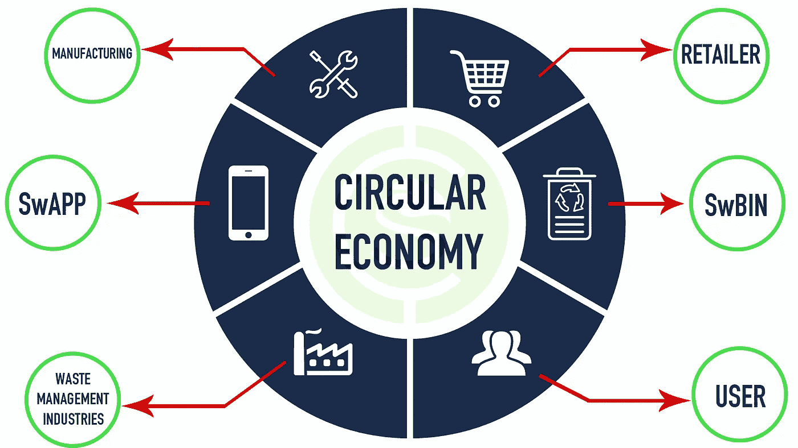

# 兑换金币与循环经济

> 原文：<https://medium.com/hackernoon/swachhcoin-and-circular-economy-9d5ad1dcd68b>

> “在不断重复利用我们开采的资源的基础上，重新思考和设计我们的经济模式，这无疑是我们标准经济的现代化和积极发展。”

Swachhcoin and Circular Economy: How Do They Go Hand in Hand?

人类浪费和消耗所有的自然资源，并把自己推向一个反乌托邦时代的想法是一个经常谈论的概念，并在书籍，电视，电影甚至严肃的政治讨论中得到报道。

随着环境污染和全球变暖通过食物和材料废物以及温室气体等因素的影响越来越大，似乎所有这些理论和小说作品都可能指向一些有形的东西。

这就是为什么越来越多的实体正在寻找解决方案，不仅允许人们有效地处理他们的废物，而且通过生产可再生资源将产生的废物投入使用，包括但不限于可以反复使用的燃料、能源和生物可降解材料。

这赋予了循环经济的概念以生命，这反过来又让许多环保公司带着他们的解决方案走到了前列。

一家这样的公司恰好是[swachcoin](https://swachhcoin.com/)，这是一种生态友好的废物管理解决方案，它不仅允许人们负责任地丢弃垃圾，而且将废物转化为可以有效回收的有生产力的东西。

这项位于区块链的倡议利用了物联网、大数据和人工智能等多种日常设备和技术，以提供可以从家庭、医院、工业企业以及农业地区获取废物的解决方案，并将其转化为一种全功能的经济模式，这种模式可以彻底改变我们所知的当前经济，使其成为一种全循环机制。

## 【Swachhcoin 在循环经济中是如何运作的？

Swachhcoin 将通过其专门创建的 SWBins 收集废物，这些 SW bins 是专门的废物处理装置，将放置在不同的位置，方便用户使用。这将有助于从家庭中有效收集废物，因为家庭通常每天都会产生食物和材料废物。

除了家庭以外，Swachhcoin 将通过专门的收集中心收集医院的材料和医疗废物、工业和原材料废物以及农村地区的农业废物。

从这里开始，从家庭、医院、工业和农村地区收集的废物将被送往 Swachhcoin 指定的废物处理单位，该单位将通过不同的流程将这些废物转化为有形的可用资源，如燃料、能源、金属、各种材料和肥料。

这些生产出来的资源就像它们被初次消费之前一样，可以对更大的经济做出贡献，这就是它们如何为了地球的更好而重复其存在的循环。

通过这种有利的结构和方法，新发现的循环经济概念将看到供应再循环、资源回收、工业供应和材料循环经济汇集在一个保护伞下，以创建一个真正的循环商业模式，这不仅将为有关各方提供负担得起的可再生材料，而且还将有益于我们居住的地球，地球仍然迫切需要这种解决方案。

## 【Swachhcoin 的解决方案效果如何？

Swachhcoin 的计划将是一个典型的示范，让*开采——生产——消费——废物*的生命周期链进入的循环，只要人们对此感兴趣，这将是自我可持续的(生命周期链得到了像[欧洲环境署](https://www.eea.europa.eu/soer/synthesis/synthesis/chapter4.xhtml)这样的受尊敬机构的认可和遵循)。

该项目目前正在开发中，正在经历众筹阶段，但一旦它开始向大众提供其拟议的解决方案，可以肯定地说，它将有可能成为其业务所涉及的任何领域的主要废物和资源管理解决方案。

*   在这里加入我们的预售:[https://swachhcoin.com/pre-sale/](https://swachhcoin.com/pre-sale/)
*   更多详情，请访问:[www.swachhcoin.com](http://www.swachhcoin.com)
*   电子邮件:[info@swachhcoin.com](mailto:info@swachhcoin.com)

## 在此加入我们的社区:

[Official Telegram Discussion Group](https://t.me/swachhcoin)

[Twitter Channel](https://twitter.com/@swachhcoin)

[Facebook FanPage](https://www.facebook.com/swachhcoinofficial/)

[Swachhcoin Subreddit](https://www.reddit.com/r/swachhcoin/)