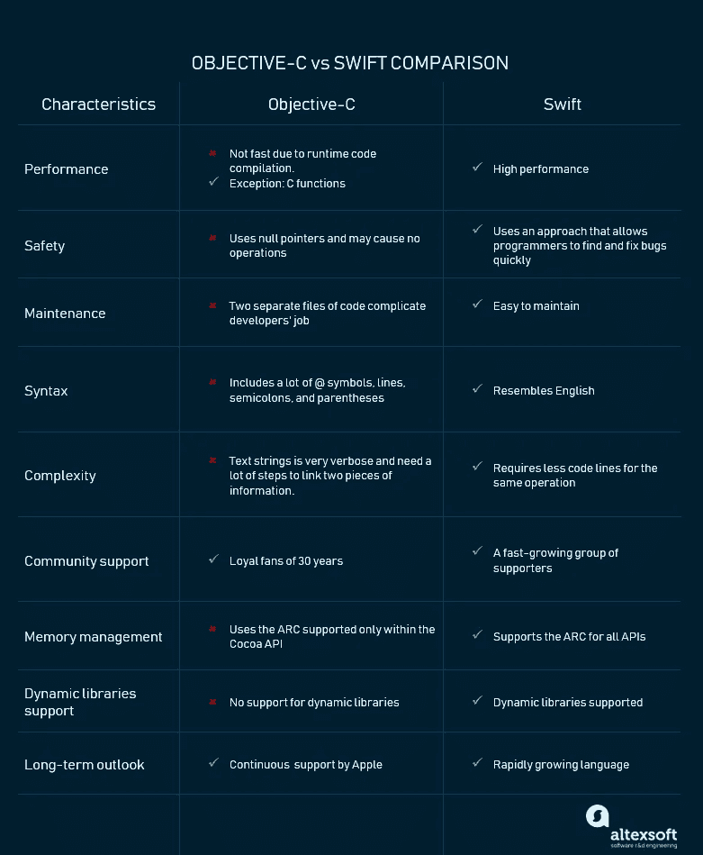
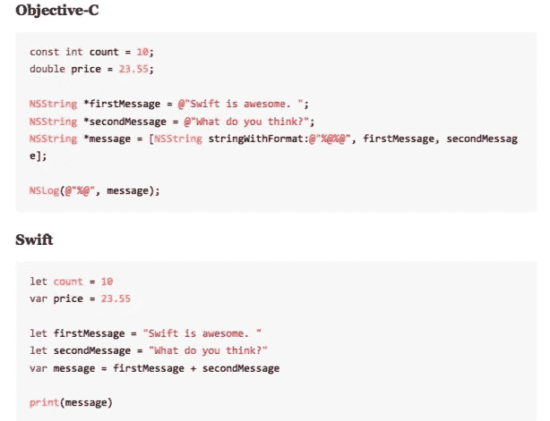
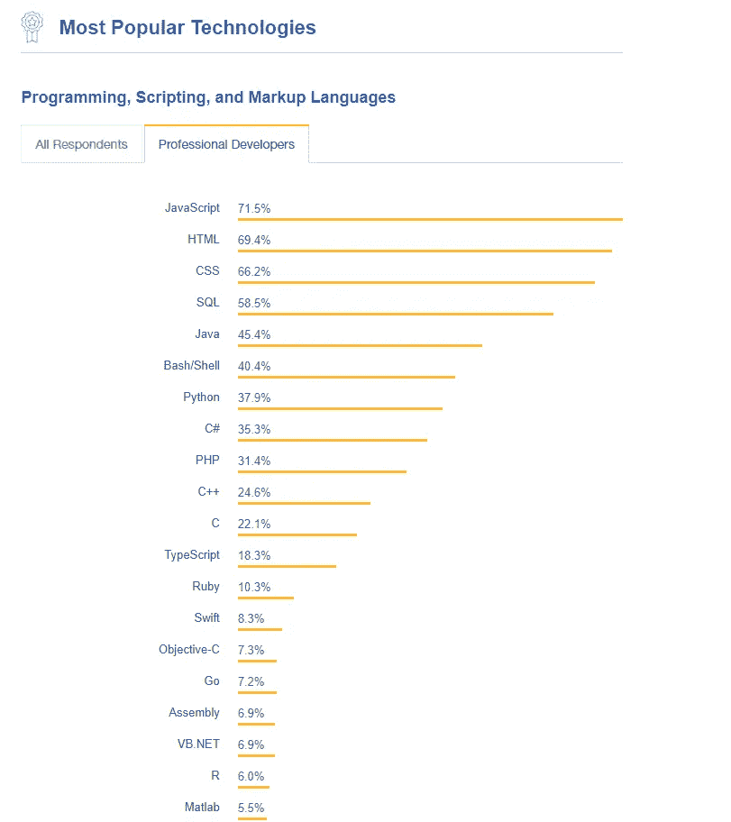

# Swift vs Objective-C:淘汰旧的，引入新的

> 原文：<https://medium.com/hackernoon/swift-vs-objective-c-out-with-the-old-in-with-the-new-b47f16aea075>

虽然今天 Objective-C 主要被认为是创建 iPhone 应用程序的语言，但它的开发可以追溯到 20 世纪 80 年代。创建后不久，它被史蒂夫·乔布斯的公司 NeXT Computer Inc .授权开发 NeXTStep 框架，后来成为许多标志性苹果产品的基础。基于另外两种语言，C 和 Smalltalk，它从 Smalltalk 接收对象语法，从 C 语言接收非面向对象操作的语法。因此，Objective-C 语言的一个特点是它非常成熟，并且经过了几代开发人员的测试。

另一方面，Swift 是一种新的编程语言，由苹果公司于 2014 年 6 月首次发布。Swift 在本质上类似于 Objective-C，但它也具有 Objective-C 所缺乏的一些基本特性。请务必阅读我们在专门文章中对 [Swift 利弊的全面概述](https://www.altexsoft.com/blog/engineering/the-good-and-the-bad-of-swift-programming-language/?utm_source=MediumCom&utm_medium=referral)。

自从 Swift 推出以来，iOS 开发者就开始热烈争论哪种语言更好。在对一种新的、更简单的构建应用程序的方式的普遍兴奋中，也有怀疑者，不确定这个世界是否需要另一种变革性但健忘的技术。尽管如此，在短短三年内，Swift 成为了历史上发展最快的编程语言。尽管如此，苹果继续支持 Objective-C 作为老派开发者的替代方案。

但是，这些语言中的哪一种既能让开发人员的生活变得更轻松，又能为企业提供一个经济高效的解决方案呢？从业务角度来看，涉众在为项目选择语言时通常会考虑这些因素:开发成本、持续时间和进一步创新的范围。另一方面，开发人员会考虑简单的语法、有用的编译器和代码安全性。如果你没有选择[跨平台方法](https://www.altexsoft.com/blog/mobile/5-step-guide-to-choosing-between-native-and-cross-platform-development/?utm_source=MediumCom&utm_medium=referral)，做出这个选择对你项目的成功至关重要。

今天，我们比较这两种语言，以得出一个决定性的结论:为什么以及何时应该使用一种技术而不是另一种，Objective-C 在哪里成功，以及哪些好处使 Swift 在排名中获得分数？我们将在比较中考虑这些因素:

*   速度和性能
*   安全
*   维护
*   句法
*   代码复杂性
*   内存管理
*   支持动态库
*   社区认可
*   长期展望

*Objective-C vs Swift comparison*

# 表演

苹果官方网站声称 Swift 比 Objective-C 快 [2.6 倍](https://www.apple.com/swift/)。然而[一些研究](https://www.thedroidsonroids.com/blog/ios/swift-vs-obj-c-performance-comparision)表明这种差异并不显著。Swift 和 Objective-C 都是统计类型语言，使用相同的 [iOS SDK](https://docs.microsoft.com/en-us/appcenter/sdk/getting-started/ios) 和高质量的[低级虚拟机](http://llvm.org/)编译器。然而，有一些差异会影响应用程序的性能，我们将在下面进行描述。

## Objective-C 使用运行时代码编译

Objective-C 不是一种快速的语言。主要原因是它使用运行时代码编译，而不是编译时。这意味着当 Objective-C 对象调用代码中的另一个对象时，会涉及到一个额外的间接层。一般来说，这发生得非常快，但是当代码编译发生很多次时，它就变得可以测量了。Objective-C 是 C 的超集，所有用 Objective-C 编写的 C 函数都一样快。编写性能敏感代码的开发人员经常回头清除 C 语言中的那些内部循环。

## 斯威夫特被造得很敏捷

对于对性能敏感的代码，Swift 语言是一个很好的选择。根据许多[测试](https://www.primatelabs.com/blog/2014/12/swift-performance/)，它显示了 FFT 算法接近 C++的性能。对于 Mandelbrot 算法，Swift 也优于 C++。因为 Swift 仍然是一门年轻的语言，我们可以期待很快会有更多的改进。

# 安全

Swift 旨在提高 iOS 产品的代码安全性。它是作为一种类型安全和内存安全的语言而创建的。类型安全意味着语言本身可以防止类型错误。类型内存安全的重要性在于，它有助于避免与悬空或未初始化指针相关的漏洞。这些类型的错误是开发中最常见的，很难发现和调试。Swift 语言的这些优势使其更具吸引力。

## 使用空指针的 Objective-C 方法

理解 Objective-C '安全的重要一点是它使用空指针。指针是 C++和其他基于 C 语言的组件，它会导致安全漏洞。这种公开值的方法让开发人员能够更好地访问数据。指针的问题在于它们的处理方式。在 Objective-C 中，当你试图用一个空指针调用一个方法时，什么都不会发生。那么表达式和一行代码就变成了空操作(NOP)。乍一看，它似乎是有益的，因为它不会导致崩溃，但实际上，它可能是错误的广泛来源。NOP 会导致不可预测的结果，使查找和修复 bug 的过程变得复杂。

## Swift 是为干净的代码而创建的

另一方面，Swift 不使用指针。如果你在代码中遗漏了一个指针，也许是一个空值，程序就会崩溃。这种方法允许程序员快速找到并修复错误。因此，代码会更清晰，更容易理解。泛型、可选性和类型干扰等特性使得在 Swift 中开发的应用程序不太可能包含未被注意到的错误。

# 维护

在 Objective-C 中管理文件是一个令人沮丧的过程，因为开发人员必须管理两个独立的文件。而 Swift 需要的维护较少，不需要您管理两个文件。事情是这样的，Swift 自动完成 reliances 并在文件中执行增量构建。

## 在 Objective-C 代码中维护两个独立的代码文件

Objective-C 是从 C 语言发展而来的，它依赖于 C 语言来进行改变和改进。开发人员必须在 Objective-C 中维护两个独立的代码文件，以提高应用程序的效率和开发时间。它还需要人工同步方法名和注释。

## 维护单个程序代码文件

Swift 和许多现代语言一样，更容易维护。LLVM 编译器和 Xmind 找出需求并自动完成增量构建。结果，客观 C 头(。h)文件和实施(。m)文件组合成一个单独的(.swift)程序代码文件。

# 句法

苹果对 Swift 的目标是设计一种简单易懂的语言。Objective-с和 Swift 的区别在于，Swift 使用所有有助于编写干净代码的行业标准。然而，Objective-C 因其代码复杂性而臭名昭著。由于增强的可读性和简单的语法，任何熟悉 JavaScript、Python 或 C++的开发人员都可以快速学习 Swift 语言。

*Comparison of Objective-C vs Swift syntax
Source —* [*Mike Hubbartt*](https://mhreviews.wordpress.com/2017/11/21/beginning-ios-11-programming-with-swift/)

## 目标-代码结构的复杂性

Objective-C 具有复杂的代码结构，因为它是建立在 C 语言之上的。它包括许多@符号、线条、分号和括号条件句，以及内部的“if”和“else”语句。@符号用于区分关键字和类型与 C #类型。

## Swift 的语法类似于英语

Swift 如此受欢迎的原因之一是其简单的语法，这使得该语言易于读写。与 Objective-C 的复杂结构相反，Swift 避免了大量的@符号，并在括号内使用逗号分隔的参数列表。Swift 还需要编写比 Objective-C 更少的代码字符串。它允许您避免错误并创建更干净的代码。Swift 代码类似于自然英语语音，就像许多现代流行语言一样。

# 代码复杂性

为了成功地管理您的程序，您需要不太难测量的代码。你的程序代码行越少，维护和更新就越容易。

## 目标 C 代码的复杂性

如果我们仔细观察 Objective-C 代码，我们会发现文本字符串非常冗长，需要很多步骤来链接两条信息。开发人员必须使用特殊的字符串标记，如%s、%d、%@，并提供用逗号分隔的变量列表来替换每个标记。使用 Objective-C，打乱顺序或使用错误的字符串标记会导致应用程序崩溃。

## Swift 需要更少的代码

Swift 需要的重复语句和字符串处理代码要少得多。这是由于 Swift 的特性，例如使用“+”运算符将两个字符串相加。Swift 使用字符串插值，无需记忆令牌，因此开发人员可以直接将变量插入到字符串中，如按钮行或标签。这种类型的字符串插值避免了 Objective-C 中发生崩溃的常见原因。

# 内存管理

Objective-C 语言支持面向对象代码内部的自动引用计数(ARC)。问题是它不能访问 C 代码和其他 API 作为核心图形。相反，Swift 更加巩固，对于过程化和面向对象的路径，它的 ARC 是完整的。由于这个事实，Swift 语言不可能出现大量内存泄漏。

## Cocoa API 中的内存管理

Objective-C 使用在 [Cocoa API](https://en.wikipedia.org/wiki/Cocoa_(API)) 中支持的 ARC。ARC 是 Objective-C 和 Swift 语言的一个特性，它无需程序员的努力就能管理内存。问题是这些代码对于过程 C 和其他一些 API 如核心图形来说是不可用的。这会影响内存管理并导致大量内存泄漏。

## Swift 不仅支持 Cocoa Touch API 的 ARC

Swift 语言也使用 ARC。不同之处在于，Swift 支持所有 API 的 ARC，这些 API 允许类似于 Cocoa Touch 的简化内存管理方式。Objective-C 的问题是通过用面向对象的代码路径完成 ARC 来解决的。它节省了开发人员的时间，并帮助他们减少内存管理。

# 动态库支持

动态库是可以链接到应用程序的代码的可执行部分。动态库和静态库的区别在于，动态库可以在运行时链接到任何程序。共享代码只需加载一次，就可以被大量程序使用。无需重新编译使用该库的应用程序，即可更新、更改或重新编译该代码。动态库自动包含在 AppStore 的下载包中。在程序被放入内存后，静态库在编译过程的最后一步被链接。因此，可执行文件必须重新编译，以防任何更改应用到外部文件。静态库也随着其他更新一起更新，比如新的操作系统版本。动态库可以直接在应用程序中更新代码。

## Objective-C 使用静态库

Objective-C 不支持动态库，这是一个主要的缺点。问题是它们的尺寸更大，因为外部程序是内置在可执行文件中的。动态库更小，因为只有一个动态库副本存储在内存中。因此，如果您选择继续使用 Objective-C，您应该认识到您将忽略 Swift 语言提供的动态库支持。

## Swift 支持动态库

Swift 支持的动态库直接加载到应用程序的内存中，并优化应用程序的性能。与应用程序的直接连接允许它们独立于操作系统进行更新。它有助于使您的解决方案保持最新，减少应用程序大小，并加快新内容的加载时间。

# 长期展望

在很长一段时间里，Objective-C 是 iOS 开发的第一种也是唯一一种语言。Swift 进入市场后，Objective-C 在苹果世界占据了第二的位置。如今，该公司积极教育未来的 Swift 用户，并推出使其成为苹果主导语言的功能。

## Objective-C 是一种成熟的语言

许多开发人员不想从 Objective-C 转换过来，因为他们已经投入了大量时间学习它并在其中开发应用程序。苹果尚未提供他们计划何时停止支持 Objective-C 的预计日期，但我们可以假设他们永远不会这样做。

## Swift 一直得到苹果的支持

Swift 是一门发展非常迅速的年轻语言。它有一个充满活力的强大的社区，积极促进其形成。在这一发展阶段，Swift 不仅限于苹果生态系统。它也开始在 Linux 环境中运行。所有迹象都表明 Swift 将成为一种非常受欢迎的编程语言。

# 社区认可

尽管经常被忽视，但社区认可因素对一项技术的成功可能是至关重要的。使用产品的人越多，改进的速度就越快，使产品更好，更容易被其他人使用。开源语言通常有快速增长的社区，这正是 Swift 的情况。

## 目标-C 粉丝保持忠诚

许多开发人员仍在使用 Objective-C，原因有很多。最常见的一种可能是，他们中的许多人是这种语言的专家。在这种情况下，转换到 Swift 的现有优势可能不足以抵消学习新语言的成本。另一个因素是，Swift 目前还没有完全成型，开发者正在等待苹果开始大规模使用它。根据 StackOverflow 2018 年对最流行技术的调查,在采用这两种语言方面的差异并不太显著。所以，工程师们还不急于和 Objective-C 说再见。

*Most popular technologies among professionals in 2018*

## Swift 是开源的，社区在不断扩大

由于 Swift 是开源的，它获得了显著的社区支持，这使得苹果能够及时修复 bug。苹果可以收集反馈，并在此基础上实施改进。另一方面，开源技术有利于那些试图省钱的公司，而且它们更容易实验而不需要承诺。

# 做出选择:两种语言的用例

当选择一种编程语言时，你应该首先考虑你的团队的经验和项目的规格。例如，如果您已经有精通 Objective-C 的开发人员，让他们迁移到 Swift 是一个不好的做法。有几个例子可以说明你想要坚持好的、旧的目标——这就是。

**维护现有项目时**。当您的应用程序已经用 Objective-C 编写，并且您需要更新它时，最好使用 Objective-C。从技术上讲，您可以为同一个项目编写两种语言的代码，因为 Objective-C 和 Swift 是可互操作的。然而，维护一个用两种语言开发的应用程序是复杂的——你需要开发人员精通两种语言，他们必须不断地在两种语言之间切换。

**使用 C 或 C++框架时。**如上所述，Objective-C 是 C 的超集，如果项目需要 C 或 C++框架，使用这种语言是合乎逻辑的。

**当你的 app 需要支持旧 iOS 版本时。** Swift 仅支持 iOS 7 和 macOS 10.9 及更高版本的新 iOS 版本。如果您的应用程序必须支持旧版本，您别无选择，只能使用 Objective-C。

当你时间紧迫时。Swift 很容易学，但像任何技能一样，需要时间和努力才能掌握。如果你等不及你的团队学习一门新的语言，继续使用 Objective-C。

当你有一个大项目时。 Swift 是一门发展迅速但年轻的语言。它最大的缺点之一是缺乏向后兼容性。这意味着当 Swift 更新时，您必须为新版本完全重写您的应用程序。当你创建一个小应用程序时，重写就容易多了。但是在大项目的情况下，你不会想要在每个版本发布时更新你的整个程序。

# 一锤定音

如果你登录任何问答网站，如 Quora，并询问社区成员你应该使用什么——Swift 或 Objective-C——你很可能会听到合唱团的声音高呼“Swift！”。苹果创造了这种语言，作为旧语言的改进。所以，毫不奇怪，没有多少客观 C 福音传道者了。但是，当您做出业务决策时，您必须问自己一些问题，例如:

*   你的团队已经知道什么语言？
*   在项目开始之前你有多少时间？
*   你的项目有多大？
*   你有预算雇佣新的开发人员吗？
*   你计划将来如何处理这个项目？

开发人员也有他们的斗争，因为它需要时间来切换到全新的东西。如果您能快速学习一门新语言，我们建议您选择 Swift。苹果提供了一个在 Swift Playgrounds 学习和探索 Swift 编码的绝佳机会。社区正在共享和改进[软件文档](https://www.altexsoft.com/blog/business/software-documentation-types-and-best-practices/?utm_source=MediumCom&utm_medium=referral)，同时使 Swift 成为新的编程标准。

你对这两种语言有什么体验？你是否认同 Objective-C 不在苹果的未来？请在下面的评论中分享你的想法。

*原载于 AltexSoft 的博客**[***Swift vs Objective-C:淘汰旧的***](https://www.altexsoft.com/blog/engineering/swift-vs-objective-c-out-with-the-old-in-with-the-new/?utm_source=MediumCom&utm_medium=referral)*