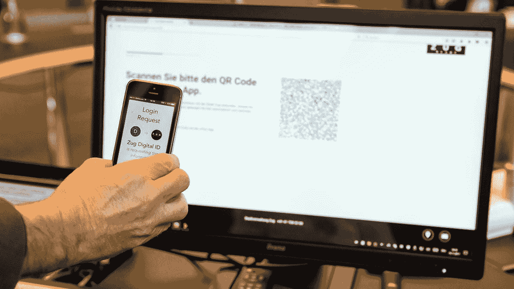

# 瑞士政府使用 uPort 登记楚格公民

> 原文：<https://medium.com/hackernoon/swiss-government-using-uport-to-register-zug-citizens-b71290caa798>

Source: [https://www.thenational.ae/business/technology/setting-the-stage-for-digital-transformation-1.677327](https://www.thenational.ae/business/technology/setting-the-stage-for-digital-transformation-1.677327)

数字化转型的阶段将会彻底改变政府 id 的工作方式。瑞士政府树立了一个活生生的例子——居住在楚格州的公民拥有自己的数字化、分散化、主权身份。这个身份可以用来参加所有政府相关的活动，如投票，证明身份等等！

想象一下这样一个场景:每次你想证明自己的身份时，你不必出示政府身份证明，而只需用手机扫描二维码，系统就会知道是你。

这种身份的特征如下:

1.  **数码**:不需要纸张。一切都在网上，而且是自动化的。
2.  **分散式**:不会使用单一的孤岛式数据库，这可能容易受到安全侵害。
3.  **主权**:你的身份由你控制，不受政府控制，一切都在你的手机里。

以下是瑞士政府如何使用它的概念验证。在我看来，这是一个出色的概念验证。

这个相同的身份可以在任何地方使用。这类似于用[脸书](https://hackernoon.com/tagged/facebook)登录。不同的是，当用脸书登录时，脸书拥有你的身份，而用 uPort 登录时，你的身份在你的控制之下。脸书是集中的第三方，uPort 本质上是分散的，它在 IPFS 上存储身份文件并使用以太坊[区块链](https://hackernoon.com/tagged/blockchain)。

你可以在这里查看关于这个主题的官方文章。

*我的下一篇文章将是关于如何创建 uPort 登录并将其与任何东西集成的实践教程！*