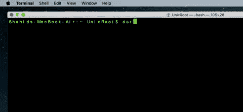
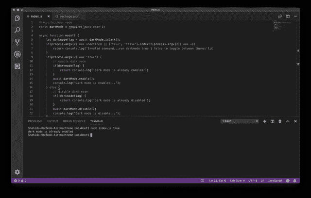
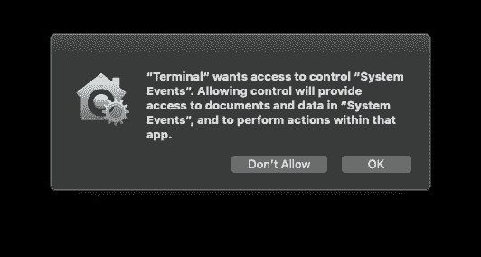

# 在 macOS Mojave 命令行中切换亮暗模式

> 原文：<https://medium.com/hackernoon/switch-between-light-and-dark-mode-in-macos-mojave-command-line-b969cb3d020b>



Switch Mac theme using Command line

我最近更新了我的 Mac 到 MacOs Mojave。它带有各种升级，黑暗主题就是其中之一。

来自硬编码 Linux 用户的背景，我喜欢任何黑色和黑暗的东西。我喜欢 Mac 的新黑暗主题，只有一个问题。

每当我需要切换主题为亮或暗，我需要去外观屏幕并选择它。嗯，没那么有效率，所以我做了一个小的命令行工具，把主题切换成亮或者暗。

一如既往，与你分享我是如何做到的。

# 问题是

我们需要设法通过命令行在 Mac 中进行系统调用，以实现我们想要的，我在为 Mac 开发应用程序方面没有太多经验，这是一个问题。

但是，我确实有 Node.js 方面的专业知识，我想我可以找到一种使用 Node.js 库或 API 进行系统调用的方法。

# 解决方案

我确实找到了一个用于 MacOs 的 Javascript 自动化工具。感谢 [sindresorhus](https://www.npmjs.com/~sindresorhus) 开发了这个工具。

这个工具允许我们使用 Node.js 执行 Mac 的任何系统级命令，它被称为 **run-jxa**

此外，有一个 npm 模块正在使用 run-jxa 来更改 Mac 中的主题。我将使用它，并将其与 Node.js 的命令行功能结合起来。

相关:[使用 Node.js 开发命令行应用](https://codeforgeek.com/2015/09/command-line-application-nodejs/)

我们编码吧。

# 密码

下面是 package.json。

```
{
 “name”: “macdarkmode”,
 “version”: “1.0.0”,
 “description”: “”,
 “main”: “index.js”,
 “scripts”: {
 “test”: “echo “Error: no test specified” && exit 1"
 },
 “keywords”: [],
 “author”: “”,
 “license”: “ISC”,
 “dependencies”: {
 “dark-mode”: “³.0.0”
 },
 “bin”: {
 “darkmode”: “index.js”
 }
 }
```

下面是处理命令行输入并相应地切换主题的代码。

```
#!/usr/bin/env node
 const darkMode = require(‘dark-mode’);async function main() {let darkmodeflag = await darkMode.isDark();
 if(process.argv[2] === undefined || [‘true’, ‘false’].indexOf(process.argv[2]) === -1) 
 return console.log(‘Invalid command…run darkmode true | false to toggle between themes’);{
 }
 if(process.argv[2] === ‘true’) {
 // enable dark mode
 if(darkmodeflag) {
 return console.log(‘dark mode is already enabled’);
 }
 await darkMode.enable();
 console.log(‘Dark mode is enabled…’);
 } else {
 // disable dark mode
 if(!darkmodeflag) {
 return console.log(‘dark mode is already disabled’);
 }
 await darkMode.disable();
 console.log(‘Dark mode is disable…’);
 }
 }//execute the functionmain();
```

您可以通过像这样直接运行 index.js 文件来测试代码。

```
node index.js true // true to switch to dark mode, false to light mode
```



或者使用以下命令将其安装到您的计算机中。

```
npm i -g
```

然后从终端或命令提示符运行此命令。

```
darkmode true
```

或者切换到照明模式。

```
darkmode false
```

享受吧。

# 奖金

我已经在 npm 上发布了这个，所以如果你安装了 Node.js，你可以使用下面的命令安装命令行包。

```
sudo npm i -g macdarkmode
```

安装完成后，运行此命令切换到黑暗模式。

Mac 将询问您是否允许执行系统级命令，单击确定。



在此之后，Mac 主题将根据您的输入命令切换到暗或亮。

# 摘要

这个项目是出于无奈而做的，因此没有遵循最佳实践。这只是为了好玩，所以请尽情享受，如果你喜欢，请在评论中告诉我。

*原载于 2018 年 11 月 22 日*[*codeforgeek.com*](https://codeforgeek.com/2018/11/switch-between-light-and-dark-mode-in-macos-mojave-w/)*。*