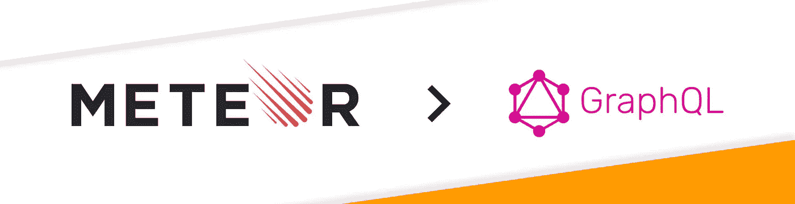
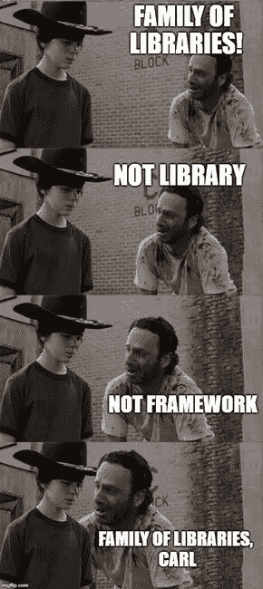
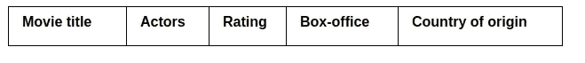

# 从 Meteor 到 GraphQL 的转换:无障碍迁移过程的秘密

> 原文：<https://medium.com/hackernoon/switch-from-meteor-to-graphql-secrets-of-hassle-free-migration-process-3bbfda4e4c40>

我决定写这篇文章的原因是，目前我们的团队正在将一个复杂的应用程序从 Meteor 迁移到 GraphQL。在描述我们为什么要这样做之前，我想简单地讲一下这个项目的概念。

我们正在进行的项目是一个[工作订单管理应用](https://apiko.com/blog/how-we-built-a-work-order-management-system-case-study/)——一个连接按需服务提供商(提供垃圾箱租赁、污水处理、景观和设备管理等服务)的复杂系统。)和不同规模的公司。

该平台帮助公司管理工作订单，跟踪所有文件，自动化发票处理和消除文书工作。该应用程序由 3 个产品组成，可以根据公司需求进行定制

*   公司的工作订单网站，在这里他们可以创建和跟踪工作请求，分配供应商，创建报告，管理发票等。
*   面向技术人员的工作订单移动应用程序，允许留下已完成工作的报告，跟踪他们的工作时间，设置工作可用性等。
*   聊天机器人系统，自动处理来自公司的请求，并创建工作订单。

正如您所看到的，这个项目由处理大量用户、请求和数据的不同应用程序组成。该产品更重要的一个方面是，它必须实时处理所有数据。这就是为什么我们选择了流星来建造 MVP。

# MVP 的流星。为什么我们为这个项目选择了流星

[Meteor](https://www.meteor.com/) 是一个全栈 JavaScript 框架，涵盖了编写 web 或移动应用的所有方面。它提供了简化开发过程的现成工具。Meteor 的另一个关键特性是默认的反应式数据流。所有数据都实时存在于客户端，因此数据库中的更改会立即填充到所有连接的客户端。

当涉及到 MVP 开发时，Meteor 是非常有用的——你可以在几分钟内开始，并推迟做出关于应用程序架构的超级复杂的决定，直到你真正需要它们。正如 Donald Knuth 所说:“过早优化是万恶之源”，所以你知道我的意思。

流星还与最流行的前端库(React、Angular、Vue)有很大的集成，托管即服务，与 [OAuth](https://oauth.net/) 的集成(这里说的是社交网络登录)并建立了零配置构建系统(说说 web pack 配置，我说的对吗？).

你还可以使用 Meteor(使用 Cordova)轻松构建和发布 Android 和 iOS 应用，这些应用不如原生应用好，但非常适合 MVP，甚至是简单产品的生产就绪应用。

当你想构建一个 MVP 时，Meteor 就派上了用场——你只需要专注于外观、感觉和功能。此外，Meteor 允许构建实时 web 应用程序(如聊天、游戏、协作工具等)。)轻松。这对任何应用程序来说都很方便，用户很快就会依赖他们应用程序中的实时数据，而您可以立即向他们提供这些数据。

# 我们什么时候决定从 Meteor 迁移到 GraphQL 的？

随着我们的应用程序变得越来越大，各种客户端的更多需求(很少的 web 和移动应用程序、微服务和第三方应用程序)出现在地平线上，我们已经意识到我们需要更通用和可扩展的后端解决方案。

显而易见的选择是使用任何语言构建 REST 服务器。但既然生活在 2018 年，就有更好的。女士们先生们，我向你们介绍 GraphQL(其实不是我，但主要是脸书。您可以在[我们的文章](https://apiko.com/blog/tag/graphql/)中深入了解 GraphQL 的特性。

简而言之，GraphQL 是一种查询语言，它允许你以一种非常明确和简洁的方式处理应用程序的数据层。它关注的是实体之间的联系(即“图”)。它用大多数流行的语言实现，并有各种客户端框架。我们选择了 Apollo GraphQL 系列库(不是框架或库，Carl！)

以下是 GraphQL(尤其是 Apollo)的主要优势。

# GraphQL 的主要优势

*   **需要为多个 app 提供 API 端点**

GraphQL 非常适合作为多个客户端的中介，因为它为大多数平台提供了库。即使不可能或不想使用客户机库，你也可以发布一些 JSON，它就能工作了！

*   **GraphQL 鼓励增量采用**

您可以保持之前的所有投资不变，并使用 GraphQL server 添加新功能。这对我们的案子来说太完美了！

*   **GraphQL 几乎是技术不可知的**

因为大多数语言中都有 GraphQL 实现，所以您可以很容易地切换到另一个技术栈。数据源也是如此。您可以使用任何数据库或外部资源来管理数据。这也促进了与第三方服务的集成，这是我们心中的需求。

*   **GraphQL 易于扩展和拆分为微服务**

由于每个解析器都是独立的，所以您可以轻松地将一些应用程序托管为无服务器功能，甚至是具有不同堆栈和硬件资源的独立服务。

*   **像 Apollo 这样的库涵盖了许多关于构建 API 的复杂决策**

当从头开始编写 REST server 时，你很容易弄乱它的架构，并在将来让它飞起来时遇到麻烦。这尤其与您的应用程序的控制器级别相关。

*   **GraphQL 负责数据中实体之间的连接**

您最终可以将数据库规范化，因为所有的连接都将被覆盖。这给了我们一些额外的好处，我们将在后面介绍。但总的来说，这是 GraphQL 背后的主要思想之一，它真的很重要！想要更高级的描述？看看这篇[文章](https://blog.apollographql.com/graphql-explained-5844742f195e)。

*   **它有一个很棒的客户端基础设施**

您可以真正享受在客户端使用 GraphQL。客户端应用程序可以以人类可读的方式轻松定义它需要的数据。没有多余的信息传输，这意味着更少的流量使用和更快的加载时间。此外，使用查询散列，您基本上只能通过网络发送数据。只要看看 CDN 上的[托管查询和响应——太棒了！](https://www.apollographql.com/docs/guides/performance.html#CDN-Integration)

随着应用程序的增长，自动测试对于促进变更和改进代码库是必不可少的。缺乏测试覆盖将很可能导致更长的开发时间，更高的易错性和整体挫败感。因为 GraphQL 架构的核心是纯函数形式的解析器，所以测试它们是一件非常愉快的事情！Meteor 也提供了一个复杂的测试框架，但是由于大量的技术细节，它过于复杂并且混淆了测试。

*   **面向开发者的强大功能**

它们包括客户端开发工具、对乐观渲染和订阅的支持、GraphiQL 的自动文档、对 FP 范式和类型的强大支持、性能监控和优化工具。

# 切换到 GraphQL 的过程

由于 GraphQL 支持增量采用，我们开始用 GraphQL 端点替换旧功能并构建新功能。除了少数例外，这是一个相当平稳的过渡。让我们来看一个从 Meteor 到 GraphQL 的某个特定实体集合的**简短描述:**

*   为 GraphQL 服务器中的查询和变化创建模式和解析器。
*   用测试来覆盖它。可选(不，不是)。我们更喜欢 TDD，但这取决于你。
*   用 Apollo 客户端代替通过 Meteor 获取数据。
*   用突变代替流星方法。
*   如果需要，创建和添加订阅，使您的数据具有流星般的反应能力。
*   替换对查询 GraphQL 端点时保留的已移除的сcollection 的引用。
*   从 Meteor 中删除与实体相关的代码。

通过这种方式，您可以用更灵活的 GraphQL 替换现有的 Meteor 堆栈。

# 从 Meteor 迁移到 GraphQL 的主要挑战和困难以及如何解决它们

现在我们来谈谈正经事。你知道那种感觉吗，当你读一些到处都是小马和彩虹的文章，然后你开始写一些类似的东西，它变成了吸血鬼和墓地。我想避免这样的经历。

众所周知，我们在转型过程中遇到了一些相当严重的问题，我们花了一些时间才找到最佳解决方案。让我们在这里深入了解更多细节。

**问题一。流星般的取乐**。正如我之前提到的，用户倾向于期望数据随时实时更新。对于 Meteor 来说或多或少有些琐碎的事情，对于 Apollo GraphQL 来说需要一个非常健壮的设置。更糟糕的是，用于订阅的 API 还没有完全开发和稳定。

**您可以选择以下解决方案之一**:

*   让您的订阅通知客户端数据已更改，并使其重新获取所有当前视图
*   通知客户端对特定数据的更改，并使其重新获取一些特定的查询
*   实现全面订阅，通过订阅传递所有必要的数据并更新视图。

前两个选项可能比轮询好，但仍然很难看。让我们用下面的例子简要描述第三种解决方案:

*   假设你有一个简单的 TODO 应用程序，它有 TODO 本身和一个与这个 TODO 相关的任务。
*   使用文档中描述的方法在您的服务器上创建 TODOs 订阅。
*   在您的 TODO 项目更改时添加简单的发布。你可以在你的变异解析器中放一些处理器，使用一些钩子或者尝试新的 Mongo [改变流](https://docs.mongodb.com/manual/changeStreams/)，如果你使用的是 MongoDB 的话。
*   这里需要注意几点:有时你需要在其他实体发生变更时发布对相关实体的变更。例如，假设您可以独立于任务的待办事项来更新任务。在这种情况下，您需要发布此 TODO，以获得相关的订阅更新视图，而不管 TODO 本身是否发生变化。

最棘手的部分是客户端实现。

为此，您需要:

1.  使用普通查询来查询数据
2.  使用完全相同的字段集订阅此数据更改
3.  如果订阅的参数已更改(例如，您有一个带过滤器的表),请关闭旧的订阅并启动新的订阅。当筛选器更改时，关闭当前订阅并启动新的订阅。)
4.  如果一切顺利，Apollo 将自动更新存储的数据和视图。
5.  您可以围绕默认的 Apollo helper 创建一个非常简单的包装器来执行上面提到的操作。

如您所见，与 Meteor 相比，Apollo 的订阅相当复杂。但是 GraphQL 还在不断发展中，它们可能很快就会变得容易得多。特别是，有一个“实时查询”的概念，这将使上述一切更加方便。(查看这篇[文章](https://blog.apollographql.com/the-next-step-for-realtime-data-in-graphql-b564b72eb07b)了解更多信息)

**问题二。不想要也是朋友**。计算机科学中有一个常见的已知问题，称为“n + 1”。当您试图加载带有指向其他项目的链接的某些项目的列表时，会出现这种情况。

例如，您查询包含导演的电影列表。在 GraphQL 中，每部电影的导演将被单独加载，从而增加数据库的负载。幸运的是，脸书有一个很棒的工具叫做[数据加载器](https://github.com/facebook/dataloader)。

虽然它看起来很神奇，但它非常简单，我强烈建议您深入了解它的实现(大约 250 行代码)。我就不赘述了，因为网上有很多文章[或者文档](/slite/avoiding-n-1-requests-in-GraphQL-including-within-subscriptions-f9d7867a257d)里有很多文章或者[。我很高兴现在你被告知并且安全了。](https://www.apollographql.com/docs/)

**问题三。帮我找到这个。**您可能对这个常见场景很熟悉:用户应该能够对他们在表中看到的每个字段使用全文搜索。现在设想一个表，其中有来自多个实体的数据，例如:收视率、票房、原产国。

至于这是一个“电影”表，它由 4 个不同实体的数据组成——电影、演员、分级、国家。如果用户想使用单个字段在所有数据库中搜索这些实体中的任何一个，那就麻烦了。事情是这样的，当你搜索一个演员的电影时，你需要找到这个演员，然后找到这个演员的电影，并返回包含所有相关数据的电影。

此外，你应该为每一个可能的场景都这样做，而且要快。如果您在一些更传统的环境中，您可以使用“like”搜索进行一些连接并返回结果。这时，专门的第三方服务机构就会出手相救。我们选择了[弹性搜索](https://www.elastic.co/)。

您需要做的就是配置 Elastic，将您的数据加载到服务中，并使用 Elastic API 解析您的 GraphQL 搜索查询。不要忘记更新你的数据。我希望你不需要实时数据，是吗？是的，没那么简单。我们将在接下来的文章中更详细地介绍这一点。

这样做的好处是，使用 GraphQL，您仍然可以拥有实体间关系的强大功能。当你有了你的弹性电影搜索结果，GraphQL 会自动把它和演员，收视率，国家联系在一起！

当您开始从 Meteor 到 GraphQL 的迁移时，我想提几个需要记住的更重要的事情:

*   **认证和授权**——你需要弄清楚流星认证。机制，并用几行代码和原始节点库代替它。您还需要在 GraphQL 和 Meteor 服务器上登录一个用户。
*   **深究 GraphQL 的思维方式，然后再做出重大举措**。以最佳方式做事可能需要时间，因为在软件开发中用图表思考并不常见。您通常会尝试为特定请求获取所有可能的数据，并根据用户需求进行拼接。但是使用 GraphQL，你需要专注于只获得用户要求的根，让奇迹发生。
*   尝试根据现有的关系为你的模式建模。不要创建类似`movies (actor) {}`的查询。用`Actor { movies }`就行了。
*   **阅读文档时不要跳过接口和联合**。这些都是非常强大的工具，可以在很多场合派上用场。
*   **请记住，GraphQL 实现发展非常迅速**，您昨天使用的 API 可能明天就会过时。每周都有更好的做事方式和令人敬畏的有用工具出现。所以你必须忍受它。
*   **Apollo stack 某些部分的文档可能不完整**、过时或混乱。您需要找到一些文章，甚至钻研源代码，写出您自己的文章。或者几篇文章。

# 迁移还是不迁移？

总而言之——graph QL 和 Meteor 是 web 应用程序开发的绝佳工具。Meteor 让您轻松启动，非常适合中小型实时应用程序。但是，如果您需要很大的灵活性，需要支持多个客户端并拥有复杂的分布式数据层，GraphQL 是一个不错的选择。

*原载于 2018 年 7 月 10 日*[*apiko.com*](https://apiko.com/blog/switch-from-meteor-to-graphql/)*。*