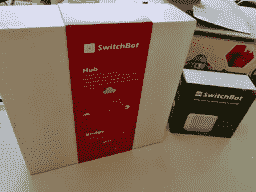
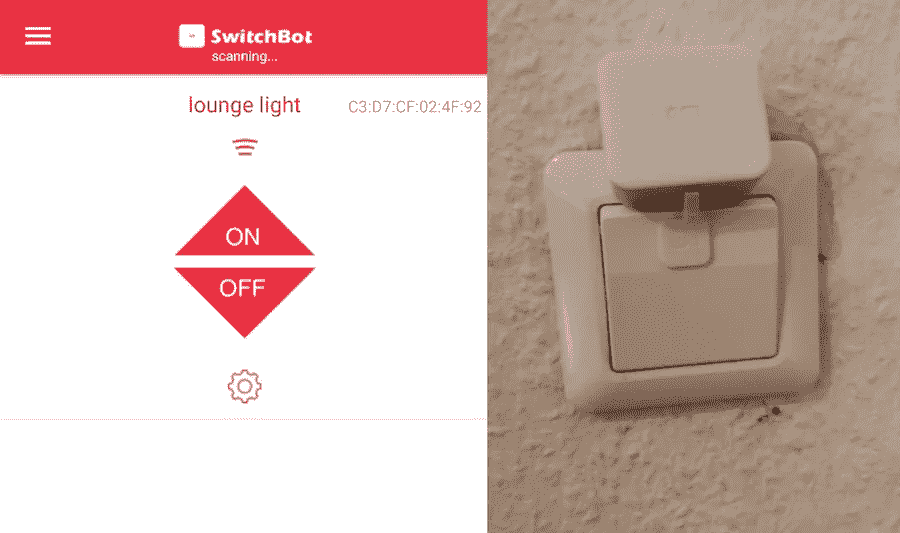
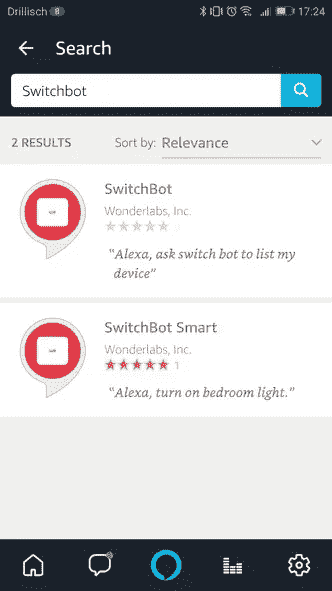

# 配电盘:人人都有智能家居？

> 原文：<https://medium.com/hackernoon/switchbot-a-smart-home-for-everyone-b13d2d50dee7>

## 这些年来，我参加了数十场宣传智能家居设备的会议和活动。作为一名技术爱好者，“智能家居”一直是我想尝试的东西，但我总是住在老旧的出租房里，那里的传统配件很难使用智能设备，或者安装智能设备需要进行可能违反我的合同的改变。

当我遇到[配电盘](http://switch-bot.com/)时，我觉得我为像我这样的人找到了一个解决方案，一个智能家居系统，它可以固定在旧的配件上，当我搬回家时，我可以(很容易地)移除并随身携带。我得到了一个测试套件，看看它能在多大程度上帮助我实现我的智能家居梦想。

交换机设置由两种类型的设备组成，一种是机器人本身，它是一种支持 WiFi 和蓝牙的电动推/拉设备。你用双面胶将机器人粘在你的开关附近，当它被指示这样做时，它就会推动开关。对于摇杆式开关，有一个奇怪的小塑料环，上面有更多的双面胶带，你也可以将它连接到水平仪上，再次拉起开关。根据开关的不同，将机器人安装在正确的位置来激活开关可能会很复杂，对于我们的大型方形灯开关，我发现很难让它正确就位。

你通过蓝牙从手机应用程序连接到机器人，配对后，你可以在需要激活开关时连接到它。该应用程序有时很复杂，掉线，需要重新配对，偶尔还会出现无用的错误信息。

用智能手机控制开关的能力是半有用的，但给机器人增加一个开关集线器会增加云连接，使它们更有用。通过添加云模块，你可以将你的机器人连接到 Alexa、IFTTT 和谷歌助手，然后从你可以与这些服务互动的无数方式中触发开关。我试图将我的集线器连接到 Alexa，再次遇到困惑。

Alexa 商店中列出了两个开关技能，设置过程安装了一个(以我的经验)很少理解我或工作的技能。相反，我建议你使用“智能开关”技能，因为它将你的机器人视为 Alexa 智能家居设备(我不确定 Akexa 如何看待其他技能)，并提供更好的用户体验，更好地利用 Alexa 生态系统。

# 价格合理的智能家居

我发现开关的设置和工作非常繁琐，这是合理的，因为世界上有这么多种类型的开关，对 SwitchBot 来说，制作一种能与所有开关一起工作的设备几乎是不可能的任务。这再加上成本(例如，一打机器人和一个集线器超过 700 美元)意味着让你的家“智能”仍然是一项艰巨的任务，不适合业余爱好者。实施机器人也涉及到妥协，例如，即使有了拉式适配器，我也不知道如何在不反转开关状态的情况下在我们的房子里容纳大型欧式开关，即“开”等于“关”，反之亦然。还要考虑到世界上许多插座没有开关，所以你需要给它们增加开关。开关盒最适合具有一种物理状态的软开关，即你在咖啡机或数字设备上找到的那种开关。

交换台是一个很好的想法的开始，但是它还没有完全实现。该公司很快将推出更多设备，如可以旋转百叶窗的机器人，一旦他们有了各种各样的物理机器人和可供购买的“入门”包，SwitchBot 将是一个更引人注目的产品。

*最初发表于*[*【dzone.com】*](https://dzone.com/articles/switchbot-a-smart-home-for-everyone)*。*