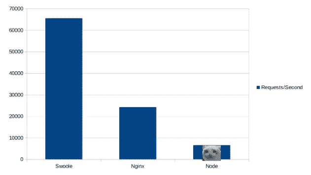

# Swoole:是 PHP 里的 Node 还是我错了？

> 原文：<https://medium.com/hackernoon/swoole-is-it-node-in-php-or-am-i-wrong-3068789438a4>

任何 PHP 开发人员在想到他们使用 Node 的同事时都会嫉妒不已。异步节点系统在协议之间共享代码库，并在代码之外为它们服务。这真的让人想知道切换到节点。实际上，PHP 中类似 Node 的东西已经作为扩展添加进来了。它叫做 Swoole。

# PHP 中的节点？那个 Swoole 是什么东西？

好吧，让我直接从[文档](https://www.swoole.co.uk/)中复制粘贴定义:

“PHP 的生产级异步编程框架
使 PHP 开发人员能够用 PHP 编程语言编写高性能、可伸缩、并发的 TCP、UDP、Unix socket、HTTP、Websocket 服务，而无需太多关于非阻塞 I/O 编程和低级 Linux 内核的知识”。

Swoole 是 PHP 的扩展，它是用 c 语言写的，听起来很有前途，对吗？用 PHP 托管 HTTP 服务器？PHP 本身的 Websockets？许多其他的可能性，有些看起来很奇特？所有这些都需要保持高性能。我们去看看吧！

# 如何让它运行起来？

本机平台上的安装方法各不相同。

对于 Linux，它归结为一个 pecl 命令:

> pecl 安装 swoole

对于 MacOS，可以使用 brew:

> brew 安装 swoole
> brew 安装 homebrew/php/php72-swoole

而在 Windows 上，原生安装是不可能的，但无论如何我们还是要用 Docker。

# Dockerizing Swoole

当然，运行 PHP 和 Swoole 的最好方法是 Docker 容器。让我们看看如何创建一个允许我们使用 Swoole 的容器。首先，我们需要一个 Dockerfile 文件。

> 从 php:最新的
> 运行 pecl 安装 swoole
> 添加 php.ini /usr/local/etc/php
> 运行 usermod -u 1000 www-data

这很简单。在扩展了官方的 PHP Docker 映像，用 pecl 安装了 Swoole，并复制了 php.ini 之后——我们得到了它。最后一行是 MacOS 的标准 Docker 修复程序。

对于要复制的 php.ini 配置文件，它甚至更简单——只需要一行代码:

> extension=swoole.so

# 它提供什么？

Swoole 具有多种功能。大多数都是异步的。以下是一些最有趣的(其他的可以在 Swoole [文档](https://www.swoole.co.uk/)中找到):

*   TCP/UDP 服务器和客户端，
*   HTTP 服务器和客户端，
*   Websocket 服务器和客户端，
*   Redis 协议服务器和客户端，
*   MySQL 客户端，
*   原子学，
*   文件系统。

让我们看看如何使用其中的三个:HTTP 服务器、Websocket 服务器和文件系统。这些是我认为最重要的。

# 使用 Swoole 的 HTTP 服务器

Swoole 允许我们运行一个简单的异步工作的 HTTP 服务器。下面的简单代码也将使用异步文件系统访问，用 index.html 文件响应它处理的每个请求。

正如我们所见，它看起来有点像 Node。

首先，我们创建一个类似于 http 服务器的对象。然后，我们为两个事件绑定两个匿名函数:一个用于 **start** ，它将在服务器启动时执行，另一个用于 **request** ，它将为每个请求执行。它将请求和响应对象作为参数**。**

**请求对象**包含与请求本身相关的所有数据:请求的路径、头等等。另一方面，它用于提供输出、设置标题等。值得一提的是，这两个对象不符合 PSR，而是他们是定制的 Swoole 对象。

在**请求**事件**事件**中，异步文件系统用于从文件中加载数据。一旦数据可用，就会用加载的内容触发一个回调。然后，使用这些内容填充响应对象并关闭响应。这有效地将数据发送回浏览器。

这看起来很整洁，最重要的是——有效。但是性能呢？

# HTTP 服务器基准测试

为了测试使用 Swoole 的 HTTP 服务器的性能，我在 Node 中创建了一个应用程序——它可以做与 Swoole 完全相同的事情——以及一个 NGINX 服务器，它将 index.html 作为静态文件。全部装在 3 个独立的集装箱里。

然后，我用 **wrk** 工具用力敲打这些容器。结果令人震惊。

Swoole 的结果远远好于预期！

这是一个惊喜。没想到 Swoole 超越 NGINX，居然真的做到了！节点已超出距离。这个扩展的原始能力确实令人印象深刻，但是随着请求中更多工作的完成，它会逐渐消失。不幸的是，Swoole 有两个小缺点，使得这些原始基准变得无关紧要。我们稍后会谈到它们。

# 使用 Swoole 的 Websocket 服务器

如前所述，Swoole 提供了一种创建 websocket 服务器的方法。它异步工作，遵循与 HTTP 和其他 Swoole 功能相同的方法。在我看来，这是 Swoole 最重要的部分之一。拜托，PHP 里的 websockets？我加入。让我们看看它看起来怎么样。

看起来类似于 HTTP 服务器的例子。

首先，我们创建一个类似 websocket 服务器的对象。然后，我们将 4 个匿名函数绑定到 4 个事件。一个到 **start** 事件，这将像从 HTTP 服务器开始事件一样工作。另一个 **open** 事件将在新的 websocket 连接后执行。另一个 to **message** 事件将在 websocket 向服务器发送消息时执行。最后 websocket 断开连接时运行的 **close** 事件。

连接到服务器的 Websockets 由随每个新 websockets 递增的唯一 ID 来标识。

# 使用 Swoole 时遇到的问题

到目前为止一切运行良好，但是我在使用 Swoole 测试一些解决方案时遇到了两个问题。这些是:

*   HTTP 服务器中没有真正的 HTTPS 支持，
*   脚本中不支持全局变量。

第一个很容易缓解。我们只需要使用 NGINX 或任何负载平衡器设置一个反向代理，就完成了。但这样做，我们失去了 Swoole 提供的极端性能提升。

第二个更棘手。Swoole 产生了处理请求的工作进程，这意味着如果我们创建一个全局变量，它的值在线程之间是独立的，它不能工作。这里有一个展示这种行为的例子。

人们可能会认为响应会返回 0，然后是 1、2、3 等等，但是它总是返回 0。

我联系了 Swoole 的作者，想看看这是不是一个 bug，但不是。为了获得我们期望的行为，我们可以在配置中设置 **worker_num = 1** ，但是这会降低性能。

# 结论

Swoole 和其他事物一样，有光明的一面，也有黑暗的一面。我认为将异步编程引入 PHP 仍然是一个好主意。它可以用于各种情况，从快速原型开发，到简洁的单一责任微服务，低延迟游戏服务器，最后成为大型框架的后端服务器。确实很有希望。

**这篇文章由 Adrian Chlubek 撰写，最初发表在软件之家博客******上。访问博客，获得更多关于最佳开发实践和软件外包技巧的文章。****