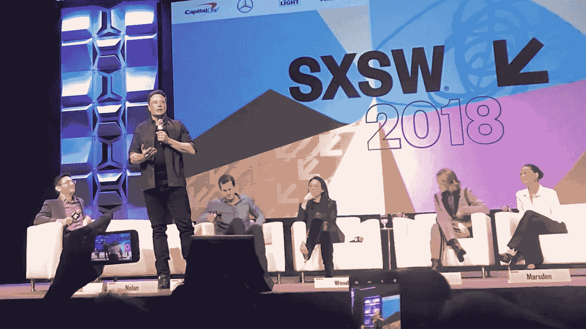
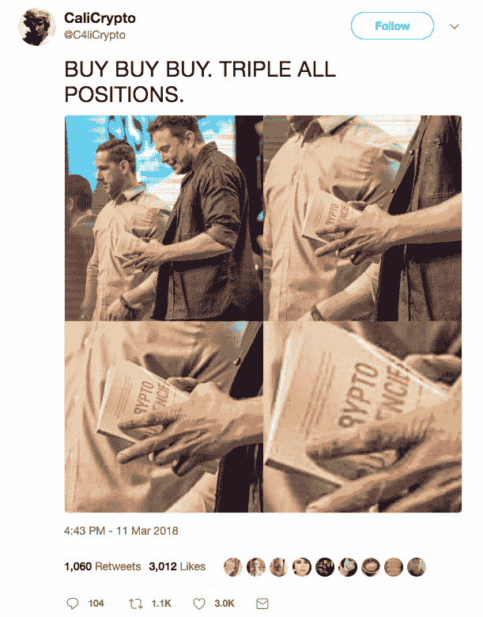

# SXSW 2018: 10 加密和区块链要点

> 原文：<https://medium.com/hackernoon/sxsw-2018-10-crypto-blockchain-takeaways-d9c397b887e4>

Elon Musk at SXSW 2018\. Source: [Teslarati](https://www.teslarati.com/elon-musk-sxsw-debut-spacex-falcon-heavy-launch-footage/)

*by* [*洛丽塔 M Taub*](https://medium.com/u/fc5bc065d6c4?source=post_page-----d9c397b887e4--------------------------------)*(*[*@洛丽塔 taub*](http://twitter.com/lolitataub) *)*

*Elon Musk at SXSW 2018\. Source:* [*CaliCrypto*](https://twitter.com/C4liCrypto/status/972981293100101632)*.*

众所周知， [SXSW](https://medium.com/u/4140f02336cb?source=post_page-----d9c397b887e4--------------------------------) 是一个庆祝互动、电影和音乐行业融合的会议和节日。今年的 SXSW 于 3 月 9 日至 18 日举行…