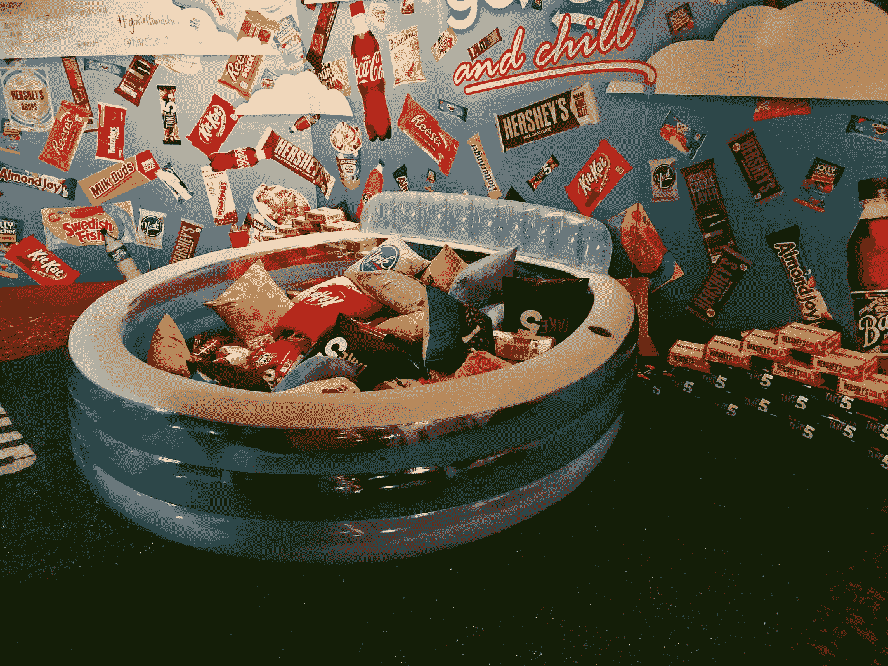

# SXSW 第 2 部分:修复技术、人工智能和创业公司

> 原文：<https://medium.com/hackernoon/sxsw-part-2-fixing-tech-ai-and-startups-5b48f6435925>

好了，伙计们，这个活动太大了，我需要两个帖子来总结一下。在[第一部分](/@ChrisChinchilla/sxsw-part-1-blockchain-and-spacetech-c64f8677acdd)中，我介绍了区块链和 SpaceTech，在这一期中，我将围绕技术、人工智能、机器学习和杂项话题进行介绍。

SXSW 延续了过去六个月的主题，重点讨论了道德规范、“良好”设计、人工智能、机器学习以及它们之间的交叉。

# 用技术解决问题

对我来说，这方面最突出的演讲是玛格丽特·古尔德·斯图尔特关于“驾驭现代技术伦理”的演讲作为脸书(之前在 YouTube 和谷歌任职)的设计副总裁，Margaret 对于为处于争议前沿的公司工作有着独特的观点。她认为，现代科技公司规模扩张的速度带来了一个独特的问题。与其他老牌网站相比，脸书、Snapchat、Instagram 和 YouTube 等平台的用户数量增长到了 1 亿，而这只是平面媒体、广播和电视的一小部分时间。如果这些公司对他们的使命是真诚的(这是一个很难知道的事实)，他们在平衡潜在有用功能和潜在滥用方面面临着同样独特的挑战，来自坏演员或他们背后的公司。

Margaret 提到，除了花费的时间和页面点击量之外，还需要新的和不同的指标，但她承认定义和衡量“有意义的互动”很困难。你如何平衡“做得更好”的愿望和赚钱的“需要”？它们是互斥的吗？

也许密歇根大学新成立的社会媒体责任 T2 中心能有所帮助。该中心旨在提供专业知识和工具，使大大小小的项目能够识别和改善社交网络及其社区成员有时产生的负面影响。它于 3 月 6 日启动，所以他们的结果还不得而知，但要了解更多信息，你可以听听我对下面的[加林·吉尔克里斯特二世](https://www.linkedin.com/in/garlinii/)(导演)和[阿维夫·奥瓦迪亚](https://twitter.com/metaviv?lang=en)(首席技术官)的采访。

# 科技造福人类

在本节的最后，重点介绍用于特别积极目的的技术。我最初在[互动创新奖](https://www.sxsw.com/awards/interactive-innovation-awards/)展览上看到了来自[微软免提音乐](https://www.microsoft.com/en-us/research/project/microsoft-hands-free-music/)的团队，但是我无法靠近去看他们在做什么。第二天晚上，我和团队的一名成员聊了聊，了解了这个项目是什么。该项目旨在帮助 ALS 患者通过播放音乐和创造性表达的设备来享受他们的世界。

# 为人工智能和机器学习而设计

我在这方面最突出的演讲来自乔什·克拉克，关于“算法时代的设计”这个演讲有先见之明地提醒我们，随着开发人员设计和构建应用程序的方式发生变化，我们开发它们的方式也在变化。基于机器学习和人工智能的应用程序的快速发展消除了对传统界面的需求，人们通过导航和点击来使应用程序做一些事情。虽然未来的应用程序将为用户做更多的事情，但仍然会有需要设计的时候，尤其是当应用程序遇到错误的时候。除了“界面”，这些应用程序的文本、流程和模型训练仍然需要设计。设计师和开发人员一样，也正处于范式转变的过程中。

# 算法中的偏差

我自己在以前的帖子(和[演讲](https://www.youtube.com/watch?v=HYoVkDbqCpk))中报道过这个话题[，人工智能没有偏见，但它们的创造者有。随着人工智能传播得越来越广，这些(往往是无意识的)偏见也越来越多。一个名为“算法、无意识偏见和人工智能”的小组讨论了这个问题，着眼于问题和新生的解决方案。](https://dzone.com/articles/are-we-all-doomed-your-role-in-the-ethics-of-tech)

与 Margaret 的陈述类似，在我们有机会解决这些新人工智能存在的问题之前，我们再次关注这些新人工智能部署背后的速度和规模。对于许多不符合算法对“正常”定义的人来说，依赖太多数据及其潜在的错误解读是一个问题。通常问题很早就开始了，用信息来训练人工智能，小组建议你问任何人工智能以下问题:

*   它做出的选择以及如何做出选择。
*   谁训练了 AI，他们的背景和经历是什么？

# 启动亮点

最后，在“不太适合其他地方”部分，这里是我在 SXSW 工作期间遇到的其他公司和项目的亮点。我将在未来跟进其中的一些问题。

*   越来越多的服务旨在帮助用户将他们的社交数据货币化，ante social 是其中的一部分，虽然我不相信它会奏效(目前)，但一些人和项目需要成为尝试一个想法的开拓者。
*   我一只耳朵部分失聪，戴着眼镜，所以 [asears](https://www.asears.net/) 这个问题的简单解决方案引起了我的兴趣。我无法试穿它们来看看效果如何，但我会睁大眼睛，竖起耳朵。
*   GoPuff 和 Hershey's 举办了一整个下午的关于零售领域 AR 和 VR 的未来的活动，这有点奇怪，但却是一次很酷的体验。[这篇关于汤姆指南的文章](https://www.tomsguide.com/us/gopuff-vr-online-snack-shopping,news-26754.html)很大程度上复制了我的经历。
*   我喜欢听到更多不知名国家的创业和技术场景，所以非常高兴参观印度尼西亚的展位(SXSW 上展出的各种国家本身就是一个亮点)。我看到了几个有趣的项目，我强烈建议附近的任何人参加 [Next Dev conference](https://www.thenextdev.id/) 。
*   [亚当之手(意大利)](http://www.adamshand.it/)，来自意大利的一款模块化的假手。

# 就这样结束了

唷！我本来可以写更多关于 SXSW 2018 的内容，但我已经忘记了太多。很高兴看到这么多新的想法、国籍和态度，我知道很少有其他事件允许如此多样化的组合。这是我的第一次 SXSW，所以我无法与过去的几年进行比较，但无论你喜欢什么，你都会在那里找到它。

*原载于*[*dzone.com*](https://dzone.com/articles/sxsw-part-2-fixing-tech-ai-and-startups)*。*