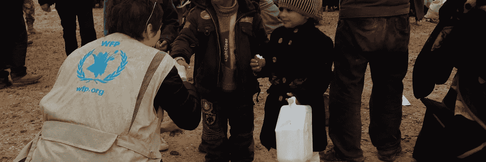

# 叙利亚难民危机和区块链

> 原文：<https://medium.com/hackernoon/syrian-refugee-crisis-and-blockchain-9885330acfd1>

叙利亚难民危机据称是二战后最大的人道主义危机。500 多万人逃离家园，失去了身份，其中大多数是儿童。这从 2011 年就开始了。

这些人会去哪里？他们会怎么做？这些孩子将如何生存？他们的未来会怎样？这些小孩子这么早就看到的黑暗事物呢？

Source: [http://subscriber.telegraph.co.uk/news/2017/02/13/world-press-photo-year-2017/](http://subscriber.telegraph.co.uk/news/2017/02/13/world-press-photo-year-2017/)

## 叙利亚难民营的现状如何？

*   没有足够的食物喂饱人们，所以有时甚至分发过期的食物。
*   没有足够的空间容纳空前涌入的难民，所以人们睡在共用的帐篷里。
*   药物和教育资源供应不足。这意味着即使是简单的医疗条件也无法解决，孩子也不能上学。
*   大多数孩子都失去了父母。他们深受创伤。他们好几年没去上学了。

> **六岁的 Ahmad 被转移到叙利亚的 Atmeh 难民营，他告诉我，难民营无法为一年级学生开课，因为他们没有书本和教材。**
> 
> **集中营里没有工作机会，就像在监狱里一样，你只能领到每天的食物和水，并被要求无望地、被动地等待。**

叙利亚难民在中东五个国家寻求庇护，包括土耳其、黎巴嫩、约旦、伊拉克和埃及。

## 约旦的扎塔里营地——和平之家(感谢区块链)

> *如果我告诉你，叙利亚难民可以重新获得他们逃离家园时失去的身份，会怎么样？*

扎塔里营地是第一个允许以太坊区块链用于人道主义援助的例子。我会告诉你怎么做。

想象一下这个场景——

一个来自难民营的小女孩去超市买生活必需品。在收银台，她不用现金/卡付款。你知道她做什么吗？她看着安装在收银台的镜子，里面有一个摄像头，可以扫描她的虹膜。过了一会儿，在超市的电脑上可以看到她的图像，确认了她的身份。她拿起收据，走出商店。这要归功于 **EyePay** 和**世界粮食计划署的合作。**

Source: [http://www.irisguard.com/eyebank/downloads/EyePay-Download.pdf](http://www.irisguard.com/eyebank/downloads/EyePay-Download.pdf)

Source: [https://3g.163.com/tech/article/DGHS92S7000998GP.html](https://3g.163.com/tech/article/DGHS92S7000998GP.html)

 [## 积木| WFP 创新|叙利亚金融危机

### 现金转移和区块链

innovation.wfp.org](http://innovation.wfp.org/project/building-blocks) 

该计划始于 2017 年初，名为“积木”,帮助 WFP 向约旦的 10 万多名叙利亚难民分发现金换食品援助。到今年年底，该计划将覆盖该国所有 50 万难民。

WFP 的建筑由以太博物馆提供动力。 [Blockchain](https://hackernoon.com/tagged/blockchain) 作为一种分布式分类账[技术](https://hackernoon.com/tagged/technology)被用作一种可信的方式来跟踪资产的所有权，而不需要中央机构，这可以加快交易速度，同时降低欺诈或数据管理不善的可能性。至关重要的是，它的点对点性质消除了对银行或其他机构等昂贵中介机构的验证需求。通过利用区块链的力量，可以降低支付成本，保护数据，控制金融风险，在发生叙利亚难民危机等紧急情况后，可以轻松开展援助行动。

 [## 消除饥饿的封锁链:利用技术支持叙利亚难民

### 联合国世界粮食计划署(WFP)正在部署尖端的区块链技术来制造…

innovation.wfp.org](http://innovation.wfp.org/blog/blockchain-against-hunger-harnessing-technology-support-syrian-refugees)  [## 联合国世界粮食计划署建立在以太网街区链现金转移的基础上

### 加入我们在 Hacked.com 的 10，0 00 名交易员社区，每月仅需 39 美元。联合国世界粮食计划署正在…

www.ccn.com](https://www.ccn.com/banks-begone-uns-world-food-programme-builds-ethereum-blockchain-money-transfers/) 

WFP 向需要食物的人转移资金，而不是提供食物。这种方法可以养活更多的人，改善当地经济，增加透明度。但它也引入了一个显著的低效率点:与当地或地区银行合作。WFP 在 2017 年转移了超过 13 亿美元的此类福利(约占其援助总额的 30%)，对该国来说，交易和其他费用本可以花在数百万顿饭上。区块链项目的早期结果显示，此类费用减少了 98%。

> 但是 WFP 将会做更多的事情，而不仅仅是降低交易成本…

身份问题也将由 WFP 处理。问题出现了——**在金融和法律体系中，没有政府身份证件或银行账户的人要想找到工作并过上有保障的生活，这些东西是必不可少的，你如何让他们进入这个体系？**

难民的区块链钱包将保存他们所有的交易历史，他们的政府 ID，通过使用区块链作为身份系统的关联金融账户。这样，人们可以更容易地融入世界经济。他们为之工作的人知道往哪里转账，银行可以看到信用记录，移民官员可以看到政府 ID。所有东西都用一个钱包。如果教育证书也保存在这个钱包里，那么即使他们失去了学位，他们仍然有一个证明，因为整个历史都存储在不可改变的账本上。这意味着难民可以去一个国家又一个国家，可以获得贷款来开办企业，可以证明他/她与他/她的孩子的关系，家庭将不必等待几天才能拿到钱。

> 他们不会感到被遗弃。

这意味着每个人都拥有一个**自我主权身份。**这些钱包可以存放任何有价值的东西——出生证明、土地记录、教育记录等等！任何可以编码的有价值的东西都可以放在区块链上。

这就是区块链如何解决许多以前无法解决的问题。

个人觉得知道这些感觉很棒。技术，就其能力而言，正在做很多事情来帮助人类。现在取决于我们如何引导我们的能量，并使用这些手段来帮助有严重问题的人。开始只需要一点点勇气。之后，一切都神奇地发生了。

