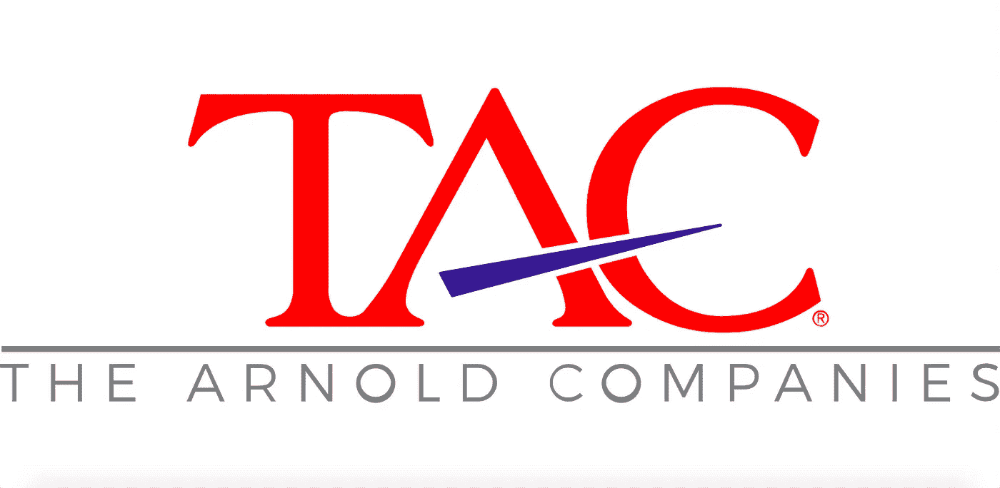
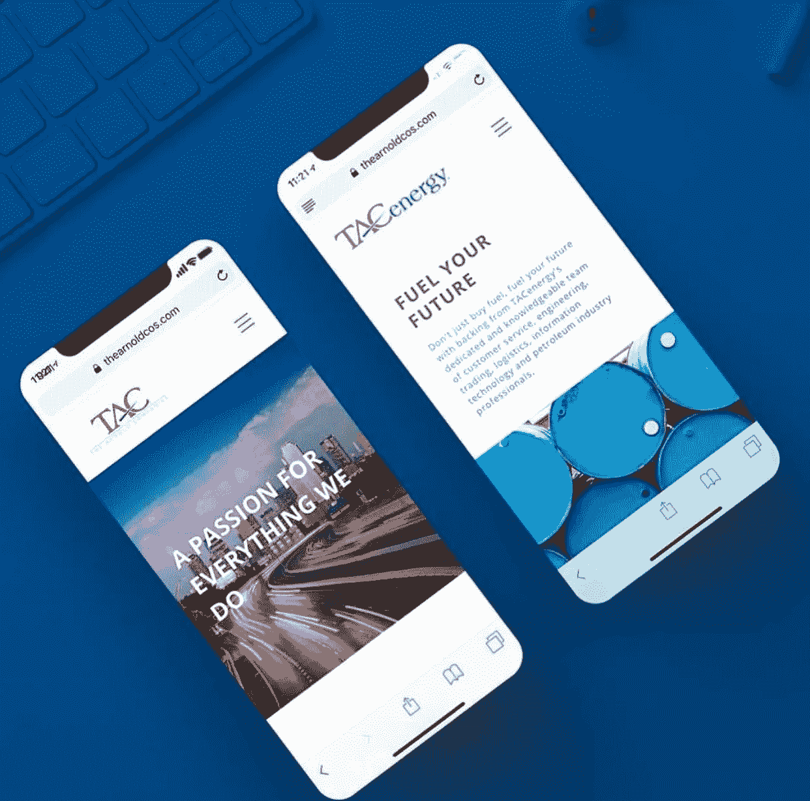
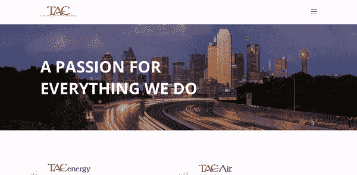

# TAC 通过从 WordPress 转向 Cosmic JS 来巩固其内容混乱

> 原文：<https://medium.com/hackernoon/tac-consolidates-its-content-chaos-by-switching-from-wordpress-to-cosmic-js-e66dc7f77b5d>

TAC — [阿诺德公司](https://thearnoldcos.com/)是美国最大的燃油批发商和航空服务提供商之一。稳定的增长、积极的财务业绩和多元化的行业基础一直使 TAC 成为美国顶尖的私营公司之一。TAC 由一个公司身份下的许多独立品牌组成，包括 [TAC 能源](https://thearnoldcos.com/tac-energy)、 [TAC 航空](https://thearnoldcos.com/tac-air)和 [Keystone 航空](https://thearnoldcos.com/keystone-aviation)。

TAC 的旧网站是独立的，在 WordPress 基础上互相链接，用户体验过于复杂，需要太多的步骤让访问者找到他们想要的东西。由于是基于 WordPress 的，它不允许清晰的信息架构来促进投资组合中的不同业务线。

通过结构化的 RFP 流程来确定重新思考客户体验和内容管理系统的合作伙伴，interactive agency[Simple Media](https://simplemedia.co/)和 [Cosmic JS](https://cosmicjs.com) 被选中。其他平台选项包括 WordPress、Drupal 和 Joomla。

TAC 专注于以移动优先的方式进行建设，并整合现有品牌网站的混乱状况，以实现四个品牌的和谐以及内容管理的易用性，在 [Cosmic JS](https://cosmicjs.com) 中找到了一个出色而简单的解决方案。

为了了解更多有关开发的信息，该项目的首席开发人员 Brandon Reid 对堆栈进行了分解:

**开发团队:**“TAC 的后端由 Node、Next.js、Express 提供支持。js 用于 SEO 优化和站点路由的服务器端渲染功能。Next.js 还使得与 Babel 和 Webpack 的集成变得容易，因为它们是内置的。该团队使用 Next.js 路由 API 为具有相同设计布局的页面呈现页面模板。TAC 的前端由 React.js 和世界上最流行的 react UI 框架 Material UI 提供支持。为了通过 SSR 使用 Material UI，团队必须将站点包装在 JSSProvider 中，并使用 CSSBaseline。为了开发，他们使用 Eslint 作为一个更干净、更一致的代码库。

由于 TAC 使用 ES6 JavaScript，该团队还必须实现非常少量的 polyfill 来将 ES6 转换为 ES5，以便该网站能够与 IE11 一起工作。使用的一些值得注意的节点模块有:

*   React-Image-Gallery 用于整个网站的图片库
*   新闻编辑室的反应-砖石-组件
*   获取 API 请求
*   对于电子邮件服务/API，团队使用了 Nodemailer 和 Mailgun

TAC 的开发团队通过使用 [Cosmic 的 React Starter](https://github.com/cosmicjs/react-starter) 开始建立网站，这帮助他们立即启动。构建 TAC 从实现站点的所有全局(页眉、页脚、Favicon 等)开始，因此开发人员快速创建了一些 JavaScript 请求函数，使用 Cosmic 的节点 API 从 Cosmic JS 桶中提取数据。该团队将这些全局组件添加到站点的 main _app 布局中，因此每个页面都将使用这些全局组件进行包装和呈现。从那里，他们分析了哪些页面将具有跨多个页面或站点的可重用组件，并基于他们的分析为这些页面创建了组件视图。

TAC 随后能够高效地完成页面设计，并在运行中在 Cosmic JS bucket 中实现对象类型。随着 TAC 越来越接近站点发布，他们注意到 IE11 的兼容性问题，必须想出一个解决方案。起初，他们打算在代码库中进行浏览器嗅探，以显示一些可以在 IE 上工作的东西。相反，该团队实现了 Babel 和一些 polyfills 来解决它们的兼容性问题。"

> *“我们在这个项目中的目标不是重塑品牌，而是简化网站内容管理的沟通和流程。Cosmic JS 使我们能够在我们的演示中保持最新，并与我们的内容推送相关。此外，该网站更易于访问者和员工使用。”*
> 
> *—泰德·佩里曼，营销副总裁，TAC —阿诺德公司*